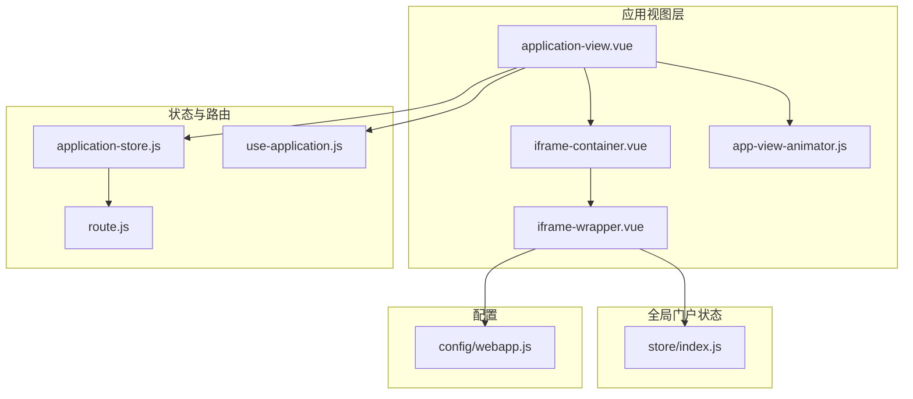
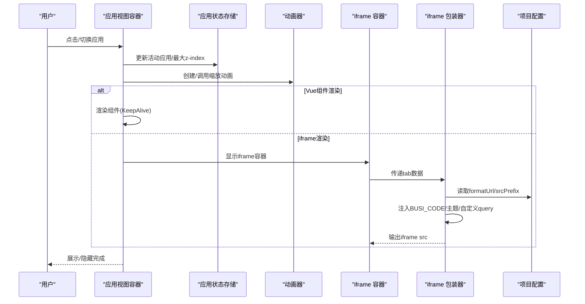
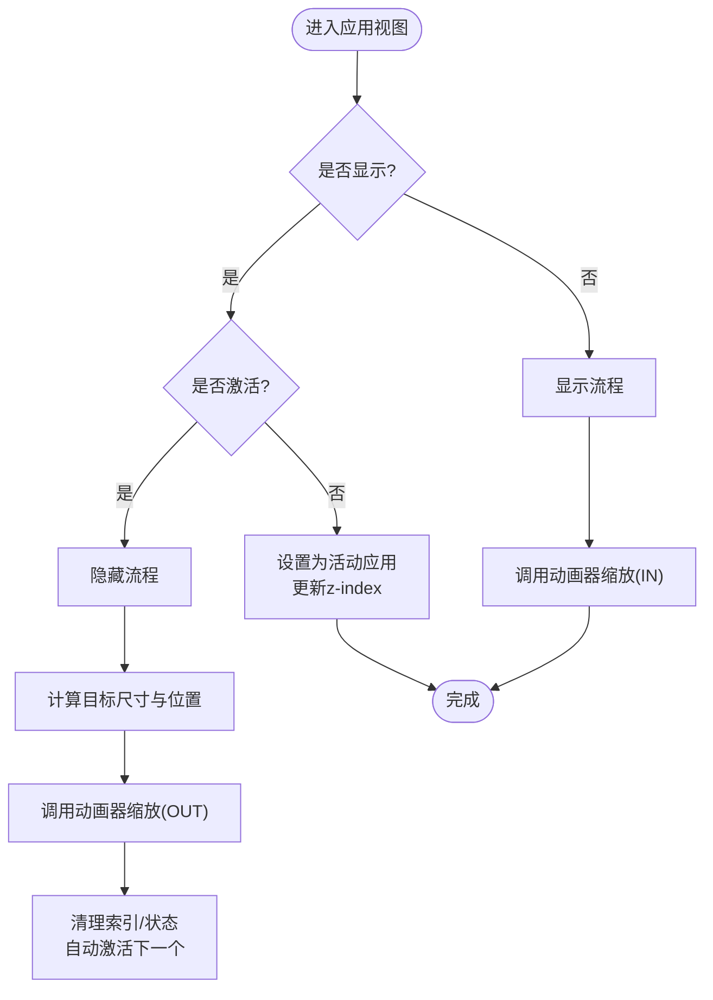
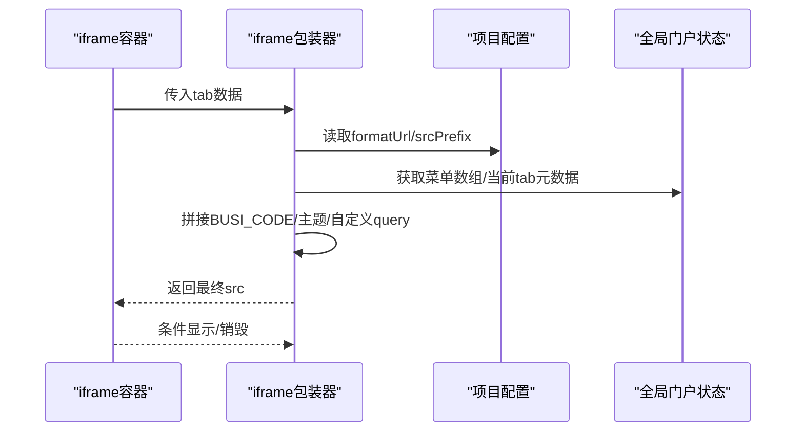
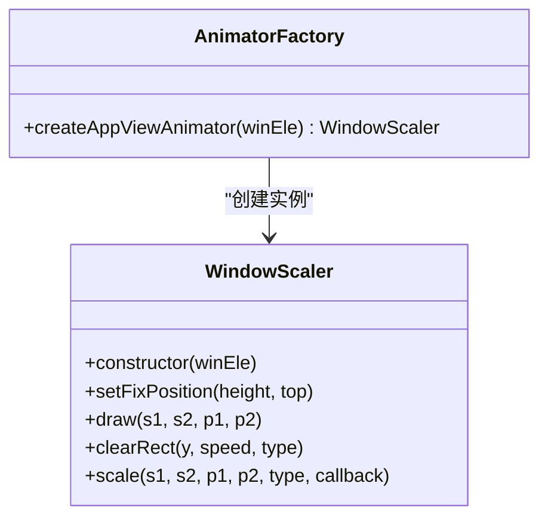
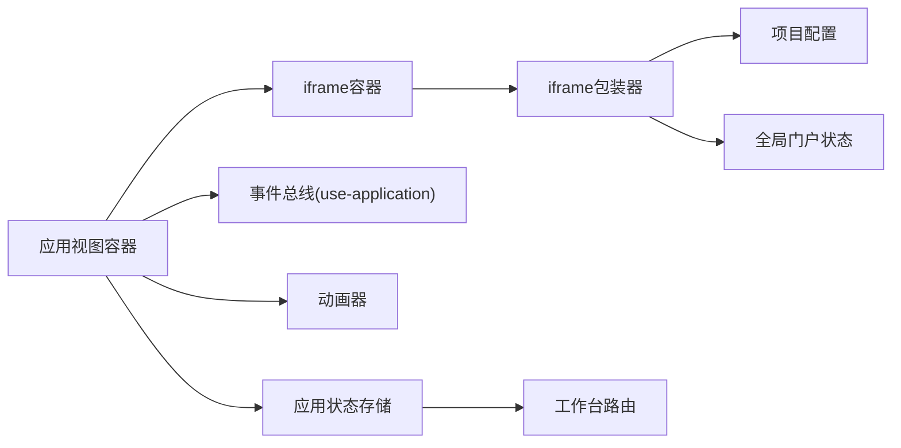

# 应用中心

<cite>
**本文引用的文件**
- [application-view.vue](file://src/portal/views/workbench/application-view/application-view.vue)
- [iframe-container.vue](file://src/portal/views/workbench/application-view/iframe-container/iframe-container.vue)
- [iframe-wrapper.vue](file://src/portal/views/workbench/application-view/iframe-container/iframe-wrapper.vue)
- [app-view-animator.js](file://src/portal/views/workbench/application-view/app-view-animator.js)
- [application-store.js](file://src/portal/views/workbench/application-view/application-store.js)
- [use-application.js](file://src/portal/views/workbench/application-view/use-application.js)
- [store/index.js](file://src/portal/store/index.js)
- [config/webapp.js](file://src/config/webapp.js)
- [route.js](file://src/portal/views/workbench/route.js)
- [modules/tabs/iframe/index.vue](file://src/portal/modules/tabs/iframe/index.vue)
</cite>

## 目录
1. [简介](#简介)
2. [项目结构](#项目结构)
3. [核心组件](#核心组件)
4. [架构总览](#架构总览)
5. [组件详解](#组件详解)
6. [依赖关系分析](#依赖关系分析)
7. [性能考量](#性能考量)
8. [故障排查指南](#故障排查指南)
9. [结论](#结论)
10. [附录](#附录)

## 简介
本文件为 FS-AOI-WEB 应用中心系统的权威技术参考，聚焦于应用视图管理、iframe 容器系统、应用动画效果、应用存储管理等关键模块。文档从整体架构到代码实现逐层展开，覆盖应用视图生命周期、iframe 通信机制、应用切换动画、状态与缓存策略、权限控制要点、懒加载与安全隔离、配置项与扩展开发指南等内容，帮助开发者快速理解并高效扩展企业级应用中心。

## 项目结构
应用中心位于门户工作台的“应用视图”子系统，围绕以下核心路径组织：
- 视图容器与动画：application-view（应用视图、动画器）
- iframe 容器与包装：iframe-container 与 iframe-wrapper
- 状态与路由：application-store、use-application、route
- 全局门户状态：portal store（tabs、iframe tabs、菜单等）
- 项目配置：config/webapp（iframe 地址格式化、前缀等）

图表来源
- [application-view.vue](file://src/portal/views/workbench/application-view/application-view.vue#L1-L358)
- [iframe-container.vue](file://src/portal/views/workbench/application-view/iframe-container/iframe-container.vue#L1-L23)
- [iframe-wrapper.vue](file://src/portal/views/workbench/application-view/iframe-container/iframe-wrapper.vue#L1-L109)
- [app-view-animator.js](file://src/portal/views/workbench/application-view/app-view-animator.js#L1-L149)
- [application-store.js](file://src/portal/views/workbench/application-view/application-store.js#L1-L65)
- [use-application.js](file://src/portal/views/workbench/application-view/use-application.js#L1-L30)
- [store/index.js](file://src/portal/store/index.js#L1-L226)
- [config/webapp.js](file://src/config/webapp.js#L131-L189)
- [route.js](file://src/portal/views/workbench/route.js#L1-L19)

章节来源
- [application-view.vue](file://src/portal/views/workbench/application-view/application-view.vue#L1-L358)
- [iframe-container.vue](file://src/portal/views/workbench/application-view/iframe-container/iframe-container.vue#L1-L23)
- [iframe-wrapper.vue](file://src/portal/views/workbench/application-view/iframe-container/iframe-wrapper.vue#L1-L109)
- [app-view-animator.js](file://src/portal/views/workbench/application-view/app-view-animator.js#L1-L149)
- [application-store.js](file://src/portal/views/workbench/application-view/application-store.js#L1-L65)
- [use-application.js](file://src/portal/views/workbench/application-view/use-application.js#L1-L30)
- [store/index.js](file://src/portal/store/index.js#L1-L226)
- [config/webapp.js](file://src/config/webapp.js#L131-L189)
- [route.js](file://src/portal/views/workbench/route.js#L1-L19)

## 核心组件
- 应用视图容器：负责应用视图的显示/隐藏、激活、最小化、全屏、拖拽、z-index 管理与遮罩层交互；内置应用切换动画器以实现缩放过渡效果。
- iframe 容器与包装：根据应用 renderType 决定渲染模式，支持 iframe 模式下的地址拼装、参数注入、懒加载与可见性控制。
- 动画器：基于 Canvas 的贝塞尔曲线绘制与 requestAnimationFrame 的缩放动画，实现从任务栏到视窗的视觉过渡。
- 应用状态存储：集中管理已打开的应用、活动应用、最大 z-index、iframe 应用列表，并维护工作台路由映射。
- 全局门户状态：维护菜单树、已打开的 tabs、iframe tabs、iframe 引用、加载状态等。
- 项目配置：提供 iframe 地址格式化函数、前缀处理、搜索与首页等系统级配置。

章节来源
- [application-view.vue](file://src/portal/views/workbench/application-view/application-view.vue#L1-L358)
- [iframe-container.vue](file://src/portal/views/workbench/application-view/iframe-container/iframe-container.vue#L1-L23)
- [iframe-wrapper.vue](file://src/portal/views/workbench/application-view/iframe-container/iframe-wrapper.vue#L1-L109)
- [app-view-animator.js](file://src/portal/views/workbench/application-view/app-view-animator.js#L1-L149)
- [application-store.js](file://src/portal/views/workbench/application-view/application-store.js#L1-L65)
- [store/index.js](file://src/portal/store/index.js#L1-L226)
- [config/webapp.js](file://src/config/webapp.js#L131-L189)

## 架构总览
应用中心采用“视图容器 + 容器包装 + 动画器 + 状态存储 + 配置”的分层架构。应用视图容器通过 Pinia 状态管理打开/关闭应用，决定渲染模式（Vue 组件或 iframe），并在切换时调用动画器进行过渡。iframe 模式下，iframe 包装器依据项目配置对地址进行格式化与前缀拼接，并注入业务参数；全局门户状态负责维护 tabs 与 iframe tabs 的一致性与刷新逻辑。

图表来源
- [application-view.vue](file://src/portal/views/workbench/application-view/application-view.vue#L48-L168)
- [app-view-animator.js](file://src/portal/views/workbench/application-view/app-view-animator.js#L44-L142)
- [iframe-container.vue](file://src/portal/views/workbench/application-view/iframe-container/iframe-container.vue#L11-L14)
- [iframe-wrapper.vue](file://src/portal/views/workbench/application-view/iframe-container/iframe-wrapper.vue#L18-L71)
- [config/webapp.js](file://src/config/webapp.js#L138-L178)

## 组件详解

### 应用视图容器（application-view）
职责与特性
- 生命周期管理：显示/隐藏、激活、最小化、全屏、拖拽、关闭。
- 视图切换动画：通过动画器在任务栏与视窗之间进行缩放过渡。
- 渲染模式选择：renderType=1 使用 KeepAlive 渲染 Vue 组件；renderType=2 使用 iframe 容器。
- z-index 与遮罩：根据激活状态与层级计算，配合遮罩层提升交互体验。
- 懒加载：当应用为远程组件时，按需动态导入并缓存为异步组件。

关键流程
- 切换激活：更新活动应用、最大 z-index，并触发 setAppViewIndex 回调。
- 显示/隐藏：计算目标位置与尺寸，调用动画器执行 zoomin/zoomout，完成后回调清理索引与状态。
- 最小化：委托隐藏流程，保持活动应用自动切换。
- 全屏：临时清除 transform 并恢复原位，退出时还原。

图表来源
- [application-view.vue](file://src/portal/views/workbench/application-view/application-view.vue#L48-L168)

章节来源
- [application-view.vue](file://src/portal/views/workbench/application-view/application-view.vue#L1-L358)

### iframe 容器与包装（iframe-container / iframe-wrapper）
职责与特性
- 容器控制：仅在当前应用为活动应用时显示对应 iframe 包装器。
- 地址格式化：优先使用项目配置中的 formatUrl，支持函数式与字符串前缀；可按环境与菜单数据动态生成最终 src。
- 参数注入：自动追加 BUSI_CODE、主题参数、客户识别参数、自定义 query。
- 加载与键控：根据 src 变更重建 iframe，避免缓存问题；提供 load 回调占位。

图表来源
- [iframe-container.vue](file://src/portal/views/workbench/application-view/iframe-container/iframe-container.vue#L11-L14)
- [iframe-wrapper.vue](file://src/portal/views/workbench/application-view/iframe-container/iframe-wrapper.vue#L18-L71)
- [config/webapp.js](file://src/config/webapp.js#L138-L178)
- [store/index.js](file://src/portal/store/index.js#L43-L45)

章节来源
- [iframe-container.vue](file://src/portal/views/workbench/application-view/iframe-container/iframe-container.vue#L1-L23)
- [iframe-wrapper.vue](file://src/portal/views/workbench/application-view/iframe-container/iframe-wrapper.vue#L1-L109)
- [config/webapp.js](file://src/config/webapp.js#L131-L189)
- [store/index.js](file://src/portal/store/index.js#L1-L226)

### 应用动画器（app-view-animator）
职责与特性
- 基于 Canvas 的贝塞尔曲线绘制，模拟窗口从任务栏向视窗缩放的过渡。
- 使用 requestAnimationFrame 控制帧率，支持 zoomin/zoomout 两种方向，具备加速与收尾逻辑。
- 通过 setFixPosition 固定画布高度与顶部，确保动画覆盖范围正确。

图表来源
- [app-view-animator.js](file://src/portal/views/workbench/application-view/app-view-animator.js#L2-L149)

章节来源
- [app-view-animator.js](file://src/portal/views/workbench/application-view/app-view-animator.js#L1-L149)

### 应用状态存储（application-store）
职责与特性
- 统一管理活动应用、已打开应用列表、iframe 应用列表与最大 z-index。
- 自动格式化应用对象（如将组件函数转为异步组件）、设置默认 renderType。
- 维护工作台路由映射，新增/删除应用时同步更新路由参数。

章节来源
- [application-store.js](file://src/portal/views/workbench/application-view/application-store.js#L1-L65)
- [route.js](file://src/portal/views/workbench/route.js#L1-L19)

### 全局门户状态（portal store）
职责与特性
- 维护菜单树、菜单数组、已打开 tabs、iframe tabs、iframe 引用、加载状态等。
- 对 iframe tabs 的 query 变更进行对比与刷新标记，保证跨页参数变化时的联动更新。
- 提供 keep-alive 名称管理与折叠状态等辅助能力。

章节来源
- [store/index.js](file://src/portal/store/index.js#L1-L226)

### 事件总线与外部通信（use-application）
职责与特性
- 通过 mitt 发布/订阅应用中心内部事件（打开、关闭、最小化、切换等）。
- 监听 window.postMessage，接收外部消息并转换为内部事件，实现跨应用通信。

章节来源
- [use-application.js](file://src/portal/views/workbench/application-view/use-application.js#L1-L30)

### 项目配置（config/webapp）
职责与特性
- 提供 iframe 地址格式化函数与前缀处理，支持函数式与字符串两种方式。
- 统一处理 BASE_PATH、环境变量、KONE 适配等场景，保证多系统兼容。

章节来源
- [config/webapp.js](file://src/config/webapp.js#L131-L189)

## 依赖关系分析
- 应用视图容器依赖：Pinia 应用状态存储、事件总线、动画器、iframe 容器、路由映射。
- iframe 包装器依赖：项目配置、全局门户状态、客户识别 store。
- 全局门户状态与 iframe tabs：与应用视图容器共同维护 tabs 一致性与刷新逻辑。
- 事件总线：作为跨模块通信中枢，连接外部系统与应用中心。

图表来源
- [application-view.vue](file://src/portal/views/workbench/application-view/application-view.vue#L1-L358)
- [application-store.js](file://src/portal/views/workbench/application-view/application-store.js#L1-L65)
- [use-application.js](file://src/portal/views/workbench/application-view/use-application.js#L1-L30)
- [app-view-animator.js](file://src/portal/views/workbench/application-view/app-view-animator.js#L1-L149)
- [iframe-container.vue](file://src/portal/views/workbench/application-view/iframe-container/iframe-container.vue#L1-L23)
- [iframe-wrapper.vue](file://src/portal/views/workbench/application-view/iframe-container/iframe-wrapper.vue#L1-L109)
- [config/webapp.js](file://src/config/webapp.js#L131-L189)
- [store/index.js](file://src/portal/store/index.js#L1-L226)
- [route.js](file://src/portal/views/workbench/route.js#L1-L19)

章节来源
- [application-view.vue](file://src/portal/views/workbench/application-view/application-view.vue#L1-L358)
- [iframe-container.vue](file://src/portal/views/workbench/application-view/iframe-container/iframe-container.vue#L1-L23)
- [iframe-wrapper.vue](file://src/portal/views/workbench/application-view/iframe-container/iframe-wrapper.vue#L1-L109)
- [app-view-animator.js](file://src/portal/views/workbench/application-view/app-view-animator.js#L1-L149)
- [application-store.js](file://src/portal/views/workbench/application-view/application-store.js#L1-L65)
- [use-application.js](file://src/portal/views/workbench/application-view/use-application.js#L1-L30)
- [store/index.js](file://src/portal/store/index.js#L1-L226)
- [config/webapp.js](file://src/config/webapp.js#L131-L189)
- [route.js](file://src/portal/views/workbench/route.js#L1-L19)

## 性能考量
- 动画性能：使用 Canvas 与 requestAnimationFrame 实现平滑缩放；建议避免在动画期间进行大量 DOM 操作。
- 组件缓存：KeepAlive 缓存已渲染的 Vue 组件，减少重复创建；注意合理设置缓存白名单。
- iframe 懒加载：按需创建 iframe，避免一次性加载过多资源；src 变更时重建可避免缓存污染。
- 状态更新：Pinia 状态粒度细化，避免不必要的响应式追踪；批量更新时合并动作。
- 资源加载：项目配置支持资源前缀与格式化，结合 CDN/版本号可进一步优化加载速度。

## 故障排查指南
常见问题与定位
- iframe 无法加载或空白
  - 检查项目配置中的 formatUrl 与 srcPrefix 是否正确返回有效 URL。
  - 确认 BUSI_CODE、主题参数、自定义 query 注入逻辑是否导致后端拒绝访问。
  - 查看全局门户状态中 openedIframeTabs 的 query 是否被意外刷新标记。
- 应用视图切换无动画或异常
  - 确认动画器初始化与 DOM 变换矩阵计算正确。
  - 检查 z-index 计算与遮罩层显示逻辑。
- 应用关闭后层级错乱
  - 核对应用状态存储的最大 z-index 更新与路由映射删除逻辑。
- 事件通信失败
  - 检查 window.postMessage 的消息类型与数据结构是否匹配事件总线映射表。

章节来源
- [iframe-wrapper.vue](file://src/portal/views/workbench/application-view/iframe-container/iframe-wrapper.vue#L18-L71)
- [store/index.js](file://src/portal/store/index.js#L156-L203)
- [application-view.vue](file://src/portal/views/workbench/application-view/application-view.vue#L92-L118)
- [application-store.js](file://src/portal/views/workbench/application-view/application-store.js#L28-L62)
- [use-application.js](file://src/portal/views/workbench/application-view/use-application.js#L16-L27)

## 结论
应用中心通过清晰的分层架构与完善的生命周期管理，实现了企业级应用的统一入口与一致体验。借助 Pinia 状态管理、事件总线与 Canvas 动画器，系统在交互流畅性与可扩展性方面表现优异。iframe 模式下的地址格式化与参数注入机制，满足多系统集成与安全隔离需求。建议在实际落地中重点关注配置项的定制化、缓存策略与权限控制的协同设计。

## 附录

### 配置项与扩展指南
- iframe 地址格式化与前缀
  - formatUrl：支持函数式返回最终 URL，可结合菜单数据与查询参数动态拼装。
  - srcPrefix：支持函数式或字符串前缀，适用于多系统基座路径差异。
- 项目级开关
  - urlEncrypt：是否对 URL 参数进行加密（视安全策略而定）。
  - showFullScreen：是否显示全屏按钮。
- tabs 限制与栈模式
  - maxNum：最大打开页签数。
  - stackMode：关闭页签后的打开策略。
- 主题与首页
  - themesConfig：主题切换开关与默认主题。
  - defaultHomePageConfig：首页模板行为控制。

章节来源
- [config/webapp.js](file://src/config/webapp.js#L131-L189)
- [config/webapp.js](file://src/config/webapp.js#L122-L126)
- [config/webapp.js](file://src/config/webapp.js#L234-L237)
- [config/webapp.js](file://src/config/webapp.js#L196-L200)

### API 接口与事件
- 应用视图容器暴露方法
  - switchActive(app)：切换并激活应用。
  - showAppView(app)：显示应用视图。
  - minimizeAppView(app, activeFlag)：最小化应用视图。
  - close()：关闭应用视图。
- 事件总线（mitt）
  - open/close/closeActive/minimizeAppView/minimizeAll/switchActive/showAppView/appViewBarClick/autoActive
  - 外部可通过 window.postMessage 发送 { type, data }，由 use-application.js 转发为内部事件。

章节来源
- [application-view.vue](file://src/portal/views/workbench/application-view/application-view.vue#L218-L218)
- [use-application.js](file://src/portal/views/workbench/application-view/use-application.js#L3-L27)

### 安全与权限控制要点
- iframe 安全
  - 通过 formatUrl 与 srcPrefix 控制访问域与路径，避免跨域风险。
  - 在 iframe 包装器中注入必要参数，减少明文敏感信息暴露。
- 权限控制
  - 建议在菜单树与菜单数组层面进行权限过滤，结合全局门户状态的菜单记忆与搜索屏蔽策略，减少越权访问机会。
- 通信协议
  - 内部：mitt 事件总线；外部：postMessage 协议，严格校验 type 与数据结构。

章节来源
- [iframe-wrapper.vue](file://src/portal/views/workbench/application-view/iframe-container/iframe-wrapper.vue#L18-L71)
- [store/index.js](file://src/portal/store/index.js#L108-L154)
- [use-application.js](file://src/portal/views/workbench/application-view/use-application.js#L16-L27)