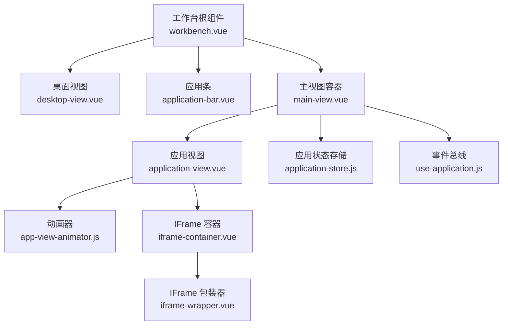
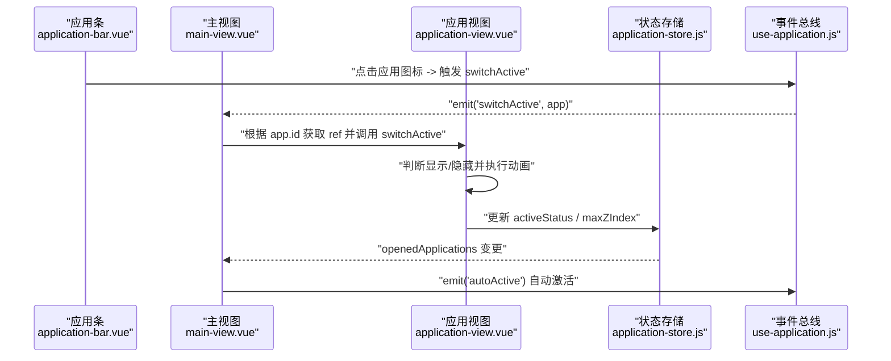
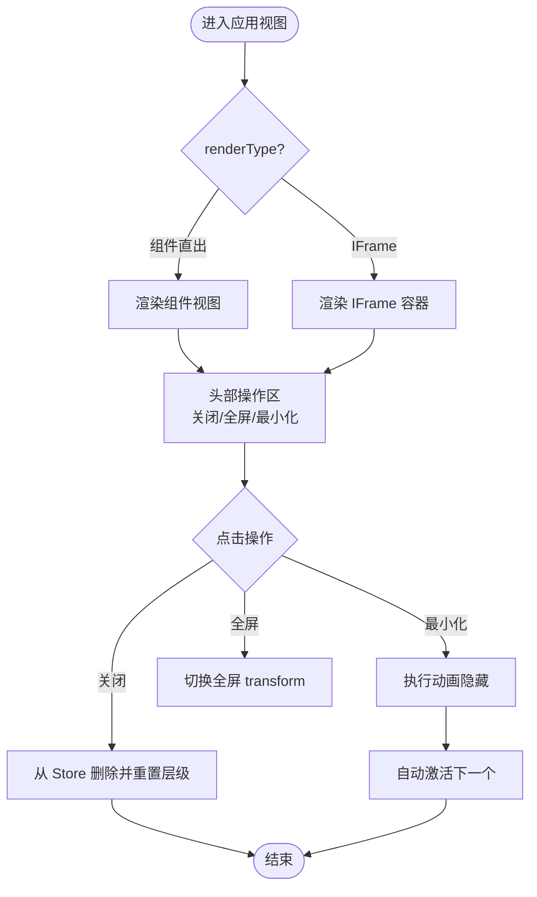
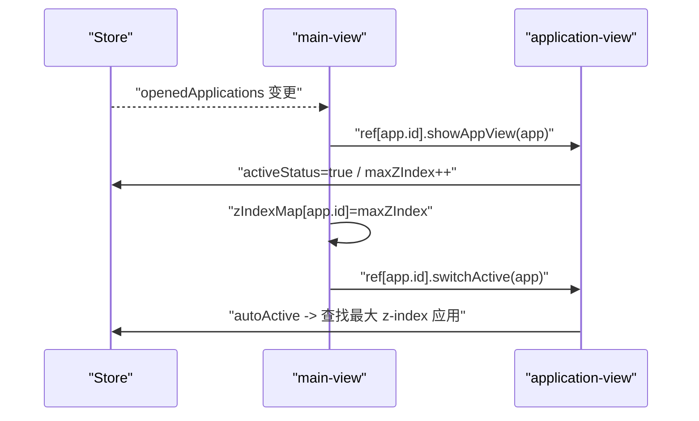
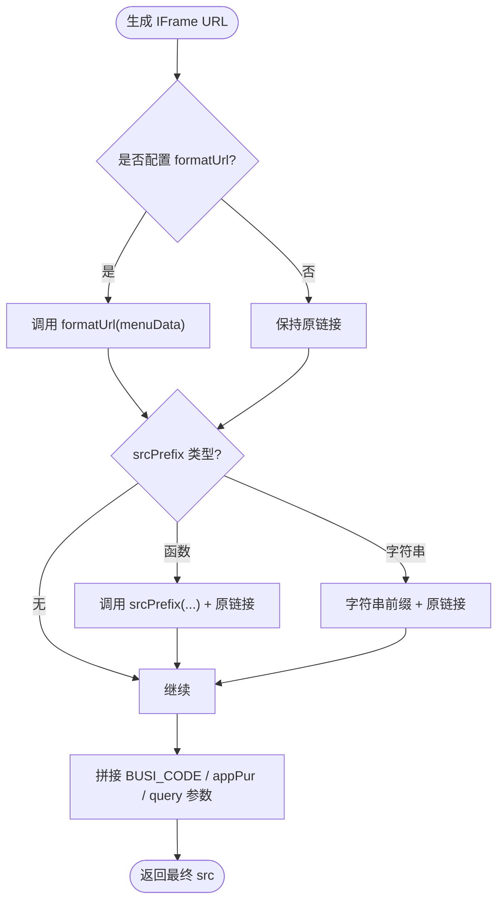
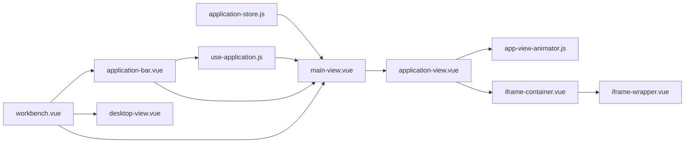

# 应用视图管理

<cite>
**本文引用的文件**   
- [application-view.vue](file://src/portal/views/workbench/application-view/application-view.vue)
- [main-view.vue](file://src/portal/views/workbench/application-view/main-view.vue)
- [use-application.js](file://src/portal/views/workbench/application-view/use-application.js)
- [application-store.js](file://src/portal/views/workbench/application-view/application-store.js)
- [app-view-animator.js](file://src/portal/views/workbench/application-view/app-view-animator.js)
- [iframe-container.vue](file://src/portal/views/workbench/application-view/iframe-container/iframe-container.vue)
- [iframe-wrapper.vue](file://src/portal/views/workbench/application-view/iframe-container/iframe-wrapper.vue)
- [application-bar.vue](file://src/portal/views/workbench/application-bar/application-bar.vue)
- [desktop-view.vue](file://src/portal/views/workbench/desktop-view/desktop-view.vue)
- [workbench.vue](file://src/portal/views/workbench/workbench.vue)
- [use-iframe.js（工作台）](file://src/portal/views/workbench/application-view/iframe-container/use-iframe.js)
- [use-iframe.js（标签页）](file://src/portal/modules/tabs/iframe/use-iframe.js)
- [index.vue（标签页容器）](file://src/portal/modules/tabs/index.vue)
</cite>

## 目录
1. [简介](#简介)
2. [项目结构](#项目结构)
3. [核心组件](#核心组件)
4. [架构总览](#架构总览)
5. [组件详解](#组件详解)
6. [依赖关系分析](#依赖关系分析)
7. [性能考量](#性能考量)
8. [故障排查指南](#故障排查指南)
9. [结论](#结论)
10. [附录](#附录)

## 简介
本文件面向 FS-AOI-WEB 的“应用视图管理系统”，系统性阐述应用视图的生命周期管理、状态跟踪、事件处理、层级与焦点控制、动画过渡、数据绑定与响应式更新、内存管理、配置项与 API 接口，以及面向企业级场景的自定义扩展指南。目标是帮助开发者快速理解并高效扩展应用视图能力。

## 项目结构
应用视图管理位于门户工作台的“工作台”模块内，采用分层与职责分离的设计：
- 工作台根组件负责初始化与桌面/应用条/主视图的装配
- 主视图负责多实例应用视图的渲染与交互调度
- 应用视图负责单个应用窗口的打开/关闭/最小化/最大化、拖拽、动画、遮罩与焦点
- 应用条负责应用图标状态与点击联动
- 桌面视图负责桌面页签切换与滚动
- IFrame 容器负责外部页面嵌入与参数拼装
- 状态与事件通过 Pinia Store 与事件总线协同

**图表来源**
- [workbench.vue](file://src/portal/views/workbench/workbench.vue#L129-L162)
- [desktop-view.vue](file://src/portal/views/workbench/desktop-view/desktop-view.vue#L94-L113)
- [application-bar.vue](file://src/portal/views/workbench/application-bar/application-bar.vue#L45-L65)
- [main-view.vue](file://src/portal/views/workbench/application-view/main-view.vue#L168-L181)
- [application-view.vue](file://src/portal/views/workbench/application-view/application-view.vue#L221-L251)
- [app-view-animator.js](file://src/portal/views/workbench/application-view/app-view-animator.js#L1-L149)
- [iframe-container.vue](file://src/portal/views/workbench/application-view/iframe-container/iframe-container.vue#L11-L15)
- [iframe-wrapper.vue](file://src/portal/views/workbench/application-view/iframe-container/iframe-wrapper.vue#L80-L96)
- [application-store.js](file://src/portal/views/workbench/application-view/application-store.js#L17-L64)
- [use-application.js](file://src/portal/views/workbench/application-view/use-application.js#L1-L30)

**章节来源**
- [workbench.vue](file://src/portal/views/workbench/workbench.vue#L1-L235)
- [desktop-view.vue](file://src/portal/views/workbench/desktop-view/desktop-view.vue#L1-L137)
- [application-bar.vue](file://src/portal/views/workbench/application-bar/application-bar.vue#L1-L135)
- [main-view.vue](file://src/portal/views/workbench/application-view/main-view.vue#L1-L194)
- [application-view.vue](file://src/portal/views/workbench/application-view/application-view.vue#L1-L358)
- [app-view-animator.js](file://src/portal/views/workbench/application-view/app-view-animator.js#L1-L149)
- [iframe-container.vue](file://src/portal/views/workbench/application-view/iframe-container/iframe-container.vue#L1-L23)
- [iframe-wrapper.vue](file://src/portal/views/workbench/application-view/iframe-container/iframe-wrapper.vue#L1-L109)
- [application-store.js](file://src/portal/views/workbench/application-view/application-store.js#L1-L65)
- [use-application.js](file://src/portal/views/workbench/application-view/use-application.js#L1-L30)

## 核心组件
- 应用视图容器：负责单个应用窗口的渲染、动画、拖拽、遮罩、全屏、最小化/最大化、关闭与焦点管理
- 主视图容器：负责多应用视图的实例化、z-index 管理、焦点自动计算、拖拽边界约束
- 应用状态存储：集中维护已打开的应用列表、活动应用、最大 z-index，并提供增删路由
- 事件总线：跨组件通信，支持打开/关闭/最小化/切换/自动激活等事件
- 动画器：基于 Canvas 的缩放动画，实现从应用条到窗口的视觉过渡
- IFrame 容器：统一拼装外部页面 URL，注入业务参数，支持刷新/打开/关闭
- 应用条：展示已打开应用图标状态，点击触发主视图中的切换
- 桌面视图：桌面页签切换与滚轮翻页

**章节来源**
- [application-view.vue](file://src/portal/views/workbench/application-view/application-view.vue#L1-L358)
- [main-view.vue](file://src/portal/views/workbench/application-view/main-view.vue#L1-L194)
- [application-store.js](file://src/portal/views/workbench/application-view/application-store.js#L17-L64)
- [use-application.js](file://src/portal/views/workbench/application-view/use-application.js#L1-L30)
- [app-view-animator.js](file://src/portal/views/workbench/application-view/app-view-animator.js#L1-L149)
- [iframe-container.vue](file://src/portal/views/workbench/application-view/iframe-container/iframe-container.vue#L1-L23)
- [iframe-wrapper.vue](file://src/portal/views/workbench/application-view/iframe-container/iframe-wrapper.vue#L1-L109)
- [application-bar.vue](file://src/portal/views/workbench/application-bar/application-bar.vue#L1-L135)
- [desktop-view.vue](file://src/portal/views/workbench/desktop-view/desktop-view.vue#L1-L137)

## 架构总览
应用视图管理采用“事件驱动 + 状态中心”的模式：
- 事件总线负责跨组件解耦，主视图订阅事件并驱动具体应用视图实例
- Pinia Store 负责持久化状态与路由同步
- 动画器独立于视图，提供可复用的过渡效果
- IFrame 容器与包装器统一处理外部页面加载与参数传递

**图表来源**
- [application-bar.vue](file://src/portal/views/workbench/application-bar/application-bar.vue#L25-L39)
- [main-view.vue](file://src/portal/views/workbench/application-view/main-view.vue#L73-L76)
- [application-view.vue](file://src/portal/views/workbench/application-view/application-view.vue#L146-L168)
- [application-store.js](file://src/portal/views/workbench/application-view/application-store.js#L28-L62)
- [use-application.js](file://src/portal/views/workbench/application-view/use-application.js#L10-L13)

## 组件详解

### 应用视图（application-view）
- 生命周期与状态
  - 初始化时根据 renderType 决定使用组件直出或 IFrame 嵌入
  - 维护 activeStatus、z-index、全屏标志位
  - 通过 Store 更新 maxZIndex 实现层级递增
- 事件处理
  - 打开/显示：showAppView
  - 切换激活：switchActive（含显示/隐藏分支）
  - 最小化：handelHiddenView（带动画）
  - 关闭：handleClose（从 Store 删除并重置 maxZIndex）
  - 全屏：handleFullScreen（临时清空 transform）
- 动画与遮罩
  - 使用 Canvas 动画器实现从应用条到窗口的缩放过渡
  - 遮罩层用于阻止底层交互，仅在非激活态显示
- 拖拽与边界
  - 支持标题栏拖拽，限制上下边界，避免超出父容器
- 数据绑定与响应式
  - 通过 props 传入 app、zIndex、回调函数
  - computed 计算 currentZIndex，保证层级正确

**图表来源**
- [application-view.vue](file://src/portal/views/workbench/application-view/application-view.vue#L11-L30)
- [application-view.vue](file://src/portal/views/workbench/application-view/application-view.vue#L146-L196)
- [application-view.vue](file://src/portal/views/workbench/application-view/application-view.vue#L198-L200)
- [application-view.vue](file://src/portal/views/workbench/application-view/application-view.vue#L177-L186)

**章节来源**
- [application-view.vue](file://src/portal/views/workbench/application-view/application-view.vue#L1-L358)

### 主视图容器（main-view）
- 多实例管理
  - 维护 zIndexMap 与每个应用的 z-index 映射
  - setAppViewIndex 在显示/隐藏时更新映射
- 事件订阅
  - open：校验客户识别与准入，注入查询参数，添加到 Store 并延后显示
  - switchActive/showAppView：直接调用对应应用视图实例方法
  - minimizeAll：批量最小化
  - close：按 id 关闭
  - autoActive：根据最大 z-index 自动激活
- 拖拽实现
  - startDrag/drag/stopDrag 实现平滑拖拽
  - 边界检测避免越界
- 依赖
  - Pinia Store：openedApplications/maxZIndex
  - 事件总线：use-application

**图表来源**
- [main-view.vue](file://src/portal/views/workbench/application-view/main-view.vue#L14-L19)
- [main-view.vue](file://src/portal/views/workbench/application-view/main-view.vue#L30-L60)
- [main-view.vue](file://src/portal/views/workbench/application-view/main-view.vue#L73-L76)
- [main-view.vue](file://src/portal/views/workbench/application-view/main-view.vue#L62-L66)
- [application-store.js](file://src/portal/views/workbench/application-view/application-store.js#L28-L62)

**章节来源**
- [main-view.vue](file://src/portal/views/workbench/application-view/main-view.vue#L1-L194)
- [application-store.js](file://src/portal/views/workbench/application-view/application-store.js#L17-L64)

### 应用状态存储（application-store）
- 职责
  - 格式化应用对象（异步组件、id、renderType、name）
  - 维护 openedApplications/openedIframeApplications
  - 维护 maxZIndex
  - 同步路由（新增/删除）
- 行为
  - add：去重后加入列表并设置路由
  - delete：从列表与路由中移除
  - updateMaxZIndex：更新最大层级

**章节来源**
- [application-store.js](file://src/portal/views/workbench/application-view/application-store.js#L1-L65)

### 事件总线（use-application）
- 事件类型
  - open/close/closeActive/minimizeAppView/minimizeAll/switchActive/showAppView/appViewBarClick/autoActive
- 通信方式
  - mitt 事件总线
  - window.postMessage 映射 openApp/closeApp/closeActiveApp

**章节来源**
- [use-application.js](file://src/portal/views/workbench/application-view/use-application.js#L1-L30)

### 动画器（app-view-animator）
- 功能
  - 创建离屏 Canvas，绘制贝塞尔曲线路径
  - zoomin/zoomout 两种动画，配合 requestAnimationFrame
  - 清除矩形区域实现动态裁剪
- 性能
  - 使用 will-change: transform 提升渲染性能
  - 动画帧内按速度递增实现自然减速

**章节来源**
- [app-view-animator.js](file://src/portal/views/workbench/application-view/app-view-animator.js#L1-L149)

### IFrame 容器与包装器
- 容器
  - 仅在当前应用为活动应用时显示 IFrame
- 包装器
  - 统一拼装 URL（前缀、菜单参数、业务参数、查询参数）
  - 注入 BUSI_CODE、主题等参数
  - 支持 formatUrl 与 srcPrefix 的函数/字符串两种形式
- 与 Store 协作
  - 通过 usePortalStore 维护已打开的 IFrame 引用与标签

**图表来源**
- [iframe-wrapper.vue](file://src/portal/views/workbench/application-view/iframe-container/iframe-wrapper.vue#L18-L71)
- [iframe-container.vue](file://src/portal/views/workbench/application-view/iframe-container/iframe-container.vue#L11-L15)

**章节来源**
- [iframe-container.vue](file://src/portal/views/workbench/application-view/iframe-container/iframe-container.vue#L1-L23)
- [iframe-wrapper.vue](file://src/portal/views/workbench/application-view/iframe-container/iframe-wrapper.vue#L1-L109)
- [use-iframe.js（工作台）](file://src/portal/views/workbench/application-view/iframe-container/use-iframe.js#L1-L15)
- [use-iframe.js（标签页）](file://src/portal/modules/tabs/iframe/use-iframe.js#L1-L15)
- [index.vue（标签页容器）](file://src/portal/modules/tabs/index.vue#L1-L109)

### 应用条（application-bar）
- 展示
  - 固定应用 + 已打开应用合并
  - 通过 is-launched 标记已打开状态
- 交互
  - 点击应用图标，计算应用条矩形，触发主视图切换
  - 支持 tooltip 提示

**章节来源**
- [application-bar.vue](file://src/portal/views/workbench/application-bar/application-bar.vue#L1-L135)

### 桌面视图（desktop-view）
- 功能
  - 多桌面页签切换
  - 滚轮翻页与滚动边界控制
  - 与桌面条联动

**章节来源**
- [desktop-view.vue](file://src/portal/views/workbench/desktop-view/desktop-view.vue#L1-L137)

## 依赖关系分析
- 组件耦合
  - main-view 对 application-view 存在强引用（通过 ref 映射）
  - application-view 依赖 application-store 与 app-view-animator
  - application-bar 依赖 use-application 与 application-store
- 外部依赖
  - mitt 事件总线
  - Pinia 状态管理
  - Vue 组合式 API（ref/computed/watch/effect）

**图表来源**
- [application-store.js](file://src/portal/views/workbench/application-view/application-store.js#L17-L64)
- [main-view.vue](file://src/portal/views/workbench/application-view/main-view.vue#L1-L194)
- [application-view.vue](file://src/portal/views/workbench/application-view/application-view.vue#L1-L358)
- [app-view-animator.js](file://src/portal/views/workbench/application-view/app-view-animator.js#L1-L149)
- [iframe-container.vue](file://src/portal/views/workbench/application-view/iframe-container/iframe-container.vue#L1-L23)
- [iframe-wrapper.vue](file://src/portal/views/workbench/application-view/iframe-container/iframe-wrapper.vue#L1-L109)
- [application-bar.vue](file://src/portal/views/workbench/application-bar/application-bar.vue#L1-L135)
- [workbench.vue](file://src/portal/views/workbench/workbench.vue#L129-L162)
- [desktop-view.vue](file://src/portal/views/workbench/desktop-view/desktop-view.vue#L94-L113)

**章节来源**
- [main-view.vue](file://src/portal/views/workbench/application-view/main-view.vue#L1-L194)
- [application-view.vue](file://src/portal/views/workbench/application-view/application-view.vue#L1-L358)
- [application-store.js](file://src/portal/views/workbench/application-view/application-store.js#L1-L65)
- [use-application.js](file://src/portal/views/workbench/application-view/use-application.js#L1-L30)
- [application-bar.vue](file://src/portal/views/workbench/application-bar/application-bar.vue#L1-L135)
- [workbench.vue](file://src/portal/views/workbench/workbench.vue#L1-L235)
- [desktop-view.vue](file://src/portal/views/workbench/desktop-view/desktop-view.vue#L1-L137)

## 性能考量
- 动画优化
  - 使用 Canvas 动画器替代 DOM 过渡，减少重排
  - will-change: transform 提升渲染性能
- 状态与渲染
  - KeepAlive 缓存组件视图，避免重复挂载
  - IFrame 仅在活动应用显示，降低资源占用
- 事件与内存
  - onUnmounted 中移除全局事件监听，避免内存泄漏
  - Store.clearStore 可重置状态，便于调试与回收

[本节为通用建议，无需特定文件引用]

## 故障排查指南
- 应用无法打开
  - 检查事件总线是否正确触发 open
  - 确认 Store.add 是否成功并设置路由
- 切换无效
  - 确认主视图中是否获取到对应 ref
  - 检查 activeStatus 与 maxZIndex 是否更新
- 动画异常
  - 检查 Canvas 宽高与 top 设置
  - 确认 requestAnimationFrame 是否被取消
- IFrame 无法加载
  - 校验 srcPrefix/formatUrl 返回值
  - 检查 BUSI_CODE 与 query 参数拼接
- 拖拽越界
  - 检查父容器高度与 top/bottom 边界计算

**章节来源**
- [main-view.vue](file://src/portal/views/workbench/application-view/main-view.vue#L150-L166)
- [application-view.vue](file://src/portal/views/workbench/application-view/application-view.vue#L97-L146)
- [iframe-wrapper.vue](file://src/portal/views/workbench/application-view/iframe-container/iframe-wrapper.vue#L18-L71)
- [app-view-animator.js](file://src/portal/views/workbench/application-view/app-view-animator.js#L16-L41)

## 结论
FS-AOI-WEB 的应用视图管理以事件与状态为核心，结合 Canvas 动画与 IFrame 容器，实现了企业级复杂场景下的多应用窗口管理。通过清晰的职责划分与可扩展的事件总线，开发者可以便捷地定制应用视图的行为、外观与交互。

[本节为总结，无需特定文件引用]

## 附录

### 配置选项与 API 接口
- 应用视图属性
  - app：应用对象（id/name/renderType/component/link/query）
  - zIndex：基础 z-index
  - startDrag/setAppViewIndex：拖拽与层级回调
- 事件总线接口
  - open(app)、close(appId)、closeActive()、minimizeAppView(app)、minimizeAll()、switchActive(app)、showAppView(app)、appViewBarClick(app)、autoActive()
- Store 接口
  - add(app)、delete(app)、updateMaxZIndex(index)、clearStore()

**章节来源**
- [application-view.vue](file://src/portal/views/workbench/application-view/application-view.vue#L11-L16)
- [use-application.js](file://src/portal/views/workbench/application-view/use-application.js#L4-L14)
- [application-store.js](file://src/portal/views/workbench/application-view/application-store.js#L28-L62)

### 自定义开发指南
- 新增应用视图行为
  - 在主视图中订阅新事件并在对应应用视图上调用方法
- 自定义动画
  - 修改 app-view-animator 的绘制与速度参数
- IFrame 参数扩展
  - 在 iframe-wrapper 中扩展参数拼装逻辑
- 状态持久化
  - 通过 Store 的路由同步与清理逻辑扩展持久化策略

**章节来源**
- [main-view.vue](file://src/portal/views/workbench/application-view/main-view.vue#L30-L86)
- [app-view-animator.js](file://src/portal/views/workbench/application-view/app-view-animator.js#L22-L41)
- [iframe-wrapper.vue](file://src/portal/views/workbench/application-view/iframe-container/iframe-wrapper.vue#L18-L71)
- [application-store.js](file://src/portal/views/workbench/application-view/application-store.js#L43-L51)