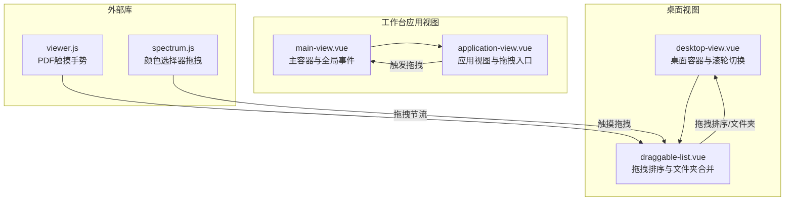
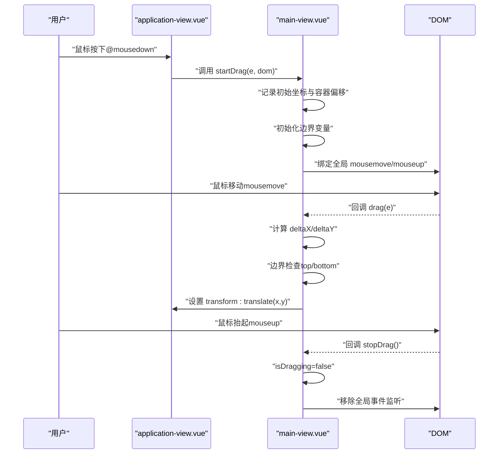
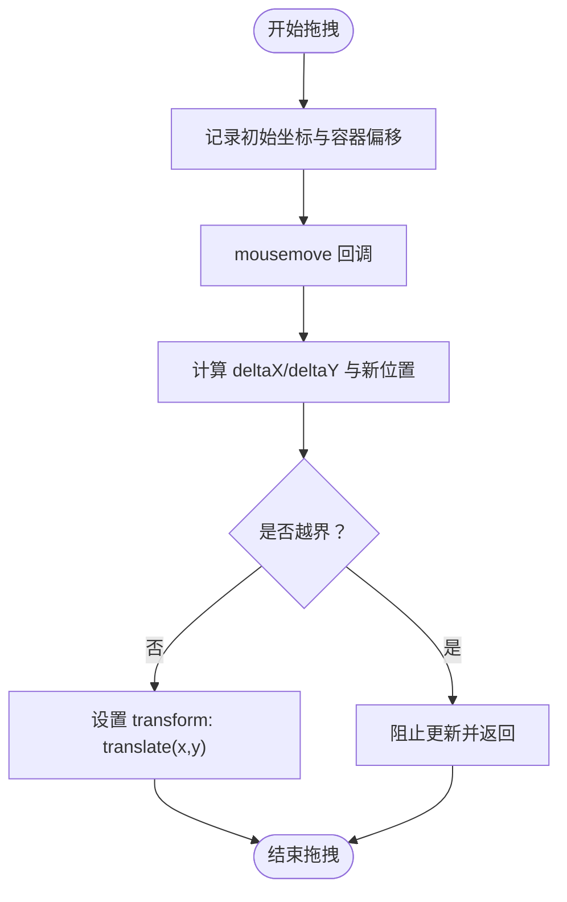
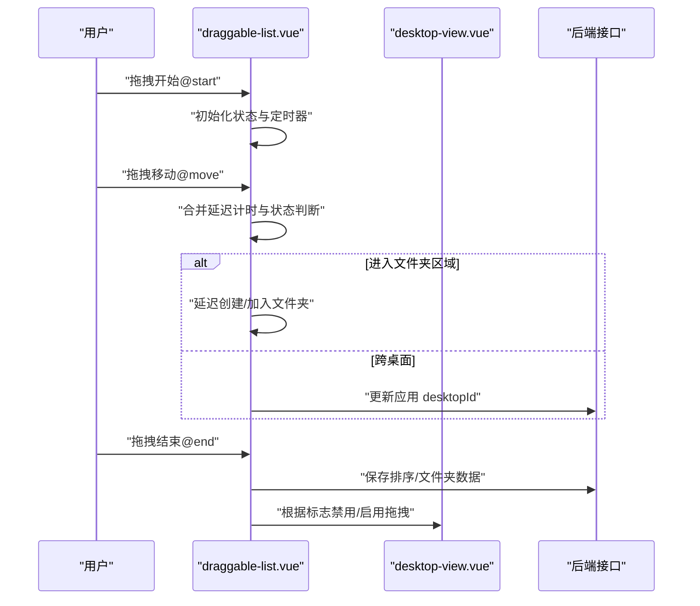
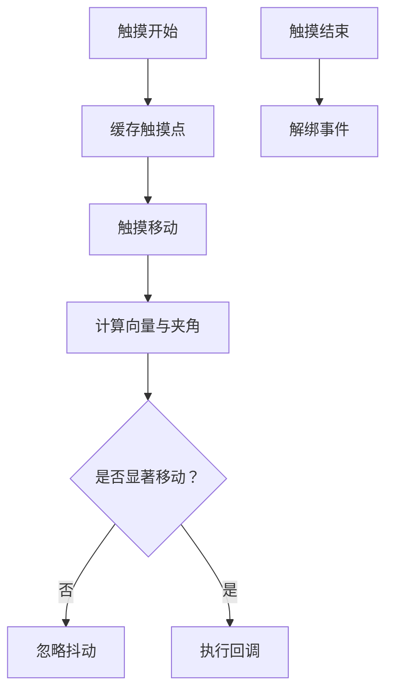
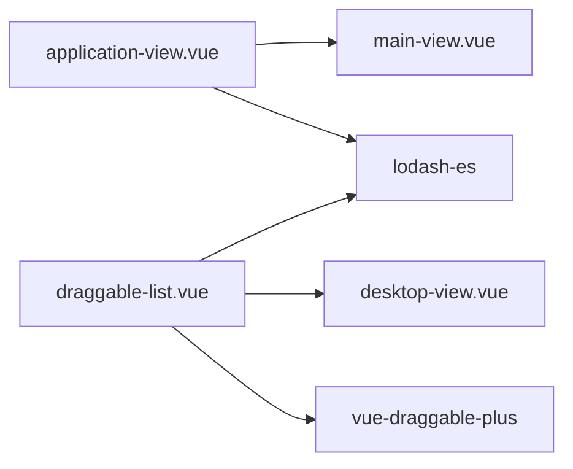

# 拖拽操作管理

<cite>
**本文档引用的文件**
- [main-view.vue](file://src/portal/views/workbench/application-view/main-view.vue)
- [application-view.vue](file://src/portal/views/workbench/application-view/application-view.vue)
- [draggable-list.vue](file://src/portal/views/workbench/desktop-view/draggable-list.vue)
- [desktop-view.vue](file://src/portal/views/workbench/desktop-view/desktop-view.vue)
- [viewer.js](file://public/static/pdf/web/viewer.js)
- [spectrum.js](file://public/static/flow/libs/angular-spectrum-colorpicker_1.0.13/spectrum.js)
</cite>

## 目录
1. [简介](#简介)
2. [项目结构](#项目结构)
3. [核心组件](#核心组件)
4. [架构总览](#架构总览)
5. [详细组件分析](#详细组件分析)
6. [依赖关系分析](#依赖关系分析)
7. [性能考虑](#性能考虑)
8. [故障排查指南](#故障排查指南)
9. [结论](#结论)

## 简介
本文件为 FS-AOI-WEB 应用视图拖拽操作管理系统的技术文档，聚焦于应用视图的拖拽移动、边界限制、碰撞检测等核心功能，系统性阐述鼠标事件处理、触摸事件支持、拖拽状态管理、物理计算与惯性效果、边界回弹动画、性能优化与事件节流、内存泄漏防护、配置参数与自定义行为以及用户体验优化策略。文档面向企业级前端开发团队，既提供代码级实现细节，也包含可视化架构图与流程图，帮助快速理解与扩展。

## 项目结构
FS-AOI-WEB 的拖拽体系主要分布在工作台应用视图与桌面视图两大模块：
- 工作台应用视图：负责应用窗口的拖拽移动、最大化/最小化、全屏切换与动画过渡。
- 桌面视图：负责桌面图标与小部件的拖拽排序、文件夹合并、跨桌面拖拽与布局网格。

**图表来源**
- [main-view.vue](file://src/portal/views/workbench/application-view/main-view.vue#L148-L166)
- [application-view.vue](file://src/portal/views/workbench/application-view/application-view.vue#L170-L175)
- [desktop-view.vue](file://src/portal/views/workbench/desktop-view/desktop-view.vue#L94-L112)
- [draggable-list.vue](file://src/portal/views/workbench/desktop-view/draggable-list.vue#L456-L474)
- [viewer.js](file://public/static/pdf/web/viewer.js#L2139-L2185)
- [spectrum.js](file://public/static/flow/libs/angular-spectrum-colorpicker_1.0.13/spectrum.js#L1038-L1049)

**章节来源**
- [main-view.vue](file://src/portal/views/workbench/application-view/main-view.vue#L1-L194)
- [application-view.vue](file://src/portal/views/workbench/application-view/application-view.vue#L1-L358)
- [desktop-view.vue](file://src/portal/views/workbench/desktop-view/desktop-view.vue#L1-L136)
- [draggable-list.vue](file://src/portal/views/workbench/desktop-view/draggable-list.vue#L1-L652)

## 核心组件
- 应用视图拖拽主容器（main-view.vue）
  - 全局鼠标事件监听：mousemove、mouseup
  - 负责启动/停止拖拽、计算边界、应用 transform 变换
  - 维护拖拽状态与边界变量，避免越界与文本选中干扰
- 应用视图（application-view.vue）
  - 作为拖拽目标容器，接收 startDrag 回调
  - 提供最小化/最大化/全屏切换与动画过渡
  - 通过 setAppViewIndex 维护层级索引映射
- 桌面拖拽列表（draggable-list.vue）
  - 基于 vue-draggable-plus 实现拖拽排序
  - 支持文件夹合并、跨桌面拖拽、延迟合并、右键菜单
  - 通过 @move/@add/@remove/@end 等钩子实现复杂拖拽逻辑
- 桌面容器（desktop-view.vue）
  - 支持滚轮切换桌面页，配合拖拽禁用标志
  - 通过 transform 控制桌面容器位移

**章节来源**
- [main-view.vue](file://src/portal/views/workbench/application-view/main-view.vue#L88-L166)
- [application-view.vue](file://src/portal/views/workbench/application-view/application-view.vue#L170-L218)
- [draggable-list.vue](file://src/portal/views/workbench/desktop-view/draggable-list.vue#L1-L652)
- [desktop-view.vue](file://src/portal/views/workbench/desktop-view/desktop-view.vue#L1-L136)

## 架构总览
拖拽系统采用“事件驱动 + 状态机”的设计：
- 事件层：鼠标按下触发 startDrag，mousemove 更新位置，mouseup 结束拖拽
- 状态层：isDragging、mouseStartX/Y、containerStartX/Y、边界变量 topBoundary/bottomBoundary
- 视图层：通过 transform 实现平滑位移；动画层：缩放/隐藏/显示过渡
- 外部集成：PDF 触摸手势、颜色选择器拖拽节流

**图表来源**
- [application-view.vue](file://src/portal/views/workbench/application-view/application-view.vue#L170-L175)
- [main-view.vue](file://src/portal/views/workbench/application-view/main-view.vue#L97-L146)

**章节来源**
- [application-view.vue](file://src/portal/views/workbench/application-view/application-view.vue#L170-L175)
- [main-view.vue](file://src/portal/views/workbench/application-view/main-view.vue#L97-L146)

## 详细组件分析

### 应用视图拖拽组件（application-view + main-view）
- 拖拽入口与状态管理
  - application-view 在标题栏区域绑定 @mousedown，调用父容器传入的 startDrag 回调
  - main-view 内部维护 isDragging、mouseStartX/Y、containerStartX/Y，并在首次拖拽时计算边界
- 边界限制与碰撞检测
  - 通过父容器高度与元素自身高度计算 bottomBoundary
  - 顶部边界取自元素初始 top 值，防止向上越界
  - 拖拽过程中进行上下边界判断，超过阈值直接返回
- 动画与过渡
  - 使用 transform: translate 实现平滑移动
  - 与应用视图动画器协作，实现最小化/显示的缩放过渡
- 性能与健壮性
  - 阻止默认行为以避免文本选中
  - onUnmounted 中移除全局事件监听，防止内存泄漏

**图表来源**
- [main-view.vue](file://src/portal/views/workbench/application-view/main-view.vue#L97-L142)

**章节来源**
- [application-view.vue](file://src/portal/views/workbench/application-view/application-view.vue#L170-L175)
- [main-view.vue](file://src/portal/views/workbench/application-view/main-view.vue#L88-L166)

### 桌面拖拽组件（draggable-list + desktop-view）
- 拖拽排序与文件夹合并
  - 使用 VueDraggable 的 @move/@add/@remove/@end 钩子
  - 合并延迟：通过 mergeFolderDelay 控制合并触发时机，避免误触
  - 文件夹合并：当拖拽元素进入文件夹区域或目标应用区域内，延迟创建/加入文件夹
  - 跨桌面拖拽：校验 desktopId 并更新后端数据
- 拖拽状态与事件节流
  - dragFlag、moveFlag、delayMergeTimer 等状态变量控制合并逻辑
  - 通过 setTimeout 与 clearTimeout 管理延迟与重置
- 桌面滚轮切换
  - desktop-view 监听滚轮事件，通过 desktopAppEmitter 控制拖拽禁用标志，避免滚轮与拖拽冲突

**图表来源**
- [draggable-list.vue](file://src/portal/views/workbench/desktop-view/draggable-list.vue#L78-L141)
- [draggable-list.vue](file://src/portal/views/workbench/desktop-view/draggable-list.vue#L257-L363)
- [desktop-view.vue](file://src/portal/views/workbench/desktop-view/desktop-view.vue#L34-L45)

**章节来源**
- [draggable-list.vue](file://src/portal/views/workbench/desktop-view/draggable-list.vue#L1-L652)
- [desktop-view.vue](file://src/portal/views/workbench/desktop-view/desktop-view.vue#L1-L136)

### 触摸事件支持与手势处理
- PDF 触摸手势
  - viewer.js 中对多点触摸进行向量计算，检测旋转/缩放意图，过滤微小抖动
  - 通过 _touchInfo 缓存上次触摸点，避免重复触发
- 颜色选择器拖拽
  - spectrum.js 对触摸与鼠标事件统一处理，绑定 touchstart/mousedown 与 touchmove/mousemove
  - 使用 throttle 函数对拖拽事件进行节流，提升性能与稳定性

**图表来源**
- [viewer.js](file://public/static/pdf/web/viewer.js#L2139-L2185)
- [spectrum.js](file://public/static/flow/libs/angular-spectrum-colorpicker_1.0.13/spectrum.js#L964-L1033)

**章节来源**
- [viewer.js](file://public/static/pdf/web/viewer.js#L2139-L2185)
- [spectrum.js](file://public/static/flow/libs/angular-spectrum-colorpicker_1.0.13/spectrum.js#L1038-L1049)

## 依赖关系分析
- 组件耦合
  - application-view 依赖 main-view 的 startDrag 与全局事件
  - draggable-list 依赖 desktop-view 的滚轮切换与拖拽禁用标志
- 外部依赖
  - vue-draggable-plus 提供拖拽排序能力
  - lodash-es 用于工具函数（如最大值/键查找）
- 事件链路
  - 用户交互 → 组件回调 → 状态更新 → DOM 变换/动画 → 数据持久化

**图表来源**
- [application-view.vue](file://src/portal/views/workbench/application-view/application-view.vue#L1-L358)
- [main-view.vue](file://src/portal/views/workbench/application-view/main-view.vue#L1-L194)
- [draggable-list.vue](file://src/portal/views/workbench/desktop-view/draggable-list.vue#L1-L652)
- [desktop-view.vue](file://src/portal/views/workbench/desktop-view/desktop-view.vue#L1-L136)

**章节来源**
- [application-view.vue](file://src/portal/views/workbench/application-view/application-view.vue#L1-L358)
- [main-view.vue](file://src/portal/views/workbench/application-view/main-view.vue#L1-L194)
- [draggable-list.vue](file://src/portal/views/workbench/desktop-view/draggable-list.vue#L1-L652)
- [desktop-view.vue](file://src/portal/views/workbench/desktop-view/desktop-view.vue#L1-L136)

## 性能考虑
- 事件节流与去抖
  - draggable-list 使用 setTimeout 控制合并延迟，避免频繁 DOM 操作
  - spectrum.js 使用 throttle 对拖拽事件进行节流，降低回调频率
- 变换与合成
  - 应用视图使用 transform 与 will-change: transform，利用 GPU 加速
  - 动画器通过缩放过渡替代复杂布局重排
- 内存与资源
  - main-view 在卸载时移除全局事件监听，防止内存泄漏
  - 拖拽过程避免创建临时对象，复用状态变量

**章节来源**
- [draggable-list.vue](file://src/portal/views/workbench/desktop-view/draggable-list.vue#L78-L141)
- [spectrum.js](file://public/static/flow/libs/angular-spectrum-colorpicker_1.0.13/spectrum.js#L1038-L1049)
- [application-view.vue](file://src/portal/views/workbench/application-view/application-view.vue#L264-L264)
- [main-view.vue](file://src/portal/views/workbench/application-view/main-view.vue#L156-L166)

## 故障排查指南
- 拖拽无效或卡顿
  - 检查是否正确绑定 @mousedown 到可拖拽区域
  - 确认全局 mousemove/mouseup 事件是否被移除（onUnmounted）
  - 查看 transform 设置是否被其他样式覆盖
- 越界与跳动
  - 校验 topBoundary/bottomBoundary 初始化逻辑
  - 确保父容器高度变化后重新计算边界
- 拖拽误触发文件夹合并
  - 调整 mergeFolderDelay 参数，避免过短导致误判
  - 检查 @move 中的目标区域判定逻辑
- 桌面滚轮与拖拽冲突
  - 确认 desktopAppEmitter 的开关逻辑生效
  - 检查滚轮事件是否正确传递到桌面容器

**章节来源**
- [main-view.vue](file://src/portal/views/workbench/application-view/main-view.vue#L97-L146)
- [draggable-list.vue](file://src/portal/views/workbench/desktop-view/draggable-list.vue#L78-L141)
- [desktop-view.vue](file://src/portal/views/workbench/desktop-view/desktop-view.vue#L34-L45)

## 结论
FS-AOI-WEB 的拖拽系统通过清晰的组件分层与事件驱动机制，实现了应用视图的平滑拖拽、桌面图标的智能合并与跨桌面拖拽，同时兼顾了性能与用户体验。建议在后续迭代中进一步完善：
- 将边界参数与动画时长抽象为可配置项
- 扩展触摸设备上的惯性与回弹效果
- 增加拖拽预览与占位符，提升交互反馈
- 引入拖拽性能监控与埋点，持续优化体验