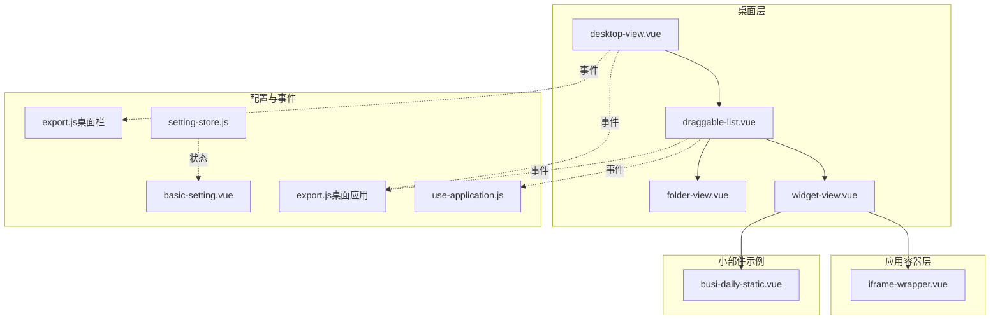
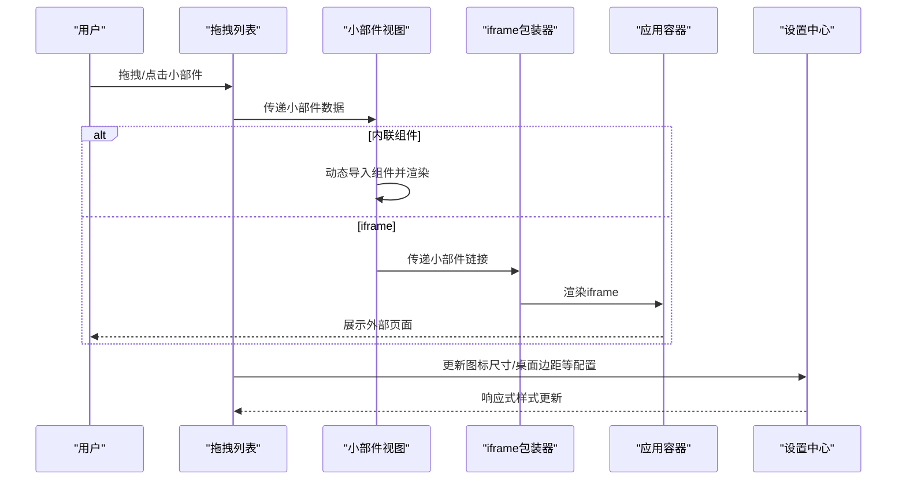
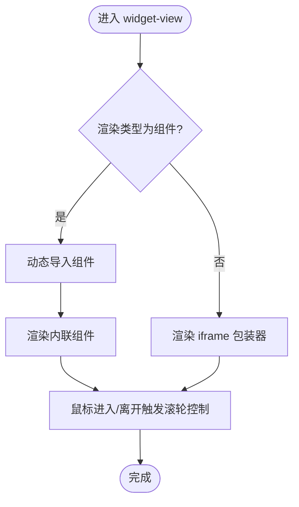
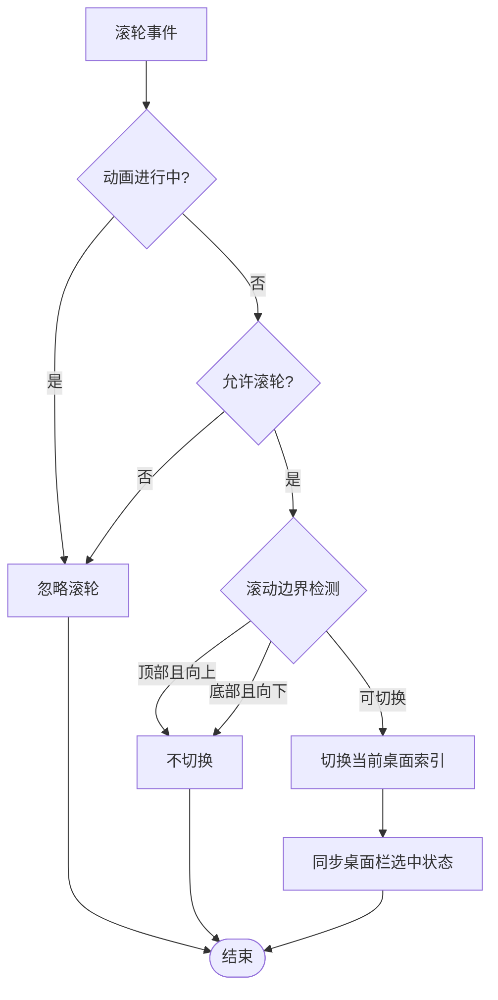
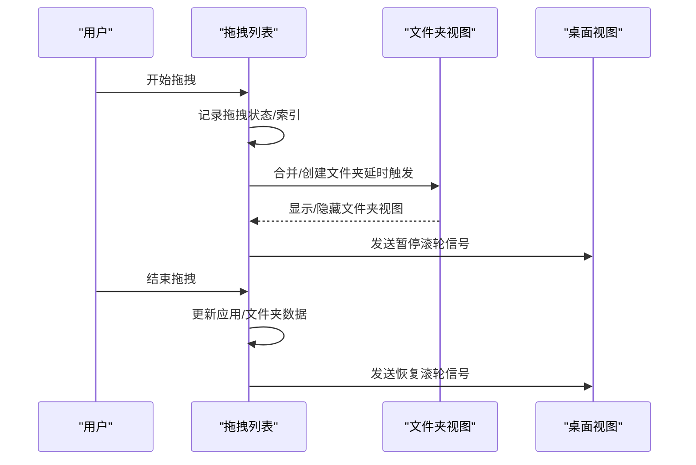
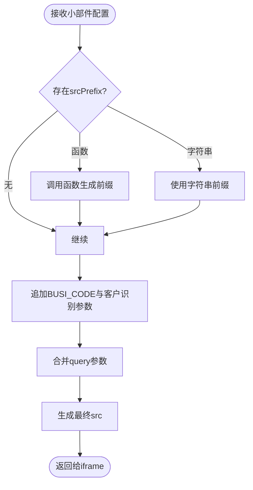
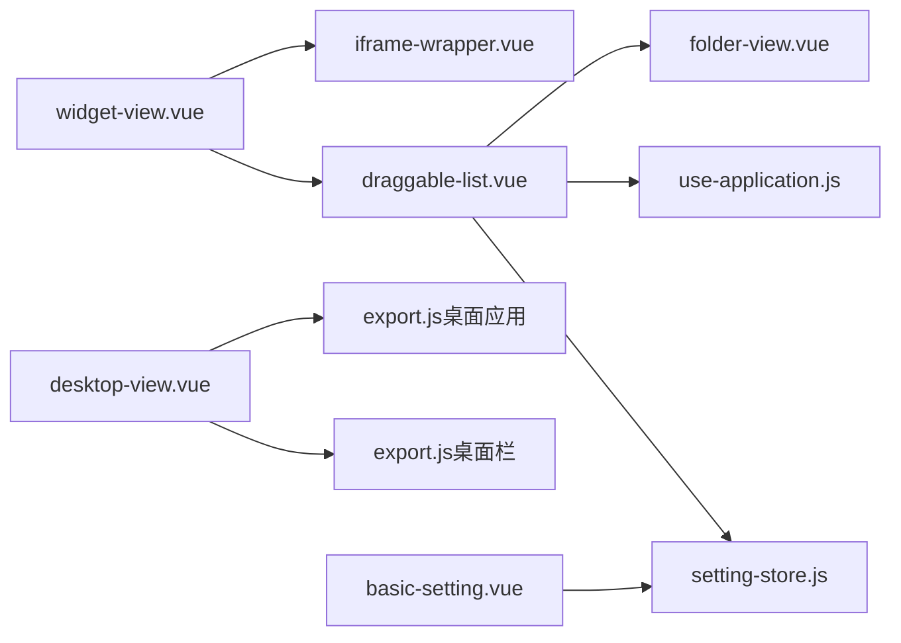

# 小部件系统

<cite>
**本文引用的文件**
- [widget-view.vue](file://src/portal/views/workbench/desktop-view/widget-view.vue)
- [desktop-view.vue](file://src/portal/views/workbench/desktop-view/desktop-view.vue)
- [draggable-list.vue](file://src/portal/views/workbench/desktop-view/draggable-list.vue)
- [folder-view.vue](file://src/portal/views/workbench/desktop-view/folder-view.vue)
- [iframe-wrapper.vue](file://src/portal/views/workbench/application-view/iframe-container/iframe-wrapper.vue)
- [import-all-pages.js](file://src/portal/hooks/import-all-pages.js)
- [export.js（桌面应用）](file://src/portal/views/workbench/desktop-view/export.js)
- [export.js（桌面栏）](file://src/portal/views/workbench/desktop-bar/export.js)
- [use-application.js](file://src/portal/views/workbench/application-view/use-application.js)
- [setting-store.js](file://src/portal/views/workbench/setting-center/setting-store.js)
- [basic-setting.vue](file://src/portal/views/workbench/setting-center/basic/basic-setting.vue)
- [busi-daily-static.vue](file://src/pages/frame/workbench-views/widgets/busi-daily-static/busi-daily-static.vue)
</cite>

## 目录
1. [引言](#引言)
2. [项目结构](#项目结构)
3. [核心组件](#核心组件)
4. [架构总览](#架构总览)
5. [详细组件分析](#详细组件分析)
6. [依赖分析](#依赖分析)
7. [性能考虑](#性能考虑)
8. [故障排查指南](#故障排查指南)
9. [结论](#结论)
10. [附录](#附录)

## 引言
本文件面向FS-AOI-WEB工作台中的“小部件系统”，系统性阐述小部件的定义、渲染、配置与生命周期管理，以及与桌面系统、应用容器、设置中心的集成方式。重点覆盖以下方面：
- 小部件的两种渲染形态：内联组件与iframe嵌套
- 数据绑定与事件处理机制
- 样式定制与布局适配
- 动态加载、内容更新与交互响应
- 配置存储与主题/尺寸联动
- 自定义开发指南与最佳实践

## 项目结构
小部件系统位于工作台桌面视图层，围绕桌面容器、拖拽列表、文件夹视图与应用容器展开，通过事件总线与设置中心协同。

图表来源
- [desktop-view.vue](file://src/portal/views/workbench/desktop-view/desktop-view.vue#L1-L137)
- [draggable-list.vue](file://src/portal/views/workbench/desktop-view/draggable-list.vue#L1-L652)
- [widget-view.vue](file://src/portal/views/workbench/desktop-view/widget-view.vue#L1-L39)
- [folder-view.vue](file://src/portal/views/workbench/desktop-view/folder-view.vue#L1-L293)
- [iframe-wrapper.vue](file://src/portal/views/workbench/application-view/iframe-container/iframe-wrapper.vue#L1-L109)
- [export.js（桌面应用）](file://src/portal/views/workbench/desktop-view/export.js#L1-L5)
- [export.js（桌面栏）](file://src/portal/views/workbench/desktop-bar/export.js#L1-L5)
- [use-application.js](file://src/portal/views/workbench/application-view/use-application.js#L1-L30)
- [setting-store.js](file://src/portal/views/workbench/setting-center/setting-store.js#L1-L43)
- [basic-setting.vue](file://src/portal/views/workbench/setting-center/basic/basic-setting.vue#L1-L30)
- [busi-daily-static.vue](file://src/pages/frame/workbench-views/widgets/busi-daily-static/busi-daily-static.vue#L1-L23)

章节来源
- [desktop-view.vue](file://src/portal/views/workbench/desktop-view/desktop-view.vue#L1-L137)
- [draggable-list.vue](file://src/portal/views/workbench/desktop-view/draggable-list.vue#L1-L652)
- [widget-view.vue](file://src/portal/views/workbench/desktop-view/widget-view.vue#L1-L39)
- [folder-view.vue](file://src/portal/views/workbench/desktop-view/folder-view.vue#L1-L293)
- [iframe-wrapper.vue](file://src/portal/views/workbench/application-view/iframe-container/iframe-wrapper.vue#L1-L109)
- [export.js（桌面应用）](file://src/portal/views/workbench/desktop-view/export.js#L1-L5)
- [export.js（桌面栏）](file://src/portal/views/workbench/desktop-bar/export.js#L1-L5)
- [use-application.js](file://src/portal/views/workbench/application-view/use-application.js#L1-L30)
- [setting-store.js](file://src/portal/views/workbench/setting-center/setting-store.js#L1-L43)
- [basic-setting.vue](file://src/portal/views/workbench/setting-center/basic/basic-setting.vue#L1-L30)
- [busi-daily-static.vue](file://src/pages/frame/workbench-views/widgets/busi-daily-static/busi-daily-static.vue#L1-L23)

## 核心组件
- 小部件视图容器：负责根据小部件类型选择组件内联渲染或iframe嵌套渲染，并处理鼠标进入/离开时的滚轮切换控制。
- 桌面视图：承载多桌面容器，支持滚轮切换桌面，使用事件总线控制滚轮状态。
- 拖拽列表：桌面项（应用/小部件/文件夹）的网格布局与拖拽排序，支持文件夹合并/拆分、上下文菜单、名称编辑等。
- 文件夹视图：以网格形式展示文件夹内的应用图标，支持弹窗内展开查看全部应用。
- 应用容器：iframe包装器，负责拼接iframe地址（含前缀、业务参数、查询参数等），并注入客户识别信息。
- 设置中心：集中管理字体大小、图标尺寸、桌面边距、主题等配置，支持联动更新CSS变量与后端同步。
- 事件总线：桌面应用/桌面栏事件通道，用于桌面切换、滚轮控制、应用打开/关闭等跨组件通信。

章节来源
- [widget-view.vue](file://src/portal/views/workbench/desktop-view/widget-view.vue#L1-L39)
- [desktop-view.vue](file://src/portal/views/workbench/desktop-view/desktop-view.vue#L1-L137)
- [draggable-list.vue](file://src/portal/views/workbench/desktop-view/draggable-list.vue#L1-L652)
- [folder-view.vue](file://src/portal/views/workbench/desktop-view/folder-view.vue#L1-L293)
- [iframe-wrapper.vue](file://src/portal/views/workbench/application-view/iframe-container/iframe-wrapper.vue#L1-L109)
- [setting-store.js](file://src/portal/views/workbench/setting-center/setting-store.js#L1-L43)

## 架构总览
小部件系统采用“桌面容器 + 拖拽列表 + 视图容器 + 应用容器”的分层架构，配合事件总线与设置中心实现解耦与可扩展。

图表来源
- [draggable-list.vue](file://src/portal/views/workbench/desktop-view/draggable-list.vue#L1-L652)
- [widget-view.vue](file://src/portal/views/workbench/desktop-view/widget-view.vue#L1-L39)
- [iframe-wrapper.vue](file://src/portal/views/workbench/application-view/iframe-container/iframe-wrapper.vue#L1-L109)
- [setting-store.js](file://src/portal/views/workbench/setting-center/setting-store.js#L1-L43)

## 详细组件分析

### 小部件视图容器（widget-view）
- 职责
  - 根据小部件的渲染类型决定渲染策略：内联组件或iframe嵌套。
  - 在鼠标进入/离开时通过事件总线通知桌面视图暂停/恢复滚轮切换。
- 关键点
  - 动态导入：通过全局按路径匹配的模块映射进行按需加载。
  - 组件内联：当渲染类型为组件时，使用动态组件渲染。
  - iframe嵌套：当渲染类型为外部链接时，交由iframe包装器处理URL拼装与参数注入。
  - 生命周期：挂载后才渲染，避免首屏闪烁。

图表来源
- [widget-view.vue](file://src/portal/views/workbench/desktop-view/widget-view.vue#L1-L39)
- [import-all-pages.js](file://src/portal/hooks/import-all-pages.js#L1-L2)

章节来源
- [widget-view.vue](file://src/portal/views/workbench/desktop-view/widget-view.vue#L1-L39)
- [import-all-pages.js](file://src/portal/hooks/import-all-pages.js#L1-L2)

### 桌面视图（desktop-view）
- 职责
  - 管理多桌面容器，支持滚轮切换、动画过渡与选中状态同步。
  - 通过事件总线接收桌面点击/索引变更，控制当前桌面索引。
- 关键点
  - 滚轮节流：在动画时间内忽略滚轮事件，防止连续翻页。
  - 滚轮边界：仅在滚动条到达顶部/底部时才允许切换桌面。
  - 与小部件的滚轮控制协作：通过事件总线暂停/恢复桌面滚轮。

图表来源
- [desktop-view.vue](file://src/portal/views/workbench/desktop-view/desktop-view.vue#L53-L87)
- [export.js（桌面应用）](file://src/portal/views/workbench/desktop-view/export.js#L1-L5)

章节来源
- [desktop-view.vue](file://src/portal/views/workbench/desktop-view/desktop-view.vue#L1-L137)
- [export.js（桌面应用）](file://src/portal/views/workbench/desktop-view/export.js#L1-L5)

### 拖拽列表（draggable-list）
- 职责
  - 提供网格布局与拖拽排序能力；支持文件夹合并/创建/拆分；提供上下文菜单与名称编辑。
  - 与桌面视图协作，处理跨桌面拖拽、文件夹内应用更新与持久化。
- 关键点
  - 合并延迟：通过定时器控制文件夹合并/创建的时机，避免误触。
  - 文件夹视图交互：暴露更新/显示/隐藏方法，供外层组件调用。
  - 滚轮控制：向桌面视图发送暂停/恢复滚轮的信号，避免拖拽时误切桌面。

图表来源
- [draggable-list.vue](file://src/portal/views/workbench/desktop-view/draggable-list.vue#L1-L652)
- [folder-view.vue](file://src/portal/views/workbench/desktop-view/folder-view.vue#L1-L293)
- [desktop-view.vue](file://src/portal/views/workbench/desktop-view/desktop-view.vue#L49-L51)

章节来源
- [draggable-list.vue](file://src/portal/views/workbench/desktop-view/draggable-list.vue#L1-L652)
- [folder-view.vue](file://src/portal/views/workbench/desktop-view/folder-view.vue#L1-L293)
- [desktop-view.vue](file://src/portal/views/workbench/desktop-view/desktop-view.vue#L1-L137)

### 文件夹视图（folder-view）
- 职责
  - 以网格形式展示文件夹内的应用图标，支持“查看更多”列表视图；弹窗内可完整编辑文件夹内容。
- 关键点
  - 动态截断：根据网格行列跨度限制首屏显示数量，其余以“查看更多”呈现。
  - 数据同步：支持文件夹内应用列表的增删改，必要时回写到父桌面列表。
  - 生命周期：通过暴露的方法控制显示/隐藏与数据更新。

章节来源
- [folder-view.vue](file://src/portal/views/workbench/desktop-view/folder-view.vue#L1-L293)

### 应用容器（iframe-wrapper）
- 职责
  - 负责拼接iframe URL，注入业务参数与客户识别信息，支持前缀格式化与查询参数追加。
- 关键点
  - URL拼装：支持函数式前缀与字符串前缀，支持BUSI_CODE与客户识别参数透传。
  - 参数合并：优先使用菜单数据与小部件配置，再追加查询参数。

图表来源
- [iframe-wrapper.vue](file://src/portal/views/workbench/application-view/iframe-container/iframe-wrapper.vue#L18-L71)

章节来源
- [iframe-wrapper.vue](file://src/portal/views/workbench/application-view/iframe-container/iframe-wrapper.vue#L1-L109)

### 设置中心（setting-store + basic-setting）
- 职责
  - 统一管理桌面与应用的个性化配置，如字体大小、图标尺寸、桌面边距、主题等；支持联动更新CSS变量与后端同步。
- 关键点
  - 响应式更新：通过Pinia Store集中管理，组件通过watch监听配置变化。
  - 主题联动：根据配置更新CSS变量，影响整体视觉风格。

章节来源
- [setting-store.js](file://src/portal/views/workbench/setting-center/setting-store.js#L1-L43)
- [basic-setting.vue](file://src/portal/views/workbench/setting-center/basic/basic-setting.vue#L1-L30)

### 小部件示例（busi-daily-static）
- 职责
  - 展示一个静态小部件的最小实现：通过背景图占位，提供基础样式与布局。
- 关键点
  - 使用v-bind动态绑定样式，便于后续接入数据源。

章节来源
- [busi-daily-static.vue](file://src/pages/frame/workbench-views/widgets/busi-daily-static/busi-daily-static.vue#L1-L23)

## 依赖分析
- 组件耦合
  - widget-view依赖动态导入映射与iframe包装器；与桌面视图通过事件总线弱耦合。
  - draggable-list与folder-view强耦合，共同完成文件夹的创建/合并/拆分。
  - desktop-view与两个事件总线协作，实现桌面切换与滚轮控制。
  - setting-store被多个组件引用，形成配置驱动的单向数据流。
- 外部依赖
  - mitt事件总线用于跨组件通信。
  - Pinia Store用于状态管理。
  - vue-draggable-plus用于拖拽排序。

图表来源
- [widget-view.vue](file://src/portal/views/workbench/desktop-view/widget-view.vue#L1-L39)
- [draggable-list.vue](file://src/portal/views/workbench/desktop-view/draggable-list.vue#L1-L652)
- [folder-view.vue](file://src/portal/views/workbench/desktop-view/folder-view.vue#L1-L293)
- [desktop-view.vue](file://src/portal/views/workbench/desktop-view/desktop-view.vue#L1-L137)
- [export.js（桌面应用）](file://src/portal/views/workbench/desktop-view/export.js#L1-L5)
- [export.js（桌面栏）](file://src/portal/views/workbench/desktop-bar/export.js#L1-L5)
- [use-application.js](file://src/portal/views/workbench/application-view/use-application.js#L1-L30)
- [setting-store.js](file://src/portal/views/workbench/setting-center/setting-store.js#L1-L43)
- [basic-setting.vue](file://src/portal/views/workbench/setting-center/basic/basic-setting.vue#L1-L30)
- [iframe-wrapper.vue](file://src/portal/views/workbench/application-view/iframe-container/iframe-wrapper.vue#L1-L109)

## 性能考虑
- 按需加载：小部件组件通过动态导入实现懒加载，减少初始包体。
- 滚轮节流：桌面视图在动画期间忽略滚轮事件，避免频繁DOM操作。
- 拖拽合并延迟：通过定时器控制文件夹合并/创建，降低误操作成本。
- 样式计算：设置中心通过CSS变量与computed响应式更新，避免全量重绘。
- iframe懒加载：仅在需要时拼装URL并渲染，减少资源占用。

## 故障排查指南
- 小部件无法渲染
  - 检查小部件的渲染类型与链接字段是否正确。
  - 若为组件类型，确认路径是否存在于动态导入映射中。
- 滚轮切换异常
  - 确认桌面视图的滚轮节流与边界检测逻辑未被阻塞。
  - 检查事件总线是否正常接收/发送“暂停/恢复滚轮”信号。
- iframe参数缺失
  - 检查iframe包装器的URL拼装逻辑，确认前缀、BUSI_CODE、客户识别参数与查询参数是否正确追加。
- 文件夹视图不更新
  - 确认文件夹视图的更新方法已被调用，且数据同步至父桌面列表。
- 设置不生效
  - 检查设置中心的watch是否触发，CSS变量是否更新，后端同步是否开启。

章节来源
- [widget-view.vue](file://src/portal/views/workbench/desktop-view/widget-view.vue#L1-L39)
- [desktop-view.vue](file://src/portal/views/workbench/desktop-view/desktop-view.vue#L49-L87)
- [iframe-wrapper.vue](file://src/portal/views/workbench/application-view/iframe-container/iframe-wrapper.vue#L18-L71)
- [folder-view.vue](file://src/portal/views/workbench/desktop-view/folder-view.vue#L77-L102)
- [setting-store.js](file://src/portal/views/workbench/setting-center/setting-store.js#L29-L41)

## 结论
FS-AOI-WEB小部件系统通过清晰的分层与事件驱动，实现了灵活的小部件渲染、强大的拖拽与文件夹管理、完善的配置与主题联动，以及稳定的iframe集成方案。遵循本文的开发规范与最佳实践，可快速扩展新的小部件并保证良好的用户体验与可维护性。

## 附录

### API与配置参数
- 小部件对象字段
  - id：唯一标识
  - name：显示名称
  - type：类型（1=应用图标，2=小部件，3=文件夹）
  - renderType：渲染类型（1=组件内联，其他=iframe链接）
  - link：链接或组件路径
  - colSpan/rowSpan：网格跨度
  - folderId/groupId：文件夹/分组归属
  - menuData/query：菜单数据与查询参数
  - appPur/busiCode：业务参数
- 设置中心配置
  - fontSize：字体大小
  - applicationIconSize：图标尺寸（small/middle/large）
  - showApplicationName：是否显示应用名
  - applicationBarPosition/desktopBarPosition：工具栏位置
  - desktopPadding：桌面内边距
  - theme：主题

章节来源
- [draggable-list.vue](file://src/portal/views/workbench/desktop-view/draggable-list.vue#L16-L26)
- [widget-view.vue](file://src/portal/views/workbench/desktop-view/widget-view.vue#L6-L9)
- [iframe-wrapper.vue](file://src/portal/views/workbench/application-view/iframe-container/iframe-wrapper.vue#L7-L9)
- [setting-store.js](file://src/portal/views/workbench/setting-center/setting-store.js#L8-L17)
- [basic-setting.vue](file://src/portal/views/workbench/setting-center/basic/basic-setting.vue#L1-L30)