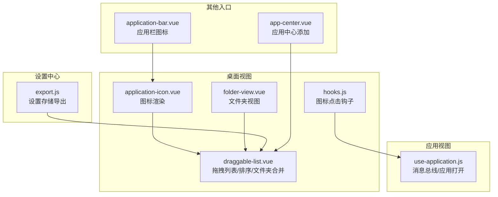
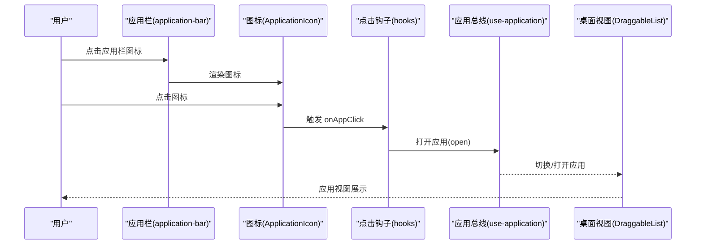
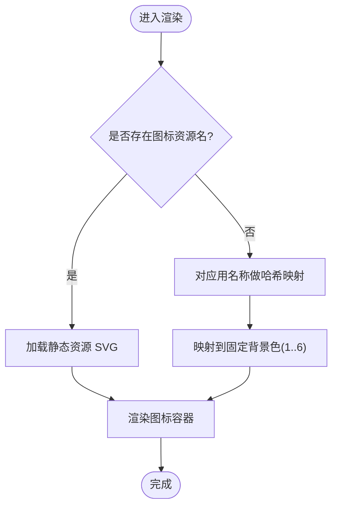
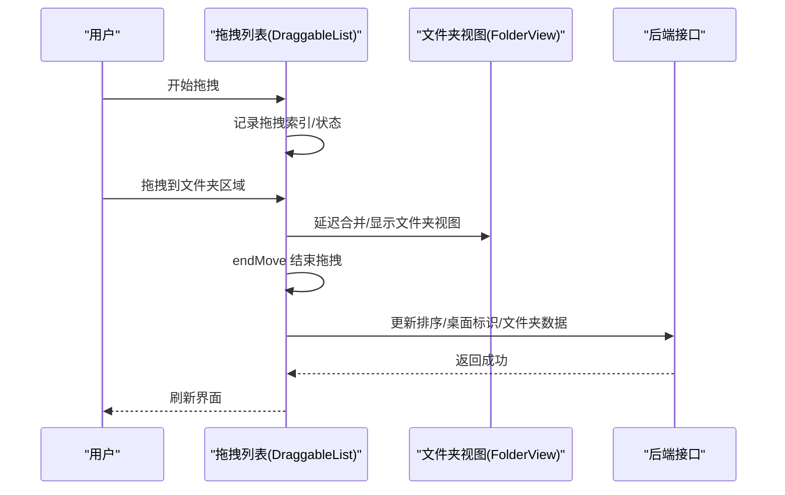
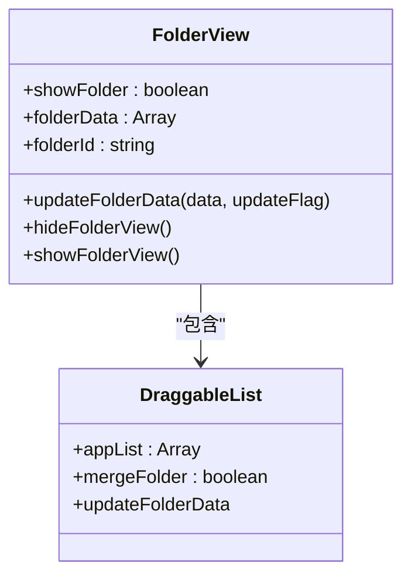
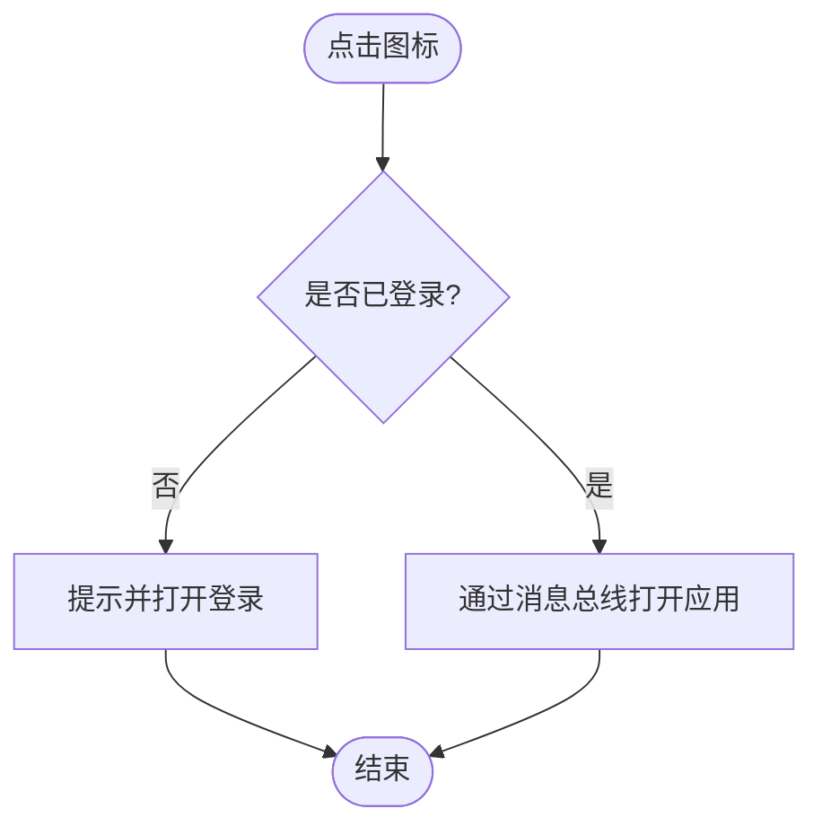
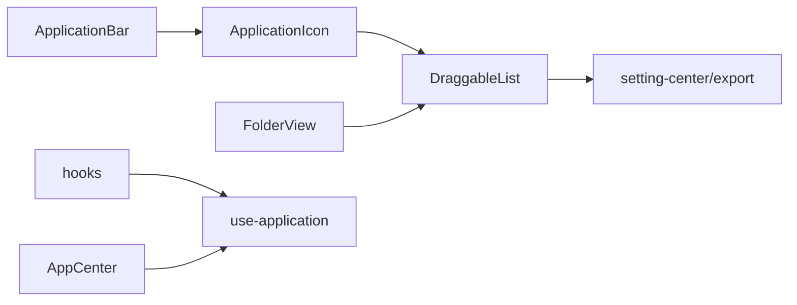

# 应用图标管理

<cite>
**本文引用的文件**
- [application-icon.vue](file://src/portal/views/workbench/desktop-view/application-icon.vue)
- [draggable-list.vue](file://src/portal/views/workbench/desktop-view/draggable-list.vue)
- [folder-view.vue](file://src/portal/views/workbench/desktop-view/folder-view.vue)
- [hooks.js](file://src/portal/views/workbench/desktop-view/hooks.js)
- [use-application.js](file://src/portal/views/workbench/application-view/use-application.js)
- [export.js](file://src/portal/views/workbench/setting-center/export.js)
- [app-center.vue](file://src/pages/frame/workbench-views/apps/app-center/app-center.vue)
- [application-bar.vue](file://src/portal/views/workbench/application-bar/application-bar.vue)
</cite>

## 目录
1. [简介](#简介)
2. [项目结构](#项目结构)
3. [核心组件](#核心组件)
4. [架构总览](#架构总览)
5. [详细组件分析](#详细组件分析)
6. [依赖关系分析](#依赖关系分析)
7. [性能考虑](#性能考虑)
8. [故障排查指南](#故障排查指南)
9. [结论](#结论)
10. [附录：API与配置](#附录api与配置)

## 简介
本技术文档围绕 FS-AOI-WEB 的“应用图标管理系统”展开，重点阐述应用图标的渲染机制、拖拽排序与文件夹合并、图标点击事件处理、图标数据结构与样式定制、以及与桌面视图的集成方式。同时给出性能优化建议、用户体验设计要点与可扩展的自定义开发指南。

## 项目结构
应用图标管理涉及多个视图与模块：
- 桌面视图中的图标渲染与拖拽列表：desktop-view 下的 application-icon、draggable-list、folder-view
- 图标点击行为钩子：desktop-view 下的 hooks
- 应用打开/切换的消息总线：application-view 下的 use-application
- 设置中心导出：setting-center 下的导出入口
- 应用中心与应用栏：pages/frame 下的 app-center 与 portal 下的 application-bar

图表来源
- [application-icon.vue](file://src/portal/views/workbench/desktop-view/application-icon.vue#L1-L69)
- [draggable-list.vue](file://src/portal/views/workbench/desktop-view/draggable-list.vue#L1-L652)
- [folder-view.vue](file://src/portal/views/workbench/desktop-view/folder-view.vue#L1-L293)
- [hooks.js](file://src/portal/views/workbench/desktop-view/hooks.js#L1-L16)
- [use-application.js](file://src/portal/views/workbench/application-view/use-application.js#L1-L30)
- [export.js](file://src/portal/views/workbench/setting-center/export.js#L1-L4)
- [app-center.vue](file://src/pages/frame/workbench-views/apps/app-center/app-center.vue#L1-L175)
- [application-bar.vue](file://src/portal/views/workbench/application-bar/application-bar.vue#L1-L135)

章节来源
- [application-icon.vue](file://src/portal/views/workbench/desktop-view/application-icon.vue#L1-L69)
- [draggable-list.vue](file://src/portal/views/workbench/desktop-view/draggable-list.vue#L1-L652)
- [folder-view.vue](file://src/portal/views/workbench/desktop-view/folder-view.vue#L1-L293)
- [hooks.js](file://src/portal/views/workbench/desktop-view/hooks.js#L1-L16)
- [use-application.js](file://src/portal/views/workbench/application-view/use-application.js#L1-L30)
- [export.js](file://src/portal/views/workbench/setting-center/export.js#L1-L4)
- [app-center.vue](file://src/pages/frame/workbench-views/apps/app-center/app-center.vue#L1-L175)
- [application-bar.vue](file://src/portal/views/workbench/application-bar/application-bar.vue#L1-L135)

## 核心组件
- 应用图标渲染组件（ApplicationIcon）
  - 支持两种图标来源：SVG 资源或字体背景渐变
  - 字体图标通过名称哈希映射到固定背景色
- 拖拽列表组件（DraggableList）
  - 基于 vue-draggable-plus 实现网格布局拖拽
  - 支持图标排序、跨桌面拖拽、文件夹合并/拆分
  - 集成文件夹视图与右键菜单
- 文件夹视图组件（FolderView）
  - 展示文件夹内图标预览与“查看更多”
  - 内部使用 DraggableList 进行文件夹内排序
- 图标点击钩子（hooks）
  - 统一处理登录态校验与应用打开
- 应用打开消息总线（use-application）
  - 通过 mitt 发布/订阅应用打开/切换事件
- 设置中心导出（export）
  - 提供应用图标尺寸、名称显示等设置项

章节来源
- [application-icon.vue](file://src/portal/views/workbench/desktop-view/application-icon.vue#L1-L69)
- [draggable-list.vue](file://src/portal/views/workbench/desktop-view/draggable-list.vue#L1-L652)
- [folder-view.vue](file://src/portal/views/workbench/desktop-view/folder-view.vue#L1-L293)
- [hooks.js](file://src/portal/views/workbench/desktop-view/hooks.js#L1-L16)
- [use-application.js](file://src/portal/views/workbench/application-view/use-application.js#L1-L30)
- [export.js](file://src/portal/views/workbench/setting-center/export.js#L1-L4)

## 架构总览
应用图标管理采用“组件化 + 消息总线”的架构：
- 视图层：ApplicationIcon、DraggableList、FolderView
- 行为层：hooks.js 统一处理点击；use-application.js 管理应用生命周期
- 配置层：setting-center 导出设置项，影响图标尺寸与名称显示
- 数据流：应用中心/应用栏触发应用打开；桌面视图负责渲染与交互

图表来源
- [application-bar.vue](file://src/portal/views/workbench/application-bar/application-bar.vue#L1-L135)
- [application-icon.vue](file://src/portal/views/workbench/desktop-view/application-icon.vue#L1-L69)
- [hooks.js](file://src/portal/views/workbench/desktop-view/hooks.js#L1-L16)
- [use-application.js](file://src/portal/views/workbench/application-view/use-application.js#L1-L30)
- [draggable-list.vue](file://src/portal/views/workbench/desktop-view/draggable-list.vue#L1-L652)

## 详细组件分析

### 应用图标渲染（ApplicationIcon）
- 渲染策略
  - 若存在图标资源名，则使用静态资源路径加载 SVG
  - 否则根据应用名称生成首字母背景色（6 种渐变色），提升辨识度
- 性能与样式
  - 使用 CSS 变量与 SCSS 控制圆角、尺寸与过渡动画
  - 字体图标通过伪元素与背景色实现，避免额外图片请求
- 复杂度
  - 名称到颜色映射为 O(n) 字符串哈希，n 为名称长度，常数时间

图表来源
- [application-icon.vue](file://src/portal/views/workbench/desktop-view/application-icon.vue#L1-L69)

章节来源
- [application-icon.vue](file://src/portal/views/workbench/desktop-view/application-icon.vue#L1-L69)

### 拖拽列表与排序（DraggableList）
- 拖拽与排序
  - 使用 vue-draggable-plus，支持网格布局与跨列/跨行跨度
  - 排序完成后批量更新顺序字段并持久化
- 文件夹合并/拆分
  - 拖拽到文件夹区域时延迟合并，避免误触
  - 支持同级合并为新文件夹，或在文件夹内移动
  - 跨桌面拖拽时更新桌面标识并同步后端
- 右键菜单
  - 删除应用、释放文件夹（拆分）等操作
- 交互细节
  - start/end/move/add/remove 生命周期事件串联状态与数据更新
  - 通过 ref 管理文件夹视图的显示/隐藏与数据同步

图表来源
- [draggable-list.vue](file://src/portal/views/workbench/desktop-view/draggable-list.vue#L1-L652)
- [folder-view.vue](file://src/portal/views/workbench/desktop-view/folder-view.vue#L1-L293)

章节来源
- [draggable-list.vue](file://src/portal/views/workbench/desktop-view/draggable-list.vue#L1-L652)
- [folder-view.vue](file://src/portal/views/workbench/desktop-view/folder-view.vue#L1-L293)

### 文件夹视图（FolderView）
- 预览与查看更多
  - 展示前若干图标与“查看更多”占位
  - 支持列表/网格两种展示模式
- 内部排序
  - 通过 DraggableList 在对话框内进行文件夹内排序
  - 同步父级桌面视图与后端数据
- 生命周期
  - 显示/隐藏由父组件控制，支持关闭时回写临时 ID

图表来源
- [folder-view.vue](file://src/portal/views/workbench/desktop-view/folder-view.vue#L1-L293)
- [draggable-list.vue](file://src/portal/views/workbench/desktop-view/draggable-list.vue#L1-L652)

章节来源
- [folder-view.vue](file://src/portal/views/workbench/desktop-view/folder-view.vue#L1-L293)

### 图标点击事件处理（hooks）
- 登录态校验
  - 未登录时弹出提示并打开登录浮层
- 应用打开
  - 已登录时通过消息总线打开应用

图表来源
- [hooks.js](file://src/portal/views/workbench/desktop-view/hooks.js#L1-L16)
- [use-application.js](file://src/portal/views/workbench/application-view/use-application.js#L1-L30)

章节来源
- [hooks.js](file://src/portal/views/workbench/desktop-view/hooks.js#L1-L16)
- [use-application.js](file://src/portal/views/workbench/application-view/use-application.js#L1-L30)

### 设置中心与样式定制（export）
- 设置项
  - 应用图标尺寸（小/中/大）
  - 是否显示应用名称
- 样式定制
  - 通过 SCSS 变量统一控制圆角、阴影、字体大小等
  - 图标容器支持 hover 动画与指针样式

章节来源
- [export.js](file://src/portal/views/workbench/setting-center/export.js#L1-L4)
- [draggable-list.vue](file://src/portal/views/workbench/desktop-view/draggable-list.vue#L404-L410)

### 应用中心与应用栏集成
- 应用中心（AppCenter）
  - 加载应用列表，支持按分组查看与添加
  - 添加按钮触发消息总线关闭当前视图
- 应用栏（ApplicationBar）
  - 展示已打开应用状态与图标
  - 点击图标触发应用切换

章节来源
- [app-center.vue](file://src/pages/frame/workbench-views/apps/app-center/app-center.vue#L1-L175)
- [application-bar.vue](file://src/portal/views/workbench/application-bar/application-bar.vue#L1-L135)

## 依赖关系分析
- 组件耦合
  - ApplicationIcon 与 DraggableList 弱耦合，仅通过 props 传递数据
  - FolderView 与 DraggableList 存在父子关系，通过回调同步数据
  - hooks 与 use-application 解耦，便于复用
- 外部依赖
  - vue-draggable-plus：拖拽能力
  - mitt：轻量事件总线
  - lodash：集合操作（如去重、合并）

图表来源
- [application-icon.vue](file://src/portal/views/workbench/desktop-view/application-icon.vue#L1-L69)
- [draggable-list.vue](file://src/portal/views/workbench/desktop-view/draggable-list.vue#L1-L652)
- [folder-view.vue](file://src/portal/views/workbench/desktop-view/folder-view.vue#L1-L293)
- [hooks.js](file://src/portal/views/workbench/desktop-view/hooks.js#L1-L16)
- [use-application.js](file://src/portal/views/workbench/application-view/use-application.js#L1-L30)
- [export.js](file://src/portal/views/workbench/setting-center/export.js#L1-L4)
- [app-center.vue](file://src/pages/frame/workbench-views/apps/app-center/app-center.vue#L1-L175)
- [application-bar.vue](file://src/portal/views/workbench/application-bar/application-bar.vue#L1-L135)

## 性能考虑
- 图标渲染
  - 字体图标避免额外图片请求，SVG 图标按需加载
  - 使用 CSS 过渡与 transform 减少重排
- 拖拽与合并
  - 合并延迟定时器减少频繁 DOM 操作
  - 批量更新排序与文件夹数据，降低后端压力
- 样式与布局
  - Grid 布局与 span 控制减少复杂计算
  - 设置中心集中管理尺寸与名称显示，避免重复计算

## 故障排查指南
- 图标不显示
  - 检查应用对象是否包含图标资源名或名称
  - 确认静态资源路径正确
- 拖拽无效
  - 确认 vue-draggable-plus 版本与配置
  - 检查 group/pull/put 配置是否允许拖拽
- 文件夹合并失败
  - 查看延迟定时器是否被清理
  - 确认文件夹视图是否正确显示与隐藏
- 点击无响应
  - 检查登录态与 hooks 中的提示逻辑
  - 确认消息总线是否正常发布/订阅

章节来源
- [draggable-list.vue](file://src/portal/views/workbench/desktop-view/draggable-list.vue#L70-L141)
- [hooks.js](file://src/portal/views/workbench/desktop-view/hooks.js#L1-L16)
- [use-application.js](file://src/portal/views/workbench/application-view/use-application.js#L1-L30)

## 结论
应用图标管理系统以组件化为核心，结合消息总线与设置中心，实现了图标渲染、拖拽排序、文件夹合并与点击事件的完整闭环。通过合理的性能优化与样式定制，系统在可用性与可维护性上达到良好平衡。后续可在缓存策略、懒加载与主题扩展方面进一步增强。

## 附录：API与配置

### 图标数据结构
- 必填字段
  - id: 应用唯一标识
  - name: 应用名称
- 可选字段
  - icon: 图标资源名（SVG）
  - type: 应用类型（1 应用；2 小部件；3 文件夹）
  - folderId: 所属文件夹标识
  - desktopId: 所属桌面标识
  - groupId/groupName: 分组信息
  - order: 排序序号
  - colSpan/rowSpan: 网格跨度
  - renderType/link: 渲染类型与链接

章节来源
- [draggable-list.vue](file://src/portal/views/workbench/desktop-view/draggable-list.vue#L408-L410)
- [folder-view.vue](file://src/portal/views/workbench/desktop-view/folder-view.vue#L24-L30)
- [app-center.vue](file://src/pages/frame/workbench-views/apps/app-center/app-center.vue#L14-L43)

### 图标渲染 API
- props
  - app: 应用对象（见上）
- 插槽
  - 无
- 事件
  - click: 点击图标触发（由父组件绑定）

章节来源
- [application-icon.vue](file://src/portal/views/workbench/desktop-view/application-icon.vue#L1-L33)

### 拖拽列表 API
- props
  - folderId: 文件夹标识
  - appList: 应用/文件夹列表
  - showAddApp: 是否显示“添加应用”入口
  - mergeFolder/mergeFolderDelay: 合并开关与延迟
  - onAppClick/hideFolderView/updateFolderData/dragViewFlag: 回调与上下文
- 事件
  - start/move/end/add/remove: 拖拽生命周期
- 方法
  - sortViewApp: 刷新排序
  - handleCloseFolderView: 关闭时回写文件夹 ID

章节来源
- [draggable-list.vue](file://src/portal/views/workbench/desktop-view/draggable-list.vue#L16-L26)
- [draggable-list.vue](file://src/portal/views/workbench/desktop-view/draggable-list.vue#L226-L256)
- [draggable-list.vue](file://src/portal/views/workbench/desktop-view/draggable-list.vue#L321-L374)

### 文件夹视图 API
- props
  - folder: 文件夹对象
  - appSize: 图标尺寸
  - appMoreDisplayType/viewStatus/removeFolder/closeDailog/syncAppListData: 控制与回调
- 方法
  - updateFolderData/showFolderView/hideFolderView: 数据与显示控制

章节来源
- [folder-view.vue](file://src/portal/views/workbench/desktop-view/folder-view.vue#L9-L17)
- [folder-view.vue](file://src/portal/views/workbench/desktop-view/folder-view.vue#L77-L113)

### 设置项
- applicationIconSize: 小/中/大
- showApplicationName: 是否显示应用名称

章节来源
- [export.js](file://src/portal/views/workbench/setting-center/export.js#L1-L4)
- [draggable-list.vue](file://src/portal/views/workbench/desktop-view/draggable-list.vue#L404-L407)

### 自定义开发指南
- 新增图标资源
  - 在静态资源目录放置 SVG，并在应用对象中设置 icon 字段
- 自定义颜色方案
  - 修改 SCSS 变量或覆盖类名样式
- 扩展拖拽行为
  - 在 DraggableList 的回调中增加业务逻辑（如权限校验）
- 主题适配
  - 通过设置中心切换图标尺寸与名称显示，满足不同主题需求

章节来源
- [application-icon.vue](file://src/portal/views/workbench/desktop-view/application-icon.vue#L34-L68)
- [draggable-list.vue](file://src/portal/views/workbench/desktop-view/draggable-list.vue#L404-L410)
- [export.js](file://src/portal/views/workbench/setting-center/export.js#L1-L4)