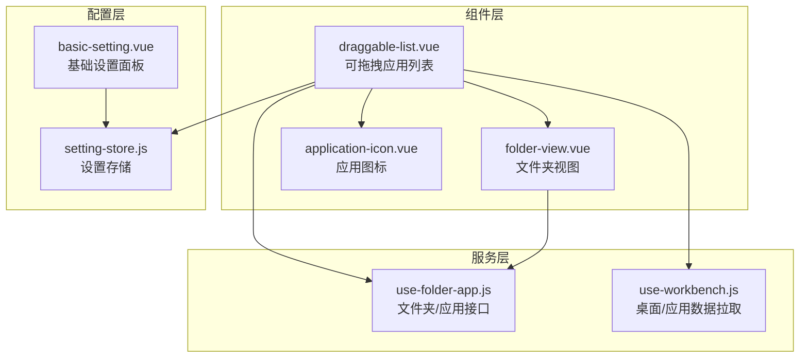
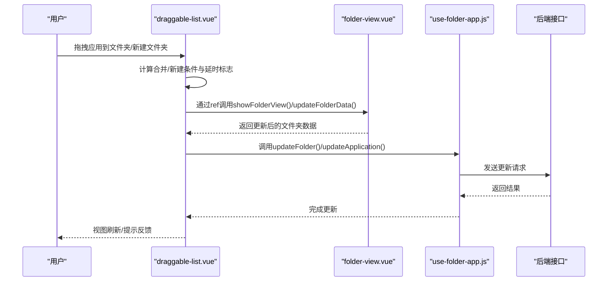
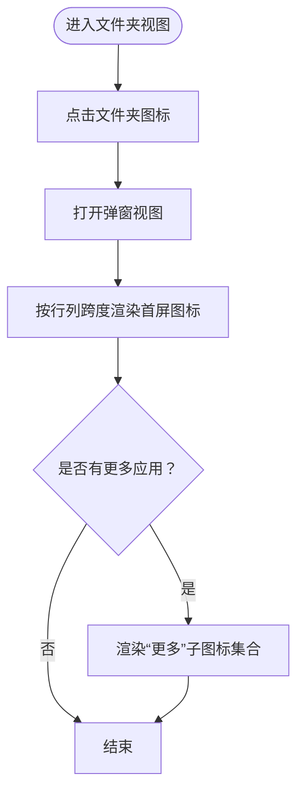
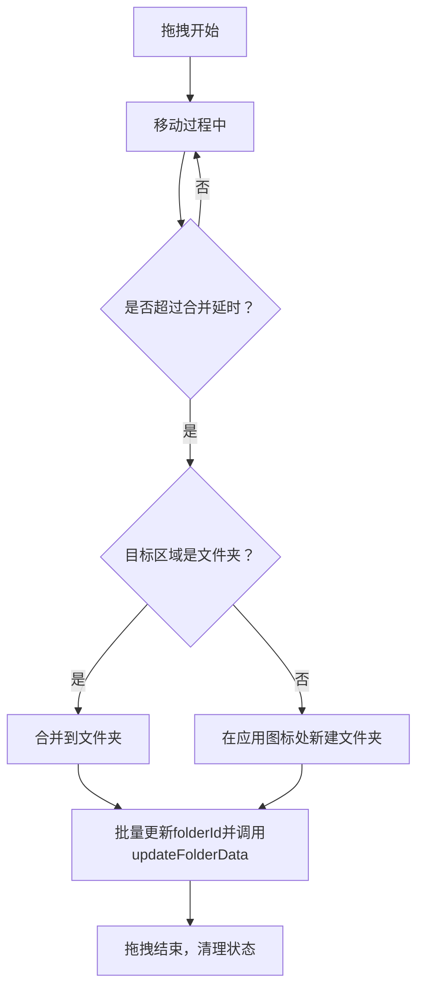
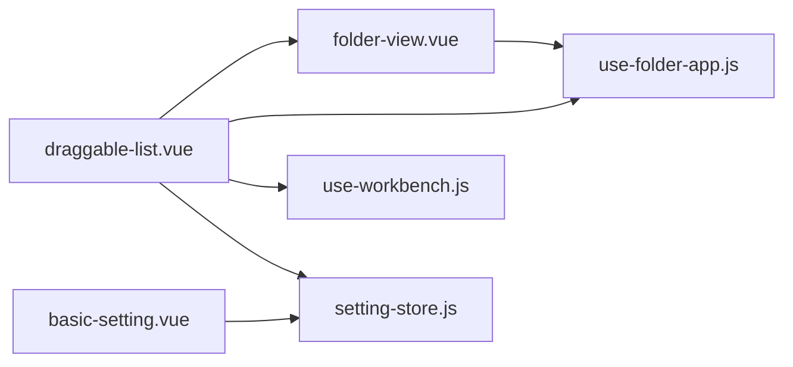

# 文件夹管理

<cite>
**本文引用的文件**
- [folder-view.vue](file://src/portal/views/workbench/desktop-view/folder-view.vue)
- [draggable-list.vue](file://src/portal/views/workbench/desktop-view/draggable-list.vue)
- [application-icon.vue](file://src/portal/views/workbench/desktop-view/application-icon.vue)
- [use-folder-app.js](file://src/portal/views/workbench/desktop-view/use-folder-app.js)
- [hooks.js](file://src/portal/views/workbench/desktop-view/hooks.js)
- [use-workbench.js](file://src/portal/views/workbench/use-workbench.js)
- [setting-store.js](file://src/portal/views/workbench/setting-center/setting-store.js)
- [basic-setting.vue](file://src/portal/views/workbench/setting-center/basic/basic-setting.vue)
- [app-center.vue](file://src/pages/frame/workbench-views/apps/app-center/app-center.vue)
- [application-bar.vue](file://src/portal/views/workbench/application-bar/application-bar.vue)
- [viewer.js](file://public/static/pdf/web/viewer.js)
</cite>

## 目录
1. [简介](#简介)
2. [项目结构](#项目结构)
3. [核心组件](#核心组件)
4. [架构总览](#架构总览)
5. [详细组件分析](#详细组件分析)
6. [依赖关系分析](#依赖关系分析)
7. [性能考量](#性能考量)
8. [故障排查指南](#故障排查指南)
9. [结论](#结论)
10. [附录](#附录)

## 简介
本文件围绕 FS-AOI-WEB 的“文件夹管理”能力进行系统化技术文档整理，重点覆盖以下方面：
- 文件夹的创建、展开、折叠与内容渲染
- 文件夹数据结构与状态管理
- 文件夹与应用列表的关联机制
- 文件夹拖拽逻辑（合并、新建、释放）
- 文件夹配置管理（图标尺寸、名称显示、主题等）
- 层级结构、嵌套显示与内容过滤
- 文件夹管理的 API 接口与扩展开发建议

## 项目结构
文件夹管理相关代码主要位于工作台桌面视图模块，采用“组件-服务-配置”的分层组织方式：
- 组件层：文件夹视图组件、可拖拽的应用列表组件、应用图标组件
- 服务层：文件夹与应用的增删改查接口封装
- 配置层：个性化设置（图标尺寸、名称显示、主题等）与持久化

图表来源
- [draggable-list.vue](file://src/portal/views/workbench/desktop-view/draggable-list.vue#L1-L652)
- [folder-view.vue](file://src/portal/views/workbench/desktop-view/folder-view.vue#L1-L293)
- [application-icon.vue](file://src/portal/views/workbench/desktop-view/application-icon.vue#L1-L69)
- [use-folder-app.js](file://src/portal/views/workbench/desktop-view/use-folder-app.js#L1-L71)
- [use-workbench.js](file://src/portal/views/workbench/use-workbench.js#L1-L222)
- [setting-store.js](file://src/portal/views/workbench/setting-center/setting-store.js#L1-L43)
- [basic-setting.vue](file://src/portal/views/workbench/setting-center/basic/basic-setting.vue#L1-L30)

章节来源
- [draggable-list.vue](file://src/portal/views/workbench/desktop-view/draggable-list.vue#L1-L652)
- [folder-view.vue](file://src/portal/views/workbench/desktop-view/folder-view.vue#L1-L293)
- [use-workbench.js](file://src/portal/views/workbench/use-workbench.js#L1-L222)

## 核心组件
- 文件夹视图组件（folder-view.vue）
  - 负责文件夹的图标渲染、子应用的首屏展示与“更多”子图标集合、弹窗式展开视图
  - 支持名称显示策略、网格布局参数（行/列跨度）、与 DraggableList 的数据交互
- 可拖拽应用列表（draggable-list.vue）
  - 提供拖拽事件处理、文件夹合并/新建/释放逻辑、跨桌面拖拽控制、排序更新
  - 通过 ref 引用与 folder-view 通信，实现延迟合并与视图切换
- 应用图标组件（application-icon.vue）
  - 渲染应用图标或占位字体图标，支持按名称哈希生成背景色
- 文件夹/应用接口（use-folder-app.js）
  - 封装文件夹创建/更新/删除与应用归属更新的后端请求
- 设置存储（setting-store.js）
  - 维护个性化设置并触发主题与样式变量更新
- 基础设置面板（basic-setting.vue）
  - 将设置项与 store 同步，触发后端持久化

章节来源
- [folder-view.vue](file://src/portal/views/workbench/desktop-view/folder-view.vue#L1-L293)
- [draggable-list.vue](file://src/portal/views/workbench/desktop-view/draggable-list.vue#L1-L652)
- [application-icon.vue](file://src/portal/views/workbench/desktop-view/application-icon.vue#L1-L69)
- [use-folder-app.js](file://src/portal/views/workbench/desktop-view/use-folder-app.js#L1-L71)
- [setting-store.js](file://src/portal/views/workbench/setting-center/setting-store.js#L1-L43)
- [basic-setting.vue](file://src/portal/views/workbench/setting-center/basic/basic-setting.vue#L1-L30)

## 架构总览
文件夹管理的运行时交互由“拖拽事件 → 列表更新 → 视图联动 → 后端同步”构成闭环。

图表来源
- [draggable-list.vue](file://src/portal/views/workbench/desktop-view/draggable-list.vue#L172-L223)
- [folder-view.vue](file://src/portal/views/workbench/desktop-view/folder-view.vue#L77-L102)
- [use-folder-app.js](file://src/portal/views/workbench/desktop-view/use-folder-app.js#L8-L68)

## 详细组件分析

### 文件夹视图组件（folder-view.vue）
- 数据结构要点
  - folder: 包含 id、name、applicationList、colSpan、rowSpan、viewStatus 等字段
  - 渲染策略：根据 colSpan×rowSpan 计算首屏图标数量，剩余应用以“更多”形式呈现
- 状态管理
  - showFolder 控制弹窗式展开
  - folderData/folderId 用于区分“新建临时ID”与“已持久化ID”，并决定是否创建/更新
- 关键流程
  - 打开文件夹：handleFolderClick → showFolder=true
  - 更新数据：updateFolderData → 同步父桌面列表/创建新文件夹/删除空文件夹
  - 关闭视图：hideFolderView/showFolderView

图表来源
- [folder-view.vue](file://src/portal/views/workbench/desktop-view/folder-view.vue#L115-L160)

章节来源
- [folder-view.vue](file://src/portal/views/workbench/desktop-view/folder-view.vue#L1-L293)

### 可拖拽应用列表（draggable-list.vue）
- 拖拽合并逻辑
  - moveEvent 中根据延时与类型判断是否触发合并/新建
  - addToFolderView：定位目标文件夹节点，延迟合并
  - createFolderView：在应用图标上停留达到延时后创建临时文件夹
- 数据更新
  - handleUpdateFolderData：批量更新 folderId 并调用 folder-view 的 updateFolderData
  - endMove：完成拖拽后清理临时状态、更新后端数据
- 跨桌面拖拽
  - 当拖拽目标桌面不同时，更新 desktopId 并同步文件夹内部应用的 desktopId
- 右键菜单
  - 删除应用/释放文件夹（将子应用还原为桌面应用）

图表来源
- [draggable-list.vue](file://src/portal/views/workbench/desktop-view/draggable-list.vue#L78-L141)
- [draggable-list.vue](file://src/portal/views/workbench/desktop-view/draggable-list.vue#L172-L223)
- [draggable-list.vue](file://src/portal/views/workbench/desktop-view/draggable-list.vue#L226-L256)

章节来源
- [draggable-list.vue](file://src/portal/views/workbench/desktop-view/draggable-list.vue#L1-L652)

### 应用图标组件（application-icon.vue）
- 图标渲染策略
  - 若存在自定义 icon，则使用静态图片资源
  - 否则基于应用名称生成哈希，选择预设背景色，显示前两个字符作为占位图标
- 作用域
  - 为应用与文件夹图标提供统一渲染入口

章节来源
- [application-icon.vue](file://src/portal/views/workbench/desktop-view/application-icon.vue#L1-L69)

### 文件夹/应用接口（use-folder-app.js）
- 接口职责
  - updateFolder：创建/更新文件夹（含排序计算）
  - removeFolder：删除文件夹
  - updateApplication：批量更新应用的归属与属性
- 请求参数映射
  - 将前端对象映射为后端期望字段，确保包含 APP_ID、DESKTOP_ID、FOLDER_ID、GROUP_ID 等关键字段

章节来源
- [use-folder-app.js](file://src/portal/views/workbench/desktop-view/use-folder-app.js#L1-L71)

### 设置存储与个性化（setting-store.js、basic-setting.vue）
- 设置项
  - applicationIconSize：小/中/大三档
  - showApplicationName：是否显示应用名称
  - fontSize、applicationBarPosition、desktopBarPosition、desktopPadding、desktopBackgroundStyle、theme
- 同步机制
  - basic-setting.vue 监听设置变更，调用 store.updateCustomSetting
  - store.updateCustomSetting 写入本地并触发后端持久化（updateCustomSetting）

章节来源
- [setting-store.js](file://src/portal/views/workbench/setting-center/setting-store.js#L1-L43)
- [basic-setting.vue](file://src/portal/views/workbench/setting-center/basic/basic-setting.vue#L1-L30)
- [use-workbench.js](file://src/portal/views/workbench/use-workbench.js#L167-L195)

### 应用中心与应用列表（app-center.vue、application-bar.vue）
- 应用中心
  - 拉取应用列表并按分组聚合，支持禁用已安装应用
- 应用状态栏
  - 展示已打开应用，支持点击跳转至对应应用视图

章节来源
- [app-center.vue](file://src/pages/frame/workbench-views/apps/app-center/app-center.vue#L1-L47)
- [application-bar.vue](file://src/portal/views/workbench/application-bar/application-bar.vue#L1-L43)

## 依赖关系分析
- 组件耦合
  - draggable-list 与 folder-view 通过 ref 通信，形成父子协作
  - folder-view 依赖 use-folder-app 进行后端同步
  - draggable-list 依赖 use-workbench 获取桌面/应用数据
- 外部依赖
  - vue-draggable-plus 提供拖拽能力
  - Pinia store 提供设置状态管理
  - 后端服务接口（F092003901/05/06/07/08/13/17/18）提供数据与配置读写

图表来源
- [draggable-list.vue](file://src/portal/views/workbench/desktop-view/draggable-list.vue#L1-L14)
- [folder-view.vue](file://src/portal/views/workbench/desktop-view/folder-view.vue#L1-L7)
- [use-folder-app.js](file://src/portal/views/workbench/desktop-view/use-folder-app.js#L1-L2)
- [use-workbench.js](file://src/portal/views/workbench/use-workbench.js#L1-L2)
- [setting-store.js](file://src/portal/views/workbench/setting-center/setting-store.js#L1-L2)
- [basic-setting.vue](file://src/portal/views/workbench/setting-center/basic/basic-setting.vue#L1-L3)

章节来源
- [draggable-list.vue](file://src/portal/views/workbench/desktop-view/draggable-list.vue#L1-L14)
- [folder-view.vue](file://src/portal/views/workbench/desktop-view/folder-view.vue#L1-L7)
- [use-folder-app.js](file://src/portal/views/workbench/desktop-view/use-folder-app.js#L1-L2)
- [use-workbench.js](file://src/portal/views/workbench/use-workbench.js#L1-L2)
- [setting-store.js](file://src/portal/views/workbench/setting-center/setting-store.js#L1-L2)
- [basic-setting.vue](file://src/portal/views/workbench/setting-center/basic/basic-setting.vue#L1-L3)

## 性能考量
- 拖拽延时与节流
  - 合并延时（mergeFolderDelay）避免频繁 DOM 查询与视图切换
  - moveFlag/moveTimer 控制移动事件频率，降低重绘压力
- 视图渲染优化
  - 文件夹首屏仅渲染固定数量图标，其余以“更多”集合展示
  - 使用 CSS Grid 控制布局，减少复杂计算
- 数据更新批量化
  - 批量更新 folderId，减少多次后端请求
- 资源与样式
  - 图标采用背景图或占位文本，避免额外资源加载
  - 设置变更即时生效，减少重复计算

## 故障排查指南
- 拖拽无效或误触发
  - 检查 mergeFolder 与 mergeFolderDelay 配置
  - 确认拖拽事件中 clonedData.type 是否为应用类型（非文件夹）
- 文件夹无法创建/更新
  - 核对 folder-view 的 ID 判定逻辑（临时ID与持久化ID）
  - 检查 use-folder-app 的请求参数映射与返回值
- 子应用丢失或顺序错乱
  - 确认 endMove 中对 applicationList 的处理与排序更新
- 跨桌面拖拽异常
  - 检查 desktopId 的赋值与文件夹内部应用的同步更新
- 设置不生效
  - 确认 basic-setting.vue 与 setting-store.js 的双向绑定与后端持久化回调

章节来源
- [draggable-list.vue](file://src/portal/views/workbench/desktop-view/draggable-list.vue#L78-L141)
- [draggable-list.vue](file://src/portal/views/workbench/desktop-view/draggable-list.vue#L331-L363)
- [folder-view.vue](file://src/portal/views/workbench/desktop-view/folder-view.vue#L77-L102)
- [use-folder-app.js](file://src/portal/views/workbench/desktop-view/use-folder-app.js#L8-L68)
- [setting-store.js](file://src/portal/views/workbench/setting-center/setting-store.js#L29-L41)

## 结论
FS-AOI-WEB 的文件夹管理以组件化为核心，结合可拖拽列表与后端接口，实现了从“创建/合并/释放”到“展开/折叠/渲染”的完整闭环。通过设置存储与主题系统，用户可灵活定制图标尺寸与名称显示；通过延时与批量化更新，兼顾了交互流畅性与数据一致性。后续可在“内容过滤”“多级嵌套”“权限控制”等方面进一步增强。

## 附录

### API 接口清单（后端服务码）
- 桌面列表：F092003901
- 应用列表：F092003905
- 固定应用：F092003913
- 文件夹创建/更新：F092003907
- 文件夹删除：F092003908
- 应用批量更新：F092003906
- 用户个性化设置读取：F092003917
- 用户个性化设置更新：F092003918

章节来源
- [use-workbench.js](file://src/portal/views/workbench/use-workbench.js#L4-L122)
- [use-folder-app.js](file://src/portal/views/workbench/desktop-view/use-folder-app.js#L8-L68)

### 配置选项说明
- applicationIconSize：小/中/大
- showApplicationName：显示/隐藏
- fontSize：字号
- applicationBarPosition：应用栏位置
- desktopBarPosition：桌面导航栏位置
- desktopPadding：桌面应用列表宽度
- desktopBackgroundStyle：壁纸设置
- theme：主题

章节来源
- [setting-store.js](file://src/portal/views/workbench/setting-center/setting-store.js#L8-L17)
- [basic-setting.vue](file://src/portal/views/workbench/setting-center/basic/basic-setting.vue#L7-L30)
- [use-workbench.js](file://src/portal/views/workbench/use-workbench.js#L169-L195)

### 扩展开发指南
- 新增文件夹行为
  - 在 draggable-list 中扩展 moveEvent 的判定条件
  - 在 folder-view 中完善 updateFolderData 的分支处理
- 增强内容过滤
  - 在渲染前对 applicationList 进行筛选，减少首屏渲染量
- 多级嵌套
  - 为 folder-view 增加递归渲染与层级标识
- 权限控制
  - 在 use-workbench 中引入权限校验，并在渲染阶段屏蔽不可见应用