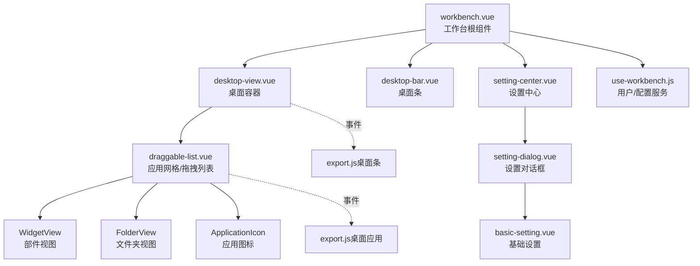
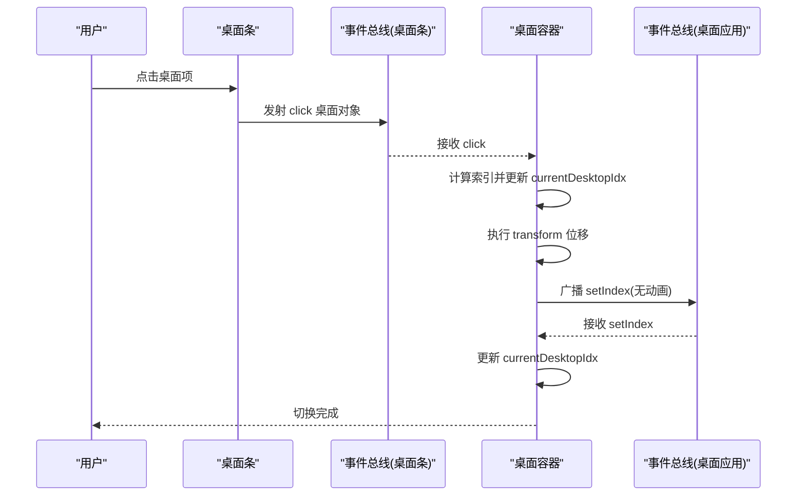
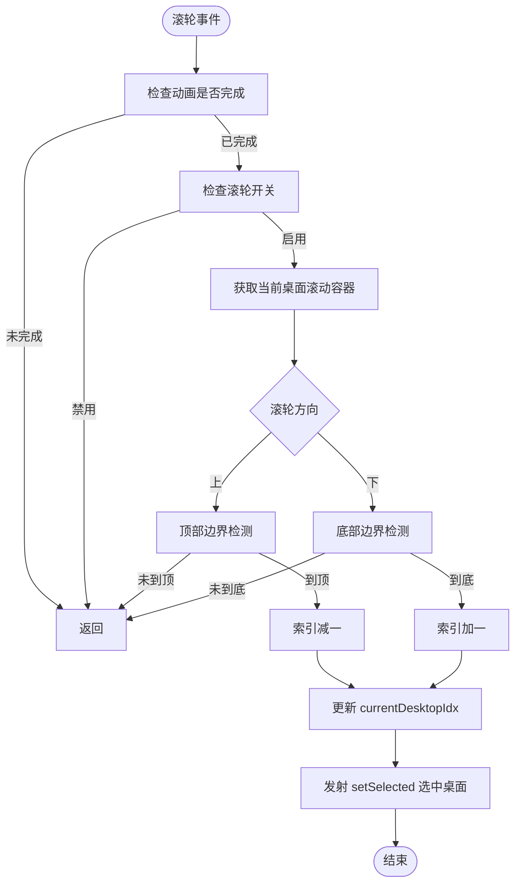
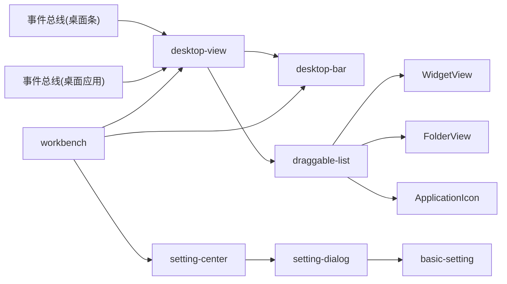
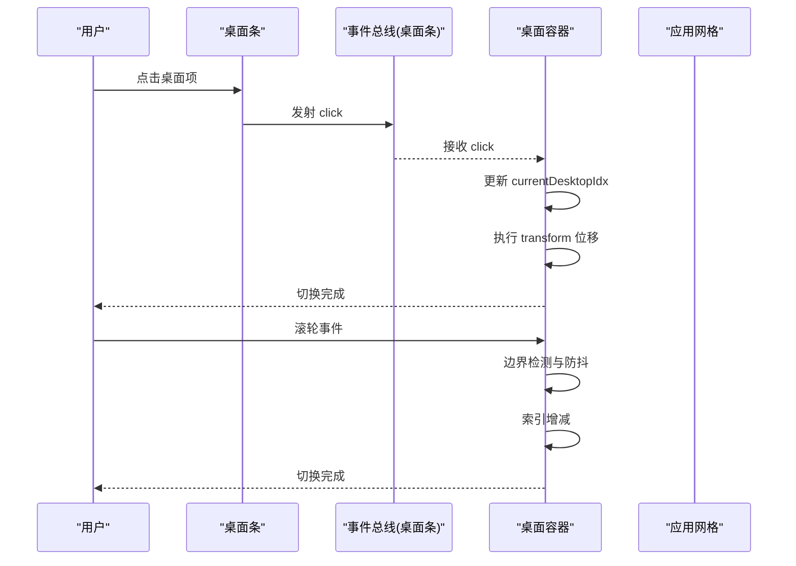

# 桌面布局管理

<cite>
**本文引用的文件**
- [workbench.vue](file://src/portal/views/workbench/workbench.vue)
- [desktop-view.vue](file://src/portal/views/workbench/desktop-view/desktop-view.vue)
- [draggable-list.vue](file://src/portal/views/workbench/desktop-view/draggable-list.vue)
- [desktop-bar.vue](file://src/portal/views/workbench/desktop-bar/desktop-bar.vue)
- [setting-store.js](file://src/portal/views/workbench/setting-center/setting-store.js)
- [basic-setting.vue](file://src/portal/views/workbench/setting-center/basic/basic-setting.vue)
- [setting-dialog.vue](file://src/portal/views/workbench/setting-center/setting-dialog.vue)
- [setting-center.vue](file://src/portal/views/workbench/setting-center/setting-center.vue)
- [use-workbench.js](file://src/portal/views/workbench/use-workbench.js)
- [export.js（桌面应用）](file://src/portal/views/workbench/desktop-view/export.js)
- [export.js（桌面条）](file://src/portal/views/workbench/desktop-bar/export.js)
</cite>

## 目录
1. [简介](#简介)
2. [项目结构](#项目结构)
3. [核心组件](#核心组件)
4. [架构总览](#架构总览)
5. [详细组件分析](#详细组件分析)
6. [依赖关系分析](#依赖关系分析)
7. [性能考量](#性能考量)
8. [故障排查指南](#故障排查指南)
9. [结论](#结论)
10. [附录](#附录)

## 简介
本文件面向 FS-AOI-WEB 的“桌面布局管理”子系统，聚焦桌面容器的实现原理与交互机制，包括：
- 多桌面切换与索引管理
- 滚动控制与边界检测
- 动画过渡与滚动行为
- 桌面高度计算与位置变换
- 事件监听与通信机制
- 配置参数与可扩展点
- 响应式布局与用户体验优化

## 项目结构
该子系统围绕工作台根组件展开，桌面容器与桌面条作为两个并行的视图层协同工作，应用列表通过拖拽组件实现桌面内的布局与文件夹合并。

图表来源
- [workbench.vue](file://src/portal/views/workbench/workbench.vue#L129-L162)
- [desktop-view.vue](file://src/portal/views/workbench/desktop-view/desktop-view.vue#L94-L113)
- [draggable-list.vue](file://src/portal/views/workbench/desktop-view/draggable-list.vue#L456-L550)
- [desktop-bar.vue](file://src/portal/views/workbench/desktop-bar/desktop-bar.vue#L172-L226)
- [setting-center.vue](file://src/portal/views/workbench/setting-center/setting-center.vue#L10-L15)
- [setting-dialog.vue](file://src/portal/views/workbench/setting-center/setting-dialog.vue#L17-L52)
- [basic-setting.vue](file://src/portal/views/workbench/setting-center/basic/basic-setting.vue#L1-L58)
- [use-workbench.js](file://src/portal/views/workbench/use-workbench.js#L167-L221)
- [export.js（桌面条）](file://src/portal/views/workbench/desktop-bar/export.js#L1-L6)
- [export.js（桌面应用）](file://src/portal/views/workbench/desktop-view/export.js#L1-L6)

章节来源
- [workbench.vue](file://src/portal/views/workbench/workbench.vue#L129-L162)

## 核心组件
- 工作台根组件：负责初始化应用与自定义配置、承载桌面容器与桌面条、挂载设置中心。
- 桌面容器：负责多桌面的垂直布局、高度计算、位移变换、滚轮切换与边界检测。
- 桌面条：负责桌面项的展示、拖拽重排、右键菜单、点击选中与事件广播。
- 应用网格/拖拽列表：负责应用图标网格布局、拖拽合并、文件夹创建与更新、跨桌面拖动控制。
- 设置中心：提供基础设置、壁纸设置、主题切换等配置入口。

章节来源
- [workbench.vue](file://src/portal/views/workbench/workbench.vue#L1-L235)
- [desktop-view.vue](file://src/portal/views/workbench/desktop-view/desktop-view.vue#L1-L137)
- [draggable-list.vue](file://src/portal/views/workbench/desktop-view/draggable-list.vue#L1-L652)
- [desktop-bar.vue](file://src/portal/views/workbench/desktop-bar/desktop-bar.vue#L1-L409)
- [setting-center.vue](file://src/portal/views/workbench/setting-center/setting-center.vue#L1-L46)

## 架构总览
桌面布局管理采用“根组件编排 + 事件总线通信”的模式：
- 根组件加载配置与应用数据，向桌面容器传递桌面列表与当前索引。
- 桌面条负责桌面项的点击/拖拽，通过事件总线通知桌面容器切换索引。
- 桌面容器根据索引进行 transform 位移，并在滚轮事件中进行边界检测与切换。
- 应用网格在每个桌面内渲染应用图标，支持拖拽合并、文件夹视图与跨桌面拖动。

图表来源
- [desktop-view.vue](file://src/portal/views/workbench/desktop-view/desktop-view.vue#L28-L45)
- [desktop-bar.vue](file://src/portal/views/workbench/desktop-bar/desktop-bar.vue#L49-L64)
- [export.js（桌面条）](file://src/portal/views/workbench/desktop-bar/export.js#L1-L6)
- [export.js（桌面应用）](file://src/portal/views/workbench/desktop-view/export.js#L1-L6)

## 详细组件分析

### 桌面容器：多桌面切换与滚动控制
- 多桌面切换
  - 容器高度：根据桌面数量动态设置为百分比高度，确保每个桌面占满可视区域。
  - 位移变换：使用 translate3d 在 Y 轴按百分比位移，索引乘以每屏百分比得到目标偏移。
  - 动画过渡：统一的 transition 时间，保证平滑的滑动体验。
- 滚动控制与边界检测
  - 通过监听滚轮事件，结合当前桌面的滚动容器 scrollTop/clientHeight/shadowRoot 属性，判断滚动方向与边界。
  - 当滚轮向上且顶部到达时阻止切换；向下且底部到达时阻止切换。
  - 使用时间戳防抖，避免动画未完成时重复触发。
- 事件监听
  - 监听桌面条的点击事件以更新索引。
  - 监听桌面条的 setIndex 事件以无动画快速定位。
  - 监听桌面应用的滚轮开关事件，用于在应用内部滚动时暂停桌面切换。

图表来源
- [desktop-view.vue](file://src/portal/views/workbench/desktop-view/desktop-view.vue#L53-L87)

章节来源
- [desktop-view.vue](file://src/portal/views/workbench/desktop-view/desktop-view.vue#L1-L137)

### 桌面条：桌面索引管理与事件广播
- 索引管理
  - 维护当前选中桌面 ID，点击时通过事件总线广播选中桌面对象。
  - 支持拖拽重排，结束后通过事件总线广播新的索引位置并触发切换。
- 右键菜单
  - 提供编辑与删除桌面项的操作，删除后自动重新选择合适的桌面。
- 位置与样式
  - 支持左右两侧固定，悬停展开显示桌面名称，使用 CSS clamp 控制高度范围。

章节来源
- [desktop-bar.vue](file://src/portal/views/workbench/desktop-bar/desktop-bar.vue#L1-L409)

### 应用网格/拖拽列表：布局与文件夹合并
- 布局
  - 基于 CSS Grid 实现自适应网格，列数由图标尺寸映射决定。
  - 支持应用图标与部件/文件夹视图混排，通过 colSpan/rowSpan 控制跨度。
- 拖拽与合并
  - 拖拽过程中延迟合并，鼠标进入目标文件夹或应用图标区域时创建/加入文件夹。
  - 支持跨桌面拖动，自动更新 desktopId 并同步后端。
- 文件夹视图
  - 文件夹内部可再次拖拽排序，离开时更新后端数据；释放时将文件夹内容拆分回桌面。
- 滚动开关
  - 当应用内部滚动时，通过事件总线通知桌面容器暂停滚轮切换，避免误触。

章节来源
- [draggable-list.vue](file://src/portal/views/workbench/desktop-view/draggable-list.vue#L1-L652)

### 设置中心：配置参数与扩展点
- 基础设置
  - 字体大小、应用图标尺寸、显示应用名称、桌面条位置、桌面内应用列表宽度、主题等。
- 同步机制
  - 设置变更通过 Pinia Store 写入并调用后端接口持久化，同时联动主题与样式变量。
- 对外暴露
  - 通过设置对话框模块化组织，支持扩展更多设置页签。

章节来源
- [setting-store.js](file://src/portal/views/workbench/setting-center/setting-store.js#L1-L43)
- [basic-setting.vue](file://src/portal/views/workbench/setting-center/basic/basic-setting.vue#L1-L58)
- [setting-dialog.vue](file://src/portal/views/workbench/setting-center/setting-dialog.vue#L1-L117)
- [setting-center.vue](file://src/portal/views/workbench/setting-center/setting-center.vue#L1-L46)
- [use-workbench.js](file://src/portal/views/workbench/use-workbench.js#L167-L221)

## 依赖关系分析
- 组件耦合
  - desktop-view 与 desktop-bar 通过事件总线解耦，降低直接依赖。
  - draggable-list 与 desktop-view 通过事件总线交换“滚轮开关”状态，实现滚动协作。
- 数据流
  - workbench 作为数据源，向 desktop-view 与 desktop-bar 注入桌面列表与当前索引。
  - 用户操作通过事件总线回流至 workbench，再写回应用列表与配置。
- 外部依赖
  - 使用 mitt 作为轻量事件总线。
  - 使用 vue-draggable-plus 实现拖拽与合并逻辑。
  - 使用 Pinia 管理设置中心状态。

图表来源
- [desktop-view.vue](file://src/portal/views/workbench/desktop-view/desktop-view.vue#L1-L137)
- [desktop-bar.vue](file://src/portal/views/workbench/desktop-bar/desktop-bar.vue#L1-L409)
- [draggable-list.vue](file://src/portal/views/workbench/desktop-view/draggable-list.vue#L1-L652)
- [setting-center.vue](file://src/portal/views/workbench/setting-center/setting-center.vue#L1-L46)
- [setting-dialog.vue](file://src/portal/views/workbench/setting-center/setting-dialog.vue#L1-L117)
- [basic-setting.vue](file://src/portal/views/workbench/setting-center/basic/basic-setting.vue#L1-L58)
- [export.js（桌面条）](file://src/portal/views/workbench/desktop-bar/export.js#L1-L6)
- [export.js（桌面应用）](file://src/portal/views/workbench/desktop-view/export.js#L1-L6)

## 性能考量
- 位移与合成层
  - 使用 translate3d 触发 GPU 加速，配合统一的 transition 时间，保证流畅度。
- 滚动节流
  - 通过时间戳与防抖逻辑避免动画未完成时重复触发，减少不必要的 DOM 更新。
- 拖拽合并延迟
  - 合并操作设置延迟阈值，降低频繁 DOM 查询与重绘。
- 布局自适应
  - CSS Grid 自动换行与列宽映射，减少手写计算开销。
- 事件总线
  - 仅在必要场景广播，避免全局监听导致的性能损耗。

## 故障排查指南
- 桌面切换无效
  - 检查动画时间戳是否仍在持续期内；确认桌面容器是否正确接收 setIndex 事件。
- 滚轮切换异常
  - 确认 canWheel 标志是否被置为 false；检查当前桌面滚动容器的 scrollTop/clientHeight/shadowRoot 是否正确。
- 桌面条拖拽不生效
  - 检查 group 配置与 put/pull 返回值；确认事件总线是否正确广播 endMove。
- 文件夹合并失败
  - 检查合并延迟阈值与目标节点是否存在；确认拖拽源 desktopId 与目标 dragViewFlag 是否一致。
- 设置未生效
  - 检查 Pinia Store 的 updateCustomSetting 是否调用后端接口；确认 key 映射是否正确。

章节来源
- [desktop-view.vue](file://src/portal/views/workbench/desktop-view/desktop-view.vue#L47-L92)
- [draggable-list.vue](file://src/portal/views/workbench/desktop-view/draggable-list.vue#L375-L378)
- [desktop-bar.vue](file://src/portal/views/workbench/desktop-bar/desktop-bar.vue#L143-L147)
- [use-workbench.js](file://src/portal/views/workbench/use-workbench.js#L180-L195)

## 结论
该桌面布局管理系统通过“根组件编排 + 事件总线 + 可插拔视图”的架构，实现了多桌面的平滑切换、精确的滚动边界控制与良好的用户体验。配合设置中心与拖拽合并能力，系统具备较强的可扩展性与可维护性。建议在后续迭代中进一步细化边界检测策略与性能监控指标，以提升复杂场景下的稳定性。

## 附录

### 关键流程时序图：桌面切换与滚轮控制

图表来源
- [desktop-view.vue](file://src/portal/views/workbench/desktop-view/desktop-view.vue#L53-L87)
- [desktop-bar.vue](file://src/portal/views/workbench/desktop-bar/desktop-bar.vue#L49-L64)
- [export.js（桌面条）](file://src/portal/views/workbench/desktop-bar/export.js#L1-L6)

### 配置参数清单（设置中心）
- 字体大小：12/14/16
- 应用图标尺寸：small/middle/large
- 显示应用名称：1/0
- 应用状态栏位置：bottom/top
- 桌面条位置：left/right
- 桌面内应用列表宽度：数值（px）
- 主题：light/dark/yellow/deepblue/default
- 桌面背景样式：字符串（壁纸样式）

章节来源
- [setting-store.js](file://src/portal/views/workbench/setting-center/setting-store.js#L8-L17)
- [basic-setting.vue](file://src/portal/views/workbench/setting-center/basic/basic-setting.vue#L7-L35)
- [use-workbench.js](file://src/portal/views/workbench/use-workbench.js#L169-L178)