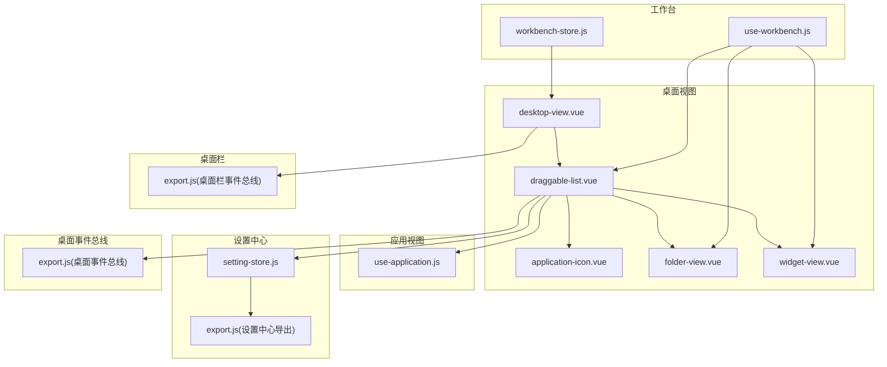
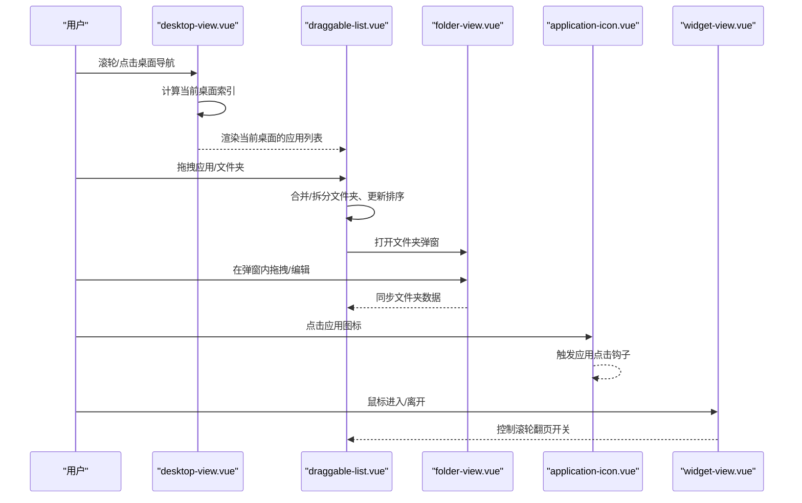
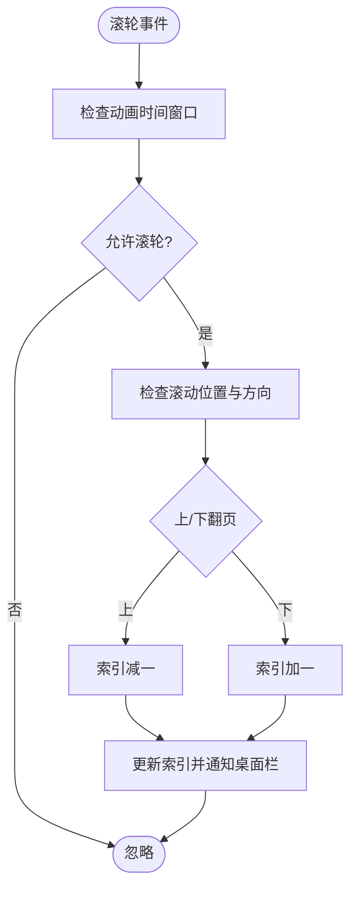
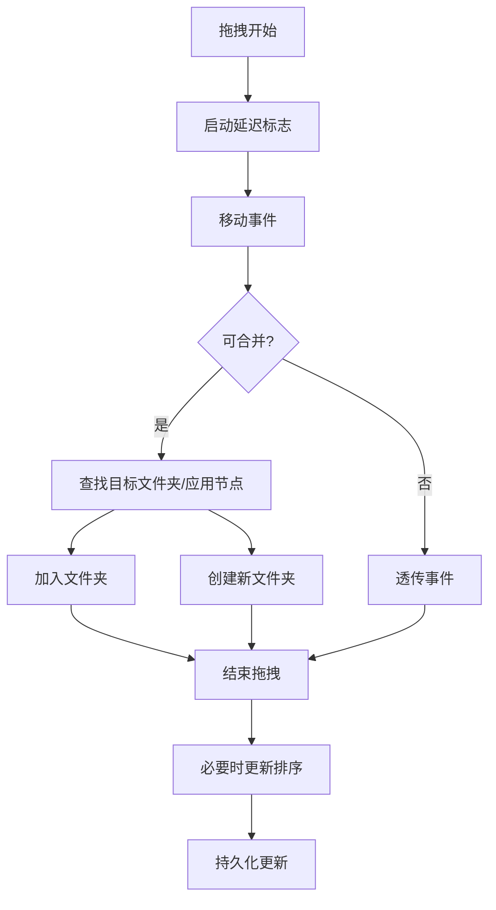
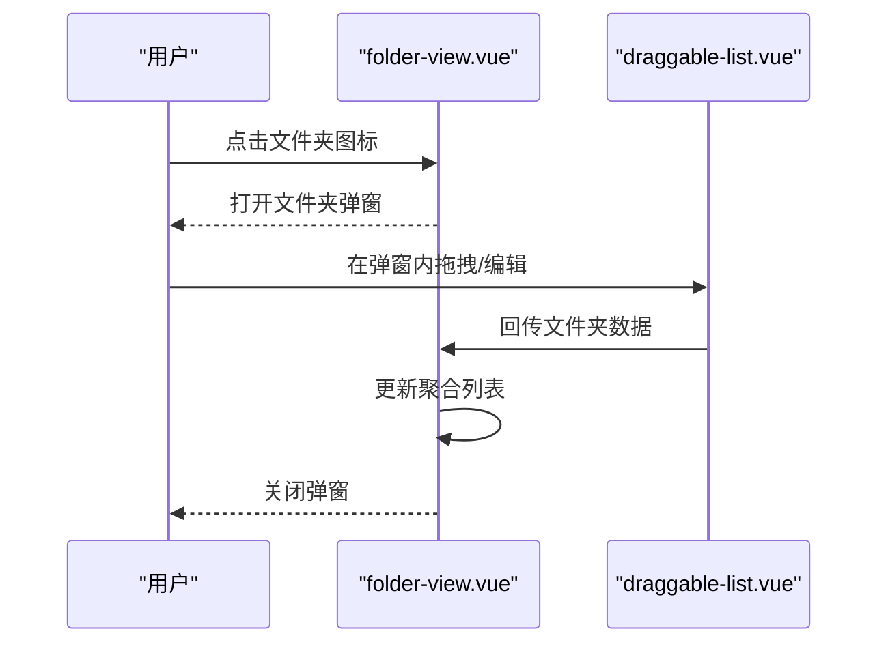
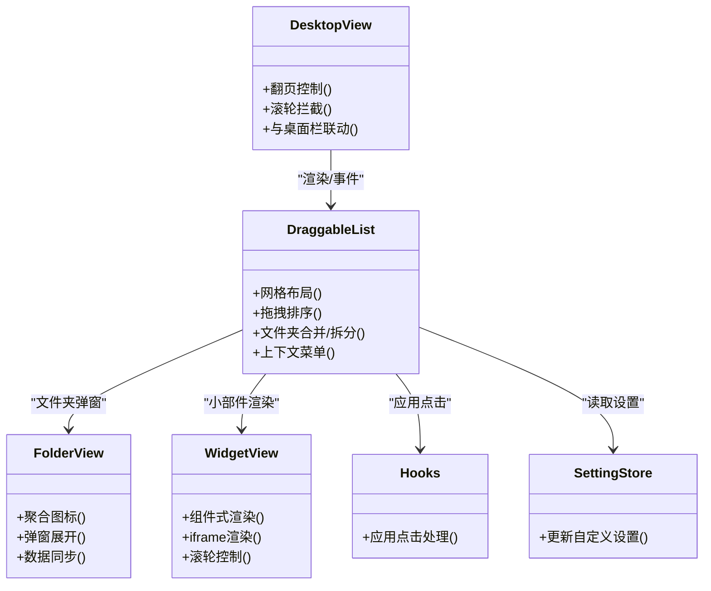
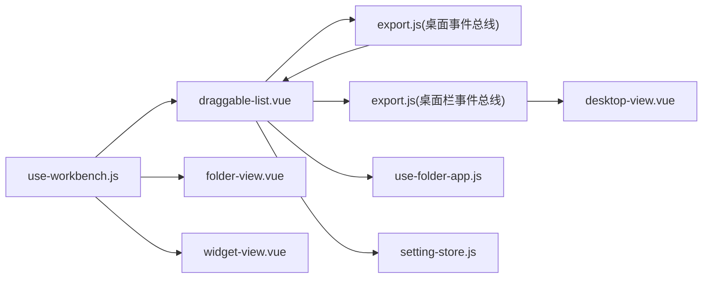

# 桌面管理

<cite>
**本文引用的文件**
- [desktop-view.vue](file://src/portal/views/workbench/desktop-view/desktop-view.vue)
- [draggable-list.vue](file://src/portal/views/workbench/desktop-view/draggable-list.vue)
- [application-icon.vue](file://src/portal/views/workbench/desktop-view/application-icon.vue)
- [folder-view.vue](file://src/portal/views/workbench/desktop-view/folder-view.vue)
- [widget-view.vue](file://src/portal/views/workbench/desktop-view/widget-view.vue)
- [hooks.js](file://src/portal/views/workbench/desktop-view/hooks.js)
- [use-folder-app.js](file://src/portal/views/workbench/desktop-view/use-folder-app.js)
- [export.js（桌面事件总线）](file://src/portal/views/workbench/desktop-view/export.js)
- [export.js（桌面栏事件总线）](file://src/portal/views/workbench/desktop-bar/export.js)
- [use-application.js](file://src/portal/views/workbench/application-view/use-application.js)
- [setting-store.js](file://src/portal/views/workbench/setting-center/setting-store.js)
- [export.js（设置中心导出）](file://src/portal/views/workbench/setting-center/export.js)
- [use-workbench.js](file://src/portal/views/workbench/use-workbench.js)
- [workbench-store.js](file://src/portal/views/workbench/workbench-store.js)
</cite>

## 目录
1. [简介](#简介)
2. [项目结构](#项目结构)
3. [核心组件](#核心组件)
4. [架构总览](#架构总览)
5. [详细组件分析](#详细组件分析)
6. [依赖关系分析](#依赖关系分析)
7. [性能考量](#性能考量)
8. [故障排查指南](#故障排查指南)
9. [结论](#结论)
10. [附录：API与配置](#附录api与配置)

## 简介
本文件面向 FS-AOI-WEB 桌面管理系统，聚焦“桌面视图”的核心架构与实现原理，覆盖桌面布局管理、应用图标管理、文件夹管理、小部件系统、拖拽排序机制、图标拖拽逻辑、文件夹展开/折叠、数据结构与状态管理、事件处理机制、渲染与配置扩展等内容。文档以代码级分析为基础，辅以可视化图示，帮助开发者快速理解并进行二次开发与扩展。

## 项目结构
桌面管理相关代码主要位于工作台视图下的 desktop-view 子目录，配合应用视图、设置中心、桌面栏等模块协同工作。核心文件职责如下：
- desktop-view.vue：桌面容器与多桌面切换、滚轮翻页、子桌面可视区域控制
- draggable-list.vue：桌面/文件夹内的拖拽列表、图标渲染、文件夹合并/拆分、排序、上下文菜单
- application-icon.vue：应用图标渲染（优先使用资源图标，否则按名称哈希生成背景色块）
- folder-view.vue：文件夹图标聚合展示、展开弹窗、子列表管理、持久化更新
- widget-view.vue：小部件渲染（支持组件式与 iframe 两种渲染方式）
- hooks.js：应用点击统一入口（鉴权与打开应用）
- use-folder-app.js：文件夹与应用的后端同步（增删改）
- export.js（桌面事件总线）：桌面与应用视图之间的事件通信
- export.js（桌面栏事件总线）：桌面导航条与桌面视图的事件通信
- use-application.js：应用视图的事件总线封装
- setting-store.js：自定义设置（图标尺寸、名称显示、桌面内边距等）
- use-workbench.js：桌面与应用数据拉取、固定应用、自定义设置同步
- workbench-store.js：工作台全局状态（加载态）

图表来源
- [desktop-view.vue](file://src/portal/views/workbench/desktop-view/desktop-view.vue#L1-L137)
- [draggable-list.vue](file://src/portal/views/workbench/desktop-view/draggable-list.vue#L1-L652)
- [application-icon.vue](file://src/portal/views/workbench/desktop-view/application-icon.vue#L1-L69)
- [folder-view.vue](file://src/portal/views/workbench/desktop-view/folder-view.vue#L1-L293)
- [widget-view.vue](file://src/portal/views/workbench/desktop-view/widget-view.vue#L1-L39)
- [use-application.js](file://src/portal/views/workbench/application-view/use-application.js#L1-L30)
- [setting-store.js](file://src/portal/views/workbench/setting-center/setting-store.js#L1-L44)
- [export.js（设置中心导出）](file://src/portal/views/workbench/setting-center/export.js#L1-L4)
- [export.js（桌面栏事件总线）](file://src/portal/views/workbench/desktop-bar/export.js#L1-L6)
- [export.js（桌面事件总线）](file://src/portal/views/workbench/desktop-view/export.js#L1-L6)
- [use-workbench.js](file://src/portal/views/workbench/use-workbench.js#L1-L222)
- [workbench-store.js](file://src/portal/views/workbench/workbench-store.js#L1-L15)

章节来源
- [desktop-view.vue](file://src/portal/views/workbench/desktop-view/desktop-view.vue#L1-L137)
- [draggable-list.vue](file://src/portal/views/workbench/desktop-view/draggable-list.vue#L1-L652)
- [use-workbench.js](file://src/portal/views/workbench/use-workbench.js#L1-L222)

## 核心组件
- 桌面容器与翻页：desktop-view.vue 负责多桌面容器、滚轮翻页、当前桌面索引控制、与桌面栏联动
- 拖拽列表与布局：draggable-list.vue 提供网格布局、拖拽排序、文件夹合并/拆分、上下文菜单、名称编辑、小部件与应用图标渲染
- 应用图标渲染：application-icon.vue 支持外部 SVG 图标与基于名称哈希的占位背景
- 文件夹视图：folder-view.vue 展示文件夹聚合图标，弹窗内嵌拖拽列表，负责文件夹数据持久化
- 小部件视图：widget-view.vue 支持组件式渲染与 iframe 渲染，并在进入/离开时控制滚轮翻页
- 钩子与事件：hooks.js 统一应用点击处理；use-folder-app.js 负责文件夹与应用的后端同步；export.js 提供事件总线

章节来源
- [desktop-view.vue](file://src/portal/views/workbench/desktop-view/desktop-view.vue#L1-L137)
- [draggable-list.vue](file://src/portal/views/workbench/desktop-view/draggable-list.vue#L1-L652)
- [application-icon.vue](file://src/portal/views/workbench/desktop-view/application-icon.vue#L1-L69)
- [folder-view.vue](file://src/portal/views/workbench/desktop-view/folder-view.vue#L1-L293)
- [widget-view.vue](file://src/portal/views/workbench/desktop-view/widget-view.vue#L1-L39)
- [hooks.js](file://src/portal/views/workbench/desktop-view/hooks.js#L1-L16)
- [use-folder-app.js](file://src/portal/views/workbench/desktop-view/use-folder-app.js#L1-L71)
- [export.js（桌面事件总线）](file://src/portal/views/workbench/desktop-view/export.js#L1-L6)
- [export.js（桌面栏事件总线）](file://src/portal/views/workbench/desktop-bar/export.js#L1-L6)
- [use-application.js](file://src/portal/views/workbench/application-view/use-application.js#L1-L30)

## 架构总览
桌面管理采用“容器-列表-子视图”三层结构：
- 容器层：desktop-view.vue 管理多桌面与翻页动画
- 列表层：draggable-list.vue 管理网格布局、拖拽、文件夹合并/拆分、上下文菜单
- 视图层：application-icon.vue、folder-view.vue、widget-view.vue 分别渲染应用图标、文件夹聚合与弹窗、小部件

图表来源
- [desktop-view.vue](file://src/portal/views/workbench/desktop-view/desktop-view.vue#L28-L87)
- [draggable-list.vue](file://src/portal/views/workbench/desktop-view/draggable-list.vue#L32-L378)
- [folder-view.vue](file://src/portal/views/workbench/desktop-view/folder-view.vue#L73-L113)
- [application-icon.vue](file://src/portal/views/workbench/desktop-view/application-icon.vue#L20-L33)
- [widget-view.vue](file://src/portal/views/workbench/desktop-view/widget-view.vue#L22-L31)

## 详细组件分析

### 桌面容器与翻页（desktop-view.vue）
- 多桌面容器：通过高度百分比与 transform 实现垂直堆叠与平滑切换
- 滚轮翻页：限制滚轮触发条件，避免滚动穿透至列表内部
- 与桌面栏联动：接收桌面栏点击事件，设置当前桌面索引并选中

图表来源
- [desktop-view.vue](file://src/portal/views/workbench/desktop-view/desktop-view.vue#L47-L87)

章节来源
- [desktop-view.vue](file://src/portal/views/workbench/desktop-view/desktop-view.vue#L1-L137)

### 拖拽列表与布局（draggable-list.vue）
- 网格布局：基于 CSS Grid 的响应式布局，列/行跨度由应用的 colSpan/rowSpan 决定
- 拖拽排序：使用 vue-draggable-plus，支持 ghost-class/chosen-class、动画时长、拖拽组
- 文件夹合并/拆分：通过 move 事件检测鼠标与目标元素位置，延迟合并策略避免误触
- 名称编辑：双击文件夹名称进入输入框，回车或失焦保存
- 上下文菜单：支持删除、释放（将文件夹内应用移出）
- 跨桌面拖拽：当拖拽目标桌面不同时，更新 desktopId 并同步后端

图表来源
- [draggable-list.vue](file://src/portal/views/workbench/desktop-view/draggable-list.vue#L78-L363)

章节来源
- [draggable-list.vue](file://src/portal/views/workbench/desktop-view/draggable-list.vue#L1-L652)

### 应用图标渲染（application-icon.vue）
- 优先使用静态资源中的 SVG 图标
- 若无图标，则根据应用名称生成哈希，映射到预设背景色块，首字符作为占位内容

章节来源
- [application-icon.vue](file://src/portal/views/workbench/desktop-view/application-icon.vue#L1-L69)

### 文件夹视图（folder-view.vue）
- 聚合展示：仅展示前 N 个应用图标，其余以“查看更多”占位
- 弹窗展开：点击后弹出对话框，内部嵌套 draggable-list，禁用文件夹合并，支持编辑与拖拽
- 数据同步：支持临时 ID 创建后的回填与批量更新，空文件夹自动移除

图表来源
- [folder-view.vue](file://src/portal/views/workbench/desktop-view/folder-view.vue#L73-L113)
- [draggable-list.vue](file://src/portal/views/workbench/desktop-view/draggable-list.vue#L144-L256)

章节来源
- [folder-view.vue](file://src/portal/views/workbench/desktop-view/folder-view.vue#L1-L293)

### 小部件视图（widget-view.vue）
- 组件式渲染：根据链接路径动态导入模块并渲染
- iframe 渲染：直接以 iframe 方式加载外部页面
- 交互控制：鼠标进入时关闭滚轮翻页，离开时恢复

章节来源
- [widget-view.vue](file://src/portal/views/workbench/desktop-view/widget-view.vue#L1-L39)

### 事件与状态管理
- 应用点击：hooks.js 统一处理登录校验与打开应用
- 事件总线：desktop-view/export.js 与 desktop-bar/export.js 提供桌面与桌面栏之间的消息通道
- 设置中心：setting-store.js 管理桌面图标尺寸、名称显示、桌面内边距等，变更时同步后端

图表来源
- [desktop-view.vue](file://src/portal/views/workbench/desktop-view/desktop-view.vue#L1-L137)
- [draggable-list.vue](file://src/portal/views/workbench/desktop-view/draggable-list.vue#L1-L652)
- [folder-view.vue](file://src/portal/views/workbench/desktop-view/folder-view.vue#L1-L293)
- [widget-view.vue](file://src/portal/views/workbench/desktop-view/widget-view.vue#L1-L39)
- [hooks.js](file://src/portal/views/workbench/desktop-view/hooks.js#L1-L16)
- [setting-store.js](file://src/portal/views/workbench/setting-center/setting-store.js#L1-L44)

## 依赖关系分析
- 组件耦合
  - desktop-view.vue 与 draggable-list.vue 为父子关系，前者负责容器与翻页，后者负责布局与交互
  - draggable-list.vue 依赖 application-icon.vue、folder-view.vue、widget-view.vue 进行渲染
  - folder-view.vue 内部再依赖 draggable-list.vue，形成“弹窗内嵌列表”的闭环
- 事件耦合
  - desktop-view/export.js 与 desktop-bar/export.js 协作完成桌面切换
  - draggable-list.vue 通过 desktopAppEmitter 控制滚轮翻页开关
- 数据耦合
  - use-workbench.js 提供桌面与应用数据拉取、固定应用、自定义设置同步
  - use-folder-app.js 提供文件夹与应用的后端持久化

图表来源
- [use-workbench.js](file://src/portal/views/workbench/use-workbench.js#L1-L222)
- [draggable-list.vue](file://src/portal/views/workbench/desktop-view/draggable-list.vue#L1-L652)
- [folder-view.vue](file://src/portal/views/workbench/desktop-view/folder-view.vue#L1-L293)
- [widget-view.vue](file://src/portal/views/workbench/desktop-view/widget-view.vue#L1-L39)
- [export.js（桌面事件总线）](file://src/portal/views/workbench/desktop-view/export.js#L1-L6)
- [export.js（桌面栏事件总线）](file://src/portal/views/workbench/desktop-bar/export.js#L1-L6)
- [use-folder-app.js](file://src/portal/views/workbench/desktop-view/use-folder-app.js#L1-L71)
- [setting-store.js](file://src/portal/views/workbench/setting-center/setting-store.js#L1-L44)

章节来源
- [use-workbench.js](file://src/portal/views/workbench/use-workbench.js#L1-L222)
- [draggable-list.vue](file://src/portal/views/workbench/desktop-view/draggable-list.vue#L1-L652)
- [export.js（桌面事件总线）](file://src/portal/views/workbench/desktop-view/export.js#L1-L6)
- [export.js（桌面栏事件总线）](file://src/portal/views/workbench/desktop-bar/export.js#L1-L6)

## 性能考量
- 拖拽动画与延迟：通过 animation 与合并延迟参数控制，避免频繁重排与误触
- 滚轮拦截：在拖拽过程中阻止滚轮翻页，提升交互稳定性
- 懒加载与按需渲染：小部件支持组件式懒加载与 iframe 渲染，降低初始负载
- 响应式布局：CSS Grid 自适应不同图标尺寸，减少复杂计算

## 故障排查指南
- 拖拽无效
  - 检查拖拽组与可拖拽类名是否正确
  - 确认合并延迟与 moveFlag 逻辑未被提前阻断
- 文件夹无法创建/合并
  - 核对鼠标坐标与目标节点的边界判断
  - 确保临时 ID 与最终回填流程一致
- 滚轮翻页冲突
  - 检查 desktopAppEmitter 的开关状态与小部件的鼠标进入/离开事件
- 名称编辑不生效
  - 确认编辑状态与回车/失焦回调链路
- 数据未持久化
  - 检查 updateFolder 与 updateApplication 的请求参数与返回结果

章节来源
- [draggable-list.vue](file://src/portal/views/workbench/desktop-view/draggable-list.vue#L78-L363)
- [folder-view.vue](file://src/portal/views/workbench/desktop-view/folder-view.vue#L77-L102)
- [widget-view.vue](file://src/portal/views/workbench/desktop-view/widget-view.vue#L22-L31)
- [use-folder-app.js](file://src/portal/views/workbench/desktop-view/use-folder-app.js#L8-L68)

## 结论
桌面管理系统以“容器-列表-子视图”为核心，结合事件总线与设置中心，实现了多桌面、拖拽排序、文件夹聚合与展开、小部件渲染等功能。其关键在于：
- 精准的拖拽与文件夹合并策略
- 可配置的布局与图标尺寸
- 事件驱动的状态与数据同步
- 良好的交互体验与性能平衡

## 附录：API与配置

### 数据模型与字段
- 桌面对象
  - id：桌面标识
  - name：桌面名称
  - icon：桌面图标
  - order：排序
  - applicationList：桌面应用列表
- 应用对象
  - id/name/desktopId/folderId/groupId/groupName/icon/order/type/renderType/link/rowSpan/colSpan/menuSpell/appPur/busiCode/remark
- 文件夹对象
  - 除应用字段外，额外包含 applicationList 子列表

章节来源
- [use-workbench.js](file://src/portal/views/workbench/use-workbench.js#L4-L122)

### 配置项（设置中心）
- applicationIconSize：应用图标尺寸（small/middle/large）
- showApplicationName：是否显示应用名称（'0'/'1'）
- fontSize：字体大小
- applicationBarPosition：应用栏位置（如 bottom）
- desktopBarPosition：桌面栏位置（如 left）
- desktopPadding：桌面应用列表宽度（像素）
- desktopBackgroundStyle：桌面背景样式
- theme：主题（如 light）

章节来源
- [setting-store.js](file://src/portal/views/workbench/setting-center/setting-store.js#L5-L42)
- [use-workbench.js](file://src/portal/views/workbench/use-workbench.js#L169-L195)

### 事件总线
- 桌面事件总线（desktop-view/export.js）
  - desktopAppEmitter：用于桌面与应用视图之间的消息传递
- 桌面栏事件总线（desktop-bar/export.js）
  - desktopBarEmitter：用于桌面导航与桌面视图之间的消息传递

章节来源
- [export.js（桌面事件总线）](file://src/portal/views/workbench/desktop-view/export.js#L1-L6)
- [export.js（桌面栏事件总线）](file://src/portal/views/workbench/desktop-bar/export.js#L1-L6)

### 扩展开发指南
- 新增应用类型
  - 在 draggable-list.vue 中扩展渲染逻辑与拖拽行为
  - 在 use-folder-app.js 中补充后端同步方法
- 自定义小部件
  - 使用 widget-view.vue 的组件式或 iframe 渲染能力
  - 注意滚轮控制与生命周期管理
- 文件夹交互增强
  - 在 folder-view.vue 中扩展弹窗内的功能（如搜索、筛选）
- 设置项扩展
  - 在 setting-store.js 中新增字段并在 use-workbench.js 中同步