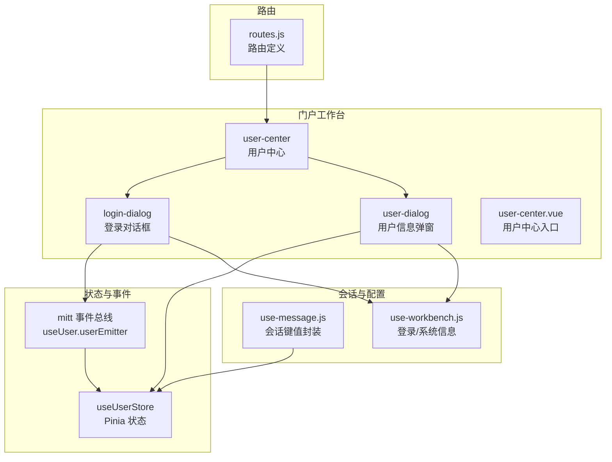
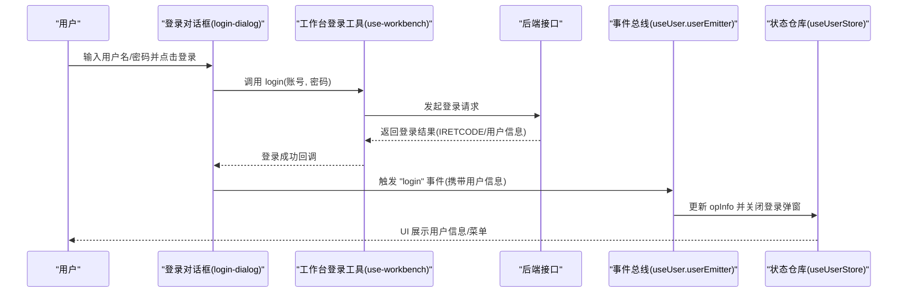
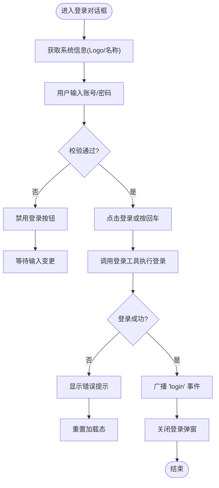
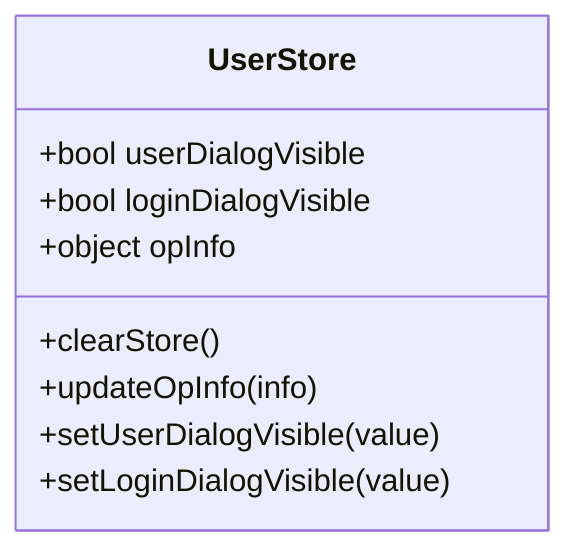
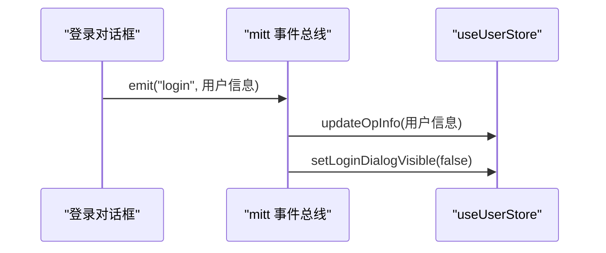
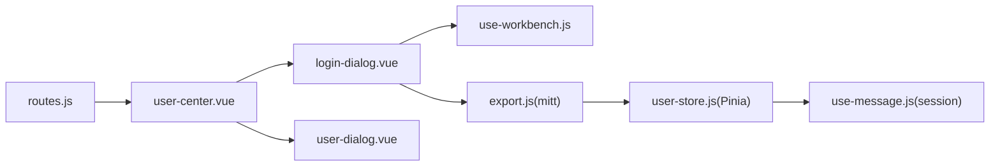

# 用户中心

<cite>
**本文引用的文件**
- [authentication-service.js](file://public/static/flow/scripts/common/services/authentication-service.js)
- [controllers.js](file://public/static/flow/scripts/controllers.js)
- [use-message.js](file://src/portal/hooks/use-message.js)
- [user-store.js](file://src/portal/views/workbench/user-center/user-store.js)
- [export.js](file://src/portal/views/workbench/user-center/export.js)
- [login-dialog.vue](file://src/portal/views/workbench/user-center/login-dialog.vue)
- [user-center.vue](file://src/portal/views/workbench/user-center/user-center.vue)
- [user-dialog.vue](file://src/portal/views/workbench/user-center/user-dialog.vue)
- [use-workbench.js](file://src/portal/views/workbench/use-workbench.js)
- [index.js](file://src/portal/router/routes.js)
- [main.js](file://src/main.js)
- [package.json](file://package.json)
</cite>

## 目录
1. [简介](#简介)
2. [项目结构](#项目结构)
3. [核心组件](#核心组件)
4. [架构总览](#架构总览)
5. [组件详解](#组件详解)
6. [依赖关系分析](#依赖关系分析)
7. [性能与可用性](#性能与可用性)
8. [故障排查指南](#故障排查指南)
9. [结论](#结论)
10. [附录](#附录)

## 简介
本文件面向 FS-AOI-WEB 的“用户中心”子系统，提供从整体架构到具体实现的完整技术参考。内容覆盖用户信息管理、登录对话框、用户操作面板等用户相关功能；阐述用户认证机制、会话管理、权限控制等安全能力；解释用户信息的获取与更新、登录状态维护、用户操作记录等技术实现；并给出用户界面响应式设计、交互流畅性、错误处理机制的实现要点。最后提供 API 接口、配置项与扩展开发指南，帮助开发者快速理解与二次开发。

## 项目结构
用户中心位于门户工作台（workbench）视图下，采用 Vue 3 + Pinia 架构，结合前端路由与会话存储实现登录态与用户信息的持久化与跨模块共享。后端认证流程通过 AngularJS 旧版脚本与新的前端登录流程协同完成，形成前后端联动的统一登录体验。

图表来源
- [user-center.vue](file://src/portal/views/workbench/user-center/user-center.vue#L1-L200)
- [login-dialog.vue](file://src/portal/views/workbench/user-center/login-dialog.vue#L1-L117)
- [user-dialog.vue](file://src/portal/views/workbench/user-center/user-dialog.vue#L1-L200)
- [user-store.js](file://src/portal/views/workbench/user-center/user-store.js#L1-L32)
- [export.js](file://src/portal/views/workbench/user-center/export.js#L1-L26)
- [use-message.js](file://src/portal/hooks/use-message.js#L1-L30)
- [use-workbench.js](file://src/portal/views/workbench/use-workbench.js#L1-L200)
- [routes.js](file://src/portal/router/routes.js#L1-L200)

章节来源
- [user-center.vue](file://src/portal/views/workbench/user-center/user-center.vue#L1-L200)
- [login-dialog.vue](file://src/portal/views/workbench/user-center/login-dialog.vue#L1-L117)
- [user-dialog.vue](file://src/portal/views/workbench/user-center/user-dialog.vue#L1-L200)
- [user-store.js](file://src/portal/views/workbench/user-center/user-store.js#L1-L32)
- [export.js](file://src/portal/views/workbench/user-center/export.js#L1-L26)
- [use-message.js](file://src/portal/hooks/use-message.js#L1-L30)
- [use-workbench.js](file://src/portal/views/workbench/use-workbench.js#L1-L200)
- [routes.js](file://src/portal/router/routes.js#L1-L200)

## 核心组件
- 登录对话框：负责用户输入凭据、触发登录请求、接收登录结果并广播事件。
- 用户信息弹窗：展示当前登录用户信息，支持退出登录等操作。
- 用户状态仓库：集中管理登录态、用户信息、对话框可见性等状态。
- 事件总线：在登录/退出时同步更新全局状态。
- 会话与配置：封装登录数据键值、登录令牌键值，统一读写 session 存储。
- 工作台登录工具：提供获取系统信息、执行登录等方法，供登录对话框调用。

章节来源
- [login-dialog.vue](file://src/portal/views/workbench/user-center/login-dialog.vue#L1-L117)
- [user-dialog.vue](file://src/portal/views/workbench/user-center/user-dialog.vue#L1-L200)
- [user-store.js](file://src/portal/views/workbench/user-center/user-store.js#L1-L32)
- [export.js](file://src/portal/views/workbench/user-center/export.js#L1-L26)
- [use-message.js](file://src/portal/hooks/use-message.js#L1-L30)
- [use-workbench.js](file://src/portal/views/workbench/use-workbench.js#L1-L200)

## 架构总览
用户中心采用“前端状态 + 事件总线 + 会话存储”的轻量级架构，登录态与用户信息通过 session 存储持久化，Pinia 状态用于组件间共享与驱动 UI 更新。登录流程由登录对话框发起，成功后通过事件总线通知状态仓库更新，并关闭登录对话框。

图表来源
- [login-dialog.vue](file://src/portal/views/workbench/user-center/login-dialog.vue#L31-L43)
- [export.js](file://src/portal/views/workbench/user-center/export.js#L8-L21)
- [user-store.js](file://src/portal/views/workbench/user-center/user-store.js#L20-L29)
- [use-workbench.js](file://src/portal/views/workbench/use-workbench.js#L1-L200)

## 组件详解

### 登录对话框（login-dialog）
- 功能职责
  - 提供用户名/密码输入与登录按钮。
  - 获取系统信息（如 Logo、系统名称）以增强品牌化。
  - 调用工作台登录工具执行登录，处理加载态与错误提示。
  - 登录成功后通过事件总线广播登录事件，携带用户信息。
- 关键点
  - 表单校验：用户名与密码非空才允许提交。
  - 加载态：登录过程中禁用按钮并显示加载。
  - 键盘回车：支持 Enter 快捷登录。
  - 事件广播：登录成功后触发 "login" 事件，供状态层更新。

图表来源
- [login-dialog.vue](file://src/portal/views/workbench/user-center/login-dialog.vue#L13-L43)

章节来源
- [login-dialog.vue](file://src/portal/views/workbench/user-center/login-dialog.vue#L1-L117)

### 用户状态仓库（useUserStore）
- 功能职责
  - 维护登录弹窗可见性、用户信息、以及是否需要显示登录弹窗。
  - 通过 sessionStorage 恢复登录态与用户信息。
  - 提供更新用户信息、控制弹窗显隐等动作。
- 关键点
  - 初始化逻辑：根据子系统模式与登录态决定初始弹窗显示。
  - 数据来源：从会话存储中读取登录数据键值。
  - 清理：提供重置状态的能力。

图表来源
- [user-store.js](file://src/portal/views/workbench/user-center/user-store.js#L6-L31)

章节来源
- [user-store.js](file://src/portal/views/workbench/user-center/user-store.js#L1-L32)

### 事件总线与导出（useUser）
- 功能职责
  - 基于 mitt 创建事件总线，监听 "login"/"logout" 事件。
  - 在 "login" 时更新用户信息，在 "logout" 时清空用户信息。
  - 对外暴露 showLogin 方法，用于触发显示登录弹窗。
- 关键点
  - 事件命名规范："login"/"logout"。
  - 与状态仓库解耦，仅负责事件分发与状态更新。

图表来源
- [export.js](file://src/portal/views/workbench/user-center/export.js#L8-L21)
- [user-store.js](file://src/portal/views/workbench/user-center/user-store.js#L20-L29)

章节来源
- [export.js](file://src/portal/views/workbench/user-center/export.js#L1-L26)

### 会话与配置（use-message）
- 功能职责
  - 封装登录数据键值与登录令牌键值，统一读写 sessionStorage。
  - 为登录态与用户信息持久化提供一致的键名约定。
- 关键点
  - 键值来自项目配置，确保前后端键名一致。
  - 与状态仓库配合，实现刷新后状态恢复。

章节来源
- [use-message.js](file://src/portal/hooks/use-message.js#L1-L30)

### 工作台登录工具（use-workbench）
- 功能职责
  - 提供获取系统信息的方法，用于登录对话框的品牌化展示。
  - 提供登录方法，封装登录请求与返回值处理。
- 关键点
  - 登录成功后返回包含 IRETCODE 的结果对象。
  - 与登录对话框紧密协作，驱动登录流程。

章节来源
- [use-workbench.js](file://src/portal/views/workbench/use-workbench.js#L1-L200)

### 用户中心入口（user-center.vue）
- 功能职责
  - 作为用户中心的主入口，承载登录弹窗与用户信息弹窗。
  - 根据登录态与子系统模式控制登录弹窗的初始可见性。
- 关键点
  - 与状态仓库联动，动态渲染登录弹窗与用户信息弹窗。
  - 与路由集成，确保页面访问与登录态一致。

章节来源
- [user-center.vue](file://src/portal/views/workbench/user-center/user-center.vue#L1-L200)

### 用户信息弹窗（user-dialog）
- 功能职责
  - 展示当前登录用户的基本信息。
  - 提供退出登录等操作入口。
- 关键点
  - 与事件总线配合，接收退出登录事件并清理状态。

章节来源
- [user-dialog.vue](file://src/portal/views/workbench/user-center/user-dialog.vue#L1-L200)

### 路由集成
- 功能职责
  - 定义用户中心相关路由，确保页面可访问且与登录态联动。
- 关键点
  - 路由守卫与登录态检查需与前端状态保持一致。

章节来源
- [routes.js](file://src/portal/router/routes.js#L1-L200)

## 依赖关系分析
- 组件内聚与耦合
  - 登录对话框与工作台登录工具高内聚，通过函数调用解耦。
  - 事件总线与状态仓库低耦合，通过事件契约通信。
  - 会话存储与状态仓库弱耦合，通过键值约定连接。
- 外部依赖
  - mitt：事件总线库，用于跨组件通信。
  - Pinia：状态管理库，用于集中管理用户态。
  - Vue 3：组件化框架，提供响应式与组合式 API。
- 可能的循环依赖
  - 当前结构未见明显循环依赖；事件总线与状态仓库通过单一方向通信，避免环路。

图表来源
- [login-dialog.vue](file://src/portal/views/workbench/user-center/login-dialog.vue#L1-L117)
- [use-workbench.js](file://src/portal/views/workbench/use-workbench.js#L1-L200)
- [export.js](file://src/portal/views/workbench/user-center/export.js#L1-L26)
- [user-store.js](file://src/portal/views/workbench/user-center/user-store.js#L1-L32)
- [use-message.js](file://src/portal/hooks/use-message.js#L1-L30)
- [user-center.vue](file://src/portal/views/workbench/user-center/user-center.vue#L1-L200)
- [user-dialog.vue](file://src/portal/views/workbench/user-center/user-dialog.vue#L1-L200)
- [routes.js](file://src/portal/router/routes.js#L1-L200)

章节来源
- [package.json](file://package.json#L1-L200)

## 性能与可用性
- 性能优化建议
  - 登录对话框在提交时进行基础表单校验，避免无效请求。
  - 使用加载态与禁用按钮减少重复提交与 UI 抖动。
  - 会话存储读写尽量在初始化阶段一次性完成，避免频繁 IO。
- 可用性建议
  - 登录失败时提供明确错误提示与重试入口。
  - 支持键盘快捷键（Enter）提升操作效率。
  - 用户信息弹窗提供清晰的退出登录入口与确认提示。

## 故障排查指南
- 登录无响应
  - 检查登录对话框是否处于加载态（按钮禁用/加载中）。
  - 确认工作台登录工具返回值是否包含 IRETCODE。
- 登录成功但未关闭弹窗
  - 检查事件总线是否正确触发 "login" 事件。
  - 确认状态仓库是否收到事件并更新 opInfo。
- 刷新后登录态丢失
  - 检查会话存储中的登录数据键值是否存在。
  - 确认状态仓库初始化时是否从 sessionStorage 读取数据。
- 权限相关问题
  - 若涉及角色/组权限判断，可在工作台登录工具或后端接口处增加权限校验与提示。

章节来源
- [login-dialog.vue](file://src/portal/views/workbench/user-center/login-dialog.vue#L31-L43)
- [export.js](file://src/portal/views/workbench/user-center/export.js#L8-L21)
- [user-store.js](file://src/portal/views/workbench/user-center/user-store.js#L20-L29)
- [use-message.js](file://src/portal/hooks/use-message.js#L16-L29)

## 结论
用户中心通过“登录对话框 + 事件总线 + 状态仓库 + 会话存储”的轻量架构，实现了登录态与用户信息的统一管理与跨组件共享。前端与后端认证流程协同，保证了登录体验的一致性与安全性。该架构具备良好的扩展性，便于后续新增用户信息展示、操作面板等功能模块。

## 附录

### API 接口与配置
- 登录接口
  - 请求方式：POST
  - 路径：由工作台登录工具封装，返回包含 IRETCODE 的结果对象
  - 参数：账号、密码（以及可能的 remember-me 等）
  - 示例路径参考：[use-workbench.js](file://src/portal/views/workbench/use-workbench.js#L1-L200)
- 系统信息接口
  - 用途：品牌化展示（Logo、系统名称等）
  - 路径：由工作台登录工具封装
  - 示例路径参考：[use-workbench.js](file://src/portal/views/workbench/use-workbench.js#L1-L200)
- 会话键值
  - 登录数据键值：来自项目配置，统一读写 sessionStorage
  - 登录令牌键值：同上
  - 示例路径参考：[use-message.js](file://src/portal/hooks/use-message.js#L13-L29)

章节来源
- [use-workbench.js](file://src/portal/views/workbench/use-workbench.js#L1-L200)
- [use-message.js](file://src/portal/hooks/use-message.js#L13-L29)

### 扩展开发指南
- 新增用户信息字段
  - 在状态仓库中扩展 opInfo 字段，并在事件总线处理逻辑中更新。
  - 在用户信息弹窗中新增对应展示区域。
- 新增用户操作面板
  - 在用户中心入口中引入新组件，并通过状态仓库控制其可见性。
- 新增登录方式
  - 在登录对话框中新增输入项与校验逻辑，并在工作台登录工具中对接新接口。
- 权限控制
  - 在工作台登录工具或后端接口处增加权限校验，结合事件总线与状态仓库更新 UI。

章节来源
- [user-store.js](file://src/portal/views/workbench/user-center/user-store.js#L6-L31)
- [export.js](file://src/portal/views/workbench/user-center/export.js#L8-L21)
- [user-center.vue](file://src/portal/views/workbench/user-center/user-center.vue#L1-L200)