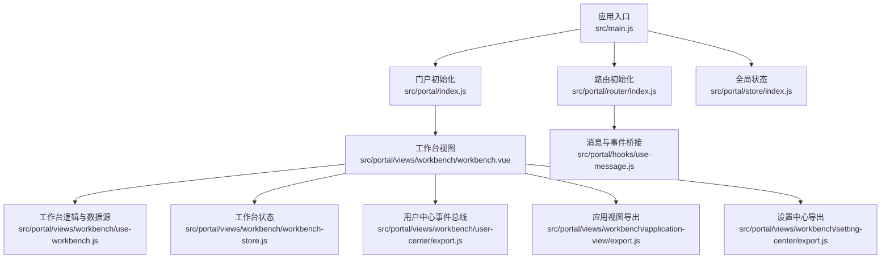
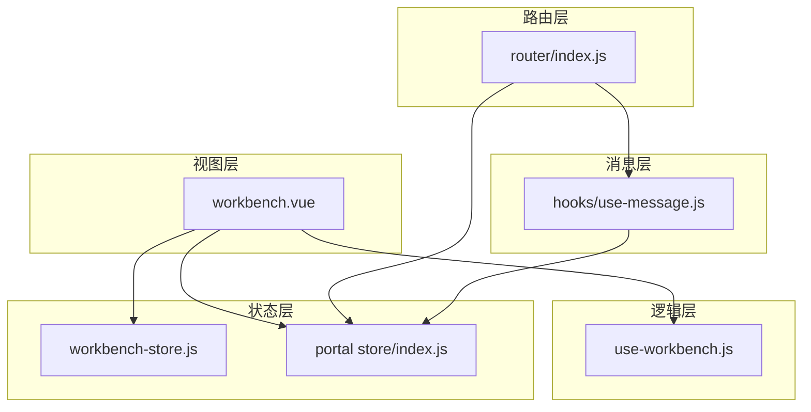
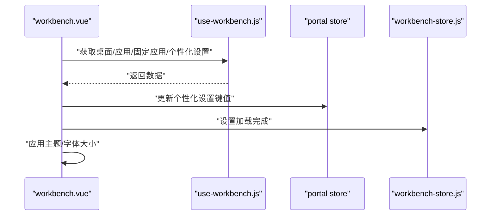
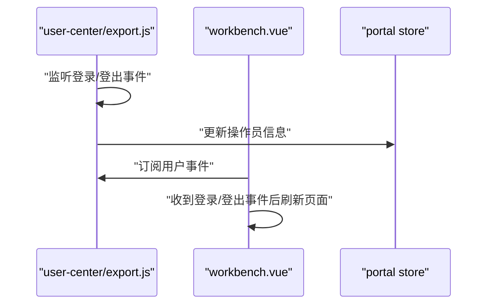
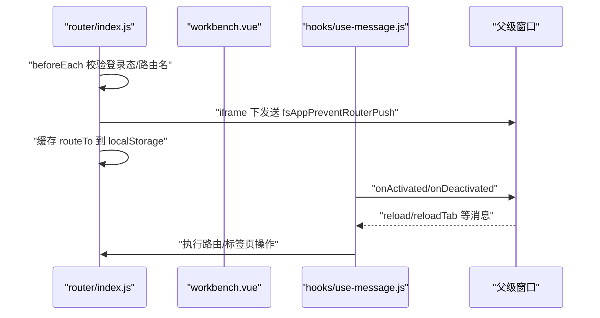
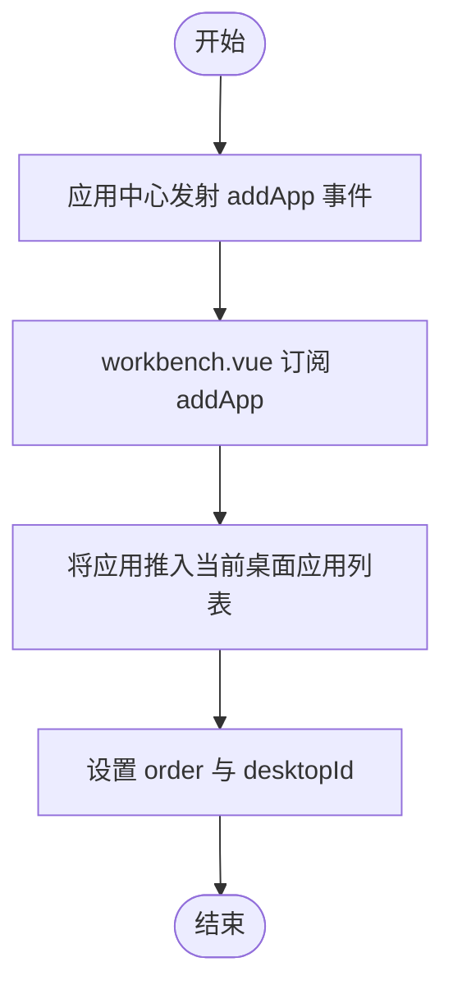
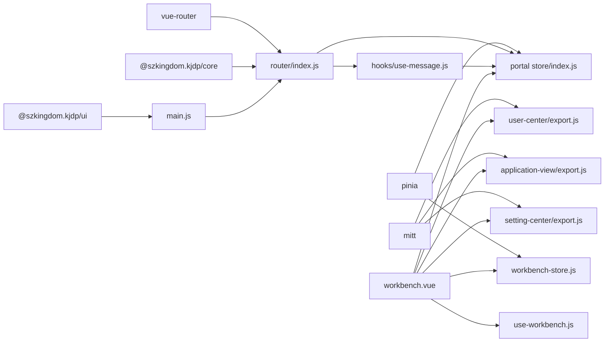

# 组件交互

<cite>
**本文引用的文件**
- [README.md](file://README.md)
- [package.json](file://package.json)
- [src/main.js](file://src/main.js)
- [src/App.vue](file://src/App.vue)
- [src/portal/index.js](file://src/portal/index.js)
- [src/portal/views/workbench/workbench.vue](file://src/portal/views/workbench/workbench.vue)
- [src/portal/views/workbench/use-workbench.js](file://src/portal/views/workbench/use-workbench.js)
- [src/portal/views/workbench/workbench-store.js](file://src/portal/views/workbench/workbench-store.js)
- [src/portal/router/index.js](file://src/portal/router/index.js)
- [src/portal/store/index.js](file://src/portal/store/index.js)
- [src/portal/hooks/use-message.js](file://src/portal/hooks/use-message.js)
- [src/portal/views/workbench/user-center/export.js](file://src/portal/views/workbench/user-center/export.js)
- [src/portal/views/workbench/application-view/export.js](file://src/portal/views/workbench/application-view/export.js)
- [src/portal/views/workbench/setting-center/export.js](file://src/portal/views/workbench/setting-center/export.js)
</cite>

## 目录
1. [引言](#引言)
2. [项目结构](#项目结构)
3. [核心组件](#核心组件)
4. [架构总览](#架构总览)
5. [组件交互详解](#组件交互详解)
6. [依赖关系分析](#依赖关系分析)
7. [性能考量](#性能考量)
8. [故障排查指南](#故障排查指南)
9. [结论](#结论)
10. [附录](#附录)

## 引言
本文件面向 FS-AOI-WEB 工作台组件交互系统，系统性阐述工作台内组件之间的交互机制与通信方式，覆盖数据传递、事件处理、状态同步、路由管理、组件生命周期、事件总线机制、解耦设计、消息协议、状态管理模式、性能优化、错误处理与调试支持等。目标是为开发者提供完整且可操作的技术参考。

## 项目结构
FS-AOI-WEB 采用 Vue 3 + Pinia + Vue Router 的前端架构，工作台位于 portal 子系统中，通过统一入口初始化并挂载。核心模块包括：
- 应用入口与全局配置：main.js、App.vue、portal/index.js
- 工作台视图与状态：workbench.vue、use-workbench.js、workbench-store.js
- 路由与参数加密：router/index.js
- 全局状态：portal store
- 消息与事件桥接：hooks/use-message.js
- 用户中心与应用视图导出：user-center/export.js、application-view/export.js、setting-center/export.js

图表来源
- [src/main.js](file://src/main.js#L1-L40)
- [src/portal/index.js](file://src/portal/index.js#L1-L153)
- [src/portal/router/index.js](file://src/portal/router/index.js#L1-L141)
- [src/portal/store/index.js](file://src/portal/store/index.js#L1-L226)
- [src/portal/views/workbench/workbench.vue](file://src/portal/views/workbench/workbench.vue#L1-L235)
- [src/portal/views/workbench/use-workbench.js](file://src/portal/views/workbench/use-workbench.js#L1-L222)
- [src/portal/views/workbench/workbench-store.js](file://src/portal/views/workbench/workbench-store.js#L1-L15)
- [src/portal/views/workbench/user-center/export.js](file://src/portal/views/workbench/user-center/export.js#L1-L26)
- [src/portal/views/workbench/application-view/export.js](file://src/portal/views/workbench/application-view/export.js#L1-L5)
- [src/portal/views/workbench/setting-center/export.js](file://src/portal/views/workbench/setting-center/export.js#L1-L4)
- [src/portal/hooks/use-message.js](file://src/portal/hooks/use-message.js#L1-L503)

章节来源
- [README.md](file://README.md#L1-L55)
- [package.json](file://package.json#L1-L61)
- [src/main.js](file://src/main.js#L1-L40)
- [src/App.vue](file://src/App.vue#L1-L8)
- [src/portal/index.js](file://src/portal/index.js#L1-L153)

## 核心组件
- 应用入口与初始化
  - 创建 Vue 应用、注册 Pinia、注入 Kjdp 核心与 UI 插件、挂载路由、全局错误处理回调。
- 工作台视图与状态
  - workbench.vue：负责桌面、应用视图、应用栏、设置中心、客户推荐与接入等区域的渲染与交互；使用 use-workbench.js 获取桌面、应用、固定应用与个性化设置；通过 Pinia store 控制加载态。
- 路由与参数加密
  - router/index.js：基于哈希历史模式，支持 URL 参数加解密、跨 iframe 路由拦截与同步、登录态校验与重定向。
- 全局状态
  - portal store：集中管理子系统模式、菜单树、已开标签页、iframe 引用、URL 加密密钥、主题等。
- 消息与事件桥接
  - hooks/use-message.js：封装 postMessage 通道，实现 iframe 内外的消息同步、路由参数同步、激活/失活通知、标签页控制、菜单与用户信息同步等。

章节来源
- [src/main.js](file://src/main.js#L1-L40)
- [src/portal/views/workbench/workbench.vue](file://src/portal/views/workbench/workbench.vue#L1-L235)
- [src/portal/views/workbench/use-workbench.js](file://src/portal/views/workbench/use-workbench.js#L1-L222)
- [src/portal/views/workbench/workbench-store.js](file://src/portal/views/workbench/workbench-store.js#L1-L15)
- [src/portal/router/index.js](file://src/portal/router/index.js#L1-L141)
- [src/portal/store/index.js](file://src/portal/store/index.js#L1-L226)
- [src/portal/hooks/use-message.js](file://src/portal/hooks/use-message.js#L1-L503)

## 架构总览
工作台采用“视图层 + 逻辑层 + 状态层 + 路由层 + 消息层”的分层架构：
- 视图层：workbench.vue 渲染桌面、应用视图、应用栏、设置中心等。
- 逻辑层：use-workbench.js 提供桌面/应用/固定应用/个性化设置的拉取与更新能力。
- 状态层：workbench-store 与 portal store 管理工作台与全局状态。
- 路由层：router/index.js 实现登录态校验、路由拦截、参数加解密、跨 iframe 同步。
- 消息层：hooks/use-message.js 提供 iframe 通信、标签页控制、激活/失活、菜单与用户信息同步。

图表来源
- [src/portal/views/workbench/workbench.vue](file://src/portal/views/workbench/workbench.vue#L1-L235)
- [src/portal/views/workbench/use-workbench.js](file://src/portal/views/workbench/use-workbench.js#L1-L222)
- [src/portal/views/workbench/workbench-store.js](file://src/portal/views/workbench/workbench-store.js#L1-L15)
- [src/portal/store/index.js](file://src/portal/store/index.js#L1-L226)
- [src/portal/router/index.js](file://src/portal/router/index.js#L1-L141)
- [src/portal/hooks/use-message.js](file://src/portal/hooks/use-message.js#L1-L503)

## 组件交互详解

### 1) 数据传递与状态同步
- 桌面与应用数据
  - use-workbench.js 通过服务接口获取桌面、应用、固定应用与个性化设置，并映射为组件可用的数据结构。
  - workbench.vue 使用 Promise 并行初始化应用列表与个性化设置，随后更新主题与字体大小。
- 全局状态
  - portal store 统一维护菜单树、已开标签页、iframe 引用、URL 加密密钥等，供路由与消息层共享。
- 设置中心与主题
  - workbench.vue 从设置中心导出的 store 中读取个性化设置，实时应用到桌面背景样式与主题。

图表来源
- [src/portal/views/workbench/workbench.vue](file://src/portal/views/workbench/workbench.vue#L52-L96)
- [src/portal/views/workbench/use-workbench.js](file://src/portal/views/workbench/use-workbench.js#L16-L122)
- [src/portal/store/index.js](file://src/portal/store/index.js#L69-L71)
- [src/portal/views/workbench/workbench-store.js](file://src/portal/views/workbench/workbench-store.js#L3-L14)

章节来源
- [src/portal/views/workbench/workbench.vue](file://src/portal/views/workbench/workbench.vue#L52-L96)
- [src/portal/views/workbench/use-workbench.js](file://src/portal/views/workbench/use-workbench.js#L1-L222)
- [src/portal/store/index.js](file://src/portal/store/index.js#L1-L226)
- [src/portal/views/workbench/workbench-store.js](file://src/portal/views/workbench/workbench-store.js#L1-L15)

### 2) 事件处理与事件总线
- 用户中心事件总线
  - user-center/export.js 导出 userEmitter，监听登录/登出事件，同步更新用户信息到 store。
- 应用中心事件总线
  - workbench.vue 订阅 appCenterEmitter，用于响应“添加应用”事件，动态更新当前桌面的应用列表。
- 用户行为事件
  - workbench.vue 监听 userEmitter 的“*”事件，当类型为 login/logout 时触发页面刷新，确保状态一致。

图表来源
- [src/portal/views/workbench/user-center/export.js](file://src/portal/views/workbench/user-center/export.js#L1-L26)
- [src/portal/views/workbench/workbench.vue](file://src/portal/views/workbench/workbench.vue#L100-L117)

章节来源
- [src/portal/views/workbench/user-center/export.js](file://src/portal/views/workbench/user-center/export.js#L1-L26)
- [src/portal/views/workbench/workbench.vue](file://src/portal/views/workbench/workbench.vue#L100-L117)

### 3) 路由管理与跨 iframe 通信
- URL 参数加解密
  - router/index.js 在 stringifyQuery/parseQuery 中根据项目配置决定是否对查询参数进行加密/解密。
- 登录态与重定向
  - beforeEach 中对未登录用户进行登录页重定向；对 workbench 与 login 特例进行放行。
- 跨 iframe 路由拦截与同步
  - 当处于 iframe 时，首次进入记录 firstInIframePath；后续路由 push 若路径不同则向父级发送“阻止路由跳转”消息，并将 routeTo 缓存到 localStorage，以便内部页面同步。
- 激活/失活检测
  - hooks/use-message.js 通过定时器检测 body 尺寸变化，向父级发送 onActivated/onDeactivated 消息，用于外部框架联动。

图表来源
- [src/portal/router/index.js](file://src/portal/router/index.js#L46-L134)
- [src/portal/hooks/use-message.js](file://src/portal/hooks/use-message.js#L429-L493)
- [src/portal/views/workbench/workbench.vue](file://src/portal/views/workbench/workbench.vue#L119-L126)

章节来源
- [src/portal/router/index.js](file://src/portal/router/index.js#L1-L141)
- [src/portal/hooks/use-message.js](file://src/portal/hooks/use-message.js#L1-L503)
- [src/portal/views/workbench/workbench.vue](file://src/portal/views/workbench/workbench.vue#L119-L126)

### 4) 组件生命周期与 KeepAlive
- App.vue 使用 RouterView + KeepAlive 包裹，保证路由切换时组件状态得以保留，减少重复渲染与请求。
- workbench.vue 在初始化阶段并行加载桌面、应用与个性化设置，完成后设置 initFlag 并关闭加载态。

章节来源
- [src/App.vue](file://src/App.vue#L1-L8)
- [src/portal/views/workbench/workbench.vue](file://src/portal/views/workbench/workbench.vue#L52-L96)

### 5) 解耦设计与消息协议
- 事件总线
  - 使用 mitt 作为轻量事件总线，分别在工作台、应用中心、设置中心等模块中独立声明，降低耦合度。
- postMessage 协议
  - hooks/use-message.js 定义统一的消息 topic（如 fsAppMounted、fsAppContentNode、routeTo、syncData、reload、closeTab 等），约定 body 结构，实现跨 iframe 通信与控制。
- 导出模块化
  - 各模块通过 export.js 暴露 useXxxStore/useXxx 方法，便于按需引入，避免全局污染。

章节来源
- [src/portal/views/workbench/user-center/export.js](file://src/portal/views/workbench/user-center/export.js#L1-L26)
- [src/portal/views/workbench/application-view/export.js](file://src/portal/views/workbench/application-view/export.js#L1-L5)
- [src/portal/views/workbench/setting-center/export.js](file://src/portal/views/workbench/setting-center/export.js#L1-L4)
- [src/portal/hooks/use-message.js](file://src/portal/hooks/use-message.js#L375-L400)

### 6) 状态管理模式
- Pinia Store
  - workbench-store：管理工作台加载态。
  - portal store：集中管理子系统模式、菜单树、已开标签页、iframe 引用、URL 加密密钥、主题等。
- 状态同步
  - 用户登录/登出通过 userEmitter 同步到 portal store；个性化设置通过 use-workbench.js 更新并反馈到 UI。

章节来源
- [src/portal/views/workbench/workbench-store.js](file://src/portal/views/workbench/workbench-store.js#L1-L15)
- [src/portal/store/index.js](file://src/portal/store/index.js#L1-L226)
- [src/portal/views/workbench/user-center/export.js](file://src/portal/views/workbench/user-center/export.js#L1-L26)
- [src/portal/views/workbench/use-workbench.js](file://src/portal/views/workbench/use-workbench.js#L180-L195)

### 7) 组件间数据流与流程图
- 应用添加流程
  - 应用中心发射“addApp”事件，workbench.vue 订阅后将新应用推入当前桌面的应用列表，并设置顺序与桌面 ID。

图表来源
- [src/portal/views/workbench/workbench.vue](file://src/portal/views/workbench/workbench.vue#L120-L126)

## 依赖关系分析
- 外部依赖
  - mitt：事件总线
  - pinia：状态管理
  - vue-router：路由
  - @szkingdom.kjdp/*：核心与 UI 插件
- 内部模块依赖
  - workbench.vue 依赖 use-workbench.js、workbench-store.js、portal store、user-center/export.js、application-view/export.js、setting-center/export.js
  - router/index.js 依赖 hooks/use-message.js 与 portal store
  - hooks/use-message.js 依赖 router、portal store、tabs 与配置回调

图表来源
- [package.json](file://package.json#L17-L40)
- [src/main.js](file://src/main.js#L1-L40)
- [src/portal/router/index.js](file://src/portal/router/index.js#L1-L141)
- [src/portal/hooks/use-message.js](file://src/portal/hooks/use-message.js#L1-L503)
- [src/portal/views/workbench/workbench.vue](file://src/portal/views/workbench/workbench.vue#L1-L235)
- [src/portal/views/workbench/use-workbench.js](file://src/portal/views/workbench/use-workbench.js#L1-L222)
- [src/portal/views/workbench/workbench-store.js](file://src/portal/views/workbench/workbench-store.js#L1-L15)
- [src/portal/store/index.js](file://src/portal/store/index.js#L1-L226)
- [src/portal/views/workbench/user-center/export.js](file://src/portal/views/workbench/user-center/export.js#L1-L26)
- [src/portal/views/workbench/application-view/export.js](file://src/portal/views/workbench/application-view/export.js#L1-L5)
- [src/portal/views/workbench/setting-center/export.js](file://src/portal/views/workbench/setting-center/export.js#L1-L4)

章节来源
- [package.json](file://package.json#L1-L61)
- [src/main.js](file://src/main.js#L1-L40)
- [src/portal/router/index.js](file://src/portal/router/index.js#L1-L141)
- [src/portal/hooks/use-message.js](file://src/portal/hooks/use-message.js#L1-L503)

## 性能考量
- 并行初始化
  - workbench.vue 使用 Promise.all 并行获取桌面、固定应用与个性化设置，缩短首屏等待时间。
- KeepAlive
  - App.vue 对 RouterView 使用 KeepAlive，减少组件重建与重复请求。
- 路由参数加解密
  - router/index.js 在 stringifyQuery/parseQuery 中按需加解密，避免不必要的计算。
- 消息轮询与节流
  - hooks/use-message.js 通过定时器检测激活状态，避免频繁 DOM 查询；对路由参数同步使用 localStorage 缓存，减少重复通信。

章节来源
- [src/portal/views/workbench/workbench.vue](file://src/portal/views/workbench/workbench.vue#L63-L78)
- [src/App.vue](file://src/App.vue#L1-L8)
- [src/portal/router/index.js](file://src/portal/router/index.js#L12-L22)
- [src/portal/hooks/use-message.js](file://src/portal/hooks/use-message.js#L454-L481)

## 故障排查指南
- 登录态异常
  - 现象：未登录用户被重定向至登录页或无法访问受保护路由。
  - 排查：检查 router/index.js 的登录态判断与 beforeEach 逻辑；确认 portal store 中 opInfo 是否正确更新。
- 跨 iframe 路由失效
  - 现象：iframe 内路由跳转被父级拦截或参数未同步。
  - 排查：确认 hooks/use-message.js 是否正确发送 fsAppPreventRouterPush 与 routeTo；检查 localStorage 中 routeTo 缓存是否存在。
- 主题/字体设置不生效
  - 现象：个性化设置保存成功但界面未变化。
  - 排查：确认 use-workbench.js 的 updateCustomSetting 是否调用；检查 workbench.vue 是否正确应用设置到样式。
- 标签页控制无效
  - 现象：父级发送 closeTab/reloadTab 等消息后，子级未响应。
  - 排查：确认 hooks/use-message.js 的 initUseTabsPostMessage 是否监听到消息类型；检查 useTabs 的实现与回调。

章节来源
- [src/portal/router/index.js](file://src/portal/router/index.js#L96-L134)
- [src/portal/hooks/use-message.js](file://src/portal/hooks/use-message.js#L375-L400)
- [src/portal/views/workbench/use-workbench.js](file://src/portal/views/workbench/use-workbench.js#L180-L195)
- [src/portal/views/workbench/workbench.vue](file://src/portal/views/workbench/workbench.vue#L149-L158)

## 结论
FS-AOI-WEB 工作台通过清晰的分层架构与模块化设计，实现了组件间低耦合、高内聚的交互体系。借助事件总线、postMessage 消息协议与 Pinia 状态管理，系统在路由、数据、事件与生命周期层面均具备良好的可维护性与扩展性。建议在后续迭代中持续完善消息协议规范与错误处理策略，进一步提升跨 iframe 场景的稳定性与性能。

## 附录
- API 与配置要点
  - 路由参数加解密：在 router/index.js 中通过 stringifyQuery/parseQuery 控制。
  - 用户信息同步：hooks/use-message.js 通过 fsAppMounted 与 userInfo 字段实现。
  - 标签页控制：hooks/use-message.js 支持 openTab/closeActiveTab/reloadTab/closeTab 等消息类型。
  - 个性化设置：use-workbench.js 的 updateCustomSetting 与 customSettingKeyMap。
- 扩展开发指南
  - 新增事件总线：在对应模块中引入 mitt，导出 emitter 并在组件中订阅。
  - 新增消息协议：在 hooks/use-message.js 中新增 topic 与处理逻辑，并在父级窗口发送对应消息。
  - 新增路由拦截规则：在 router/index.js 的 beforeEach 中补充条件与重定向逻辑。