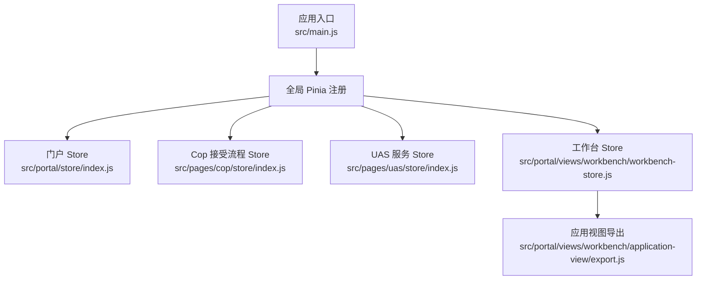
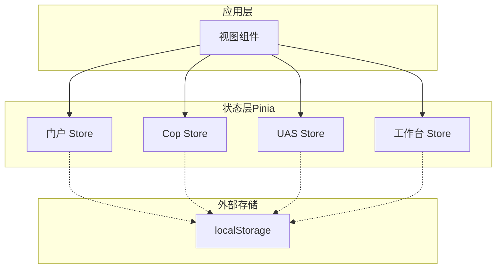
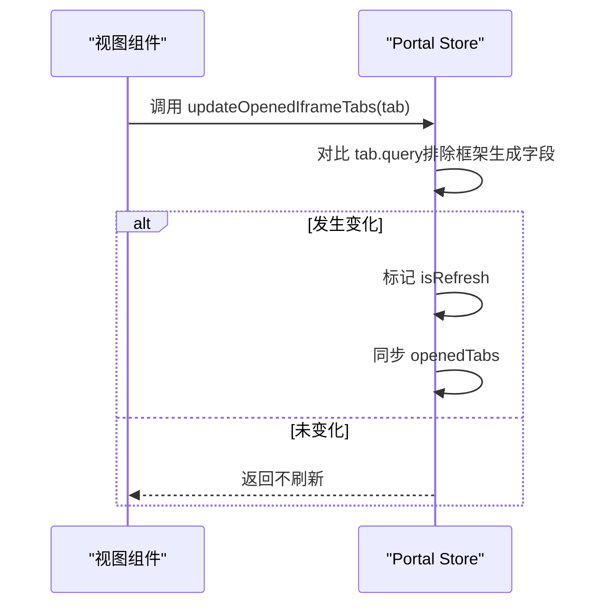
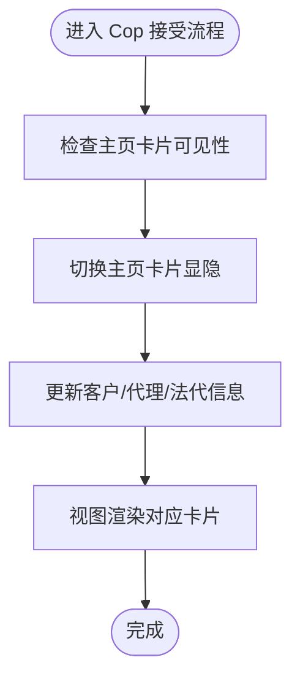
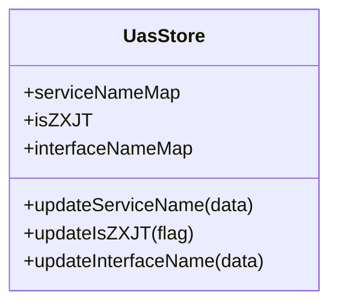
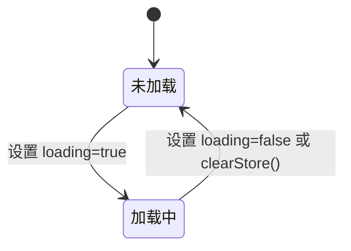
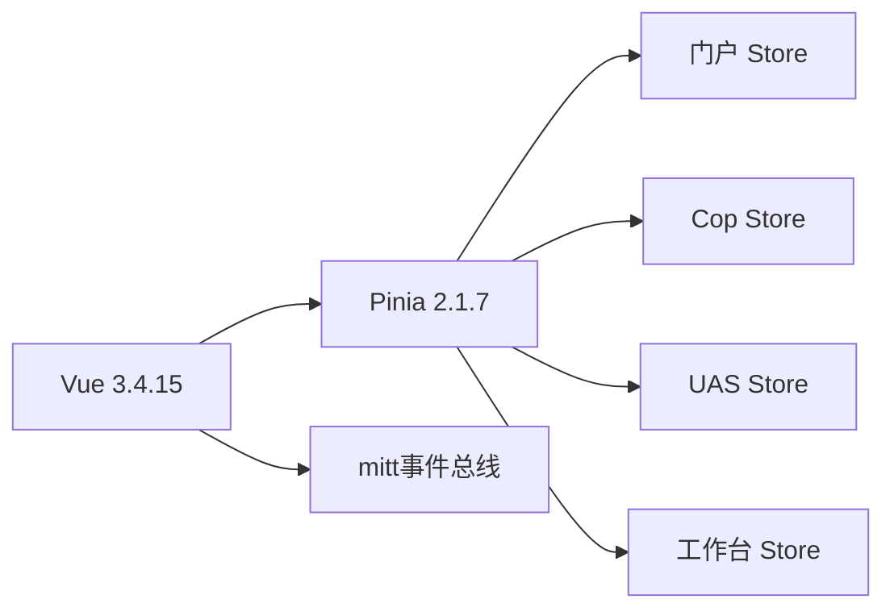

# 状态管理

<cite>
**本文引用的文件**
- [src/main.js](file://src/main.js)
- [src/portal/store/index.js](file://src/portal/store/index.js)
- [src/pages/cop/store/index.js](file://src/pages/cop/store/index.js)
- [src/pages/uas/store/index.js](file://src/pages/uas/store/index.js)
- [src/portal/views/workbench/workbench-store.js](file://src/portal/views/workbench/workbench-store.js)
- [src/portal/views/workbench/application-view/export.js](file://src/portal/views/workbench/application-view/export.js)
- [package.json](file://package.json)
</cite>

## 目录
1. [简介](#简介)
2. [项目结构](#项目结构)
3. [核心组件](#核心组件)
4. [架构总览](#架构总览)
5. [详细组件分析](#详细组件分析)
6. [依赖分析](#依赖分析)
7. [性能考虑](#性能考虑)
8. [故障排查指南](#故障排查指南)
9. [结论](#结论)
10. [附录](#附录)

## 简介
本技术文档面向 FS-AOI-WEB 的状态管理系统，围绕基于 Pinia 的状态管理架构进行系统化梳理。重点覆盖以下方面：
- Store 模块组织与职责划分（门户 Store、Cop 接受流程 Store、UAS 服务 Store、工作台 Store）
- 状态定义与数据流管理
- 状态持久化与本地缓存策略
- 状态监听与跨模块通信机制
- 最佳实践、性能优化与调试技巧
- 开发者使用指南

## 项目结构
FS-AOI-WEB 使用 Vue 3 + Pinia 构建前端应用，全局在入口处注册 Pinia，并按功能域拆分多个 Store 模块：
- 全局入口注册 Pinia：在应用启动时调用 createPinia 并挂载到根实例
- 功能域 Store：
  - 门户域：src/portal/store/index.js
  - Cop 域：src/pages/cop/store/index.js
  - UAS 域：src/pages/uas/store/index.js
  - 工作台域：src/portal/views/workbench/workbench-store.js
- 应用视图导出：src/portal/views/workbench/application-view/export.js 提供 Store 导出接口

图表来源
- [src/main.js](file://src/main.js#L1-L40)
- [src/portal/store/index.js](file://src/portal/store/index.js#L1-L226)
- [src/pages/cop/store/index.js](file://src/pages/cop/store/index.js#L1-L58)
- [src/pages/uas/store/index.js](file://src/pages/uas/store/index.js#L1-L23)
- [src/portal/views/workbench/workbench-store.js](file://src/portal/views/workbench/workbench-store.js#L1-L15)
- [src/portal/views/workbench/application-view/export.js](file://src/portal/views/workbench/application-view/export.js#L1-L4)

章节来源
- [src/main.js](file://src/main.js#L1-L40)
- [package.json](file://package.json#L1-L61)

## 核心组件
本节对各 Store 的职责、状态字段与动作进行概览式说明，帮助开发者快速定位功能域与关键状态。

- 门户 Store（Portal Store）
  - 职责：承载门户级全局状态，包括菜单树、打开的标签页、iframe 缓存、加密密钥、菜单折叠状态等
  - 关键状态：subSysMode、loading、tabsLoading、opInfo、menuTree、menuArr、openedTabs、openedIframeTabs、urlEncryptKey、isMenuCollapse 等
  - 关键动作：clearStore、setSubSysMode、updateOpInfo、updateMenuData、updateOpenedTabs、updateOpenedIframeTabs、updateUrlEncryptKey、updateMenuCollapseStatus 等
  - 数据流：菜单数据通过 updateMenuData 更新；标签页通过 updateOpenedTabs/删除通过 deleteOpenedTab 同步；iframe 通过 updateOpenedIframeTabs 同步并触发刷新标识

- Cop 接受流程 Store（Cop Accept Store）
  - 职责：支撑“接受”流程的界面卡片显隐与数据上下文
  - 关键状态：menuTree、homePageVisivle、customerInfoCardVisivle、customerInfo、agentInfo、legalInfo、NON_CONTACT_FLAG、IS_CSDC_CHECK
  - 关键动作：updateMenuData、toggleHomePageVisible、toggleCustomerInfoCardVisivle、updateCustomerInfo、updateAgentInfo、updateLegalInfo、updateNonContactFlag、updateCsdcCheckFlag
  - 数据流：以卡片可见性与客户/代理/法代信息为主，便于视图层条件渲染与联动

- UAS 服务 Store（UAS Store）
  - 职责：统一维护服务映射与系统标识
  - 关键状态：serviceNameMap、isZXJT、interfaceNameMap
  - 关键动作：updateServiceName、updateIsZXJT、updateInterfaceName
  - 数据流：集中式服务名与接口名映射，供业务模块查询与渲染

- 工作台 Store（Workbench Store）
  - 职责：工作台级轻量状态，如加载指示
  - 关键状态：loading、loadingText
  - 关键动作：clearStore（重置）
  - 数据流：用于工作台组件的加载态控制

章节来源
- [src/portal/store/index.js](file://src/portal/store/index.js#L1-L226)
- [src/pages/cop/store/index.js](file://src/pages/cop/store/index.js#L1-L58)
- [src/pages/uas/store/index.js](file://src/pages/uas/store/index.js#L1-L23)
- [src/portal/views/workbench/workbench-store.js](file://src/portal/views/workbench/workbench-store.js#L1-L15)

## 架构总览
FS-AOI-WEB 的状态管理采用“全局 Pinia + 多域 Store”的分层架构：
- 全局注册：应用启动时一次性注册 Pinia，确保后续各模块可直接使用
- 域内自治：每个功能域拥有独立的 Store，职责边界清晰，避免状态耦合
- 跨域通信：通过共享状态或事件总线（mitt）实现模块间松耦合通信
- 持久化策略：结合浏览器本地存储（localStorage）实现菜单历史、最近访问等轻量持久化

图表来源
- [src/main.js](file://src/main.js#L1-L40)
- [src/portal/store/index.js](file://src/portal/store/index.js#L1-L226)
- [src/pages/cop/store/index.js](file://src/pages/cop/store/index.js#L1-L58)
- [src/pages/uas/store/index.js](file://src/pages/uas/store/index.js#L1-L23)
- [src/portal/views/workbench/workbench-store.js](file://src/portal/views/workbench/workbench-store.js#L1-L15)

## 详细组件分析

### 门户 Store（Portal Store）
- 组织方式：defineStore 定义，state 返回门户全局状态对象
- 状态要点：
  - 加载与提示：loading、loadingText、tabsLoading、tabsLoadingText
  - 菜单与权限：menuTree、menuArr、menuRightType、menuOpPer、favMenuArr、menuSearched
  - 打开的标签页：openedTabs、openedTabsKeepAlive、openedIframeTabs、openedIframeRefs
  - 缓存与路由：portalFullPathCache、cardFullPathCache、cardHomePageOpened
  - 安全与交互：urlEncryptKey、isMenuCollapse、openIframeFailed、subSysModeKey
- 动作要点：
  - clearStore：重置所有状态
  - setSubSysMode/setSubSysModeKey：子系统模式与标识
  - updateOpInfo/updateMenuData：运营信息与菜单数据更新
  - updateOpenedTabs/updateOpenedIframeTabs：标签页与 iframe 状态同步
  - updateUrlEncryptKey/updateMenuCollapseStatus：安全参数与菜单折叠状态
- 数据流与同步：
  - updateOpenedIframeTabs 内部会对比 query（排除框架生成字段），若变化则标记刷新并同步 openedTabs
  - 支持 KeepAlive 名称列表维护，便于路由切换时缓存策略控制

图表来源
- [src/portal/store/index.js](file://src/portal/store/index.js#L156-L203)

章节来源
- [src/portal/store/index.js](file://src/portal/store/index.js#L1-L226)

### Cop 接受流程 Store（Cop Accept Store）
- 组织方式：defineStore 定义，state 返回流程卡片与上下文状态
- 状态要点：menuTree、homePageVisivle、customerInfoCardVisivle、customerInfo、agentInfo、legalInfo、NON_CONTACT_FLAG、IS_CSDC_CHECK
- 动作要点：toggle 系列用于显隐控制；update 系列用于数据写入
- 数据流：视图根据 visible 状态与 customerInfo/agentInfo/legalInfo 渲染不同卡片内容

图表来源
- [src/pages/cop/store/index.js](file://src/pages/cop/store/index.js#L1-L58)

章节来源
- [src/pages/cop/store/index.js](file://src/pages/cop/store/index.js#L1-L58)

### UAS 服务 Store（UAS Store）
- 组织方式：defineStore 定义，state 返回服务映射与系统标识
- 状态要点：serviceNameMap、isZXJT、interfaceNameMap
- 动作要点：updateServiceName、updateIsZXJT、updateInterfaceName
- 数据流：集中式映射供业务模块查询，减少重复请求与分散配置

图表来源
- [src/pages/uas/store/index.js](file://src/pages/uas/store/index.js#L1-L23)

章节来源
- [src/pages/uas/store/index.js](file://src/pages/uas/store/index.js#L1-L23)

### 工作台 Store（Workbench Store）
- 组织方式：defineStore 定义，state 返回工作台级轻量状态
- 状态要点：loading、loadingText
- 动作要点：clearStore（重置）
- 数据流：用于工作台组件的加载态控制，避免全局污染

图表来源
- [src/portal/views/workbench/workbench-store.js](file://src/portal/views/workbench/workbench-store.js#L1-L15)

章节来源
- [src/portal/views/workbench/workbench-store.js](file://src/portal/views/workbench/workbench-store.js#L1-L15)

### 应用视图导出（应用 Store 导出）
- 作用：为应用视图层提供 Store 访问能力，统一导出 useApplicationStore 与 useApplication
- 影响：便于在工作台应用视图中按需引入与使用 Store

章节来源
- [src/portal/views/workbench/application-view/export.js](file://src/portal/views/workbench/application-view/export.js#L1-L4)

## 依赖分析
- Pinia 版本：2.1.7（在 package.json 中声明）
- Vue 版本：3.4.15（在 package.json 中声明）
- 依赖关系：
  - 应用入口通过 createPinia 注册状态管理
  - 各功能域 Store 通过 defineStore 定义，彼此独立
  - mitt 作为事件总线库，可用于跨 Store 通信（仓库中存在 mitt 依赖）

图表来源
- [package.json](file://package.json#L1-L61)
- [src/main.js](file://src/main.js#L1-L40)

章节来源
- [package.json](file://package.json#L1-L61)
- [src/main.js](file://src/main.js#L1-L40)

## 性能考虑
- 状态粒度控制
  - 将高频更新与低频更新拆分到不同 Store，降低不必要的响应式开销
  - 避免在 Store 中存放大型二进制或深度嵌套对象
- 计算属性与派生状态
  - 使用计算属性缓存派生结果，减少重复计算
- 持久化策略
  - 仅持久化必要字段（如最近访问、搜索历史），避免 localStorage 过载
  - 对大对象采用分段存储或压缩策略
- KeepAlive 与懒加载
  - 结合 openedTabsKeepAlive 与路由懒加载，平衡内存占用与切换性能
- 监听与副作用
  - 在 Store 中谨慎使用 watch，避免深层监听导致的性能问题
  - 对复杂监听使用防抖/节流

## 故障排查指南
- 症状：标签页刷新异常或数据未更新
  - 排查点：updateOpenedIframeTabs 是否正确对比 query（排除框架生成字段）；openedTabs 是否同步更新；是否设置了 isRefresh
  - 参考路径：[标签页同步逻辑](file://src/portal/store/index.js#L156-L203)
- 症状：菜单历史记录未生效
  - 排查点：localStorage 键值是否正确；记录上限是否被触发；清空历史按钮逻辑
  - 参考路径：[菜单搜索历史](file://src/portal/store/index.js#L152-L154)
- 症状：Cop 卡片显隐不符合预期
  - 排查点：toggleHomePageVisible 与 toggleCustomerInfoCardVisivle 的调用链；customerInfo/agentInfo/legalInfo 是否为空
  - 参考路径：[Cop Store 动作](file://src/pages/cop/store/index.js#L24-L56)
- 症状：UAS 映射未生效
  - 排查点：updateServiceName/updateInterfaceName 是否被调用；视图层是否从 Store 读取最新值
  - 参考路径：[UAS Store 动作](file://src/pages/uas/store/index.js#L11-L21)
- 症状：工作台加载态不一致
  - 排查点：loading/loadingText 是否被正确设置；是否调用了 clearStore
  - 参考路径：[工作台 Store](file://src/portal/views/workbench/workbench-store.js#L1-L15)

章节来源
- [src/portal/store/index.js](file://src/portal/store/index.js#L152-L203)
- [src/pages/cop/store/index.js](file://src/pages/cop/store/index.js#L24-L56)
- [src/pages/uas/store/index.js](file://src/pages/uas/store/index.js#L11-L21)
- [src/portal/views/workbench/workbench-store.js](file://src/portal/views/workbench/workbench-store.js#L1-L15)

## 结论
FS-AOI-WEB 的状态管理以 Pinia 为核心，采用“全局注册 + 多域自治”的架构，实现了清晰的职责分离与良好的扩展性。通过合理的状态划分、动作封装与持久化策略，能够满足门户、Cop、UAS、工作台等多场景需求。建议在后续迭代中持续关注性能优化与调试工具完善，进一步提升开发体验与运行效率。

## 附录
- 开发者使用指南
  - 在组件中通过组合式 API 使用 Store：import { useXxxStore } from '@/xxx/store'
  - 仅在需要的组件中引入对应 Store，避免全局污染
  - 对外暴露的导出接口由 application-view/export.js 统一管理
- 最佳实践清单
  - 明确 Store 职责边界，避免跨域强耦合
  - 使用计算属性与浅层状态，减少响应式开销
  - 对重要状态提供 clearStore/reset 能力，便于测试与调试
  - 对持久化数据设定上限与清理策略，防止 localStorage 泄漏
  - 使用 mitt 实现跨 Store 松耦合通信，避免直接依赖

章节来源
- [src/portal/views/workbench/application-view/export.js](file://src/portal/views/workbench/application-view/export.js#L1-L4)