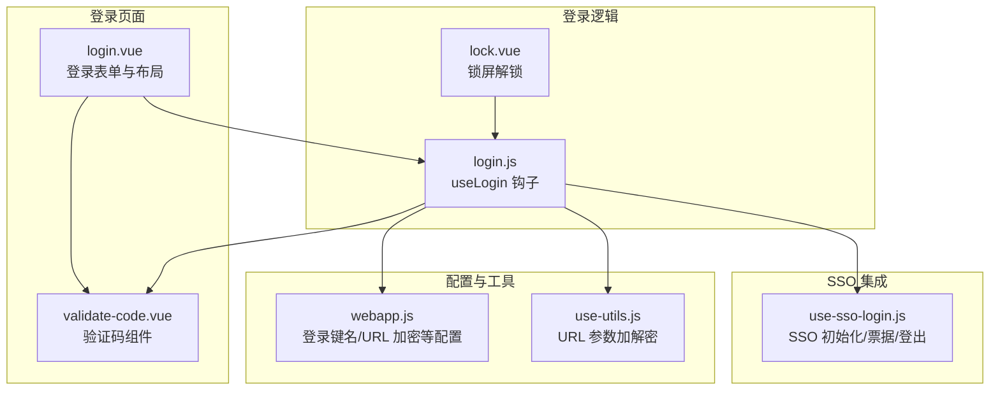
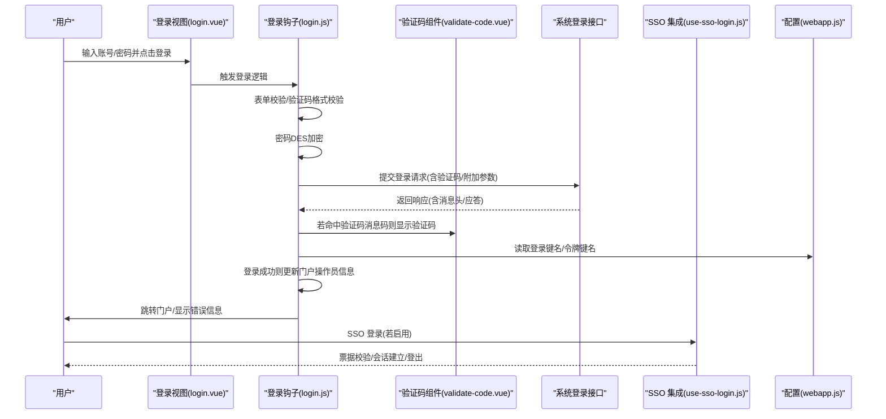
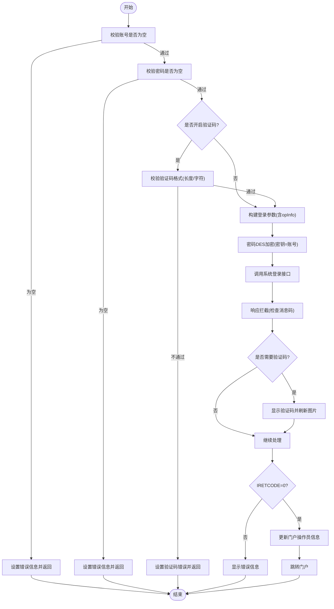
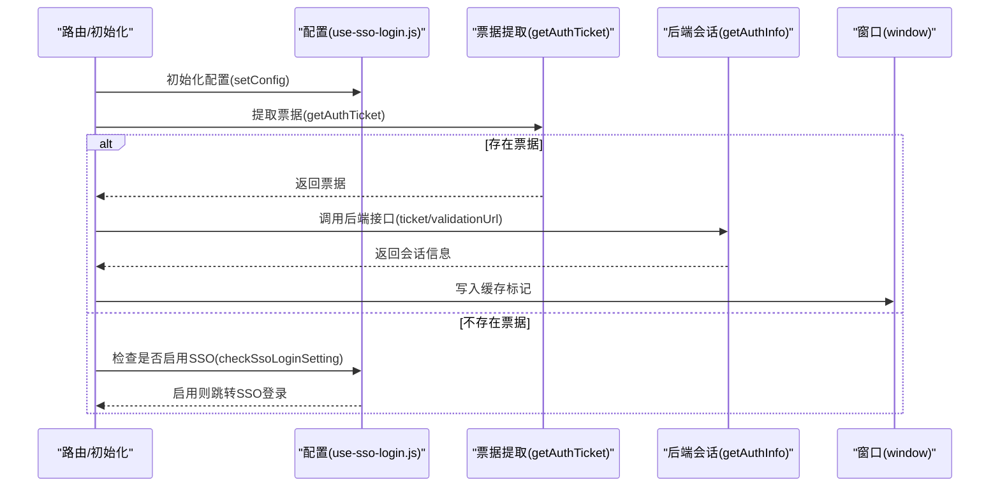
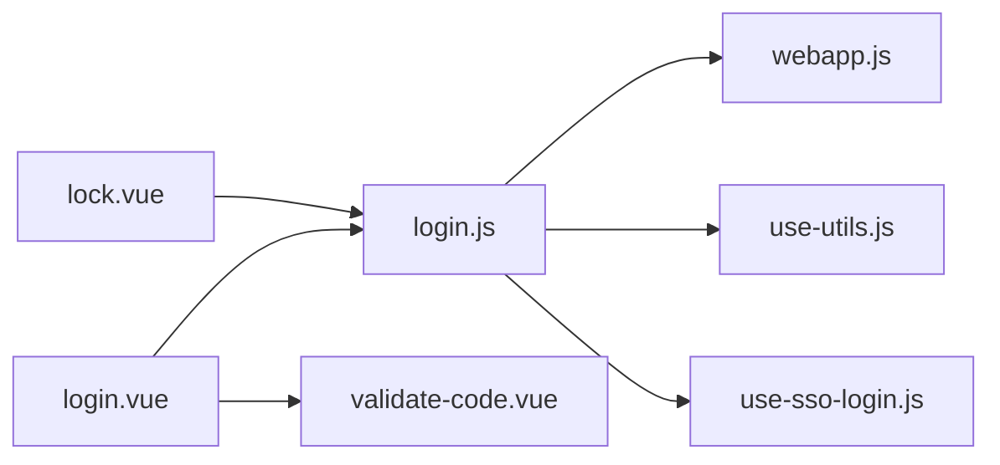

# 登录系统

<cite>
**本文引用的文件**
- [login.vue](file://src/portal/views/login/components/login.vue)
- [login.js](file://src/portal/views/login/components/login.js)
- [validate-code.vue](file://src/portal/views/login/components/validate-code.vue)
- [use-sso-login.js](file://src/portal/hooks/use-sso-login.js)
- [webapp.js](file://src/config/webapp.js)
- [lock.vue](file://src/portal/views/layout/views/header/header-user/lock.vue)
- [use-utils.js](file://src/portal/hooks/use-utils.js)
</cite>

## 目录
1. [简介](#简介)
2. [项目结构](#项目结构)
3. [核心组件](#核心组件)
4. [架构总览](#架构总览)
5. [组件详解](#组件详解)
6. [依赖关系分析](#依赖关系分析)
7. [性能考量](#性能考量)
8. [故障排查指南](#故障排查指南)
9. [结论](#结论)
10. [附录](#附录)

## 简介
本技术文档面向 FS-AOI-WEB 登录系统，聚焦于登录组件的设计结构、认证流程、验证码机制、单点登录（SSO）集成、登录状态与会话管理、安全防护与最佳实践。文档从代码层面梳理了用户名密码登录、验证码验证、SSO 跳转与票据校验、密码加密传输、登录状态持久化与刷新策略，并提供可扩展的配置项与安全加固建议。

## 项目结构
登录系统主要由以下模块构成：
- 登录页面与表单：负责用户输入、表单校验与提交
- 登录逻辑钩子：封装登录参数构建、加密、调用系统登录接口、错误处理与验证码弹窗控制
- 验证码组件：支持图片验证码的拉取、显示与交互
- SSO 集成：统一配置 SSO 登录入口、票据提取、后端会话建立与缓存
- 会话与状态：基于门户 Store 更新操作员信息，结合 URL 加密工具与登录数据键值管理
- 锁屏解锁：提供二次密码校验能力，复用登录加密与接口调用

图表来源
- [login.vue](file://src/portal/views/login/components/login.vue#L1-L167)
- [login.js](file://src/portal/views/login/components/login.js#L1-L98)
- [validate-code.vue](file://src/portal/views/login/components/validate-code.vue#L1-L80)
- [use-sso-login.js](file://src/portal/hooks/use-sso-login.js#L1-L84)
- [webapp.js](file://src/config/webapp.js#L134-L137)
- [lock.vue](file://src/portal/views/layout/views/header/header-user/lock.vue#L1-L75)
- [use-utils.js](file://src/portal/hooks/use-utils.js#L1-L53)

章节来源
- [login.vue](file://src/portal/views/login/components/login.vue#L1-L167)
- [login.js](file://src/portal/views/login/components/login.js#L1-L98)
- [validate-code.vue](file://src/portal/views/login/components/validate-code.vue#L1-L80)
- [use-sso-login.js](file://src/portal/hooks/use-sso-login.js#L1-L84)
- [webapp.js](file://src/config/webapp.js#L134-L137)
- [lock.vue](file://src/portal/views/layout/views/header/header-user/lock.vue#L1-L75)
- [use-utils.js](file://src/portal/hooks/use-utils.js#L1-L53)

## 核心组件
- 登录表单组件：提供账号、密码输入与提交按钮，支持回车跳转与提交
- 登录逻辑钩子：集中处理表单校验、密码加密、调用系统登录接口、响应拦截触发验证码弹窗、路由跳转与错误提示
- 验证码组件：按需显示图片验证码，支持点击刷新与输入绑定
- SSO 集成钩子：统一配置 SSO 登录参数、票据提取、后端会话建立与登出
- 会话与状态：通过门户 Store 更新操作员信息，结合登录数据键与令牌键进行本地持久化
- 锁屏解锁：复用登录加密与接口调用，完成二次解锁

章节来源
- [login.vue](file://src/portal/views/login/components/login.vue#L1-L167)
- [login.js](file://src/portal/views/login/components/login.js#L1-L98)
- [validate-code.vue](file://src/portal/views/login/components/validate-code.vue#L1-L80)
- [use-sso-login.js](file://src/portal/hooks/use-sso-login.js#L1-L84)
- [webapp.js](file://src/config/webapp.js#L134-L137)
- [lock.vue](file://src/portal/views/layout/views/header/header-user/lock.vue#L1-L75)

## 架构总览
登录系统采用“视图层 + 逻辑钩子 + 验证码 + SSO + 配置工具”的分层设计，核心流程如下：
- 用户输入账号与密码，触发登录逻辑钩子
- 对必填项与验证码格式进行前端校验
- 密码通过 DES 加密并拼接附加参数（如验证码）
- 调用系统登录接口，根据响应头中的消息码决定是否弹出验证码
- 登录成功后更新门户操作员信息并跳转至门户
- 登录失败或异常时，显示错误信息并按需刷新验证码

图表来源
- [login.vue](file://src/portal/views/login/components/login.vue#L1-L167)
- [login.js](file://src/portal/views/login/components/login.js#L24-L86)
- [validate-code.vue](file://src/portal/views/login/components/validate-code.vue#L21-L46)
- [use-sso-login.js](file://src/portal/hooks/use-sso-login.js#L37-L81)
- [webapp.js](file://src/config/webapp.js#L134-L137)

## 组件详解

### 登录表单组件（login.vue）
- 功能要点
  - 账号输入框：支持最大长度限制、自动完成关闭、回车跳转
  - 密码输入框：支持明文切换、最大长度限制、自动完成关闭、回车登录
  - 验证码组件：通过插槽挂载并受控显示
  - 登录按钮：加载态控制、禁用态控制、回车登录
  - 错误信息展示：统一提示区域
- 设计细节
  - 使用受控组件模式，通过 v-model 绑定表单数据
  - 通过 ref 获取密码输入焦点，提升用户体验
  - 样式采用 SCSS，布局清晰、响应式友好

章节来源
- [login.vue](file://src/portal/views/login/components/login.vue#L1-L167)

### 登录逻辑钩子（login.js）
- 功能要点
  - 表单校验：账号/密码必填校验；验证码开启时对格式进行正则校验
  - 登录状态控制：避免重复提交，设置加载态与按钮禁用
  - 参数构建：合并门户操作员信息，按需附加验证码
  - 密码加密：使用 DES 加密，密钥为账号
  - 登录调用：通过系统登录接口发起请求
  - 响应拦截：根据消息码决定是否弹出验证码
  - 成功/失败处理：成功更新门户操作员信息并跳转门户；失败显示错误信息
- 安全与健壮性
  - 防止重复提交：通过状态位与 Promise 链控制
  - 错误兜底：catch 中统一处理并刷新验证码
  - 验证码弹窗：按消息码动态开启，避免硬编码

图表来源
- [login.js](file://src/portal/views/login/components/login.js#L24-L86)

章节来源
- [login.js](file://src/portal/views/login/components/login.js#L1-L98)

### 验证码组件（validate-code.vue）
- 功能要点
  - 可见性控制：按配置开关显示/隐藏
  - 图片拉取：带时间戳参数避免缓存，成功后填充图片数据
  - 交互行为：点击刷新验证码，输入框双向绑定
- 防刷与可用性
  - 请求中状态避免并发请求
  - 显示提示文案与加载状态

章节来源
- [validate-code.vue](file://src/portal/views/login/components/validate-code.vue#L1-L80)

### 单点登录（SSO）集成（use-sso-login.js）
- 功能要点
  - 配置项：SSO 地址、参数格式化函数、票据键名、后端会话接口、缓存键、重定向地址
  - 票据提取：支持从查询参数或哈希中提取票据
  - 会话建立：调用后端接口换取会话信息并写入缓存
  - 登录跳转：检测是否启用 SSO，未登录时跳转至 SSO 登录页
  - 登出：调用 SSO 登出并清除缓存标记
  - 设置检测：通过系统参数判断是否启用 SSO
- 扩展性
  - 支持自定义票据键名与参数格式化
  - 支持自定义后端会话接口与附加参数

图表来源
- [use-sso-login.js](file://src/portal/hooks/use-sso-login.js#L37-L81)

章节来源
- [use-sso-login.js](file://src/portal/hooks/use-sso-login.js#L1-L84)

### 会话与状态管理（webapp.js + lock.vue + use-utils.js）
- 登录键与令牌键：通过配置项定义本地存储的键名，便于统一管理登录数据与令牌
- URL 参数加解密：提供 URL 参数的加解密工具，结合门户 Store 的密钥进行处理
- 锁屏解锁：复用登录加密与接口调用，完成二次解锁，保证会话安全

章节来源
- [webapp.js](file://src/config/webapp.js#L134-L137)
- [lock.vue](file://src/portal/views/layout/views/header/header-user/lock.vue#L1-L75)
- [use-utils.js](file://src/portal/hooks/use-utils.js#L1-L53)

## 依赖关系分析
- 登录视图依赖登录钩子与验证码组件
- 登录钩子依赖系统登录接口、门户 Store、配置与工具模块
- 验证码组件依赖配置模块与网络请求
- SSO 集成独立于登录流程，但可被登录流程触发
- 锁屏组件复用登录流程的加密与接口调用

图表来源
- [login.vue](file://src/portal/views/login/components/login.vue#L1-L167)
- [login.js](file://src/portal/views/login/components/login.js#L1-L98)
- [validate-code.vue](file://src/portal/views/login/components/validate-code.vue#L1-L80)
- [use-sso-login.js](file://src/portal/hooks/use-sso-login.js#L1-L84)
- [webapp.js](file://src/config/webapp.js#L134-L137)
- [lock.vue](file://src/portal/views/layout/views/header/header-user/lock.vue#L1-L75)
- [use-utils.js](file://src/portal/hooks/use-utils.js#L1-L53)

章节来源
- [login.vue](file://src/portal/views/login/components/login.vue#L1-L167)
- [login.js](file://src/portal/views/login/components/login.js#L1-L98)
- [validate-code.vue](file://src/portal/views/login/components/validate-code.vue#L1-L80)
- [use-sso-login.js](file://src/portal/hooks/use-sso-login.js#L1-L84)
- [webapp.js](file://src/config/webapp.js#L134-L137)
- [lock.vue](file://src/portal/views/layout/views/header/header-user/lock.vue#L1-L75)
- [use-utils.js](file://src/portal/hooks/use-utils.js#L1-L53)

## 性能考量
- 避免重复提交：通过状态位与 Promise 链控制，减少无效请求
- 验证码防刷：请求中状态与时间戳参数，降低缓存命中率
- 加密开销：DES 加密在前端完成，注意对大文本的性能影响
- 路由跳转：登录成功后一次性跳转，避免多次路由变更
- SSO 跳转：仅在启用时触发，减少不必要的外部跳转

## 故障排查指南
- 登录失败无提示
  - 检查登录钩子的错误处理分支与错误信息设置
  - 确认系统登录接口返回的消息码与验证码配置是否匹配
- 验证码无法刷新
  - 检查验证码组件的请求中状态与图片拉取逻辑
  - 确认配置中的验证码接口 URL 与时间戳参数
- SSO 登录未生效
  - 检查 SSO 配置项与票据提取逻辑
  - 确认系统参数中是否启用 SSO，以及后端会话接口返回
- 锁屏解锁失败
  - 检查锁屏组件的密码输入与加密调用
  - 确认系统登录接口返回的 IRETCODE 判断

章节来源
- [login.js](file://src/portal/views/login/components/login.js#L77-L85)
- [validate-code.vue](file://src/portal/views/login/components/validate-code.vue#L35-L46)
- [use-sso-login.js](file://src/portal/hooks/use-sso-login.js#L66-L81)
- [lock.vue](file://src/portal/views/layout/views/header/header-user/lock.vue#L54-L72)

## 结论
FS-AOI-WEB 登录系统通过清晰的分层设计与完善的前端安全机制，实现了用户名密码登录、验证码验证、SSO 集成与会话管理。登录钩子集中处理表单校验、加密与接口调用，验证码组件按需弹出，SSO 集成提供统一的票据与会话管理。配合配置与工具模块，系统具备良好的可扩展性与安全性。

## 附录

### 配置项与扩展接口
- 登录键与令牌键
  - 登录数据键：用于存储登录数据
  - 登录令牌键：用于存储登录令牌
- 验证码配置
  - 开关：是否启用验证码
  - 接口 URL：验证码图片拉取地址
  - 消息码：命中后触发验证码弹窗
- SSO 配置
  - SSO 地址：登录入口
  - 票据键名：票据参数名
  - 会话接口：后端会话建立接口
  - 缓存键：本地缓存标记
  - 重定向地址：登录成功后跳转地址
- URL 参数加解密
  - 提供 URL 参数的加解密工具，结合门户 Store 的密钥进行处理

章节来源
- [webapp.js](file://src/config/webapp.js#L134-L137)
- [validate-code.vue](file://src/portal/views/login/components/validate-code.vue#L4-L4)
- [use-sso-login.js](file://src/portal/hooks/use-sso-login.js#L1-L11)
- [use-utils.js](file://src/portal/hooks/use-utils.js#L6-L34)