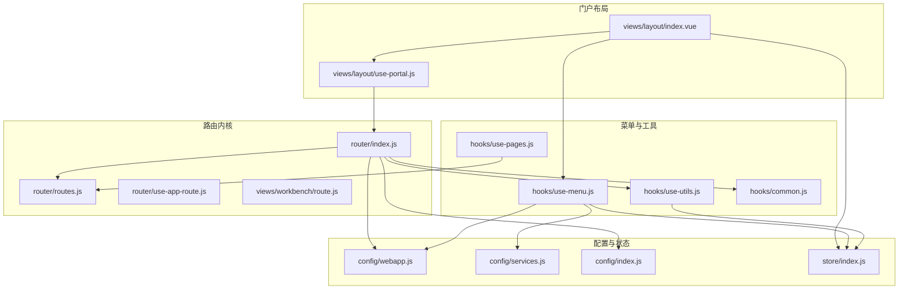
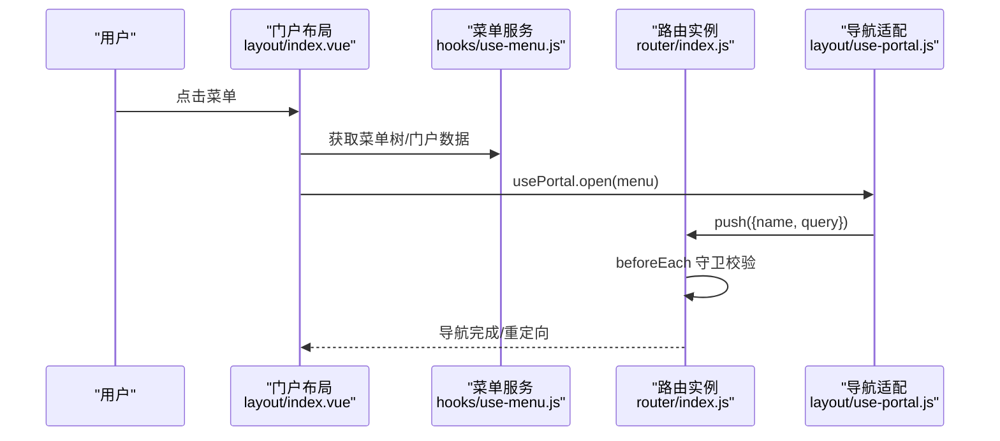
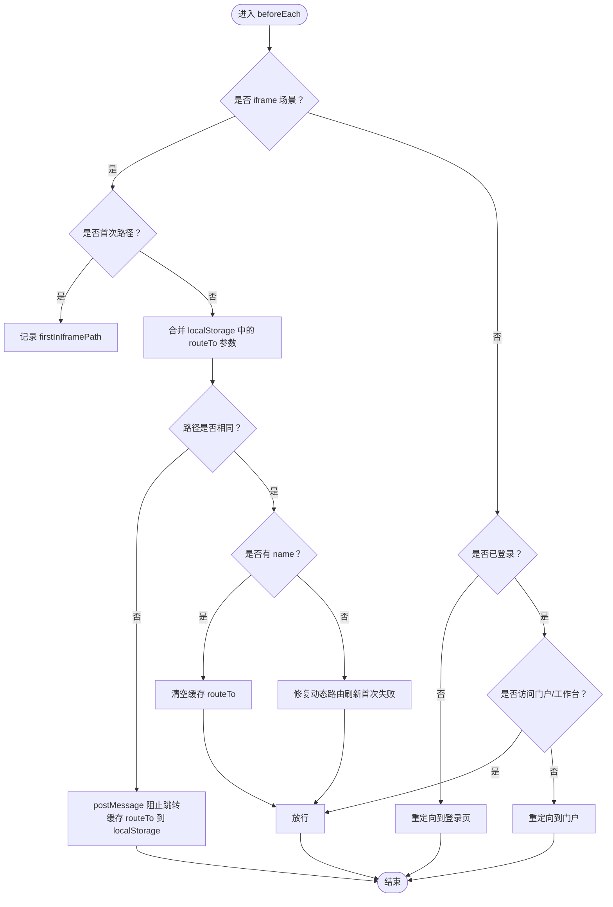
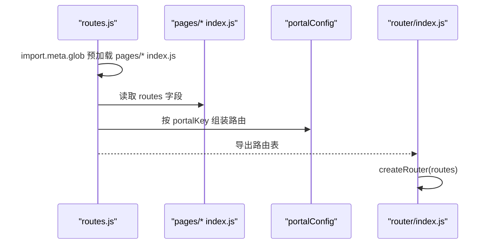
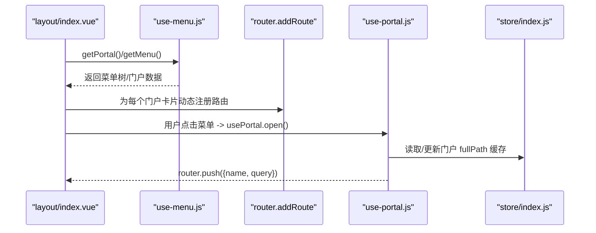
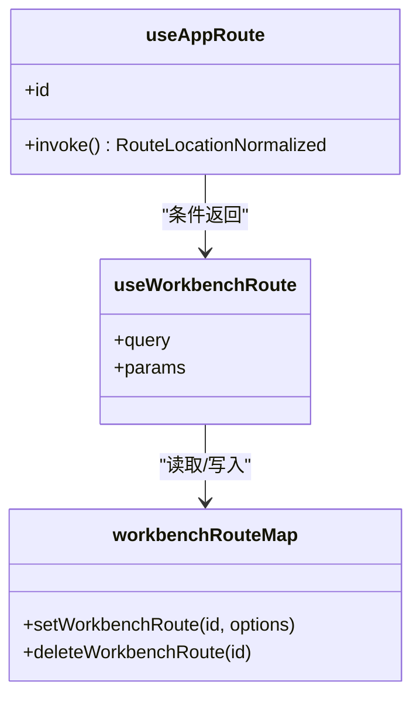
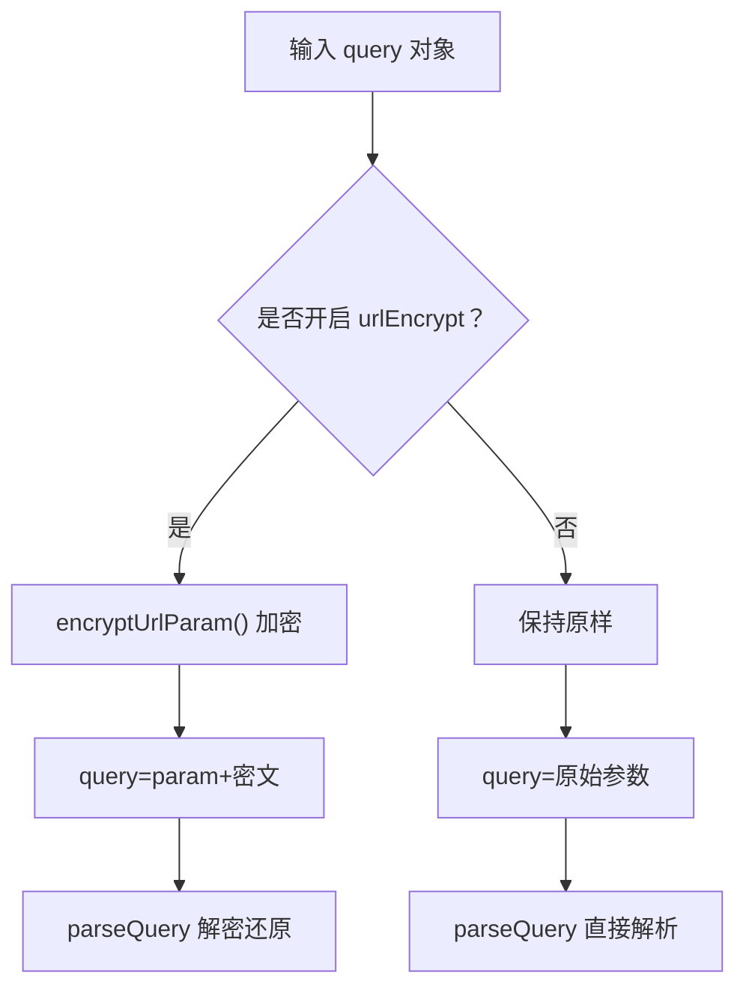
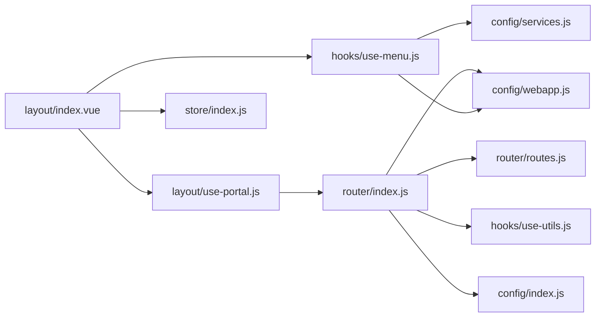

# 路由系统

<cite>
**本文引用的文件**
- [src/portal/router/index.js](file://src/portal/router/index.js)
- [src/portal/router/routes.js](file://src/portal/router/routes.js)
- [src/portal/router/use-app-route.js](file://src/portal/router/use-app-route.js)
- [src/portal/views/workbench/route.js](file://src/portal/views/workbench/route.js)
- [src/portal/views/layout/index.vue](file://src/portal/views/layout/index.vue)
- [src/portal/views/layout/use-portal.js](file://src/portal/views/layout/use-portal.js)
- [src/portal/hooks/use-menu.js](file://src/portal/hooks/use-menu.js)
- [src/portal/hooks/use-pages.js](file://src/portal/hooks/use-pages.js)
- [src/portal/hooks/use-utils.js](file://src/portal/hooks/use-utils.js)
- [src/portal/hooks/common.js](file://src/portal/hooks/common.js)
- [src/portal/store/index.js](file://src/portal/store/index.js)
- [src/config/webapp.js](file://src/config/webapp.js)
- [src/config/services.js](file://src/config/services.js)
- [src/config/index.js](file://src/config/index.js)
</cite>

## 目录
1. [简介](#简介)
2. [项目结构](#项目结构)
3. [核心组件](#核心组件)
4. [架构总览](#架构总览)
5. [详细组件分析](#详细组件分析)
6. [依赖关系分析](#依赖关系分析)
7. [性能考量](#性能考量)
8. [故障排查指南](#故障排查指南)
9. [结论](#结论)
10. [附录](#附录)

## 简介
本文件面向 FS-AOI-WEB 的路由系统，系统基于 Vue Router 实现，采用哈希路由模式，结合动态路由配置、菜单驱动路由、路由守卫与导航管理、参数加密与跨框架通信等能力，支撑多门户、多页面、多工作台的统一导航体系。本文将从架构设计、实现原理、关键流程、性能优化与故障排查等方面进行系统化阐述，并提供可操作的配置示例与扩展指南。

## 项目结构
路由系统主要分布在以下模块：
- 路由内核与守卫：src/portal/router
- 动态路由装配：src/portal/router/routes.js
- 应用层路由适配：src/portal/router/use-app-route.js、src/portal/views/workbench/route.js
- 门户布局与菜单集成：src/portal/views/layout/index.vue、src/portal/views/layout/use-portal.js、src/portal/hooks/use-menu.js
- 工具与配置：src/portal/hooks/use-utils.js、src/portal/hooks/common.js、src/config/webapp.js、src/config/services.js、src/config/index.js
- 状态管理：src/portal/store/index.js

图表来源
- [src/portal/router/index.js](file://src/portal/router/index.js#L1-L141)
- [src/portal/router/routes.js](file://src/portal/router/routes.js#L1-L78)
- [src/portal/router/use-app-route.js](file://src/portal/router/use-app-route.js#L1-L14)
- [src/portal/views/workbench/route.js](file://src/portal/views/workbench/route.js#L1-L19)
- [src/portal/views/layout/index.vue](file://src/portal/views/layout/index.vue#L1-L188)
- [src/portal/views/layout/use-portal.js](file://src/portal/views/layout/use-portal.js#L1-L43)
- [src/portal/hooks/use-menu.js](file://src/portal/hooks/use-menu.js#L1-L130)
- [src/portal/hooks/use-pages.js](file://src/portal/hooks/use-pages.js#L1-L21)
- [src/portal/hooks/use-utils.js](file://src/portal/hooks/use-utils.js#L1-L330)
- [src/portal/hooks/common.js](file://src/portal/hooks/common.js#L1-L81)
- [src/config/webapp.js](file://src/config/webapp.js#L1-L254)
- [src/config/services.js](file://src/config/services.js#L1-L28)
- [src/config/index.js](file://src/config/index.js#L1-L8)

章节来源
- [src/portal/router/index.js](file://src/portal/router/index.js#L1-L141)
- [src/portal/router/routes.js](file://src/portal/router/routes.js#L1-L78)
- [src/portal/views/layout/index.vue](file://src/portal/views/layout/index.vue#L1-L188)

## 核心组件
- 路由实例与守卫：负责全局前置守卫、后置钩子、URL 加密/解密、iframe 场景下的路由拦截与消息通信。
- 动态路由装配：扫描 pages/* 目录，读取各页面 index.js 中的 routes 配置，按 portalConfig 组装子路由。
- 门户布局与菜单集成：初始化时拉取菜单树，动态向路由添加“门户卡片”路由；通过 use-portal 统一打开菜单。
- 应用层路由适配：在工作台模式下提供独立的路由映射，保证 query/params 与工作台上下文一致。
- 工具与配置：URL 参数加解密、菜单树转换、URL 构造与解析、系统参数与主题联动。
- 状态管理：维护菜单树、已打开页签、加密密钥、门户全路径缓存等。

章节来源
- [src/portal/router/index.js](file://src/portal/router/index.js#L1-L141)
- [src/portal/router/routes.js](file://src/portal/router/routes.js#L1-L78)
- [src/portal/views/layout/index.vue](file://src/portal/views/layout/index.vue#L1-L188)
- [src/portal/views/layout/use-portal.js](file://src/portal/views/layout/use-portal.js#L1-L43)
- [src/portal/router/use-app-route.js](file://src/portal/router/use-app-route.js#L1-L14)
- [src/portal/views/workbench/route.js](file://src/portal/views/workbench/route.js#L1-L19)
- [src/portal/hooks/use-utils.js](file://src/portal/hooks/use-utils.js#L1-L330)
- [src/portal/hooks/use-menu.js](file://src/portal/hooks/use-menu.js#L1-L130)
- [src/portal/store/index.js](file://src/portal/store/index.js#L1-L226)
- [src/config/webapp.js](file://src/config/webapp.js#L1-L254)

## 架构总览
路由系统以“菜单驱动路由”为核心，通过以下步骤完成从菜单到页面的导航闭环：
1) 初始化阶段：加载菜单树与门户配置，动态注册“门户卡片”路由。
2) 导航阶段：点击菜单触发 usePortal.open，根据菜单类型选择直接路由或 iframe 打开。
3) 守卫阶段：全局 beforeEach 根据登录态、路由白名单、iframe 场景等进行拦截与重定向。
4) 参数与加密：对 query 进行统一加解密，确保 URL 安全与跨域兼容。
5) 工作台适配：在工作台模式下提供独立的路由映射，隔离参数来源。

图表来源
- [src/portal/views/layout/index.vue](file://src/portal/views/layout/index.vue#L38-L95)
- [src/portal/hooks/use-menu.js](file://src/portal/hooks/use-menu.js#L1-L130)
- [src/portal/views/layout/use-portal.js](file://src/portal/views/layout/use-portal.js#L1-L43)
- [src/portal/router/index.js](file://src/portal/router/index.js#L46-L134)

## 详细组件分析

### 路由内核与守卫
- 历史模式：使用哈希路由，便于部署与兼容。
- 参数加密：通过 stringifyQuery/parseQuery 对 query 进行统一加解密，支持开关控制。
- 全局守卫：
  - 登录态校验：未登录强制跳转登录页，登录后可回退至原目标。
  - 门户白名单：workbench、login 等路由放行。
  - iframe 场景：在 iframe 内首次进入记录 firstInIframePath，后续同路径放行，不同路径通过 postMessage 阻止并缓存 routeTo 参数。
  - 回退保护：afterEach 在 to.params 中注入 routerFrom，避免深层引用导致的循环引用问题。
- 动态路由：通过回调 callbacks.routerBeforeEach 提供外部扩展点。

图表来源
- [src/portal/router/index.js](file://src/portal/router/index.js#L46-L134)

章节来源
- [src/portal/router/index.js](file://src/portal/router/index.js#L1-L141)

### 动态路由配置与页面加载
- 路由装配：
  - 使用 import.meta.glob 预加载 pages/* 下的 index.js，读取 routes 字段。
  - 将各页面 routes 按 portalConfig 组合，生成 /portal/{portalKey} 子路由。
  - 注入 reload、empty 等通用子路由，支持标签页刷新与占位。
- 页面懒加载：
  - 路由 component 使用异步函数返回 import(...)，实现按需加载。
- 页面全局组件：
  - usePages.get('globalComponents') 收集页面级全局组件，通过 defineAsyncComponent 注册。

图表来源
- [src/portal/router/routes.js](file://src/portal/router/routes.js#L1-L78)
- [src/portal/hooks/use-pages.js](file://src/portal/hooks/use-pages.js#L1-L21)

章节来源
- [src/portal/router/routes.js](file://src/portal/router/routes.js#L1-L78)
- [src/portal/hooks/use-pages.js](file://src/portal/hooks/use-pages.js#L1-L21)

### 门户布局与菜单系统集成
- 初始化：
  - portalHooksInit 预加载页面与回调。
  - useMenu.getMenu 拉取菜单树与门户数据，构建树形结构并缓存。
  - 遍历门户菜单，动态调用 router.addRoute('portal', ...) 注册“门户卡片”路由。
- 导航：
  - usePortal.open 根据当前门户缓存的 fullPath 或解析 MENU_LINK 的 query，统一 push 到对应 name 的路由。
- 状态：
  - usePortalStore 维护菜单树、已打开页签、iframe 引用、URL 加密密钥等。

图表来源
- [src/portal/views/layout/index.vue](file://src/portal/views/layout/index.vue#L38-L95)
- [src/portal/hooks/use-menu.js](file://src/portal/hooks/use-menu.js#L1-L130)
- [src/portal/views/layout/use-portal.js](file://src/portal/views/layout/use-portal.js#L1-L43)
- [src/portal/store/index.js](file://src/portal/store/index.js#L1-L226)

章节来源
- [src/portal/views/layout/index.vue](file://src/portal/views/layout/index.vue#L1-L188)
- [src/portal/views/layout/use-portal.js](file://src/portal/views/layout/use-portal.js#L1-L43)
- [src/portal/hooks/use-menu.js](file://src/portal/hooks/use-menu.js#L1-L130)
- [src/portal/store/index.js](file://src/portal/store/index.js#L1-L226)

### 应用层路由适配（工作台模式）
- useAppRoute：
  - 当 query.workbench=1 时，切换到工作台路由适配器，返回基于 workbenchRouteMap 的 query/params。
- workbenchRouteMap：
  - setWorkbenchRoute/deleteWorkbenchRoute 维护工作台内的路由上下文，避免与普通路由冲突。

图表来源
- [src/portal/router/use-app-route.js](file://src/portal/router/use-app-route.js#L1-L14)
- [src/portal/views/workbench/route.js](file://src/portal/views/workbench/route.js#L1-L19)

章节来源
- [src/portal/router/use-app-route.js](file://src/portal/router/use-app-route.js#L1-L14)
- [src/portal/views/workbench/route.js](file://src/portal/views/workbench/route.js#L1-L19)

### 参数加密与 URL 工具
- URL 加密：
  - stringifyQuery/parseQuery 在路由层统一处理，支持开关 projectConfig.urlEncrypt。
  - 加密/解密使用 usePortalStore().urlEncryptKey，通过 use-utils.js 的 encryptUrlParam/decryptUrlParam 实现。
- URL 构建：
  - use-utils.js 提供 parseUrl/buildUrl/formatUrl 等工具，支持从菜单数据构造最终 URL，兼容 http/ksot-sync/kotc-sync 等场景。
- iframe 场景：
  - isInIframe/isIframeRoute 用于判断菜单类型与 iframe 环境，配合路由守卫与 postMessage 协同。

图表来源
- [src/portal/router/index.js](file://src/portal/router/index.js#L12-L22)
- [src/portal/hooks/use-utils.js](file://src/portal/hooks/use-utils.js#L6-L34)
- [src/portal/hooks/common.js](file://src/portal/hooks/common.js#L47-L63)

章节来源
- [src/portal/hooks/use-utils.js](file://src/portal/hooks/use-utils.js#L1-L330)
- [src/portal/hooks/common.js](file://src/portal/hooks/common.js#L1-L81)
- [src/config/webapp.js](file://src/config/webapp.js#L131-L189)

### 权限控制与导航管理
- 权限与菜单类型：
  - use-menu.js 提供 isIframeMenu/isRouterMenu/isTabMenu 判断菜单类型，结合 menuMap.MENU_TYPE 与 menuMap.MENU_TYPE_OPTIONS 控制渲染与打开方式。
- 导航策略：
  - 未登录：统一重定向到登录页，若目标路由声明 redirect，则携带 query。
  - 非门户入口：若非 portal/workbench/signScreen/collect，统一重定向到 portal，并携带 redirect 参数。
  - 未知路由：兜底到 portal。
- 页签与 iframe 管理：
  - store/index.js 维护 openedTabs/openedIframeTabs、keep-alive 名单、刷新标识等，支持页签去重与参数变更刷新。

章节来源
- [src/portal/hooks/use-menu.js](file://src/portal/hooks/use-menu.js#L77-L87)
- [src/portal/router/index.js](file://src/portal/router/index.js#L96-L131)
- [src/portal/store/index.js](file://src/portal/store/index.js#L110-L203)

## 依赖关系分析
- 路由依赖：
  - router/index.js 依赖 routes.js、use-utils.js、hooks/common.js、config/webapp.js、config/index.js。
  - 动态路由依赖 pages/* 的 index.js 与 portalConfig。
- 布局依赖：
  - layout/index.vue 依赖 use-menu.js、use-portal.js、store/index.js、hooks/use-utils.js。
- 配置依赖：
  - config/webapp.js 提供 menuMap、projectConfig、extendUrlConfig、tabsConfig 等。
  - config/services.js 提供菜单/门户接口号。

图表来源
- [src/portal/router/index.js](file://src/portal/router/index.js#L1-L141)
- [src/portal/router/routes.js](file://src/portal/router/routes.js#L1-L78)
- [src/portal/views/layout/index.vue](file://src/portal/views/layout/index.vue#L1-L188)
- [src/portal/views/layout/use-portal.js](file://src/portal/views/layout/use-portal.js#L1-L43)
- [src/portal/hooks/use-menu.js](file://src/portal/hooks/use-menu.js#L1-L130)
- [src/config/webapp.js](file://src/config/webapp.js#L1-L254)
- [src/config/services.js](file://src/config/services.js#L1-L28)
- [src/config/index.js](file://src/config/index.js#L1-L8)

章节来源
- [src/portal/router/index.js](file://src/portal/router/index.js#L1-L141)
- [src/portal/views/layout/index.vue](file://src/portal/views/layout/index.vue#L1-L188)
- [src/portal/hooks/use-menu.js](file://src/portal/hooks/use-menu.js#L1-L130)
- [src/config/webapp.js](file://src/config/webapp.js#L1-L254)

## 性能考量
- 路由懒加载：所有路由 component 均采用异步加载，减少首屏体积与初次渲染时间。
- 动态路由装配：使用 import.meta.glob 预加载 pages/* 的 index.js，避免运行时反射带来的不确定性。
- 页签与 keep-alive：store 中维护 openedTabsKeepAlive，仅对必要组件启用缓存，降低重复渲染成本。
- URL 加密：仅在开启开关时进行加解密，避免不必要的 CPU 开销。
- iframe 通信：在 iframe 场景下通过 postMessage 与本地缓存协同，减少跨框架同步成本。

[本节为通用性能建议，无需列出具体文件来源]

## 故障排查指南
- 登录态异常导致无法跳转：
  - 检查登录态判定逻辑与回调 callbacks.routerBeforeEach。
  - 确认未登录时是否被重定向到 login，并检查 redirect 逻辑。
- iframe 路由拦截无效：
  - 确认 isInIframe 配置与 location 中 isIframe=1/isInIframe=1 的检测。
  - 检查 firstInIframePath 与 localStorage 中 routeTo#path 的缓存一致性。
- 动态路由首次刷新失败：
  - 检查 beforeEach 中针对无 name 路由的修复逻辑。
- 页签参数不刷新：
  - 检查 openedIframeTabs 的 compare 逻辑与刷新标识 isRefresh 设置。
- URL 参数乱码或解密失败：
  - 确认 projectConfig.urlEncrypt 开关与 usePortalStore().urlEncryptKey 的设置。
  - 检查 parseQuery/stringifyQuery 的实现与加密/解密流程。

章节来源
- [src/portal/router/index.js](file://src/portal/router/index.js#L46-L134)
- [src/portal/store/index.js](file://src/portal/store/index.js#L156-L203)
- [src/portal/hooks/use-utils.js](file://src/portal/hooks/use-utils.js#L6-L34)
- [src/portal/hooks/common.js](file://src/portal/hooks/common.js#L65-L72)

## 结论
FS-AOI-WEB 路由系统以“菜单驱动路由”为核心，结合动态路由装配、参数加密、iframe 场景适配与工作台路由适配，形成一套可扩展、可维护、可安全传输的导航体系。通过 store 管理页签与 iframe 状态，配合工具函数与配置中心，能够高效支撑多门户、多页面、多工作台的复杂业务场景。

[本节为总结性内容，无需列出具体文件来源]

## 附录

### 路由配置示例（步骤说明）
- 动态路由装配：
  - 在 pages/*/index.js 中导出 routes 字段，按 portalKey 组织子路由。
  - 确保 routes.js 正确读取并拼装到 /portal/{portalKey} 下。
- 门户卡片路由：
  - 在 layout/index.vue 初始化时，遍历菜单调用 router.addRoute('portal', ...) 注册卡片路由。
- 登录与白名单：
  - 在 router.beforeEach 中配置登录态校验与白名单路由（如 workbench、login）。
- URL 加密：
  - 在 config/webapp.js 中开启 projectConfig.urlEncrypt，并在登录成功后设置 usePortalStore().urlEncryptKey。
- 工作台路由适配：
  - 在工作台模式下，通过 useAppRoute 返回工作台专用的路由上下文。

章节来源
- [src/portal/router/routes.js](file://src/portal/router/routes.js#L1-L78)
- [src/portal/views/layout/index.vue](file://src/portal/views/layout/index.vue#L48-L56)
- [src/portal/router/index.js](file://src/portal/router/index.js#L96-L131)
- [src/config/webapp.js](file://src/config/webapp.js#L131-L189)
- [src/portal/router/use-app-route.js](file://src/portal/router/use-app-route.js#L1-L14)

### 自定义路由守卫编写指南
- 扩展点：
  - 通过 callbacks.routerBeforeEach 注入自定义守卫逻辑，支持异步校验与重定向。
- 注意事项：
  - 优先处理 iframe 场景与登录态，再进行业务校验。
  - 对动态路由与兜底路由做好分支处理，避免误拦截。
  - 使用 afterEach 清理 params.routerFrom，避免内存泄漏。

章节来源
- [src/portal/router/index.js](file://src/portal/router/index.js#L92-L94)
- [src/portal/router/index.js](file://src/portal/router/index.js#L136-L138)

### 路由性能优化建议
- 仅在必要时启用 URL 加密。
- 合理使用 keep-alive 与缓存策略，避免过度缓存导致内存压力。
- 将高频页面拆分为独立 chunk，结合路由懒加载进一步优化首屏。
- 在 iframe 场景下，尽量减少 postMessage 的频率与数据量。

[本节为通用优化建议，无需列出具体文件来源]