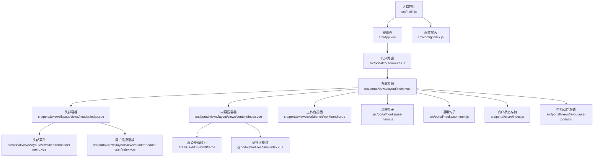
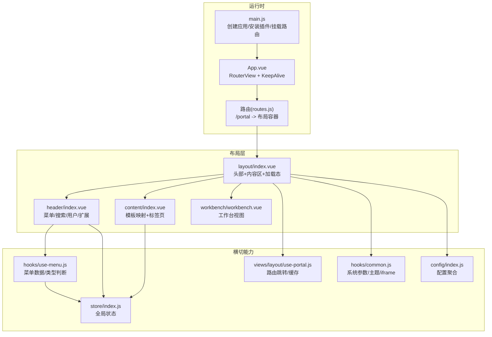
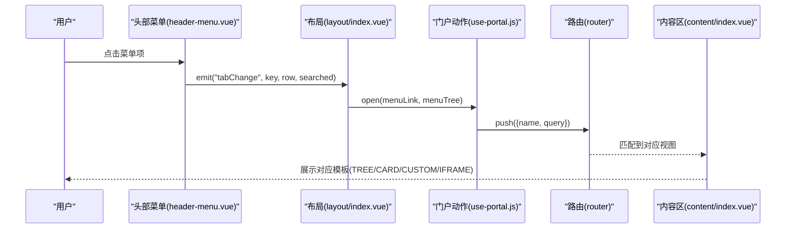
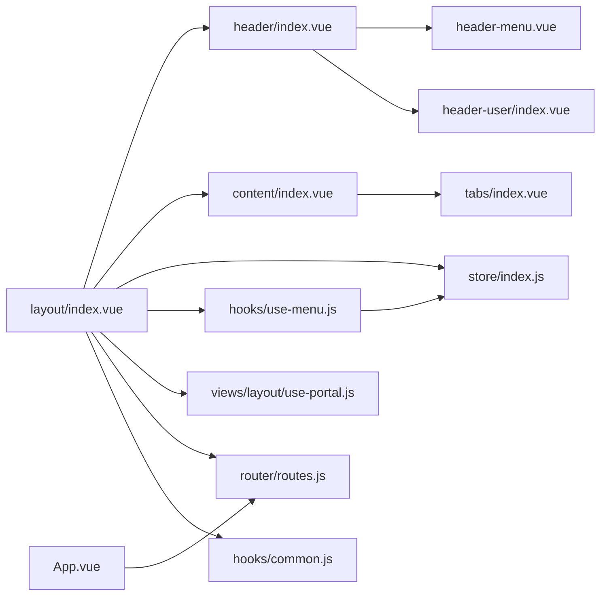

# 门户布局

<cite>
**本文引用的文件**
- [src/App.vue](file://src/App.vue)
- [src/main.js](file://src/main.js)
- [src/portal/views/layout/index.vue](file://src/portal/views/layout/index.vue)
- [src/portal/views/layout/views/header/index.vue](file://src/portal/views/layout/views/header/index.vue)
- [src/portal/views/layout/views/header/header-menu.vue](file://src/portal/views/layout/views/header/header-menu.vue)
- [src/portal/views/layout/views/header/header-user/index.vue](file://src/portal/views/layout/views/header/header-user/index.vue)
- [src/portal/views/layout/views/content/index.vue](file://src/portal/views/layout/views/content/index.vue)
- [src/portal/views/workbench/workbench.vue](file://src/portal/views/workbench/workbench.vue)
- [src/portal/router/routes.js](file://src/portal/router/routes.js)
- [src/portal/hooks/use-menu.js](file://src/portal/hooks/use-menu.js)
- [src/portal/hooks/common.js](file://src/portal/hooks/common.js)
- [src/portal/store/index.js](file://src/portal/store/index.js)
- [src/portal/views/layout/use-portal.js](file://src/portal/views/layout/use-portal.js)
- [src/config/index.js](file://src/config/index.js)
</cite>

## 目录
1. [简介](#简介)
2. [项目结构](#项目结构)
3. [核心组件](#核心组件)
4. [架构总览](#架构总览)
5. [组件详解](#组件详解)
6. [依赖关系分析](#依赖关系分析)
7. [性能考量](#性能考量)
8. [故障排查指南](#故障排查指南)
9. [结论](#结论)
10. [附录](#附录)

## 简介
本技术文档围绕 FS-AOI-WEB 门户布局系统进行系统化梳理，覆盖整体架构、布局组件（头部导航、内容区、侧边栏/应用栏）、响应式与多系统适配、头部菜单与搜索、用户信息面板交互、与工作台系统的集成、路由切换与布局变化、用户体验优化、布局定制与扩展、以及性能优化建议。目标是帮助开发者快速理解并高效开发与定制门户布局。

## 项目结构
门户布局位于 portal 子系统内，采用 Vue 3 + Pinia 架构，通过路由组织页面与布局视图，配合 hooks 与 store 实现菜单、主题、系统参数等横切能力的统一管理。

图表来源
- [src/main.js](file://src/main.js#L1-L40)
- [src/App.vue](file://src/App.vue#L1-L8)
- [src/portal/router/routes.js](file://src/portal/router/routes.js#L1-L78)
- [src/portal/views/layout/index.vue](file://src/portal/views/layout/index.vue#L1-L188)
- [src/portal/views/layout/views/header/index.vue](file://src/portal/views/layout/views/header/index.vue#L1-L184)
- [src/portal/views/layout/views/content/index.vue](file://src/portal/views/layout/views/content/index.vue#L1-L93)
- [src/portal/views/workbench/workbench.vue](file://src/portal/views/workbench/workbench.vue#L1-L235)
- [src/portal/hooks/use-menu.js](file://src/portal/hooks/use-menu.js#L1-L130)
- [src/portal/hooks/common.js](file://src/portal/hooks/common.js#L1-L81)
- [src/portal/store/index.js](file://src/portal/store/index.js#L1-L226)
- [src/portal/views/layout/use-portal.js](file://src/portal/views/layout/use-portal.js#L1-L43)
- [src/config/index.js](file://src/config/index.js#L1-L8)

章节来源
- [src/main.js](file://src/main.js#L1-L40)
- [src/App.vue](file://src/App.vue#L1-L8)
- [src/portal/router/routes.js](file://src/portal/router/routes.js#L1-L78)

## 核心组件
- 布局容器：负责门户模式与子系统模式的切换、头部与内容区的组合、加载态与动画控制。
- 头部容器：承载左侧系统信息、中部菜单、右侧用户信息与扩展插槽，并根据子系统模式切换展示。
- 内容区容器：根据菜单 RENDER_TYPE 动态选择渲染模板（树形/卡片/自定义/Iframe），并挂载标签页面板。
- 菜单钩子：统一拉取门户与菜单数据，构建树结构，提供菜单类型判断与本地最近访问记录。
- 门户动作：封装路由跳转、缓存上次门户路由、处理菜单链接查询参数。
- 通用钩子：系统参数、主题、iframe 环境检测、预版本样式判断。
- 门户状态存储：集中管理菜单树、操作员信息、打开的标签页、iframe 引用、折叠状态等。
- 工作台视图：与门户解耦的工作台页面，负责桌面、应用栏、设置中心等。

章节来源
- [src/portal/views/layout/index.vue](file://src/portal/views/layout/index.vue#L1-L188)
- [src/portal/views/layout/views/header/index.vue](file://src/portal/views/layout/views/header/index.vue#L1-L184)
- [src/portal/views/layout/views/content/index.vue](file://src/portal/views/layout/views/content/index.vue#L1-L93)
- [src/portal/hooks/use-menu.js](file://src/portal/hooks/use-menu.js#L1-L130)
- [src/portal/views/layout/use-portal.js](file://src/portal/views/layout/use-portal.js#L1-L43)
- [src/portal/hooks/common.js](file://src/portal/hooks/common.js#L1-L81)
- [src/portal/store/index.js](file://src/portal/store/index.js#L1-L226)
- [src/portal/views/workbench/workbench.vue](file://src/portal/views/workbench/workbench.vue#L1-L235)

## 架构总览
门户布局以“容器 + 视图 + 钩子 + 存储”的分层组织，路由驱动布局与内容切换，Pinia 提供跨组件状态共享，KJDP 生态提供系统参数、UI 组件与图标资源。

图表来源
- [src/main.js](file://src/main.js#L1-L40)
- [src/App.vue](file://src/App.vue#L1-L8)
- [src/portal/router/routes.js](file://src/portal/router/routes.js#L1-L78)
- [src/portal/views/layout/index.vue](file://src/portal/views/layout/index.vue#L1-L188)
- [src/portal/views/layout/views/header/index.vue](file://src/portal/views/layout/views/header/index.vue#L1-L184)
- [src/portal/views/layout/views/content/index.vue](file://src/portal/views/layout/views/content/index.vue#L1-L93)
- [src/portal/views/workbench/workbench.vue](file://src/portal/views/workbench/workbench.vue#L1-L235)
- [src/portal/hooks/use-menu.js](file://src/portal/hooks/use-menu.js#L1-L130)
- [src/portal/hooks/common.js](file://src/portal/hooks/common.js#L1-L81)
- [src/portal/store/index.js](file://src/portal/store/index.js#L1-L226)
- [src/portal/views/layout/use-portal.js](file://src/portal/views/layout/use-portal.js#L1-L43)
- [src/config/index.js](file://src/config/index.js#L1-L8)

## 组件详解

### 布局容器（layout/index.vue）
- 职责
  - 初始化门户钩子、加载操作员信息、动态注册菜单路由、初始化子系统状态、控制头部与搜索显示、处理白名单场景的消息通知。
  - 根据门户模式（普通/子系统）与主题版本切换类名，控制背景与尺寸。
  - 将头部点击事件转发给门户动作以打开对应页面。
- 关键点
  - 使用防抖延迟控制头部首次渲染，避免闪烁。
  - 支持预版本样式判断，切换背景与布局。
  - 在 iframe 场景下禁用头部渲染与加载态，直接进入内容区。
- 交互
  - 头部菜单点击 -> 门户动作 open -> 路由 push -> 内容区根据 RENDER_TYPE 渲染对应模板。

图表来源
- [src/portal/views/layout/index.vue](file://src/portal/views/layout/index.vue#L75-L89)
- [src/portal/views/layout/use-portal.js](file://src/portal/views/layout/use-portal.js#L6-L39)
- [src/portal/views/layout/views/content/index.vue](file://src/portal/views/layout/views/content/index.vue#L31-L36)

章节来源
- [src/portal/views/layout/index.vue](file://src/portal/views/layout/index.vue#L1-L188)

### 头部容器（header/index.vue）
- 职责
  - 左侧系统信息（券商 LOGO、系统名称、环境），仅在非子系统模式显示。
  - 中部菜单（普通模式）或子系统菜单（子系统模式）。
  - 右侧搜索与用户信息面板。
  - 扩展插槽与系统信息适配组件。
- 适配逻辑
  - 子系统模式下隐藏左侧系统信息；在特定 fullscreen 场景下可隐藏头部。
  - 预版本样式下调整布局与间距。
- 事件
  - 通过 provide/inject 将 menuSearch 与 handleSelect 注入子组件，统一处理菜单点击与搜索结果跳转。

章节来源
- [src/portal/views/layout/views/header/index.vue](file://src/portal/views/layout/views/header/index.vue#L1-L184)

### 头部菜单（header-menu.vue）
- 职责
  - 从 store 读取菜单树，按 RENDER_ORD 排序展示。
  - 初始化时根据回调或首个菜单自动跳转至门户首页。
  - 点击菜单项触发父级 tabChange 事件。
- 交互
  - 与头部容器通过 provide/inject 协作，确保点击行为一致。

章节来源
- [src/portal/views/layout/views/header/header-menu.vue](file://src/portal/views/layout/views/header/header-menu.vue#L1-L137)

### 用户信息面板（header-user/index.vue）
- 职责
  - 展示操作员信息（工号、姓名、岗位、手机、机构）。
  - 提供主题切换弹窗、锁定用户、退出登录等操作。
  - 通过 Popover 展示信息面板，支持点击外部关闭。
- 行为
  - 退出登录后刷新页面回到登录页。
  - 锁定用户流程通过确认对话框触发系统登出。

章节来源
- [src/portal/views/layout/views/header/header-user/index.vue](file://src/portal/views/layout/views/header/header-user/index.vue#L1-L312)

### 内容区容器（content/index.vue）
- 职责
  - 根据菜单 RENDER_TYPE 动态选择渲染模板：树形、卡片、自定义、Iframe。
  - 在非子系统 fullscreen 场景下显示标签页面板。
  - 通过 keep-alive 缓存已打开的视图，减少重复渲染。
- 数据流
  - 从 store 获取菜单树，结合事件总线选择当前激活菜单项。
  - 通过路由 query 中的 portalId 作为初始激活条件。

章节来源
- [src/portal/views/layout/views/content/index.vue](file://src/portal/views/layout/views/content/index.vue#L1-L93)

### 工作台视图（workbench/workbench.vue）
- 职责
  - 加载应用列表、固定应用、个性化设置，初始化主题与字号。
  - 管理桌面栏、桌面视图、应用主视图、应用栏与设置中心。
  - 监听用户登录/登出事件，触发页面刷新。
- 与门户的关系
  - 工作台为独立视图，不参与门户布局容器的头部与内容区渲染，二者通过路由隔离。

章节来源
- [src/portal/views/workbench/workbench.vue](file://src/portal/views/workbench/workbench.vue#L1-L235)

### 菜单钩子（hooks/use-menu.js）
- 职责
  - 拉取门户与菜单数据，构建树结构，注入门户属性与渲染类型。
  - 提供菜单类型判断（iframe/router/tab）与最近访问记录的本地持久化。
  - 在子系统模式下对卡片模板进行兼容性转换。
- 性能
  - 并行请求门户与菜单数据，减少等待时间。

章节来源
- [src/portal/hooks/use-menu.js](file://src/portal/hooks/use-menu.js#L1-L130)

### 门户动作（views/layout/use-portal.js）
- 职责
  - 将菜单链接转换为路由 push 参数，处理查询串解析与缓存上次门户路由。
  - 当目标路由不存在时弹出提示消息。
- 与路由
  - 依赖路由模块的 hasRoute 与 push 能力，保证跳转安全。

章节来源
- [src/portal/views/layout/use-portal.js](file://src/portal/views/layout/use-portal.js#L1-L43)

### 通用钩子（hooks/common.js）
- 职责
  - 系统参数获取与标题/Favicon 设置。
  - 窗口事件监听器的挂载与卸载。
  - 判断是否在 iframe、是否为预版本样式等环境判定。
- 应用
  - 为头部容器与内容区提供样式与可见性控制依据。

章节来源
- [src/portal/hooks/common.js](file://src/portal/hooks/common.js#L1-L81)

### 门户状态存储（store/index.js）
- 职责
  - 统一管理门户相关状态：菜单树、操作员信息、打开的标签页、iframe 引用、折叠状态等。
  - 提供标签页生命周期管理（新增、删除、KeepAlive 名称维护）。
- 与布局
  - 布局容器与内容区均依赖该 store 进行数据与状态同步。

章节来源
- [src/portal/store/index.js](file://src/portal/store/index.js#L1-L226)

### 路由配置（router/routes.js）
- 职责
  - 自动扫描各页面模块的路由配置，按门户键合并生成子路由。
  - 定义门户根路由与登录、采集、签名屏等特殊页面路由。
- 与布局
  - /portal 根路由指向布局容器，子路由由各页面模块导出的 routes 配置拼装而来。

章节来源
- [src/portal/router/routes.js](file://src/portal/router/routes.js#L1-L78)

## 依赖关系分析
- 组件耦合
  - 布局容器与头部/内容区为强依赖；头部菜单与用户面板通过事件注入与布局容器弱耦合。
  - 内容区与标签页模块松耦合，通过 store 共享状态。
- 外部依赖
  - KJDP 核心与 UI 提供系统参数、图标与弹窗组件。
  - Pinia 提供全局状态管理。
- 循环依赖
  - 未发现明显循环依赖；若后续扩展，需避免在 store 中引入布局组件实例。

图表来源
- [src/portal/views/layout/index.vue](file://src/portal/views/layout/index.vue#L1-L188)
- [src/portal/views/layout/views/header/index.vue](file://src/portal/views/layout/views/header/index.vue#L1-L184)
- [src/portal/views/layout/views/content/index.vue](file://src/portal/views/layout/views/content/index.vue#L1-L93)
- [src/portal/views/layout/views/header/header-menu.vue](file://src/portal/views/layout/views/header/header-menu.vue#L1-L137)
- [src/portal/views/layout/views/header/header-user/index.vue](file://src/portal/views/layout/views/header/header-user/index.vue#L1-L312)
- [src/portal/store/index.js](file://src/portal/store/index.js#L1-L226)
- [src/portal/hooks/use-menu.js](file://src/portal/hooks/use-menu.js#L1-L130)
- [src/portal/views/layout/use-portal.js](file://src/portal/views/layout/use-portal.js#L1-L43)
- [src/portal/router/routes.js](file://src/portal/router/routes.js#L1-L78)
- [src/portal/hooks/common.js](file://src/portal/hooks/common.js#L1-L81)
- [src/App.vue](file://src/App.vue#L1-L8)

## 性能考量
- 渲染优化
  - 使用 KeepAlive 缓存内容区视图，减少重复渲染与请求开销。
  - 防抖控制头部首次渲染，避免闪烁与多余重排。
- 数据加载
  - 菜单与门户数据并行拉取，缩短首屏等待。
  - 门户动作缓存上次门户路由，避免重复计算 fullPath。
- 状态管理
  - 将标签页与 iframe 引用集中管理，便于清理与复用。
- 主题与样式
  - 预版本样式判断仅在主题切换时生效，避免频繁样式计算。
- 资源加载
  - 通过配置聚合与按需异步组件加载，降低首屏体积。

## 故障排查指南
- 页面无法跳转或报错
  - 检查菜单配置中的 MENU_ID 是否与路由注册一致；若不存在则会弹出提示。
  - 确认菜单链接中的查询串格式正确，门户动作会解析并注入到路由 query。
- 头部不显示或闪烁
  - 若处于 iframe 或 fullscreen 场景，头部默认隐藏；检查 URL 参数与子系统模式配置。
  - 首次加载闪烁可通过防抖参数调优。
- 用户信息面板不显示
  - 确认操作员信息已写入 store；面板依赖 store 中的 opInfo。
- 标签页不刷新
  - 检查 openedIframeTabs 与 openedTabs 的同步逻辑，确认查询串差异是否被忽略（框架生成字段除外）。
- 主题切换无效
  - 确认主题钩子与配置开关已启用；预版本样式下部分布局会调整。

章节来源
- [src/portal/views/layout/use-portal.js](file://src/portal/views/layout/use-portal.js#L36-L39)
- [src/portal/views/layout/index.vue](file://src/portal/views/layout/index.vue#L24-L27)
- [src/portal/hooks/common.js](file://src/portal/hooks/common.js#L57-L80)
- [src/portal/store/index.js](file://src/portal/store/index.js#L156-L203)

## 结论
门户布局系统通过清晰的分层与模块化设计，实现了头部导航、内容区与工作台的解耦与协同。借助 Pinia 状态管理与 KJDP 生态，系统具备良好的可扩展性与多系统适配能力。开发者可在不破坏现有结构的前提下，通过路由配置、菜单钩子与主题钩子进行布局定制与功能增强。

## 附录

### 响应式与多系统适配要点
- 门户模式与子系统模式
  - 通过 store 的 subSysMode 与 subSysModeKey 控制布局方向与头部高度。
- 预版本样式
  - 通过主题钩子判断当前主题，切换布局与背景样式。
- iframe 场景
  - 在 iframe 中隐藏头部与加载态，直接进入内容区，避免嵌套问题。

章节来源
- [src/portal/views/layout/index.vue](file://src/portal/views/layout/index.vue#L147-L156)
- [src/portal/hooks/common.js](file://src/portal/hooks/common.js#L74-L80)
- [src/portal/hooks/common.js](file://src/portal/hooks/common.js#L57-L63)

### 布局定制与扩展指南
- 新增门户
  - 在页面模块的 routes 中导出路由配置，路由扫描会自动合并到门户子路由。
- 新增菜单模板
  - 在内容区模板映射中添加新模板组件，并在菜单 RENDER_TYPE 对应。
- 新增头部功能
  - 在头部容器扩展插槽中插入自定义组件，或通过 provide/inject 事件扩展菜单行为。
- 新增主题
  - 通过主题钩子与配置开关启用新主题，预版本样式判断可按需扩展。

章节来源
- [src/portal/router/routes.js](file://src/portal/router/routes.js#L13-L33)
- [src/portal/views/layout/views/content/index.vue](file://src/portal/views/layout/views/content/index.vue#L31-L36)
- [src/portal/views/layout/views/header/index.vue](file://src/portal/views/layout/views/header/index.vue#L66-L70)