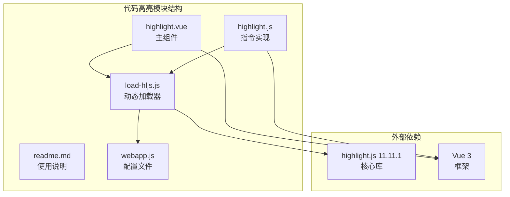
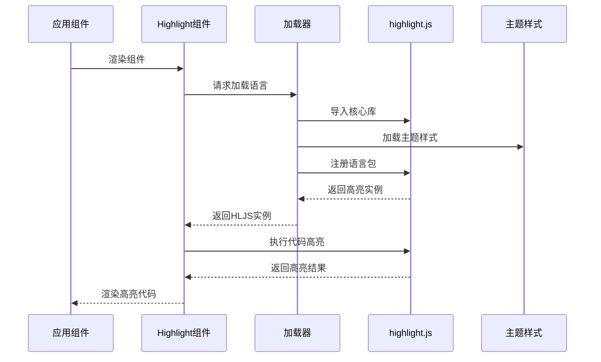
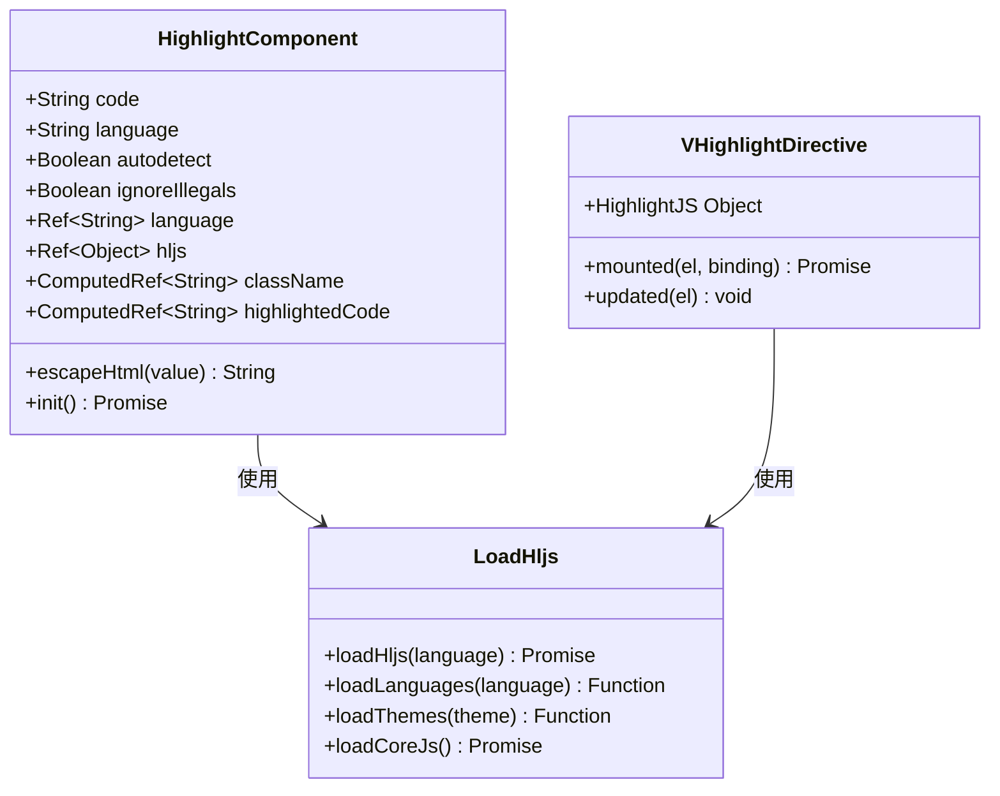
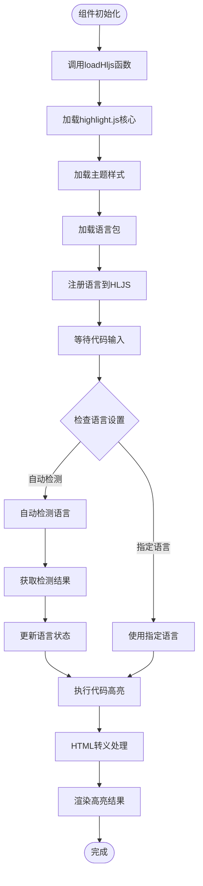
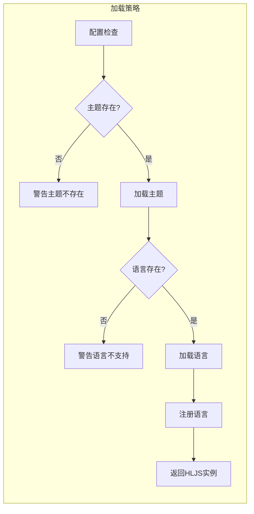
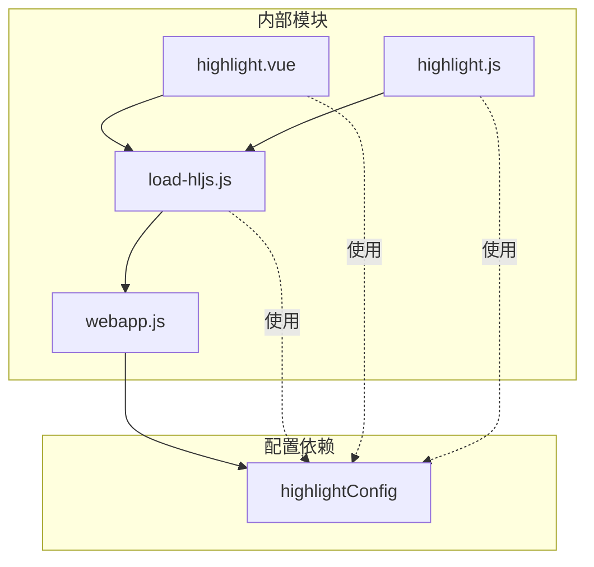

# 代码高亮模块

<cite>
**本文档引用的文件**
- [highlight.vue](file://src/portal/modules/highlight/highlight.vue)
- [load-hljs.js](file://src/portal/modules/highlight/load-hljs.js)
- [highlight.js](file://src/portal/modules/highlight/highlight.js)
- [readme.md](file://src/portal/modules/highlight/readme.md)
- [webapp.js](file://src/config/webapp.js)
- [package.json](file://package.json)
</cite>

## 目录
1. [简介](#简介)
2. [项目结构](#项目结构)
3. [核心组件](#核心组件)
4. [架构概览](#架构概览)
5. [详细组件分析](#详细组件分析)
6. [依赖关系分析](#依赖关系分析)
7. [性能考虑](#性能考虑)
8. [故障排除指南](#故障排除指南)
9. [结论](#结论)

## 简介

FS-AOI-WEB代码高亮模块是一个基于highlight.js的Vue 3集成解决方案，提供了灵活的代码高亮功能，支持多种编程语言和主题配置。该模块通过动态加载机制实现了按需加载，确保了应用的性能和用户体验。

## 项目结构

代码高亮模块位于门户系统的模块目录中，包含以下核心文件：

**图表来源**
- [highlight.vue](file://src/portal/modules/highlight/highlight.vue#L1-L77)
- [load-hljs.js](file://src/portal/modules/highlight/load-hljs.js#L1-L389)
- [highlight.js](file://src/portal/modules/highlight/highlight.js#L1-L24)

**章节来源**
- [highlight.vue](file://src/portal/modules/highlight/highlight.vue#L1-L77)
- [load-hljs.js](file://src/portal/modules/highlight/load-hljs.js#L1-L389)
- [highlight.js](file://src/portal/modules/highlight/highlight.js#L1-L24)

## 核心组件

### highlight.vue - 主要组件

highlight.vue是代码高亮模块的核心组件，采用Vue 3 Composition API实现，提供了完整的代码高亮功能。

**主要特性：**
- 动态语言检测和高亮
- 插槽支持的代码输入
- HTML转义保护
- 响应式语言切换

**关键属性配置：**
- `code`: 代码字符串（String类型，默认为空字符串）
- `language`: 高亮语言（String类型，默认为javascript）
- `autodetect`: 自动选择语言（Boolean类型，默认为true）
- `ignoreIllegals`: 忽略非法字符（Boolean类型，默认为true）

**章节来源**
- [highlight.vue](file://src/portal/modules/highlight/highlight.vue#L5-L17)
- [readme.md](file://src/portal/modules/highlight/readme.md#L33-L41)

### load-hljs.js - 动态加载器

load-hljs.js实现了highlight.js的动态加载机制，支持按需加载语言包和主题样式。

**核心功能：**
- 动态导入highlight.js核心库
- 条件加载指定语言包
- 主题样式动态加载
- 语言注册和缓存管理

**支持的语言范围：** 包含从1c到zephir的198种编程语言

**支持的主题范围：** 包含从1c-light到xt256的100+种主题

**章节来源**
- [load-hljs.js](file://src/portal/modules/highlight/load-hljs.js#L5-L202)
- [load-hljs.js](file://src/portal/modules/highlight/load-hljs.js#L203-L368)

### highlight.js - Vue指令实现

highlight.js提供了Vue指令接口，便于在模板中直接使用代码高亮功能。

**指令特性：**
- `v-highlight:language` 语法
- 自动高亮预格式化代码块
- 更新时重新高亮
- 支持动态语言切换

**章节来源**
- [highlight.js](file://src/portal/modules/highlight/highlight.js#L6-L21)

## 架构概览

代码高亮模块采用分层架构设计，实现了清晰的关注点分离：

**图表来源**
- [highlight.vue](file://src/portal/modules/highlight/highlight.vue#L66-L69)
- [load-hljs.js](file://src/portal/modules/highlight/load-hljs.js#L370-L388)

## 详细组件分析

### Highlight组件类图

**图表来源**
- [highlight.vue](file://src/portal/modules/highlight/highlight.vue#L1-L77)
- [load-hljs.js](file://src/portal/modules/highlight/load-hljs.js#L370-L388)
- [highlight.js](file://src/portal/modules/highlight/highlight.js#L6-L21)

### 代码高亮流程

**图表来源**
- [highlight.vue](file://src/portal/modules/highlight/highlight.vue#L43-L64)
- [load-hljs.js](file://src/portal/modules/highlight/load-hljs.js#L370-L388)

### 动态加载机制

load-hljs.js实现了智能的动态加载策略：

**图表来源**
- [load-hljs.js](file://src/portal/modules/highlight/load-hljs.js#L370-L388)

**章节来源**
- [highlight.vue](file://src/portal/modules/highlight/highlight.vue#L19-L64)
- [load-hljs.js](file://src/portal/modules/highlight/load-hljs.js#L370-L388)

## 依赖关系分析

### 外部依赖

代码高亮模块依赖于highlight.js 11.11.1版本，该版本提供了丰富的语言支持和主题选择：

**支持的编程语言：**
- 1C: 1c
- ABNF: abnf
- Apache配置: apache
- AppleScript: applescript
- Arduino: arduino
- ARM汇编: armasm
- C/C++: c, cpp
- C#: csharp
- CSS: css
- Go: go
- Java: java
- JavaScript: javascript
- JSON: json
- Kotlin: kotlin
- Markdown: markdown
- PHP: php
- Python: python
- Ruby: ruby
- Rust: rust
- SQL: sql
- Swift: swift
- TypeScript: typescript
- YAML: yaml

**支持的主题：**
- GitHub Dark: github-dark
- Dark: dark
- Default: default
- Monokai: monokai
- Nord: nord
- Obsidian: obsidian
- Solarized: solarized
- 和其他100+种主题

**章节来源**
- [load-hljs.js](file://src/portal/modules/highlight/load-hljs.js#L5-L199)
- [load-hljs.js](file://src/portal/modules/highlight/load-hljs.js#L203-L365)
- [package.json](file://package.json#L26)

### 内部依赖关系

**图表来源**
- [highlight.vue](file://src/portal/modules/highlight/highlight.vue#L3)
- [load-hljs.js](file://src/portal/modules/highlight/load-hljs.js#L1)
- [highlight.js](file://src/portal/modules/highlight/highlight.js#L4)
- [webapp.js](file://src/config/webapp.js#L251-L253)

**章节来源**
- [highlight.vue](file://src/portal/modules/highlight/highlight.vue#L1-L77)
- [load-hljs.js](file://src/portal/modules/highlight/load-hljs.js#L1-L389)
- [highlight.js](file://src/portal/modules/highlight/highlight.js#L1-L24)

## 性能考虑

### 按需加载优化

代码高亮模块采用了多层按需加载策略：

1. **核心库延迟加载**：只有在需要时才加载highlight.js核心库
2. **语言包按需加载**：只加载实际使用的语言包
3. **主题样式动态加载**：根据配置动态加载对应主题样式
4. **缓存机制**：已加载的语言包和主题会被缓存复用

### 内存管理

- 使用Vue 3的响应式系统管理状态
- 及时清理不需要的DOM节点
- 避免重复注册相同语言包
- 合理的错误处理和降级策略

### 加载性能监控

模块提供了完善的错误处理机制：
- 语言不支持时的警告信息
- 主题不存在时的降级处理
- 异步加载失败的重试机制

**章节来源**
- [load-hljs.js](file://src/portal/modules/highlight/load-hljs.js#L376-L381)

## 故障排除指南

### 常见问题及解决方案

**问题1：主题加载失败**
- 现象：控制台出现主题不存在警告
- 解决方案：检查webapp.js中的highlightConfig.theme配置
- 验证可用主题：参考load-hljs.js中的主题列表

**问题2：特定语言无法高亮**
- 现象：指定语言代码未正确高亮
- 解决方案：确认语言名称拼写正确
- 支持语言验证：检查load-hljs.js的语言映射表

**问题3：自动检测失效**
- 现象：autodetect=true但语言识别不准确
- 解决方案：明确指定language属性
- 建议：在复杂代码场景下禁用自动检测

**问题4：性能问题**
- 现象：大量代码高亮导致页面卡顿
- 解决方案：使用虚拟滚动或分页加载
- 优化建议：合理使用异步加载和缓存

### 调试技巧

1. **启用详细日志**：检查控制台中的警告和错误信息
2. **验证配置**：确认highlightConfig配置正确
3. **测试边界条件**：验证空代码、特殊字符等边界情况
4. **性能监控**：使用浏览器开发者工具监控内存和CPU使用

**章节来源**
- [load-hljs.js](file://src/portal/modules/highlight/load-hljs.js#L376-L381)
- [readme.md](file://src/portal/modules/highlight/readme.md#L42-L49)

## 结论

FS-AOI-WEB代码高亮模块是一个设计精良的Vue 3集成解决方案，具有以下优势：

1. **高度模块化**：清晰的职责分离和依赖管理
2. **性能优化**：智能的按需加载和缓存机制
3. **扩展性强**：支持198种语言和100+主题
4. **易于使用**：简洁的API和完善的文档
5. **稳定可靠**：完善的错误处理和降级策略

该模块为门户系统提供了高质量的代码高亮功能，开发者可以轻松集成到各种应用场景中。通过合理的配置和使用，可以显著提升代码展示的用户体验和可读性。