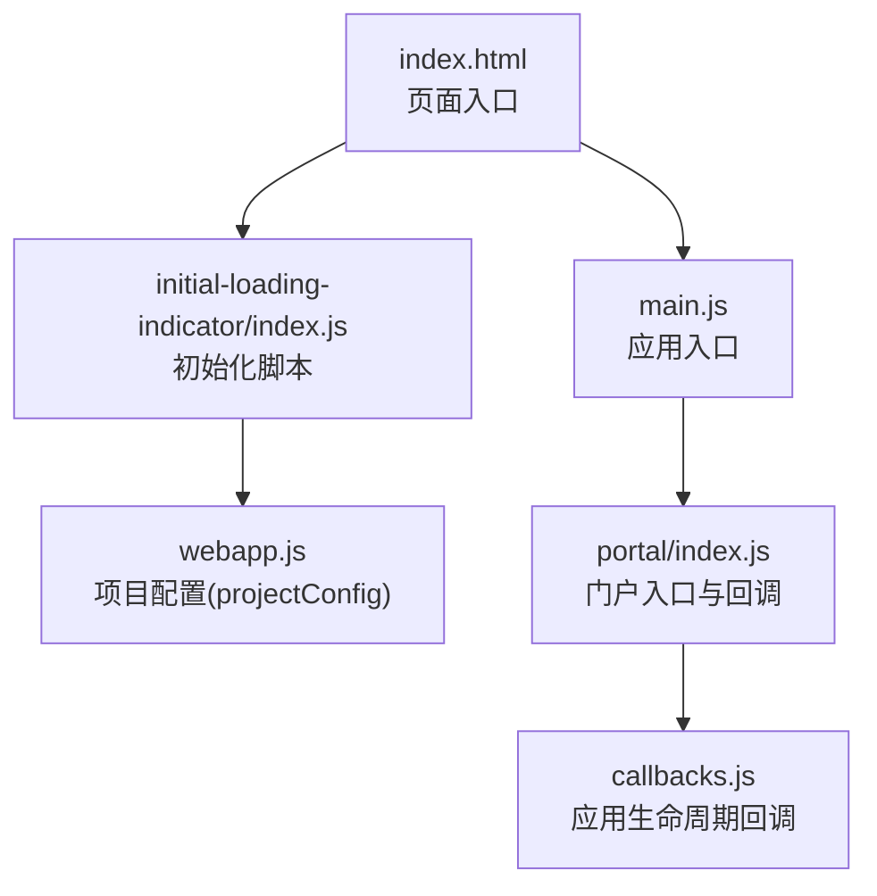
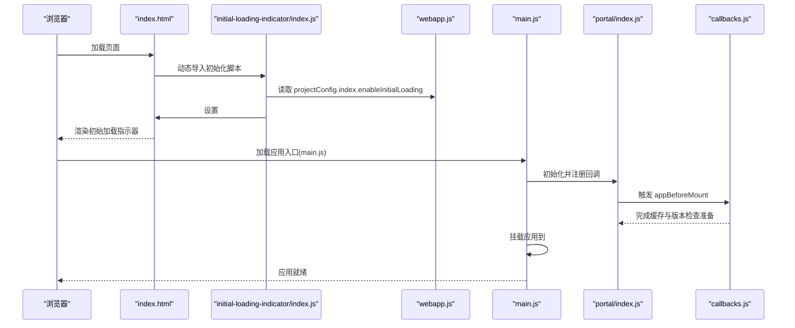
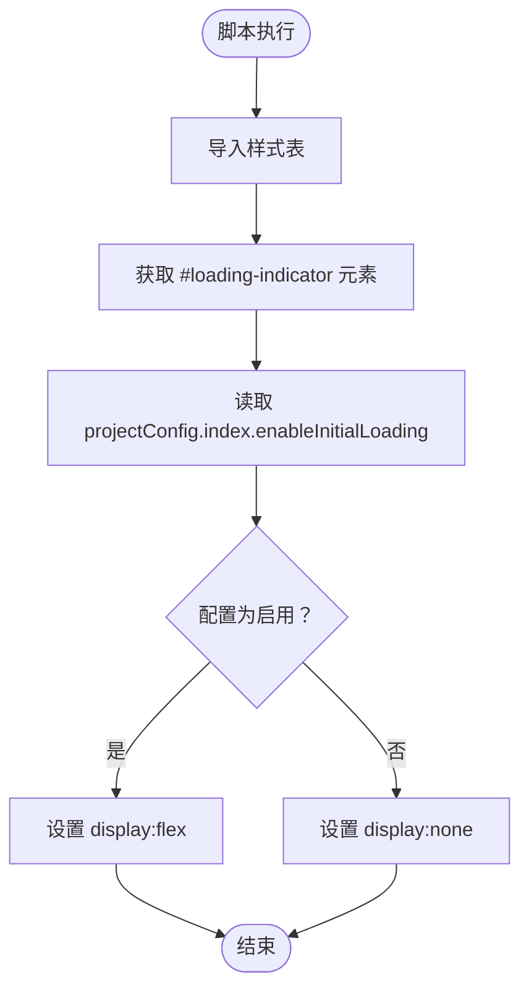
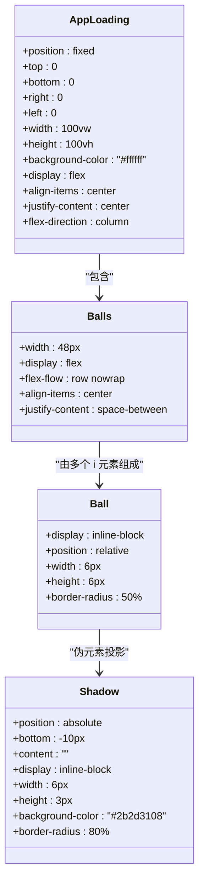
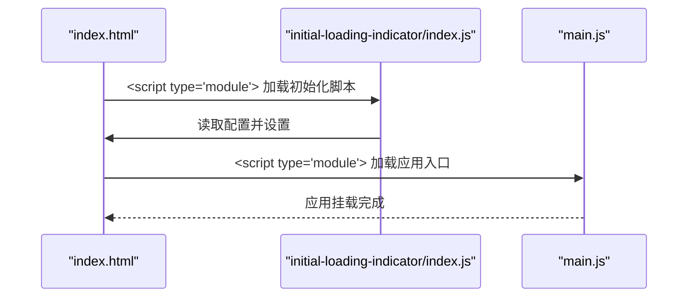
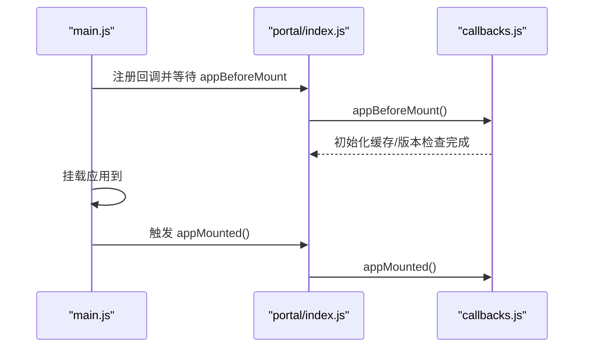
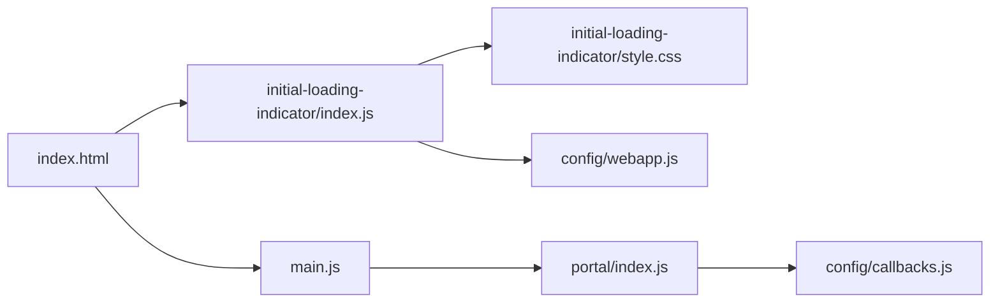

# 初始加载指示器

<cite>
**本文引用的文件**
- [index.html](file://index.html)
- [index.js](file://src/portal/modules/initial-loading-indicator/index.js)
- [style.css](file://src/portal/modules/initial-loading-indicator/style.css)
- [webapp.js](file://src/config/webapp.js)
- [main.js](file://src/main.js)
- [index.js](file://src/portal/index.js)
- [callbacks.js](file://src/config/callbacks.js)
- [use-utils.js](file://src/portal/hooks/use-utils.js)
</cite>

## 目录
1. [简介](#简介)
2. [项目结构](#项目结构)
3. [核心组件](#核心组件)
4. [架构总览](#架构总览)
5. [详细组件分析](#详细组件分析)
6. [依赖关系分析](#依赖关系分析)
7. [性能考量](#性能考量)
8. [故障排查指南](#故障排查指南)
9. [结论](#结论)
10. [附录](#附录)

## 简介
本技术文档围绕 FS-AOI-WEB 的“初始加载指示器”模块展开，系统性阐述其设计理念、实现方案与最佳实践。该模块在应用启动初期提供视觉反馈，通过可配置的显示策略与可定制的样式，提升首屏加载阶段的用户体验。文档将重点覆盖以下方面：
- 初始化流程与控制逻辑
- 样式规则与主题适配方法
- 显示时机与隐藏策略
- 配置参数与集成方式
- 自定义样式指南与常见问题排查

## 项目结构
初始加载指示器位于门户模块目录下，与入口 HTML、应用入口脚本以及全局配置共同构成完整的启动链路。

图表来源
- [index.html](file://index.html#L1-L31)
- [index.js](file://src/portal/modules/initial-loading-indicator/index.js#L1-L14)
- [webapp.js](file://src/config/webapp.js#L185-L187)
- [main.js](file://src/main.js#L1-L40)
- [index.js](file://src/portal/index.js#L109-L150)
- [callbacks.js](file://src/config/callbacks.js#L15-L46)

章节来源
- [index.html](file://index.html#L1-L31)
- [index.js](file://src/portal/modules/initial-loading-indicator/index.js#L1-L14)
- [webapp.js](file://src/config/webapp.js#L185-L187)
- [main.js](file://src/main.js#L1-L40)
- [index.js](file://src/portal/index.js#L109-L150)
- [callbacks.js](file://src/config/callbacks.js#L15-L46)

## 核心组件
- 初始加载指示器脚本：负责读取配置并控制指示器元素的显示/隐藏。
- 样式表：定义指示器的布局、动画与视觉风格。
- 入口 HTML：挂载指示器 DOM 并按顺序加载初始化脚本与应用入口。
- 项目配置：提供开关项 enableInitialLoading 控制是否显示。
- 应用入口与回调：在应用挂载前后触发相关逻辑，影响指示器的可见性与过渡体验。

章节来源
- [index.js](file://src/portal/modules/initial-loading-indicator/index.js#L1-L14)
- [style.css](file://src/portal/modules/initial-loading-indicator/style.css#L1-L88)
- [index.html](file://index.html#L12-L29)
- [webapp.js](file://src/config/webapp.js#L185-L187)
- [main.js](file://src/main.js#L35-L39)
- [index.js](file://src/portal/index.js#L109-L150)

## 架构总览
初始加载指示器的启动链路如下：

图表来源
- [index.html](file://index.html#L12-L29)
- [index.js](file://src/portal/modules/initial-loading-indicator/index.js#L1-L14)
- [webapp.js](file://src/config/webapp.js#L185-L187)
- [main.js](file://src/main.js#L35-L39)
- [index.js](file://src/portal/index.js#L109-L150)
- [callbacks.js](file://src/config/callbacks.js#L15-L46)

## 详细组件分析

### 初始化脚本（index.js）
职责与行为
- 导入样式表以确保指示器具备正确的视觉表现。
- 从全局配置读取开关项，决定是否显示指示器。
- 通过修改 DOM 元素的 display 属性实现显隐控制。

关键点
- 依赖于全局配置对象中的开关项，便于在不同环境或场景下灵活控制。
- 仅进行最小化的 DOM 操作，避免阻塞主线程。

图表来源
- [index.js](file://src/portal/modules/initial-loading-indicator/index.js#L1-L14)
- [webapp.js](file://src/config/webapp.js#L185-L187)

章节来源
- [index.js](file://src/portal/modules/initial-loading-indicator/index.js#L1-L14)
- [webapp.js](file://src/config/webapp.js#L185-L187)

### 样式表（style.css）
设计要点
- 布局：采用全屏固定定位，垂直居中，列向排列，保证在任何分辨率下均能覆盖全屏。
- 图标与动画：包含品牌图标占位与一组带阴影投影的小球，小球通过不同动画方向与渐变色形成动感。
- 动画：左右两侧小球分别使用不同的旋转动画，配合交替的缓动曲线，营造自然的摆动感。
- 可扩展性：通过类名与伪元素分离视觉与交互，便于主题化与局部替换。

图表来源
- [style.css](file://src/portal/modules/initial-loading-indicator/style.css#L1-L88)

章节来源
- [style.css](file://src/portal/modules/initial-loading-indicator/style.css#L1-L88)

### 入口 HTML（index.html）
职责与行为
- 在页面中预留指示器容器，并将其初始状态设为隐藏。
- 通过模块脚本顺序加载：先加载初始加载指示器脚本，再加载应用入口脚本，确保指示器在应用挂载前生效。

图表来源
- [index.html](file://index.html#L12-L29)
- [index.js](file://src/portal/modules/initial-loading-indicator/index.js#L1-L14)
- [main.js](file://src/main.js#L35-L39)

章节来源
- [index.html](file://index.html#L12-L29)

### 项目配置（webapp.js）
关键配置项
- index.enableInitialLoading：布尔开关，控制是否显示初始加载指示器。
- 默认值：未启用（false），可在部署或开发环境中按需开启。

集成建议
- 在开发环境或网络较慢场景下可临时启用，以改善用户感知。
- 生产环境建议保持默认，避免不必要的视觉干扰。

章节来源
- [webapp.js](file://src/config/webapp.js#L185-L187)

### 应用入口与回调（main.js、portal/index.js、callbacks.js）
- 应用入口：在挂载前通过回调机制完成必要的初始化工作。
- 门户入口：提供统一的回调映射，确保多异步任务并行完成后再进入挂载阶段。
- 回调机制：在 appBeforeMount 中完成缓存与版本检查等准备工作；在 appMounted 中进行版本校验与定时任务清理。

图表来源
- [main.js](file://src/main.js#L35-L39)
- [index.js](file://src/portal/index.js#L109-L150)
- [callbacks.js](file://src/config/callbacks.js#L15-L46)

章节来源
- [main.js](file://src/main.js#L35-L39)
- [index.js](file://src/portal/index.js#L109-L150)
- [callbacks.js](file://src/config/callbacks.js#L15-L46)

## 依赖关系分析
- 模块内聚：初始化脚本仅依赖全局配置与本地样式，内聚性强，耦合度低。
- 外部依赖：样式表无外部依赖，纯 CSS 实现；脚本依赖全局配置对象。
- 生命周期耦合：指示器的显示与应用挂载存在时间上的先后关系，但无强耦合逻辑，可通过配置灵活调整。

图表来源
- [index.js](file://src/portal/modules/initial-loading-indicator/index.js#L1-L14)
- [style.css](file://src/portal/modules/initial-loading-indicator/style.css#L1-L88)
- [webapp.js](file://src/config/webapp.js#L185-L187)
- [index.html](file://index.html#L12-L29)
- [main.js](file://src/main.js#L35-L39)
- [index.js](file://src/portal/index.js#L109-L150)
- [callbacks.js](file://src/config/callbacks.js#L15-L46)

章节来源
- [index.js](file://src/portal/modules/initial-loading-indicator/index.js#L1-L14)
- [style.css](file://src/portal/modules/initial-loading-indicator/style.css#L1-L88)
- [webapp.js](file://src/config/webapp.js#L185-L187)
- [index.html](file://index.html#L12-L29)
- [main.js](file://src/main.js#L35-L39)
- [index.js](file://src/portal/index.js#L109-L150)
- [callbacks.js](file://src/config/callbacks.js#L15-L46)

## 性能考量
- 脚本体积：初始化脚本极小，仅做显隐控制，对首屏加载影响可忽略。
- 样式渲染：动画基于 CSS，尽量使用 GPU 加速友好的属性，减少主线程压力。
- 加载时机：通过入口 HTML 的顺序加载，确保指示器在应用挂载前出现，避免白屏感知。
- 配置驱动：通过开关项控制显示，避免在生产环境引入不必要的视觉开销。

## 故障排查指南
常见问题与解决思路
- 指示器未显示
  - 检查配置项是否启用：确认项目配置中的开关已设为启用。
  - 检查 DOM 是否存在：确认页面中存在对应 ID 的容器。
  - 检查脚本加载顺序：确保初始化脚本在应用入口之前加载。
- 指示器一直显示
  - 检查应用挂载流程：确认应用入口脚本已成功挂载，避免阻塞导致挂载失败。
  - 检查回调逻辑：确认回调已完成，应用进入挂载阶段。
- 样式异常
  - 检查样式表是否正确导入：确认初始化脚本已导入样式文件。
  - 检查主题覆盖：若存在主题覆盖，确认未意外重置关键样式。

章节来源
- [index.js](file://src/portal/modules/initial-loading-indicator/index.js#L1-L14)
- [style.css](file://src/portal/modules/initial-loading-indicator/style.css#L1-L88)
- [webapp.js](file://src/config/webapp.js#L185-L187)
- [index.html](file://index.html#L12-L29)
- [main.js](file://src/main.js#L35-L39)
- [index.js](file://src/portal/index.js#L109-L150)
- [callbacks.js](file://src/config/callbacks.js#L15-L46)

## 结论
初始加载指示器模块通过简洁的脚本与独立的样式，实现了对应用启动阶段的可视化反馈。其核心优势在于：
- 配置驱动的显示策略，便于在不同环境灵活启用/禁用。
- 独立的样式体系，易于主题化与定制。
- 与应用入口与回调机制协同，确保在合适的时间点呈现与消失。

建议在开发与测试环境启用该指示器以提升感知质量，在生产环境保持默认以避免冗余开销。

## 附录

### 配置示例
- 启用初始加载指示器
  - 在项目配置中将开关项设为启用，以便在启动阶段显示指示器。
- 禁用初始加载指示器
  - 将开关项设为禁用，适合性能敏感或已内置其他加载反馈的场景。

章节来源
- [webapp.js](file://src/config/webapp.js#L185-L187)

### 自定义样式指南
- 调整尺寸与间距
  - 修改容器尺寸与内边距，适配不同设备与布局需求。
- 更换动画与颜色
  - 替换小球的颜色梯度与动画参数，形成品牌化动效。
- 背景与图标
  - 调整背景色与图标尺寸，确保在深色/浅色主题下均清晰可见。

章节来源
- [style.css](file://src/portal/modules/initial-loading-indicator/style.css#L1-L88)

### 集成方法
- 在入口 HTML 中保留指示器容器与初始化脚本的加载顺序。
- 在应用入口脚本中确保回调完成后才挂载应用，避免指示器过早消失。
- 如需在特定页面或条件下启用，可通过项目配置的开关项进行控制。

章节来源
- [index.html](file://index.html#L12-L29)
- [index.js](file://src/portal/modules/initial-loading-indicator/index.js#L1-L14)
- [main.js](file://src/main.js#L35-L39)
- [index.js](file://src/portal/index.js#L109-L150)