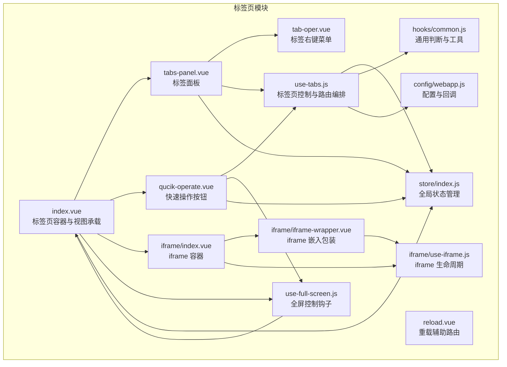
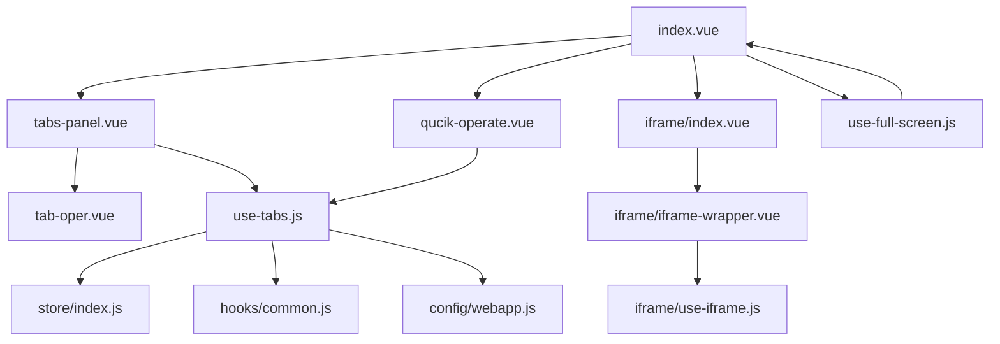
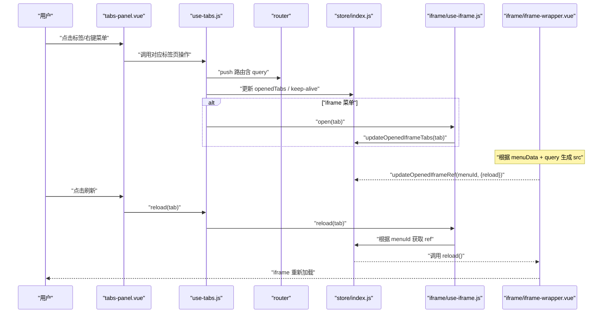
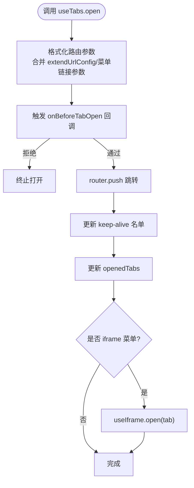
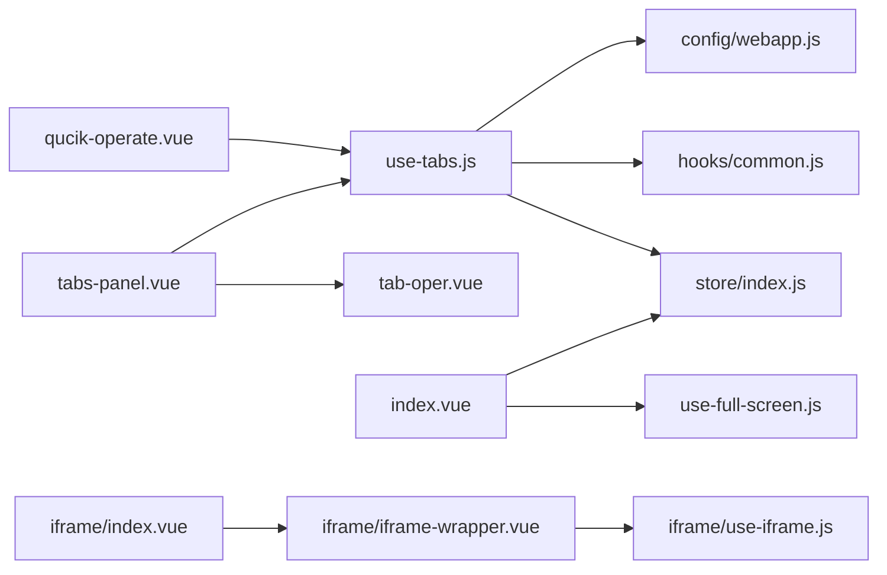

# 标签页模块

<cite>
**本文引用的文件**
- [index.vue](file://src/portal/modules/tabs/index.vue)
- [use-tabs.js](file://src/portal/modules/tabs/use-tabs.js)
- [use-full-screen.js](file://src/portal/modules/tabs/use-full-screen.js)
- [tabs-panel.vue](file://src/portal/modules/tabs/tabs-panel.vue)
- [tab-oper.vue](file://src/portal/modules/tabs/tab-oper.vue)
- [qucik-operate.vue](file://src/portal/modules/tabs/qucik-operate.vue)
- [reload.vue](file://src/portal/modules/tabs/reload.vue)
- [iframe/index.vue](file://src/portal/modules/tabs/iframe/index.vue)
- [iframe/iframe-wrapper.vue](file://src/portal/modules/tabs/iframe/iframe-wrapper.vue)
- [iframe/use-iframe.js](file://src/portal/modules/tabs/iframe/use-iframe.js)
- [store/index.js](file://src/portal/store/index.js)
- [hooks/common.js](file://src/portal/hooks/common.js)
- [config/webapp.js](file://src/config/webapp.js)
- [config/callbacks.js](file://src/config/callbacks.js)
</cite>

## 目录
1. [简介](#简介)
2. [项目结构](#项目结构)
3. [核心组件](#核心组件)
4. [架构总览](#架构总览)
5. [组件详解](#组件详解)
6. [依赖关系分析](#依赖关系分析)
7. [性能与可用性](#性能与可用性)
8. [故障排查指南](#故障排查指南)
9. [结论](#结论)
10. [附录](#附录)

## 简介
本技术文档面向 FS-AOI-WEB 的标签页模块，系统性阐述其架构设计与实现细节，覆盖基础标签页组件、操作面板、快速操作按钮、重新加载流程、iframe 集成方案、生命周期管理、标签页增删改查、拖拽排序、缓存与状态持久化等关键能力，并提供 API 接口说明、配置项与使用示例，帮助开发者构建灵活高效的多标签页工作环境。

## 项目结构
标签页模块位于门户应用的 tabs 子模块中，包含基础容器、标签面板、操作面板、iframe 集成以及相关钩子与 store 状态管理。整体采用“容器 + 面板 + 钩子 + store”的分层组织方式，便于扩展与维护。

图表来源
- [index.vue](file://src/portal/modules/tabs/index.vue#L1-L173)
- [tabs-panel.vue](file://src/portal/modules/tabs/tabs-panel.vue#L1-L381)
- [tab-oper.vue](file://src/portal/modules/tabs/tab-oper.vue#L1-L114)
- [qucik-operate.vue](file://src/portal/modules/tabs/qucik-operate.vue#L1-L129)
- [reload.vue](file://src/portal/modules/tabs/reload.vue#L1-L20)
- [iframe/index.vue](file://src/portal/modules/tabs/iframe/index.vue#L1-L21)
- [iframe/iframe-wrapper.vue](file://src/portal/modules/tabs/iframe/iframe-wrapper.vue#L1-L110)
- [iframe/use-iframe.js](file://src/portal/modules/tabs/iframe/use-iframe.js#L1-L16)
- [use-tabs.js](file://src/portal/modules/tabs/use-tabs.js#L1-L597)
- [use-full-screen.js](file://src/portal/modules/tabs/use-full-screen.js#L1-L84)
- [store/index.js](file://src/portal/store/index.js#L1-L226)
- [hooks/common.js](file://src/portal/hooks/common.js#L1-L81)
- [config/webapp.js](file://src/config/webapp.js#L1-L254)

章节来源
- [index.vue](file://src/portal/modules/tabs/index.vue#L1-L173)
- [use-tabs.js](file://src/portal/modules/tabs/use-tabs.js#L1-L597)
- [use-full-screen.js](file://src/portal/modules/tabs/use-full-screen.js#L1-L84)
- [tabs-panel.vue](file://src/portal/modules/tabs/tabs-panel.vue#L1-L381)
- [tab-oper.vue](file://src/portal/modules/tabs/tab-oper.vue#L1-L114)
- [qucik-operate.vue](file://src/portal/modules/tabs/qucik-operate.vue#L1-L129)
- [reload.vue](file://src/portal/modules/tabs/reload.vue#L1-L20)
- [iframe/index.vue](file://src/portal/modules/tabs/iframe/index.vue#L1-L21)
- [iframe/iframe-wrapper.vue](file://src/portal/modules/tabs/iframe/iframe-wrapper.vue#L1-L110)
- [iframe/use-iframe.js](file://src/portal/modules/tabs/iframe/use-iframe.js#L1-L16)
- [store/index.js](file://src/portal/store/index.js#L1-L226)
- [hooks/common.js](file://src/portal/hooks/common.js#L1-L81)
- [config/webapp.js](file://src/config/webapp.js#L1-L254)

## 核心组件
- 标签页容器与视图承载：负责渲染标签面板、视图滚动区域、iframe 容器、全屏控制与加载态。
- 标签面板：基于 Element Plus Tabs 实现，支持右键菜单、点击切换、禁用关闭等。
- 快速操作按钮：提供刷新、全屏、更多操作入口。
- 重载辅助路由：通过中间路由实现“先跳转再回退”的重载策略。
- iframe 集成：iframe 容器、包装组件与生命周期钩子，统一管理 iframe 地址格式化、加载与刷新。
- 标签页控制钩子：use-tabs.js 提供 open/reload/close 等核心 API，编排路由与状态。
- 全屏控制钩子：use-full-screen.js 提供全屏开关与动画过渡。
- 全局状态：store/index.js 统一维护 openedTabs、openedIframeTabs、keep-alive 名单等。

章节来源
- [index.vue](file://src/portal/modules/tabs/index.vue#L1-L173)
- [tabs-panel.vue](file://src/portal/modules/tabs/tabs-panel.vue#L1-L381)
- [qucik-operate.vue](file://src/portal/modules/tabs/qucik-operate.vue#L1-L129)
- [reload.vue](file://src/portal/modules/tabs/reload.vue#L1-L20)
- [iframe/index.vue](file://src/portal/modules/tabs/iframe/index.vue#L1-L21)
- [iframe/iframe-wrapper.vue](file://src/portal/modules/tabs/iframe/iframe-wrapper.vue#L1-L110)
- [iframe/use-iframe.js](file://src/portal/modules/tabs/iframe/use-iframe.js#L1-L16)
- [use-tabs.js](file://src/portal/modules/tabs/use-tabs.js#L1-L597)
- [use-full-screen.js](file://src/portal/modules/tabs/use-full-screen.js#L1-L84)
- [store/index.js](file://src/portal/store/index.js#L1-L226)

## 架构总览
标签页模块以“容器 + 面板 + 钩子 + store”为核心，形成清晰的职责边界：

- 容器层：index.vue 负责布局、滚动、iframe 容器、全屏控制与视图包裹。
- 面板层：tabs-panel.vue 负责标签渲染与交互；tab-oper.vue 提供右键菜单；qucik-operate.vue 提供顶部快捷操作。
- 控制层：use-tabs.js 编排路由、菜单链、回调、keep-alive 与 iframe 生命周期；use-full-screen.js 管理全屏状态与动画。
- 集成层：iframe/index.vue 与 iframe/iframe-wrapper.vue 统一 iframe 渲染与刷新；iframe/use-iframe.js 提供统一的生命周期调用。
- 状态层：store/index.js 维护 openedTabs、openedIframeTabs、keep-alive 名单、iframe 引用等。

图表来源
- [index.vue](file://src/portal/modules/tabs/index.vue#L1-L173)
- [tabs-panel.vue](file://src/portal/modules/tabs/tabs-panel.vue#L1-L381)
- [tab-oper.vue](file://src/portal/modules/tabs/tab-oper.vue#L1-L114)
- [qucik-operate.vue](file://src/portal/modules/tabs/qucik-operate.vue#L1-L129)
- [iframe/index.vue](file://src/portal/modules/tabs/iframe/index.vue#L1-L21)
- [iframe/iframe-wrapper.vue](file://src/portal/modules/tabs/iframe/iframe-wrapper.vue#L1-L110)
- [iframe/use-iframe.js](file://src/portal/modules/tabs/iframe/use-iframe.js#L1-L16)
- [use-tabs.js](file://src/portal/modules/tabs/use-tabs.js#L1-L597)
- [use-full-screen.js](file://src/portal/modules/tabs/use-full-screen.js#L1-L84)
- [store/index.js](file://src/portal/store/index.js#L1-L226)
- [hooks/common.js](file://src/portal/hooks/common.js#L1-L81)
- [config/webapp.js](file://src/config/webapp.js#L1-L254)

## 组件详解

### 基础容器与视图承载（index.vue）
- 功能要点
  - 条件渲染标签面板与视图滚动区域。
  - 使用 keep-alive 包裹 router-view，结合 store.openedTabsKeepAlive 实现缓存。
  - 条件渲染 iframe 容器与全屏按钮。
  - 封装视图包裹器，按是否 iframe 动态设置类名，避免内嵌 iframe 的 padding 影响布局。
  - 全屏模式下固定定位与背景色覆盖，适配 iframe 全屏场景。
- 关键点
  - 视图包裹器通过动态组件映射，确保 iframe 与普通路由视图的统一容器结构。
  - 全屏状态由 use-full-screen.js 提供，支持动画过渡。

章节来源
- [index.vue](file://src/portal/modules/tabs/index.vue#L1-L173)
- [use-full-screen.js](file://src/portal/modules/tabs/use-full-screen.js#L1-L84)
- [hooks/common.js](file://src/portal/hooks/common.js#L1-L81)
- [store/index.js](file://src/portal/store/index.js#L1-L226)

### 标签面板与右键菜单（tabs-panel.vue、tab-oper.vue）
- 功能要点
  - 基于 Element Plus Tabs 渲染标签，支持禁用关闭、动态样式与预版本样式。
  - 右键弹出菜单，支持刷新、关闭、关闭左侧、右侧、其他、全部等命令。
  - 通过 provide/inject 注入事件，tab-oper.vue 仅负责菜单项与交互。
  - 监听路由变化，自动同步当前激活标签。
- 交互流程
  - 用户点击标签或右键菜单触发 use-tabs.js 中对应方法。
  - 右键菜单通过注入的 handleCommand 分发至 use-tabs.js。

章节来源
- [tabs-panel.vue](file://src/portal/modules/tabs/tabs-panel.vue#L1-L381)
- [tab-oper.vue](file://src/portal/modules/tabs/tab-oper.vue#L1-L114)
- [use-tabs.js](file://src/portal/modules/tabs/use-tabs.js#L1-L597)
- [store/index.js](file://src/portal/store/index.js#L1-L226)

### 快速操作按钮（qucik-operate.vue）
- 功能要点
  - 提供刷新、全屏、更多操作三个入口。
  - 更多操作弹出菜单，与右键菜单一致的命令集。
  - 与 use-full-screen.js 协作，实现全屏切换。
- 与面板的关系
  - 通过注入事件与 use-tabs.js 交互，实现与面板一致的操作语义。

章节来源
- [qucik-operate.vue](file://src/portal/modules/tabs/qucik-operate.vue#L1-L129)
- [use-full-screen.js](file://src/portal/modules/tabs/use-full-screen.js#L1-L84)
- [use-tabs.js](file://src/portal/modules/tabs/use-tabs.js#L1-L597)

### 重载辅助路由（reload.vue）
- 功能要点
  - 作为中间路由，接收 _backToMenuId 参数并回退到目标标签页。
  - 通过 nextTick 在下一帧完成 open 操作，保证路由稳定。
- 设计动机
  - 避免直接 replace 导致的路由栈问题，通过“跳转 -> 回退”的方式实现稳定重载。

章节来源
- [reload.vue](file://src/portal/modules/tabs/reload.vue#L1-L20)
- [use-tabs.js](file://src/portal/modules/tabs/use-tabs.js#L1-L597)

### iframe 集成方案
- iframe 容器与包装
  - iframe/index.vue 渲染所有已打开的 iframe 标签，按 menuId 对应唯一 iframe-wrapper。
  - iframe/iframe-wrapper.vue 负责根据菜单与查询参数生成最终 src，支持 formatUrl 与 srcPrefix。
  - 加载完成后关闭 tabsLoading，提供 reload 方法触发 contentWindow.location.reload(true)。
- 生命周期管理
  - iframe/use-iframe.js 统一暴露 open/close/reload，内部通过 store.openedIframeRefs 与 store.openedIframeTabs 管理。
  - store/index.js 维护 openedIframeTabs、openedIframeRefs、keep-alive 名单等。
- 地址格式化
  - config/webapp.js 的 projectConfig.iframe.formatUrl 支持多种协议与前缀拼接，兼容不同系统基座。

图表来源
- [tabs-panel.vue](file://src/portal/modules/tabs/tabs-panel.vue#L1-L381)
- [use-tabs.js](file://src/portal/modules/tabs/use-tabs.js#L1-L597)
- [store/index.js](file://src/portal/store/index.js#L1-L226)
- [iframe/use-iframe.js](file://src/portal/modules/tabs/iframe/use-iframe.js#L1-L16)
- [iframe/iframe-wrapper.vue](file://src/portal/modules/tabs/iframe/iframe-wrapper.vue#L1-L110)

章节来源
- [iframe/index.vue](file://src/portal/modules/tabs/iframe/index.vue#L1-L21)
- [iframe/iframe-wrapper.vue](file://src/portal/modules/tabs/iframe/iframe-wrapper.vue#L1-L110)
- [iframe/use-iframe.js](file://src/portal/modules/tabs/iframe/use-iframe.js#L1-L16)
- [store/index.js](file://src/portal/store/index.js#L1-L226)
- [config/webapp.js](file://src/config/webapp.js#L1-L254)

### 钩子函数：use-tabs.js
- 职责与能力
  - 菜单链解析与路由编排：根据 menuId 生成完整菜单链，自动补齐临时菜单。
  - 路由参数合并：合并 extendUrlConfig、menuLink 查询串与传入 query。
  - 打开标签：open(args) 支持字符串或对象，校验状态、回调、路由添加、keep-alive 更新、iframe 打开。
  - 重载标签：reload(tab) 支持当前或指定标签，必要时通过 reload.vue 实现安全回退。
  - 关闭标签：close/closeActive/closeOthers/closeLeft/closeRight/closeAll/clear/clearAll，支持回调与临时菜单清理。
  - 栈式模式：维护每个门户/卡片下的打开顺序，关闭后可回到上次打开的标签。
- 关键流程
  - open：格式化路由 -> 触发 onBeforeTabOpen/onTabOpened 回调 -> 更新 keep-alive 与 openedTabs -> iframe 打开。
  - reload：删除 keep-alive -> 若为当前标签则 push reload.vue -> 否则重新 open -> iframe reload。
  - close：删除 keep-alive 与 openedTabs -> 清理临时菜单 -> 计算下一个激活标签 -> iframe 关闭 -> 回调通知。

图表来源
- [use-tabs.js](file://src/portal/modules/tabs/use-tabs.js#L1-L597)
- [store/index.js](file://src/portal/store/index.js#L1-L226)
- [config/webapp.js](file://src/config/webapp.js#L1-L254)

章节来源
- [use-tabs.js](file://src/portal/modules/tabs/use-tabs.js#L1-L597)
- [store/index.js](file://src/portal/store/index.js#L1-L226)
- [config/webapp.js](file://src/config/webapp.js#L1-L254)

### 钩子函数：use-full-screen.js
- 职责与能力
  - 计算全屏按钮可见性：依据路由参数、当前标签是否可关闭、子系统模式等。
  - 计算动画起始位置：基于内容区与头部尺寸，计算初始 left/top/width/height。
  - 切换全屏状态：执行动画过渡，更新状态与样式。
- 与容器协作
  - index.vue 读取 showFullScreenBtn/fullScrrenStatus/animationStyle 并应用到布局与类名。

章节来源
- [use-full-screen.js](file://src/portal/modules/tabs/use-full-screen.js#L1-L84)
- [index.vue](file://src/portal/modules/tabs/index.vue#L1-L173)

### 全局状态：store/index.js
- 状态与动作
  - openedTabs：按 portalId/cardId 分组的标签页列表，支持更新/删除/keep-alive 维护。
  - openedIframeTabs/openedIframeRefs：iframe 标签页与其 DOM 引用，支持刷新标识与统一刷新。
  - tabsLoading/tabsLoadingText：标签页加载态与文案。
  - updateOpenedIframeTabs：对比 query 差异，触发刷新标识与同步 openedTabs。
  - updateOpenedIframeRef：注册 iframe 引用，供 use-iframe.js 调用。
- 设计要点
  - 通过分组键（cardId 或 portalId）隔离不同门户/卡片的标签页集合。
  - 过滤框架自动生成的 query 键，避免误判导致的重复刷新。

章节来源
- [store/index.js](file://src/portal/store/index.js#L1-L226)

### 通用工具与配置：hooks/common.js、config/webapp.js
- hooks/common.js
  - isIframeRoute/isInIframe：判断路由是否 iframe 类型与当前是否内嵌。
  - isPreVersionStyle：主题兼容旧版本样式。
- config/webapp.js
  - menuMap：菜单字段映射与类型枚举。
  - extendUrlConfig：门户级 URL 参数扩展。
  - tabsConfig：标签页最大数量、排除菜单、栈式模式等。
  - projectConfig.iframe.formatUrl/srcPrefix：iframe 地址格式化与前缀策略。
  - tabErrorTip：异常菜单提示文案。

章节来源
- [hooks/common.js](file://src/portal/hooks/common.js#L1-L81)
- [config/webapp.js](file://src/config/webapp.js#L1-L254)

## 依赖关系分析
- 组件耦合
  - tabs-panel.vue 与 tab-oper.vue 通过 provide/inject 解耦，降低面板与菜单的耦合度。
  - qucik-operate.vue 与 tabs-panel.vue 共享相同的事件分发机制，保证一致性。
  - index.vue 与 use-full-screen.js 通过返回值直接驱动 DOM 样式与类名。
- 外部依赖
  - Element Plus Tabs：标签面板渲染与交互。
  - Vue Router：路由跳转与中间路由 reload.vue。
  - Pinia Store：全局状态集中管理。
  - 项目配置与回调：webapp.js 与 callbacks.js 提供运行期行为扩展。

图表来源
- [tabs-panel.vue](file://src/portal/modules/tabs/tabs-panel.vue#L1-L381)
- [tab-oper.vue](file://src/portal/modules/tabs/tab-oper.vue#L1-L114)
- [qucik-operate.vue](file://src/portal/modules/tabs/qucik-operate.vue#L1-L129)
- [index.vue](file://src/portal/modules/tabs/index.vue#L1-L173)
- [use-full-screen.js](file://src/portal/modules/tabs/use-full-screen.js#L1-L84)
- [store/index.js](file://src/portal/store/index.js#L1-L226)
- [iframe/index.vue](file://src/portal/modules/tabs/iframe/index.vue#L1-L21)
- [iframe/iframe-wrapper.vue](file://src/portal/modules/tabs/iframe/iframe-wrapper.vue#L1-L110)
- [iframe/use-iframe.js](file://src/portal/modules/tabs/iframe/use-iframe.js#L1-L16)
- [use-tabs.js](file://src/portal/modules/tabs/use-tabs.js#L1-L597)
- [hooks/common.js](file://src/portal/hooks/common.js#L1-L81)
- [config/webapp.js](file://src/config/webapp.js#L1-L254)

## 性能与可用性
- 缓存与 keep-alive
  - 通过 store.openedTabsKeepAlive 与 keep-alive 结合，避免频繁销毁重建，提升切换性能。
- 懒加载与按需路由
  - 路由模式菜单通过 import.meta.glob 动态引入页面组件，减少首屏体积。
- iframe 加载优化
  - iframe 加载完成后再关闭 tabsLoading，避免闪烁；reload 时强制刷新缓存。
- 全屏动画
  - use-full-screen.js 采用定时器逐步调整 left/top/width/height，保证平滑过渡。
- 配置化扩展
  - projectConfig.iframe.formatUrl/srcPrefix 支持复杂基座与协议拼接，减少硬编码。

[本节为通用建议，无需列出具体文件来源]

## 故障排查指南
- 打开标签失败
  - 检查菜单状态与链接配置，查看 tabErrorTip 提示。
  - 确认路由是否存在，iframe 模式需确保 MENU_LINK 配置正确。
- 无法关闭标签
  - 检查标签是否被标记为不可关闭（unclosable），或是否强制关闭。
- iframe 无法刷新
  - 确认 store.openedIframeRefs 是否已注册，reload.vue 是否正确回退。
- 全屏按钮不显示
  - 检查路由参数（menuId/_fullScreen/unclosable）与子系统模式条件。
- 标签页过多
  - tabsConfig.maxNum 限制生效，可通过关闭其他或清理策略释放。

章节来源
- [use-tabs.js](file://src/portal/modules/tabs/use-tabs.js#L1-L597)
- [config/webapp.js](file://src/config/webapp.js#L1-L254)
- [store/index.js](file://src/portal/store/index.js#L1-L226)

## 结论
标签页模块通过清晰的分层设计与完善的生命周期管理，实现了从路由编排、状态持久化到 iframe 集成的一体化解决方案。配合丰富的配置项与回调扩展，能够满足复杂业务场景下的多标签页需求，具备良好的可维护性与可扩展性。

[本节为总结性内容，无需列出具体文件来源]

## 附录

### API 接口说明（use-tabs.js）
- open(args)
  - 功能：打开标签页，支持字符串 menuId 或对象参数。
  - 参数：menuId、query、params、component、hideTabPanel、unclosable、onClosed 等。
  - 返回：Promise，成功时返回菜单 ID。
- reload(tab)
  - 功能：重载指定标签页或当前标签页。
  - 参数：tab 可为字符串或标签对象。
- close(tab, options)
  - 功能：关闭标签页，支持强制关闭。
- closeActive(options)
  - 功能：关闭当前活动标签页。
- closeOthers(tab, options)
  - 功能：关闭除当前标签外的所有标签。
- closeLeft(tab, options)
  - 功能：关闭当前标签左侧所有标签。
- closeRight(tab, options)
  - 功能：关闭当前标签右侧所有标签。
- closeAll(tab, options)
  - 功能：关闭所有标签。
- clear(key, options)
  - 功能：按门户/卡片键清理标签。
- clearAll(options)
  - 功能：清理所有标签。

章节来源
- [use-tabs.js](file://src/portal/modules/tabs/use-tabs.js#L1-L597)

### 配置项与使用示例
- 项目配置（config/webapp.js）
  - projectConfig.iframe.formatUrl：自定义 iframe 地址格式化逻辑。
  - projectConfig.iframe.srcPrefix：iframe 地址前缀（支持函数或字符串）。
  - tabsConfig：标签页最大数量、排除菜单、栈式模式。
  - extendUrlConfig：门户级 URL 参数扩展。
- 使用示例
  - 打开标签：调用 useTabs.open({ menuId, query })。
  - 重载标签：调用 useTabs.reload(menuId)。
  - 关闭标签：调用 useTabs.close(menuId) 或 useTabs.closeActive()。
  - 全屏：通过 qucik-operate.vue 或 use-full-screen.js 切换。

章节来源
- [config/webapp.js](file://src/config/webapp.js#L1-L254)
- [use-tabs.js](file://src/portal/modules/tabs/use-tabs.js#L1-L597)
- [qucik-operate.vue](file://src/portal/modules/tabs/qucik-operate.vue#L1-L129)
- [use-full-screen.js](file://src/portal/modules/tabs/use-full-screen.js#L1-L84)