# 空模块

<cite>
**本文引用的文件**   
- [src/portal/modules/empty/index.vue](file://src/portal/modules/empty/index.vue)
- [src/portal/modules/tabs/use-tabs.js](file://src/portal/modules/tabs/use-tabs.js)
- [src/portal/modules/tabs/reload.vue](file://src/portal/modules/tabs/reload.vue)
- [src/portal/router/routes.js](file://src/portal/router/routes.js)
- [src/portal/modules/tabs/iframe/use-iframe.js](file://src/portal/modules/tabs/iframe/use-iframe.js)
- [src/portal/views/layout/use-portal.js](file://src/portal/views/layout/use-portal.js)
- [src/portal/hooks/use-menu.js](file://src/portal/hooks/use-menu.js)
- [src/config/services.js](file://src/config/services.js)
- [src/config/webapp.js](file://src/config/webapp.js)
- [src/pages/frame/workbench-views/apps/general-menu-view/menu-view.vue](file://src/pages/frame/workbench-views/apps/general-menu-view/menu-view.vue)
- [index.html](file://index.html)
</cite>

## 目录
1. [简介](#简介)
2. [项目结构](#项目结构)
3. [核心组件](#核心组件)
4. [架构总览](#架构总览)
5. [详细组件分析](#详细组件分析)
6. [依赖关系分析](#依赖关系分析)
7. [性能考量](#性能考量)
8. [故障排查指南](#故障排查指南)
9. [结论](#结论)
10. [附录](#附录)

## 简介
空模块是 FS-AOI-WEB 门户系统中的一个占位型路由组件，其设计目的是在特定业务流程中作为“占位”或“兜底”使用，例如当需要关闭最后一个标签页时回退到一个空内容的路由，避免出现空白或异常状态；同时在某些 iframe 嵌入场景下，当目标菜单尚未就绪或路由未注册时，可临时以空组件占位，保证导航链路稳定。

空模块本身不承载任何业务逻辑，仅提供最小化模板，确保路由系统正常运行，便于后续再打开真实页面。它与标签页管理、路由注册、菜单系统紧密协作，是门户系统在动态路由与菜单联动中的重要基础构件之一。

## 项目结构
空模块位于门户模块目录下，配合标签页模块、路由模块共同工作：
- 空模块组件：src/portal/modules/empty/index.vue
- 标签页管理：src/portal/modules/tabs/use-tabs.js
- 刷新中间态：src/portal/modules/tabs/reload.vue
- 路由注册：src/portal/router/routes.js
- iframe 打开/刷新/关闭：src/portal/modules/tabs/iframe/use-iframe.js
- 门户打开逻辑：src/portal/views/layout/use-portal.js
- 菜单数据获取：src/portal/hooks/use-menu.js
- 服务接口号配置：src/config/services.js
- 门户配置与入口：src/config/webapp.js
- 应用内 iframe 容器：src/pages/frame/workbench-views/apps/general-menu-view/menu-view.vue
- 应用入口 HTML：index.html

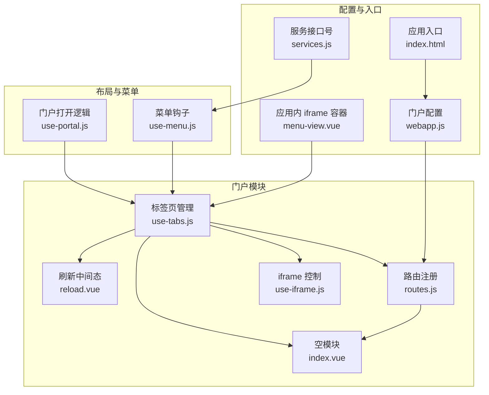

**图表来源**
- [src/portal/modules/empty/index.vue](file://src/portal/modules/empty/index.vue#L1-L4)
- [src/portal/modules/tabs/use-tabs.js](file://src/portal/modules/tabs/use-tabs.js#L1-L597)
- [src/portal/modules/tabs/reload.vue](file://src/portal/modules/tabs/reload.vue#L1-L20)
- [src/portal/router/routes.js](file://src/portal/router/routes.js#L1-L78)
- [src/portal/modules/tabs/iframe/use-iframe.js](file://src/portal/modules/tabs/iframe/use-iframe.js#L1-L15)
- [src/portal/views/layout/use-portal.js](file://src/portal/views/layout/use-portal.js#L1-L42)
- [src/portal/hooks/use-menu.js](file://src/portal/hooks/use-menu.js#L1-L42)
- [src/config/services.js](file://src/config/services.js#L1-L28)
- [src/config/webapp.js](file://src/config/webapp.js#L1-L36)
- [src/pages/frame/workbench-views/apps/general-menu-view/menu-view.vue](file://src/pages/frame/workbench-views/apps/general-menu-view/menu-view.vue#L1-L44)
- [index.html](file://index.html#L1-L31)

**章节来源**
- [src/portal/modules/empty/index.vue](file://src/portal/modules/empty/index.vue#L1-L4)
- [src/portal/router/routes.js](file://src/portal/router/routes.js#L1-L78)

## 核心组件
- 空模块组件：提供一个最小化的模板节点，作为占位路由组件使用。
- 标签页管理：负责根据菜单配置动态注册路由、打开/关闭/刷新标签页，并在必要时回退到空模块或刷新中间态。
- 路由注册：集中定义门户路由树及内置占位路由（如 empty）。
- iframe 控制：在 iframe 场景下，负责打开、刷新、关闭 iframe 标签页。
- 门户打开逻辑：根据菜单树与路由配置，完成门户初始化与页面跳转。
- 菜单钩子：从后端拉取菜单树与门户配置，供路由与标签页管理使用。
- 服务接口号：统一管理平台/门户相关服务接口号，支撑菜单与门户数据获取。
- 门户配置：门户顶层配置与 pages 目录扫描策略。
- 应用内 iframe 容器：在应用模式下，根据菜单类型选择直接加载 Vue 组件或 iframe 嵌入。
- 应用入口 HTML：应用启动与加载指示器挂载点。

**章节来源**
- [src/portal/modules/empty/index.vue](file://src/portal/modules/empty/index.vue#L1-L4)
- [src/portal/modules/tabs/use-tabs.js](file://src/portal/modules/tabs/use-tabs.js#L1-L597)
- [src/portal/router/routes.js](file://src/portal/router/routes.js#L1-L78)
- [src/portal/modules/tabs/iframe/use-iframe.js](file://src/portal/modules/tabs/iframe/use-iframe.js#L1-L15)
- [src/portal/views/layout/use-portal.js](file://src/portal/views/layout/use-portal.js#L1-L42)
- [src/portal/hooks/use-menu.js](file://src/portal/hooks/use-menu.js#L1-L42)
- [src/config/services.js](file://src/config/services.js#L1-L28)
- [src/config/webapp.js](file://src/config/webapp.js#L1-L36)
- [src/pages/frame/workbench-views/apps/general-menu-view/menu-view.vue](file://src/pages/frame/workbench-views/apps/general-menu-view/menu-view.vue#L1-L44)
- [index.html](file://index.html#L1-L31)

## 架构总览
空模块在门户系统中的作用主要体现在以下方面：
- 当关闭最后一个标签页时，自动回退到空模块，避免页面空白。
- 在 iframe 嵌入场景下，若目标菜单路由尚未注册，使用空组件占位，保证导航链路稳定。
- 与标签页刷新中间态配合，实现“先回退到空模块，再重新打开目标菜单”的平滑过渡。

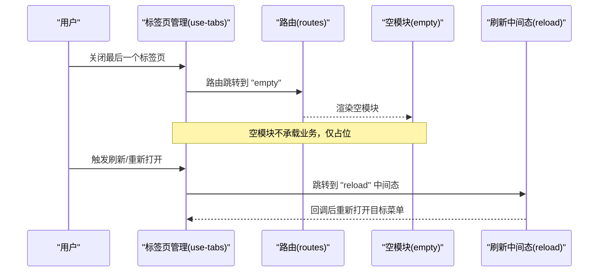

**图表来源**
- [src/portal/modules/tabs/use-tabs.js](file://src/portal/modules/tabs/use-tabs.js#L368-L459)
- [src/portal/modules/tabs/reload.vue](file://src/portal/modules/tabs/reload.vue#L1-L20)
- [src/portal/router/routes.js](file://src/portal/router/routes.js#L35-L47)

## 详细组件分析

### 空模块组件（index.vue）
- 设计目的：提供最小化模板，作为占位路由组件，确保路由系统可用且页面不会出现空白。
- 实现方式：模板中仅包含一个空的容器节点，不引入额外样式或逻辑。
- 使用场景：
  - 关闭最后一个标签页时的兜底路由。
  - iframe 嵌入场景下，路由未注册时的占位组件。
- 集成方式：在标签页管理中通过动态路由注册，或在路由表中显式声明。

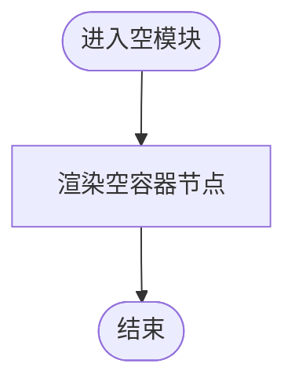

**图表来源**
- [src/portal/modules/empty/index.vue](file://src/portal/modules/empty/index.vue#L1-L4)

**章节来源**
- [src/portal/modules/empty/index.vue](file://src/portal/modules/empty/index.vue#L1-L4)

### 标签页管理（use-tabs.js）
- 动态路由注册：当菜单类型为 iframe 且路由未注册时，会向路由树动态添加一个使用空组件占位的路由。
- 关闭标签页策略：当关闭最后一个标签页时，路由跳转到“empty”，确保页面稳定。
- 刷新机制：通过“reload”中间态实现平滑刷新，先回退到空模块，再重新打开目标菜单。
- iframe 协同：在 iframe 场景下，关闭/刷新操作会同步到 iframe 引用实例。

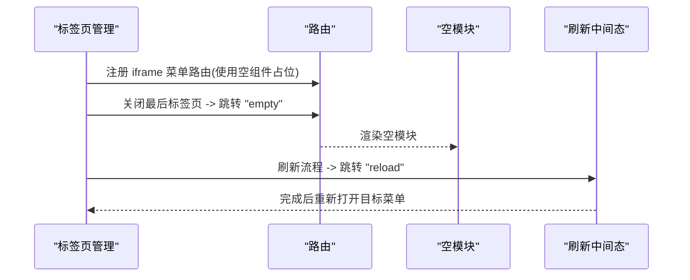

**图表来源**
- [src/portal/modules/tabs/use-tabs.js](file://src/portal/modules/tabs/use-tabs.js#L144-L164)
- [src/portal/modules/tabs/use-tabs.js](file://src/portal/modules/tabs/use-tabs.js#L444-L448)
- [src/portal/modules/tabs/use-tabs.js](file://src/portal/modules/tabs/use-tabs.js#L382-L395)
- [src/portal/modules/tabs/reload.vue](file://src/portal/modules/tabs/reload.vue#L1-L20)
- [src/portal/router/routes.js](file://src/portal/router/routes.js#L35-L47)

**章节来源**
- [src/portal/modules/tabs/use-tabs.js](file://src/portal/modules/tabs/use-tabs.js#L14-L164)
- [src/portal/modules/tabs/use-tabs.js](file://src/portal/modules/tabs/use-tabs.js#L368-L459)
- [src/portal/modules/tabs/reload.vue](file://src/portal/modules/tabs/reload.vue#L1-L20)
- [src/portal/router/routes.js](file://src/portal/router/routes.js#L35-L47)

### 路由注册（routes.js）
- 内置占位路由：显式注册“empty”路由，指向空模块组件。
- 动态路由扩展：在标签页管理中，针对 iframe 菜单动态添加路由，使用空组件占位。
- 门户路由树：基于门户配置与页面目录扫描生成路由树，支持多门户与多页面组合。

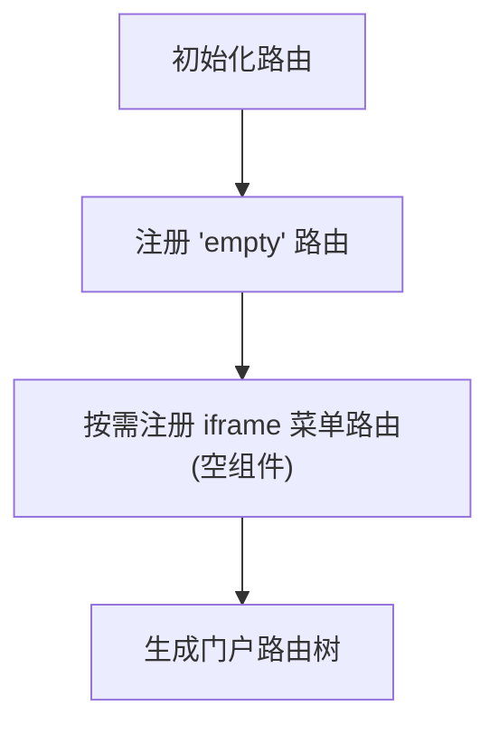

**图表来源**
- [src/portal/router/routes.js](file://src/portal/router/routes.js#L35-L47)
- [src/portal/modules/tabs/use-tabs.js](file://src/portal/modules/tabs/use-tabs.js#L157-L164)

**章节来源**
- [src/portal/router/routes.js](file://src/portal/router/routes.js#L1-L78)
- [src/portal/modules/tabs/use-tabs.js](file://src/portal/modules/tabs/use-tabs.js#L157-L164)

### iframe 控制（use-iframe.js）
- 打开/刷新/关闭：对 iframe 引用进行统一管理，确保在标签页关闭/刷新时同步执行对应操作。
- 与标签页联动：在关闭/刷新标签页时，若为 iframe 菜单，则调用 iframe 控制器执行相应动作。

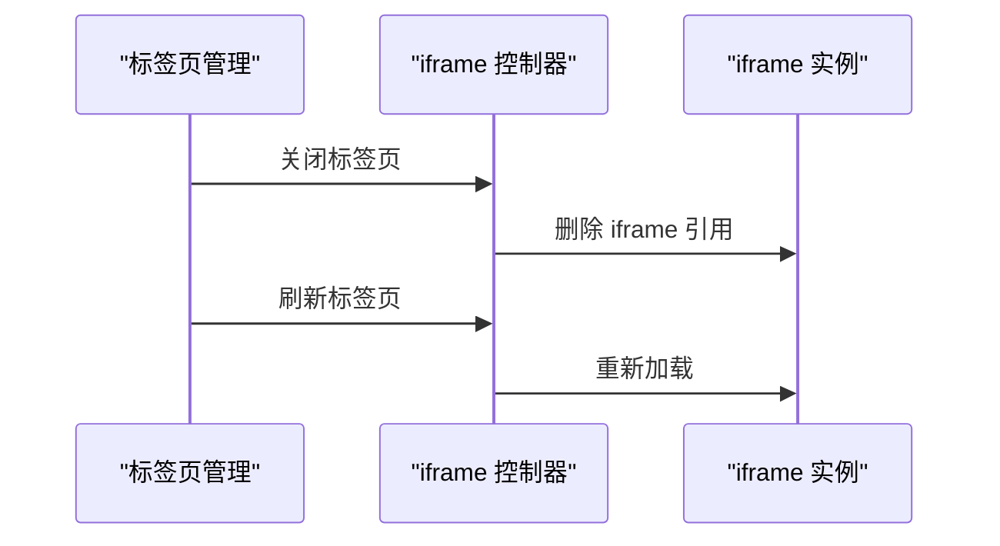

**图表来源**
- [src/portal/modules/tabs/iframe/use-iframe.js](file://src/portal/modules/tabs/iframe/use-iframe.js#L1-L15)
- [src/portal/modules/tabs/use-tabs.js](file://src/portal/modules/tabs/use-tabs.js#L392-L394)
- [src/portal/modules/tabs/use-tabs.js](file://src/portal/modules/tabs/use-tabs.js#L451-L453)

**章节来源**
- [src/portal/modules/tabs/iframe/use-iframe.js](file://src/portal/modules/tabs/iframe/use-iframe.js#L1-L15)
- [src/portal/modules/tabs/use-tabs.js](file://src/portal/modules/tabs/use-tabs.js#L392-L394)
- [src/portal/modules/tabs/use-tabs.js](file://src/portal/modules/tabs/use-tabs.js#L451-L453)

### 门户打开逻辑（use-portal.js）
- 路由跳转：根据菜单树与路由配置，完成门户初始化后的页面跳转。
- 查询参数解析：从菜单链接中提取查询参数，合并到路由 query 中。
- 错误提示：当路由不存在时，弹出提示框，提醒检查代码或菜单配置。

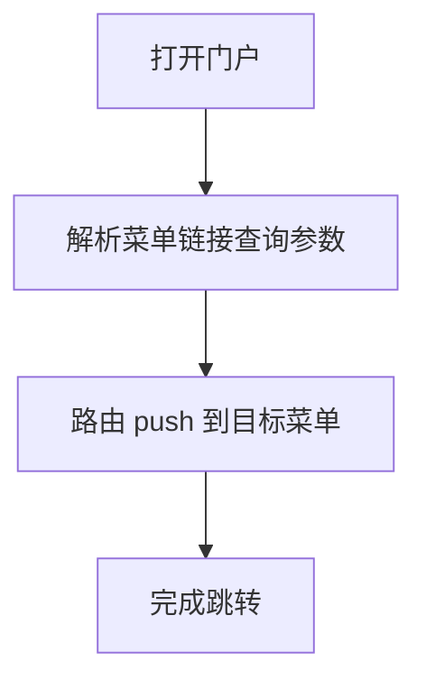

**图表来源**
- [src/portal/views/layout/use-portal.js](file://src/portal/views/layout/use-portal.js#L7-L39)

**章节来源**
- [src/portal/views/layout/use-portal.js](file://src/portal/views/layout/use-portal.js#L1-L42)

### 菜单钩子（use-menu.js）
- 门户与菜单数据：从后端服务获取门户与菜单数据，构建菜单树。
- 权限与参数：结合系统参数与权限标识，过滤与组装菜单。
- 与标签页联动：为标签页管理提供菜单数据源，决定是否为 iframe 菜单并动态注册路由。

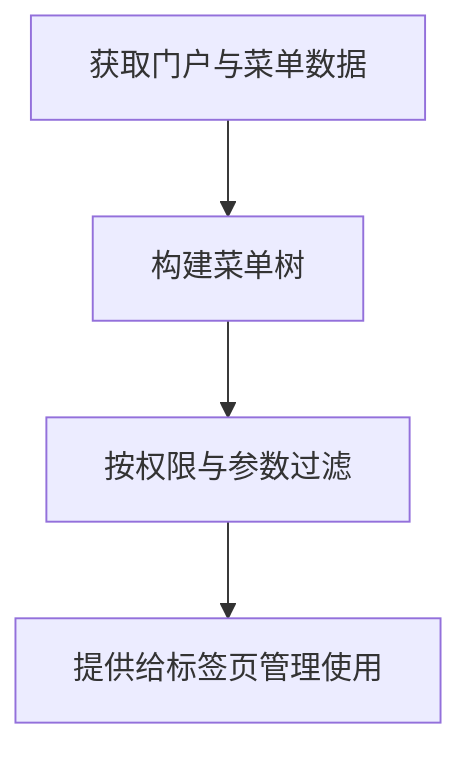

**图表来源**
- [src/portal/hooks/use-menu.js](file://src/portal/hooks/use-menu.js#L19-L42)

**章节来源**
- [src/portal/hooks/use-menu.js](file://src/portal/hooks/use-menu.js#L1-L42)

### 服务接口号与门户配置（services.js、webapp.js）
- 服务接口号：统一管理门户、菜单、字典、系统参数等服务接口号，支撑菜单与门户数据获取。
- 门户配置：门户顶层配置与 pages 目录扫描策略，简化前端复杂度，与后端配置解耦。

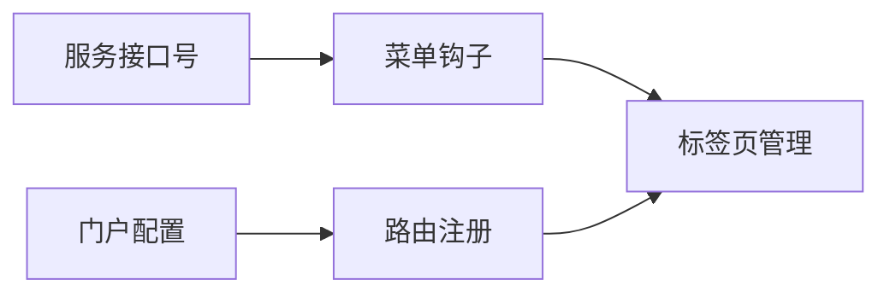

**图表来源**
- [src/config/services.js](file://src/config/services.js#L1-L28)
- [src/config/webapp.js](file://src/config/webapp.js#L25-L36)
- [src/portal/hooks/use-menu.js](file://src/portal/hooks/use-menu.js#L19-L42)
- [src/portal/router/routes.js](file://src/portal/router/routes.js#L1-L78)

**章节来源**
- [src/config/services.js](file://src/config/services.js#L1-L28)
- [src/config/webapp.js](file://src/config/webapp.js#L1-L36)

### 应用内 iframe 容器（menu-view.vue）
- 菜单类型判断：根据菜单类型选择直接加载 Vue 组件或 iframe 嵌入。
- 动态导入：通过 importAllPages 动态导入页面视图，支持菜单类型为 2 的场景。

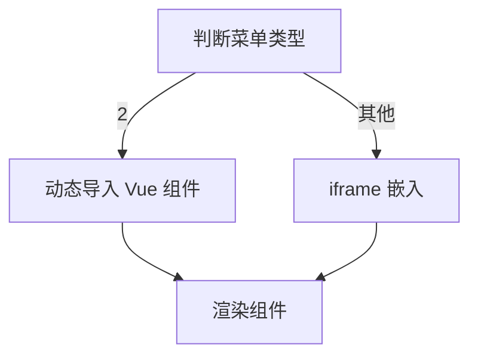

**图表来源**
- [src/pages/frame/workbench-views/apps/general-menu-view/menu-view.vue](file://src/pages/frame/workbench-views/apps/general-menu-view/menu-view.vue#L17-L26)

**章节来源**
- [src/pages/frame/workbench-views/apps/general-menu-view/menu-view.vue](file://src/pages/frame/workbench-views/apps/general-menu-view/menu-view.vue#L1-L44)

### 应用入口 HTML（index.html）
- 启动脚本：应用入口 HTML 加载初始加载指示器与主入口脚本。
- 加载体验：通过加载指示器提升首屏体验，空模块与路由系统协同保证页面稳定。

**章节来源**
- [index.html](file://index.html#L1-L31)

## 依赖关系分析
空模块与其周边组件的依赖关系如下：
- 空模块被标签页管理作为兜底路由使用。
- 路由注册模块显式注册“empty”路由。
- 标签页管理在 iframe 场景下动态注册空组件路由。
- 门户打开逻辑与菜单钩子为标签页管理提供数据与路由上下文。
- iframe 控制器与标签页管理协同，确保 iframe 场景下的关闭/刷新行为一致。

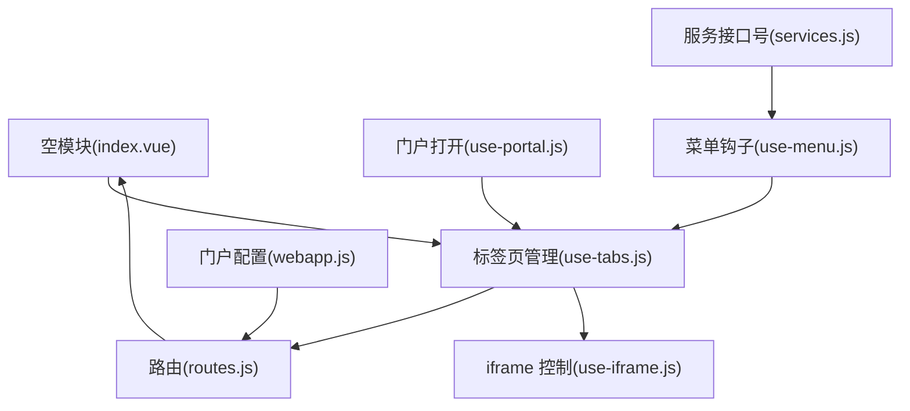

**图表来源**
- [src/portal/modules/empty/index.vue](file://src/portal/modules/empty/index.vue#L1-L4)
- [src/portal/modules/tabs/use-tabs.js](file://src/portal/modules/tabs/use-tabs.js#L1-L597)
- [src/portal/router/routes.js](file://src/portal/router/routes.js#L1-L78)
- [src/portal/modules/tabs/iframe/use-iframe.js](file://src/portal/modules/tabs/iframe/use-iframe.js#L1-L15)
- [src/portal/views/layout/use-portal.js](file://src/portal/views/layout/use-portal.js#L1-L42)
- [src/portal/hooks/use-menu.js](file://src/portal/hooks/use-menu.js#L1-L42)
- [src/config/services.js](file://src/config/services.js#L1-L28)
- [src/config/webapp.js](file://src/config/webapp.js#L1-L36)

**章节来源**
- [src/portal/modules/tabs/use-tabs.js](file://src/portal/modules/tabs/use-tabs.js#L1-L597)
- [src/portal/router/routes.js](file://src/portal/router/routes.js#L1-L78)

## 性能考量
- 最小化渲染：空模块仅包含一个空容器节点，渲染开销极低，适合在兜底场景使用。
- 动态路由注册：仅在需要时注册 iframe 菜单路由，减少不必要的路由数量。
- 刷新中间态：通过“reload”中间态实现平滑刷新，避免频繁重载导致的性能损耗。
- iframe 同步控制：在关闭/刷新标签页时同步操作 iframe 引用，避免资源泄漏。

[本节为通用建议，无需具体文件分析]

## 故障排查指南
- 路由跳转错误：当路由不存在时，门户打开逻辑会弹出提示框，提醒检查代码或菜单配置。
- 菜单类型判断：在 iframe 场景下，若菜单缺少链接或未正确配置，标签页管理会在格式化路由时给出警告。
- 关闭最后一个标签页：若关闭最后一个标签页后页面空白，检查是否正确跳转到“empty”路由。
- 刷新失败：若刷新流程异常，检查“reload”中间态与标签页管理的回调逻辑。

**章节来源**
- [src/portal/views/layout/use-portal.js](file://src/portal/views/layout/use-portal.js#L36-L38)
- [src/portal/modules/tabs/use-tabs.js](file://src/portal/modules/tabs/use-tabs.js#L147-L154)
- [src/portal/modules/tabs/use-tabs.js](file://src/portal/modules/tabs/use-tabs.js#L444-L448)

## 结论
空模块作为 FS-AOI-WEB 门户系统中的占位型组件，承担着兜底与稳定性保障的重要职责。它与标签页管理、路由注册、菜单系统、iframe 控制等模块紧密协作，在关闭最后一个标签页、iframe 嵌入场景以及刷新流程中发挥关键作用。通过最小化的实现与清晰的依赖关系，空模块提升了系统的健壮性与用户体验。

[本节为总结，无需具体文件分析]

## 附录
- 使用示例与最佳实践
  - 在需要关闭最后一个标签页时，确保路由跳转到“empty”，避免页面空白。
  - 在 iframe 嵌入场景下，若菜单路由尚未注册，优先使用空组件占位，待路由注册后再打开真实页面。
  - 刷新流程应通过“reload”中间态实现，保证刷新过程的平滑与一致性。
  - 对于动态菜单与路由，建议在标签页管理中统一处理，减少重复逻辑与潜在错误。

[本节为通用建议，无需具体文件分析]