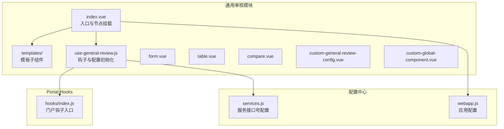
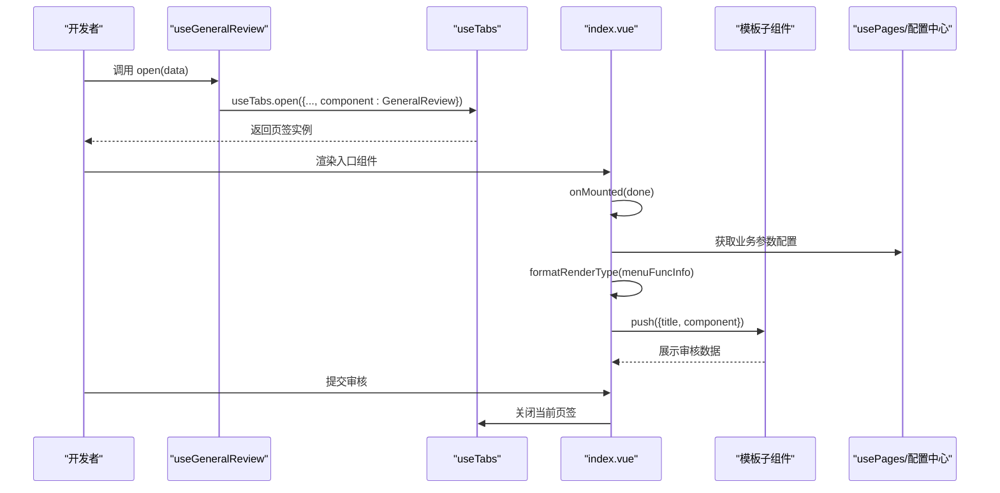
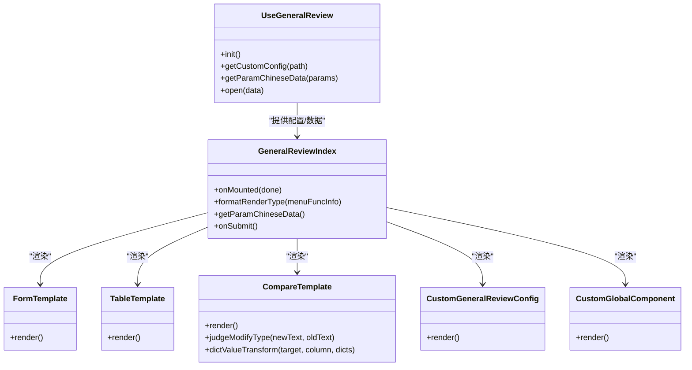
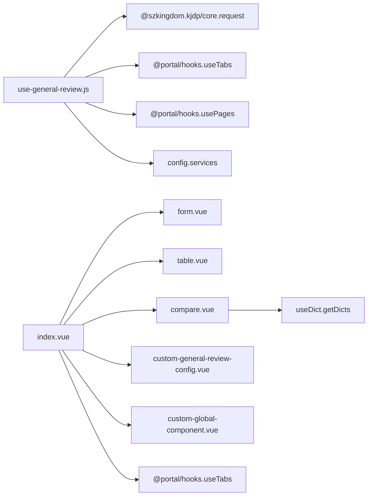

# 通用审核模块

<cite>
**本文引用的文件**
- [use-general-review.js](file://src/portal/modules/general-review/use-general-review.js)
- [index.vue](file://src/portal/modules/general-review/index.vue)
- [form.vue](file://src/portal/modules/general-review/templates/form.vue)
- [table.vue](file://src/portal/modules/general-review/templates/table.vue)
- [compare.vue](file://src/portal/modules/general-review/templates/compare.vue)
- [custom-general-review-config.vue](file://src/portal/modules/general-review/templates/custom-general-review-config.vue)
- [custom-global-component.vue](file://src/portal/modules/general-review/templates/custom-global-component.vue)
- [hooks/index.js](file://src/portal/hooks/index.js)
- [services.js](file://src/config/services.js)
- [webapp.js](file://src/config/webapp.js)
</cite>

## 目录
1. [简介](#简介)
2. [项目结构](#项目结构)
3. [核心组件](#核心组件)
4. [架构总览](#架构总览)
5. [详细组件分析](#详细组件分析)
6. [依赖关系分析](#依赖关系分析)
7. [性能考量](#性能考量)
8. [故障排查指南](#故障排查指南)
9. [结论](#结论)
10. [附录](#附录)

## 简介
本技术文档面向 FS-AOI-WEB 通用审核模块，系统性阐述其核心能力与实现原理，包括：
- 审核流程节点挂载与渲染控制
- 审核模板体系（表单、表格、对比、自定义配置与全局组件）
- 数据获取与字典映射、变更前后数据对比
- 自定义组件与配置的集成方式
- use-general-review.js 钩子函数的使用方法与 API
- 审核数据的获取、处理与展示机制
- 最佳实践与常见问题排查

## 项目结构
通用审核模块位于门户模块目录下，采用“入口组件 + 模板子组件”的分层设计，配合 hooks 与配置中心完成运行期装配。

图表来源
- [index.vue](file://src/portal/modules/general-review/index.vue#L1-L86)
- [use-general-review.js](file://src/portal/modules/general-review/use-general-review.js#L1-L41)
- [hooks/index.js](file://src/portal/hooks/index.js#L1-L20)
- [services.js](file://src/config/services.js#L1-L28)
- [webapp.js](file://src/config/webapp.js#L1-L254)

章节来源
- [index.vue](file://src/portal/modules/general-review/index.vue#L1-L86)
- [use-general-review.js](file://src/portal/modules/general-review/use-general-review.js#L1-L41)
- [hooks/index.js](file://src/portal/hooks/index.js#L1-L20)
- [services.js](file://src/config/services.js#L1-L28)
- [webapp.js](file://src/config/webapp.js#L1-L254)

## 核心组件
- useGeneralReview 钩子：提供初始化、自定义配置读取、参数中文数据获取、打开审核页签的能力。
- index.vue 入口：负责节点挂载、模板选择、业务参数配置注入、提交后的页签关闭。
- 模板子组件：根据菜单配置决定渲染类型，分别以表单、表格、对比等形式展示审核数据；支持自定义组件按路径动态加载。

章节来源
- [use-general-review.js](file://src/portal/modules/general-review/use-general-review.js#L1-L41)
- [index.vue](file://src/portal/modules/general-review/index.vue#L1-L86)

## 架构总览
通用审核模块通过“入口组件 + 模板子组件 + 钩子 + 配置中心”的协作，实现对不同业务场景的灵活适配。

图表来源
- [use-general-review.js](file://src/portal/modules/general-review/use-general-review.js#L14-L20)
- [index.vue](file://src/portal/modules/general-review/index.vue#L28-L56)
- [hooks/index.js](file://src/portal/hooks/index.js#L12-L17)

## 详细组件分析

### useGeneralReview 钩子 API
- 初始化
  - 功能：从 usePages 中拉取并扁平化通用审核自定义配置，供后续按路径匹配使用。
  - 调用时机：应用启动阶段或业务进入前调用。
  - 关键路径：[useGeneralReview.init](file://src/portal/modules/general-review/use-general-review.js#L22-L25)
- 自定义配置读取
  - 功能：按路径查找自定义配置项，返回对应组件或配置对象。
  - 关键路径：[useGeneralReview.getCustomConfig](file://src/portal/modules/general-review/use-general-review.js#L27-L31)
- 参数中文数据获取
  - 功能：调用平台参数中文数据服务，返回业务参数配置列表，用于生成表单项/列定义。
  - 关键路径：[useGeneralReview.getParamChineseData](file://src/portal/modules/general-review/use-general-review.js#L8-L12)
- 打开审核页签
  - 功能：通过 useTabs 打开通用审核组件，设置菜单类型与组件引用。
  - 关键路径：[useGeneralReview.open](file://src/portal/modules/general-review/use-general-review.js#L14-L20)

章节来源
- [use-general-review.js](file://src/portal/modules/general-review/use-general-review.js#L1-L41)

### index.vue 入口组件
- 节点挂载与生命周期
  - onMounted(done)：校验是否为通用管理类业务；加载业务资料；根据菜单配置选择渲染模板；注入业务参数配置；完成后回调 done。
  - 关键路径：[index.vue onMounted](file://src/portal/modules/general-review/index.vue#L28-L56)
- 渲染类型判定
  - formatRenderType(menuFuncInfo)：依据 RENDER_TYPE 与 AJAX_REQ 的存在情况，决定渲染模板类型（对比/表单/表格/自定义）。
  - 关键路径：[index.vue formatRenderType](file://src/portal/modules/general-review/index.vue#L58-L69)
- 业务参数配置注入
  - 通过 getParamChineseData 获取参数中文配置，并注入到 businessParamsConfig，供各模板消费。
  - 关键路径：[index.vue getParamChineseData](file://src/portal/modules/general-review/index.vue#L71-L78)
- 提交回调
  - onSubmit：关闭当前活动页签。
  - 关键路径：[index.vue onSubmit](file://src/portal/modules/general-review/index.vue#L80-L82)

章节来源
- [index.vue](file://src/portal/modules/general-review/index.vue#L1-L86)

### 模板子组件

#### 表单模板（form.vue）
- 用途：以只读描述形式展示单条业务数据，字段由业务参数配置生成。
- 关键行为：
  - 从 reviewData.busiData.AJAX_REQ 读取源数据；若为数组取首条。
  - 根据 businessParamsConfig 生成 items，含字段名、标签、组件类型（输入/下拉），并绑定字典。
- 关键路径：[form.vue](file://src/portal/modules/general-review/templates/form.vue#L1-L24)

章节来源
- [form.vue](file://src/portal/modules/general-review/templates/form.vue#L1-L24)

#### 表格模板（table.vue）
- 用途：以表格形式展示单条或多条业务数据。
- 关键行为：
  - 列定义来自 businessParamsConfig，支持字典映射。
  - onMounted 时将数据转换为数组并加载到表格。
- 关键路径：[table.vue](file://src/portal/modules/general-review/templates/table.vue#L1-L32)

章节来源
- [table.vue](file://src/portal/modules/general-review/templates/table.vue#L1-L32)

#### 对比模板（compare.vue）
- 用途：对比变更前/后的关键字段值，标注变更类型（新增/删除/修改）。
- 关键行为：
  - 从 reviewData.busiData.AJAX_REQ 与 _originalData 读取新旧数据。
  - 通过字典码批量获取字典项，进行值转换。
  - judgeModifyType 判定变更类型；dictValueTransform 负责字典值映射占位。
  - onMounted 加载对比结果到表格。
- 关键路径：[compare.vue](file://src/portal/modules/general-review/templates/compare.vue#L1-L75)

章节来源
- [compare.vue](file://src/portal/modules/general-review/templates/compare.vue#L1-L75)

#### 自定义配置模板（custom-general-review-config.vue）
- 用途：按路径从 useGeneralReview 自定义配置中解析组件并动态加载。
- 关键行为：
  - 通过 useGeneralReview.getCustomConfig(RENDER_VIEWID) 获取组件定义。
  - 若为函数则使用 defineAsyncComponent 动态加载，否则直接作为组件使用。
- 关键路径：[custom-general-review-config.vue](file://src/portal/modules/general-review/templates/custom-general-review-config.vue#L1-L15)

章节来源
- [custom-general-review-config.vue](file://src/portal/modules/general-review/templates/custom-general-review-config.vue#L1-L15)

#### 全局组件模板（custom-global-component.vue）
- 用途：兼容旧式全局组件注册方式，按名称解析并渲染。
- 关键行为：
  - 使用 resolveComponent(RENDER_VIEWID) 解析全局组件。
- 关键路径：[custom-global-component.vue](file://src/portal/modules/general-review/templates/custom-global-component.vue#L1-L11)

章节来源
- [custom-global-component.vue](file://src/portal/modules/general-review/templates/custom-global-component.vue#L1-L11)

### 类关系图（代码级）

图表来源
- [use-general-review.js](file://src/portal/modules/general-review/use-general-review.js#L33-L38)
- [index.vue](file://src/portal/modules/general-review/index.vue#L28-L82)
- [form.vue](file://src/portal/modules/general-review/templates/form.vue#L1-L24)
- [table.vue](file://src/portal/modules/general-review/templates/table.vue#L1-L32)
- [compare.vue](file://src/portal/modules/general-review/templates/compare.vue#L1-L75)
- [custom-general-review-config.vue](file://src/portal/modules/general-review/templates/custom-general-review-config.vue#L1-L15)
- [custom-global-component.vue](file://src/portal/modules/general-review/templates/custom-global-component.vue#L1-L11)

## 依赖关系分析
- useGeneralReview 依赖
  - @szkingdom.kjdp/core.request：调用平台服务接口获取参数中文数据。
  - @portal/hooks.useTabs/usePages：打开页签与读取自定义配置。
  - @config.services：读取服务接口号配置。
- index.vue 依赖
  - 模板子组件：根据 RENDER_TYPE 动态选择。
  - @portal/hooks.useTabs：提交后关闭页签。
- 模板子组件依赖
  - 注入的 businessReviewRef 与 generalReviewRef：承载业务数据与参数配置。
  - KuiGeneralDescription/KuiGeneralView/TableView 等 UI 组件：用于展示数据。

图表来源
- [use-general-review.js](file://src/portal/modules/general-review/use-general-review.js#L1-L5)
- [index.vue](file://src/portal/modules/general-review/index.vue#L12-L19)
- [compare.vue](file://src/portal/modules/general-review/templates/compare.vue#L21)

章节来源
- [use-general-review.js](file://src/portal/modules/general-review/use-general-review.js#L1-L5)
- [index.vue](file://src/portal/modules/general-review/index.vue#L12-L19)
- [compare.vue](file://src/portal/modules/general-review/templates/compare.vue#L21)

## 性能考量
- 模板按需加载：compare/form/table 通过异步组件映射，避免一次性加载所有模板。
- 字典按需请求：仅当存在 PARA_DICT 时才批量获取字典，减少网络与转换开销。
- 数据预处理：将 AJAX_REQ 转换为数组统一处理，降低模板分支判断成本。
- 页签管理：提交后立即关闭，避免长时间持有大型数据结构。

## 故障排查指南
- 通用复核业务校验失败
  - 现象：控制台报错提示当前业务不是通用复核业务。
  - 排查：确认 reviewData.isGeneralManage 是否为“1”。
  - 关键路径：[index.vue 校验](file://src/portal/modules/general-review/index.vue#L31-L34)
- 对比模板缺少原始数据
  - 现象：对比模板配置为“0-汉化翻译”，但流程数据中缺少 _originalData。
  - 排查：检查 AJAX_REQ 结构与 _originalData 是否存在。
  - 关键路径：[index.vue formatRenderType 判定](file://src/portal/modules/general-review/index.vue#L58-L62)
- 自定义配置未生效
  - 现象：RENDER_VIEWID 指向的组件未渲染。
  - 排查：确认 usePages.get('generalReviewConfig') 是否已初始化；RENDER_VIEWID 与 path 是否一致；组件是否为函数或可解析组件。
  - 关键路径：[useGeneralReview.init/getCustomConfig](file://src/portal/modules/general-review/use-general-review.js#L22-L31)，[custom-general-review-config.vue](file://src/portal/modules/general-review/templates/custom-general-review-config.vue#L11)
- 页签未关闭
  - 现象：提交后页签未关闭。
  - 排查：确认 onSubmit 回调是否被触发；useTabs.closeActive 是否可用。
  - 关键路径：[index.vue onSubmit](file://src/portal/modules/general-review/index.vue#L80-L82)

章节来源
- [index.vue](file://src/portal/modules/general-review/index.vue#L31-L34)
- [index.vue](file://src/portal/modules/general-review/index.vue#L58-L62)
- [use-general-review.js](file://src/portal/modules/general-review/use-general-review.js#L22-L31)
- [custom-general-review-config.vue](file://src/portal/modules/general-review/templates/custom-general-review-config.vue#L11)
- [index.vue](file://src/portal/modules/general-review/index.vue#L80-L82)

## 结论
通用审核模块通过“钩子 + 入口 + 模板”的分层设计，实现了对多种审核场景的高内聚、低耦合支持。借助业务参数配置与字典映射，模块能够快速适配不同业务的数据展示与对比需求；通过自定义配置与动态组件加载，进一步增强了扩展性与灵活性。建议在实际集成中遵循“先配置、再渲染、后提交”的流程，确保数据一致性与用户体验。

## 附录

### 使用示例（步骤说明）
- 初始化与打开审核页签
  - 在应用启动或业务入口处调用 useGeneralReview.init() 完成自定义配置加载。
  - 调用 useGeneralReview.open({...}) 打开通用审核页签。
  - 关键路径：[useGeneralReview.open](file://src/portal/modules/general-review/use-general-review.js#L14-L20)，[hooks/index.js](file://src/portal/hooks/index.js#L12-L17)
- 配置业务参数中文数据
  - 通过 useGeneralReview.getParamChineseData({ PARA_CLS: '3', BUSI_CODE }) 获取参数配置，注入到 businessParamsConfig。
  - 关键路径：[useGeneralReview.getParamChineseData](file://src/portal/modules/general-review/use-general-review.js#L8-L12)，[index.vue getParamChineseData](file://src/portal/modules/general-review/index.vue#L71-L78)
- 模板选择策略
  - 根据菜单 RENDER_TYPE 与 AJAX_REQ 的存在情况，自动选择对比/表单/表格/自定义模板。
  - 关键路径：[index.vue formatRenderType](file://src/portal/modules/general-review/index.vue#L58-L69)
- 自定义组件集成
  - 在自定义配置中提供 path 与 component（函数或组件），在模板中通过 RENDER_VIEWID 指向。
  - 关键路径：[custom-general-review-config.vue](file://src/portal/modules/general-review/templates/custom-general-review-config.vue#L11)

章节来源
- [use-general-review.js](file://src/portal/modules/general-review/use-general-review.js#L8-L20)
- [index.vue](file://src/portal/modules/general-review/index.vue#L58-L78)
- [custom-general-review-config.vue](file://src/portal/modules/general-review/templates/custom-general-review-config.vue#L11)

### API 一览（参数与返回）
- useGeneralReview.open(data)
  - 参数：包含菜单类型、标题、业务数据等的打开参数。
  - 返回：页签实例，可用于后续操作。
  - 关键路径：[useGeneralReview.open](file://src/portal/modules/general-review/use-general-review.js#L14-L20)
- useGeneralReview.init()
  - 功能：拉取并扁平化自定义配置。
  - 关键路径：[useGeneralReview.init](file://src/portal/modules/general-review/use-general-review.js#L22-L25)
- useGeneralReview.getCustomConfig(path)
  - 参数：模板路径。
  - 返回：匹配的配置项（含组件定义）。
  - 关键路径：[useGeneralReview.getCustomConfig](file://src/portal/modules/general-review/use-general-review.js#L27-L31)
- useGeneralReview.getParamChineseData(params)
  - 参数：{ PARA_CLS, BUSI_CODE }。
  - 返回：参数中文配置数组。
  - 关键路径：[useGeneralReview.getParamChineseData](file://src/portal/modules/general-review/use-general-review.js#L8-L12)

章节来源
- [use-general-review.js](file://src/portal/modules/general-review/use-general-review.js#L8-L31)

### 审核模板配置要点
- 表单模板（form）
  - 适用：单条记录的只读展示。
  - 关键：businessParamsConfig 生成字段项，支持字典。
  - 关键路径：[form.vue](file://src/portal/modules/general-review/templates/form.vue#L11-L22)
- 表格模板（table）
  - 适用：多条记录或字段较多的展示。
  - 关键：列定义来自 businessParamsConfig，onMounted 加载数据。
  - 关键路径：[table.vue](file://src/portal/modules/general-review/templates/table.vue#L15-L30)
- 对比模板（compare）
  - 适用：变更前后数据对比。
  - 关键：依赖 _originalData；judgeModifyType 判定变更类型；字典值转换。
  - 关键路径：[compare.vue](file://src/portal/modules/general-review/templates/compare.vue#L29-L56)
- 自定义配置模板（custom-general-review-config）
  - 适用：按路径动态加载自定义组件。
  - 关键：RENDER_VIEWID 对应 path；支持函数组件异步加载。
  - 关键路径：[custom-general-review-config.vue](file://src/portal/modules/general-review/templates/custom-general-review-config.vue#L11)
- 全局组件模板（custom-global-component）
  - 适用：兼容旧式全局组件注册。
  - 关键：RENDER_VIEWID 为全局组件名。
  - 关键路径：[custom-global-component.vue](file://src/portal/modules/general-review/templates/custom-global-component.vue#L9)

章节来源
- [form.vue](file://src/portal/modules/general-review/templates/form.vue#L11-L22)
- [table.vue](file://src/portal/modules/general-review/templates/table.vue#L15-L30)
- [compare.vue](file://src/portal/modules/general-review/templates/compare.vue#L29-L56)
- [custom-general-review-config.vue](file://src/portal/modules/general-review/templates/custom-general-review-config.vue#L11)
- [custom-global-component.vue](file://src/portal/modules/general-review/templates/custom-global-component.vue#L9)