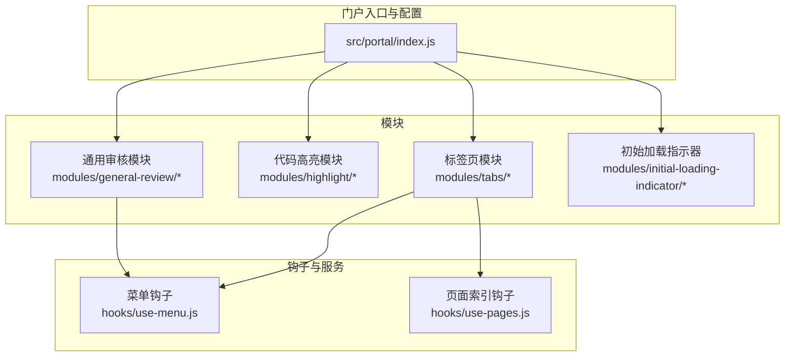
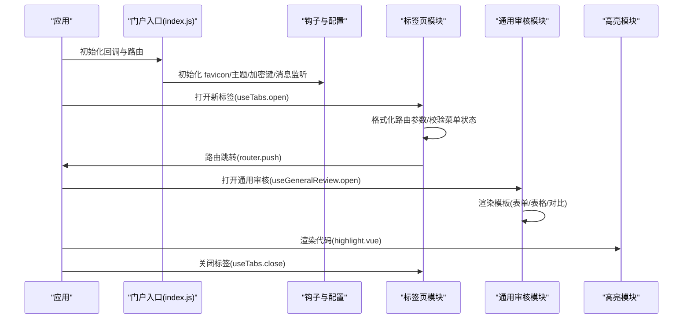
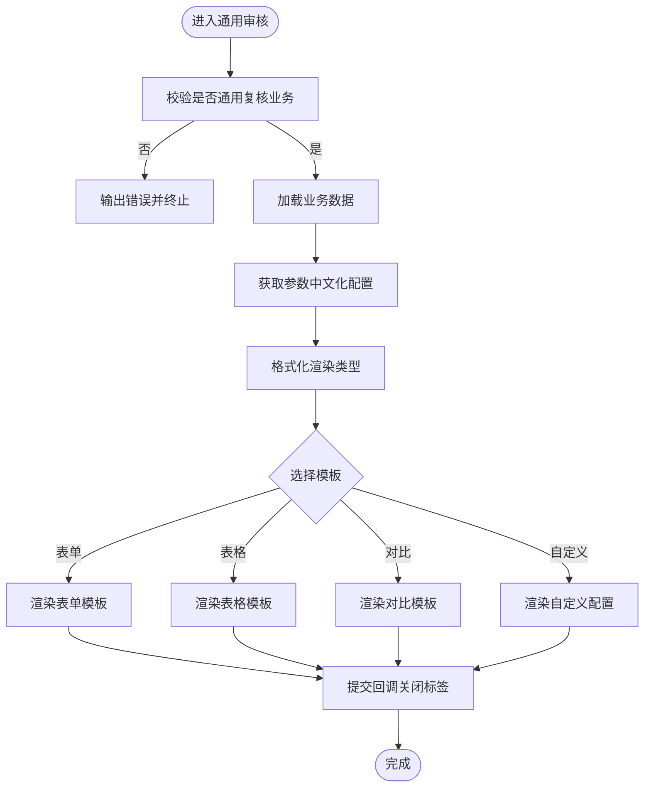
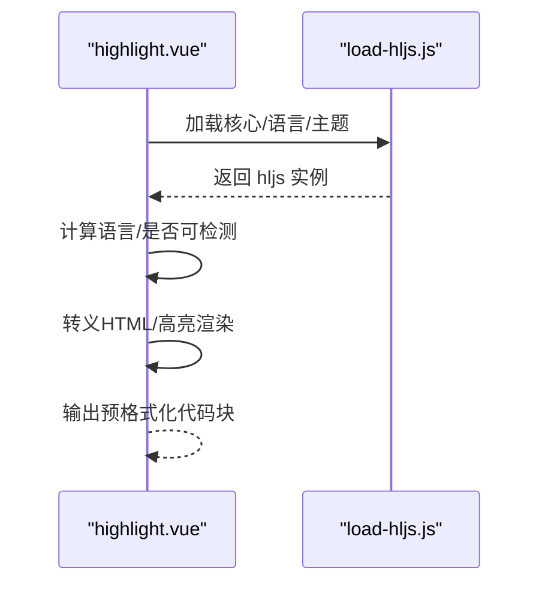
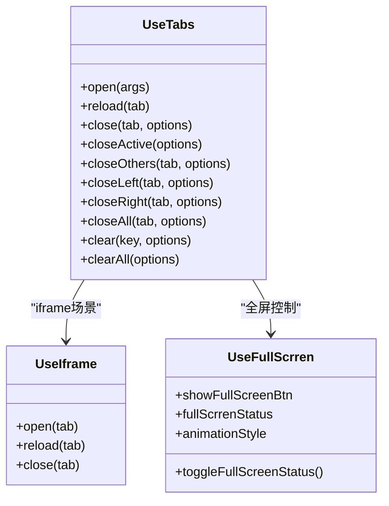
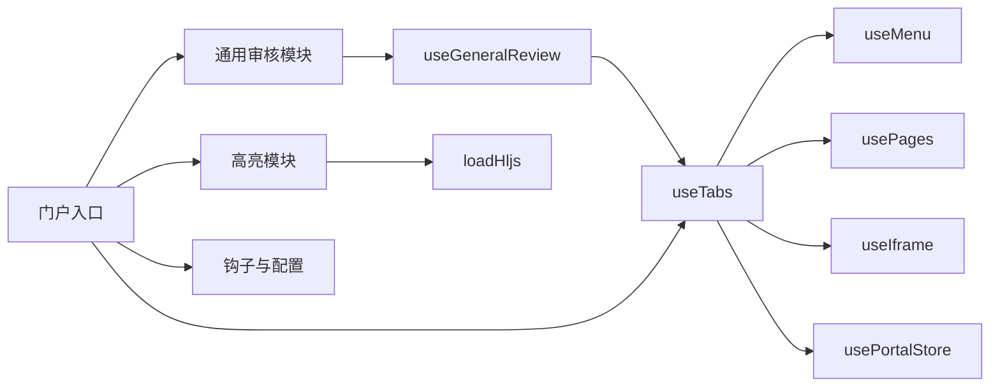

# 门户模块

<cite>
**本文引用的文件**
- [src/portal/index.js](file://src/portal/index.js)
- [src/portal/modules/general-review/index.vue](file://src/portal/modules/general-review/index.vue)
- [src/portal/modules/general-review/use-general-review.js](file://src/portal/modules/general-review/use-general-review.js)
- [src/portal/modules/general-review/templates/form.vue](file://src/portal/modules/general-review/templates/form.vue)
- [src/portal/modules/general-review/templates/table.vue](file://src/portal/modules/general-review/templates/table.vue)
- [src/portal/modules/highlight/highlight.vue](file://src/portal/modules/highlight/highlight.vue)
- [src/portal/modules/highlight/load-hljs.js](file://src/portal/modules/highlight/load-hljs.js)
- [src/portal/modules/tabs/index.vue](file://src/portal/modules/tabs/index.vue)
- [src/portal/modules/tabs/tabs-panel.vue](file://src/portal/modules/tabs/tabs-panel.vue)
- [src/portal/modules/tabs/use-tabs.js](file://src/portal/modules/tabs/use-tabs.js)
- [src/portal/modules/tabs/use-full-screen.js](file://src/portal/modules/tabs/use-full-screen.js)
- [src/portal/modules/tabs/iframe/use-iframe.js](file://src/portal/modules/tabs/iframe/use-iframe.js)
- [src/portal/modules/initial-loading-indicator/index.js](file://src/portal/modules/initial-loading-indicator/index.js)
- [src/portal/hooks/use-pages.js](file://src/portal/hooks/use-pages.js)
- [src/portal/hooks/use-menu.js](file://src/portal/hooks/use-menu.js)
</cite>

## 目录
1. [简介](#简介)
2. [项目结构](#项目结构)
3. [核心组件](#核心组件)
4. [架构总览](#架构总览)
5. [详细组件分析](#详细组件分析)
6. [依赖关系分析](#依赖关系分析)
7. [性能考量](#性能考量)
8. [故障排查指南](#故障排查指南)
9. [结论](#结论)
10. [附录](#附录)

## 简介
本技术文档面向 FS-AOI-WEB 门户模块系统，聚焦于门户提供的核心功能模块：通用审核模块、代码高亮模块、标签页模块、初始加载指示器等。文档从系统架构、组件职责、数据与事件流、生命周期管理、性能优化与扩展开发等方面进行深入解析，并提供 API 使用说明、最佳实践与排障建议，帮助开发者高效完成模块的开发与集成。

## 项目结构
门户模块位于 src/portal 下，包含模块化子目录、路由与状态管理、以及若干工具钩子。关键目录与文件如下：
- modules：各功能模块实现（通用审核、高亮、标签页、初始加载指示器）
- router：路由定义与应用路由钩子
- store：全局状态管理
- hooks：通用钩子（菜单、消息、主题、分页等）
- views：布局与工作台视图
- index.js：门户入口与回调映射

**图表来源**
- [src/portal/index.js](file://src/portal/index.js#L1-L153)
- [src/portal/modules/general-review/index.vue](file://src/portal/modules/general-review/index.vue#L1-L86)
- [src/portal/modules/highlight/highlight.vue](file://src/portal/modules/highlight/highlight.vue#L1-L77)
- [src/portal/modules/tabs/index.vue](file://src/portal/modules/tabs/index.vue#L1-L173)
- [src/portal/modules/initial-loading-indicator/index.js](file://src/portal/modules/initial-loading-indicator/index.js#L1-L14)
- [src/portal/hooks/use-menu.js](file://src/portal/hooks/use-menu.js#L1-L130)
- [src/portal/hooks/use-pages.js](file://src/portal/hooks/use-pages.js#L1-L21)

**章节来源**
- [src/portal/index.js](file://src/portal/index.js#L1-L153)

## 核心组件
- 通用审核模块：基于业务数据动态渲染表单或表格，支持参数字典化展示与提交关闭标签页。
- 代码高亮模块：按需异步加载 highlight.js 语言包与主题，支持自动语言检测与手动指定语言。
- 标签页模块：统一承载路由视图、支持 keep-alive 缓存、多标签面板、全屏模式、iframe 内嵌。
- 初始加载指示器：根据项目配置控制首页初始加载动画显示。

**章节来源**
- [src/portal/modules/general-review/index.vue](file://src/portal/modules/general-review/index.vue#L1-L86)
- [src/portal/modules/highlight/highlight.vue](file://src/portal/modules/highlight/highlight.vue#L1-L77)
- [src/portal/modules/tabs/index.vue](file://src/portal/modules/tabs/index.vue#L1-L173)
- [src/portal/modules/initial-loading-indicator/index.js](file://src/portal/modules/initial-loading-indicator/index.js#L1-L14)

## 架构总览
门户模块通过入口文件导出 router 与回调映射，结合钩子与配置，实现子系统模式、主题与图标初始化、URL 加密密钥注入、消息通道与重载事件初始化等。标签页模块负责路由跳转、标签打开/关闭/刷新、iframe 内嵌管理；通用审核模块在业务数据就绪后选择模板渲染并提供提交回调；高亮模块按需加载语言与主题资源。

**图表来源**
- [src/portal/index.js](file://src/portal/index.js#L109-L150)
- [src/portal/modules/tabs/use-tabs.js](file://src/portal/modules/tabs/use-tabs.js#L292-L597)
- [src/portal/modules/general-review/use-general-review.js](file://src/portal/modules/general-review/use-general-review.js#L14-L20)
- [src/portal/modules/highlight/highlight.vue](file://src/portal/modules/highlight/highlight.vue#L66-L69)

## 详细组件分析

### 通用审核模块
- 功能特性
  - 根据菜单配置渲染不同模板：对比、表单、表格、自定义全局组件或自定义配置。
  - 参数中文化：调用服务获取参数字典，驱动表单项与列定义。
  - 提交即关闭：提交成功后关闭当前活动标签页。
- 使用方法
  - 通过 useGeneralReview.open 打开通用审核视图，传入菜单标识与组件类型。
  - 在模板中注入 generalReviewRef，读取 busiData 与 reviewData。
- 配置选项
  - RENDER_TYPE 与 RENDER_VIEWID 控制模板选择与自定义视图绑定。
  - 支持业务参数字典化展示。
- 生命周期与事件
  - onMounted 钩子内加载业务数据与参数中文化，done 回调结束挂载流程。
  - onSubmit 触发关闭当前标签页。
- 复杂度与性能
  - 异步组件加载与模板选择，避免首屏阻塞。
  - 参数字典一次性拉取，减少重复请求。

**图表来源**
- [src/portal/modules/general-review/index.vue](file://src/portal/modules/general-review/index.vue#L28-L82)
- [src/portal/modules/general-review/templates/form.vue](file://src/portal/modules/general-review/templates/form.vue#L1-L24)
- [src/portal/modules/general-review/templates/table.vue](file://src/portal/modules/general-review/templates/table.vue#L1-L32)

**章节来源**
- [src/portal/modules/general-review/index.vue](file://src/portal/modules/general-review/index.vue#L1-L86)
- [src/portal/modules/general-review/use-general-review.js](file://src/portal/modules/general-review/use-general-review.js#L1-L41)
- [src/portal/modules/general-review/templates/form.vue](file://src/portal/modules/general-review/templates/form.vue#L1-L24)
- [src/portal/modules/general-review/templates/table.vue](file://src/portal/modules/general-review/templates/table.vue#L1-L32)

### 代码高亮模块
- 功能特性
  - 按需异步加载 highlight.js 核心、目标语言与主题。
  - 自动语言检测或显式指定语言，支持忽略非法语法。
  - HTML 转义与安全渲染。
- 使用方法
  - 通过 highlight.vue 组件传入 code、language、autodetect、ignoreIllegals。
  - 组件内部在 mounted 时初始化 hljs 并高亮渲染。
- 配置选项
  - highlightConfig.theme 控制主题。
  - 支持多种语言与主题资源按需加载。
- 性能优化
  - 仅在首次渲染时加载语言与主题，避免重复导入。
  - 语言检测失败回退为纯文本渲染。

**图表来源**
- [src/portal/modules/highlight/highlight.vue](file://src/portal/modules/highlight/highlight.vue#L66-L69)
- [src/portal/modules/highlight/load-hljs.js](file://src/portal/modules/highlight/load-hljs.js#L370-L389)

**章节来源**
- [src/portal/modules/highlight/highlight.vue](file://src/portal/modules/highlight/highlight.vue#L1-L77)
- [src/portal/modules/highlight/load-hljs.js](file://src/portal/modules/highlight/load-hljs.js#L1-L389)

### 标签页模块
- 功能特性
  - 统一承载路由视图，支持 keep-alive 缓存与标签面板。
  - 支持全屏模式、iframe 内嵌、加载指示器。
  - 提供丰富的标签操作：打开、关闭、刷新、左右/全部关闭等。
- 使用方法
  - 通过 useTabs.open 打开标签，传入 menuId 或路由参数，自动格式化路由并跳转。
  - 通过 useTabs.close/closeOthers/closeLeft/closeRight/closeAll/clear/clearAll 进行批量管理。
  - 全屏模式通过 useFullScrren 控制，支持动画过渡。
  - iframe 场景通过 useIframe.open/reload/close 管理内嵌页面。
- 生命周期与事件
  - 打开前触发 onBeforeTabOpen，打开后触发 onTabOpened。
  - 关闭前触发 onBeforeTabClose，关闭后触发 onTabClosed。
  - 支持回调链路 useCallback.call 注入自定义逻辑。
- 性能优化
  - keep-alive 缓存减少重复渲染。
  - 路由参数合并与扩展，避免重复计算。
  - 全屏动画采用帧级平滑过渡。

**图表来源**
- [src/portal/modules/tabs/use-tabs.js](file://src/portal/modules/tabs/use-tabs.js#L292-L597)
- [src/portal/modules/tabs/iframe/use-iframe.js](file://src/portal/modules/tabs/iframe/use-iframe.js#L1-L16)
- [src/portal/modules/tabs/use-full-screen.js](file://src/portal/modules/tabs/use-full-screen.js#L1-L84)

**章节来源**
- [src/portal/modules/tabs/index.vue](file://src/portal/modules/tabs/index.vue#L1-L173)
- [src/portal/modules/tabs/tabs-panel.vue](file://src/portal/modules/tabs/tabs-panel.vue#L1-L381)
- [src/portal/modules/tabs/use-tabs.js](file://src/portal/modules/tabs/use-tabs.js#L1-L597)
- [src/portal/modules/tabs/use-full-screen.js](file://src/portal/modules/tabs/use-full-screen.js#L1-L84)
- [src/portal/modules/tabs/iframe/use-iframe.js](file://src/portal/modules/tabs/iframe/use-iframe.js#L1-L16)

### 初始加载指示器
- 功能特性
  - 根据项目配置决定首页初始加载指示器的显示/隐藏。
- 使用方法
  - 在入口初始化时引入模块，自动根据配置设置元素显示状态。
- 配置选项
  - 通过 projectConfig.index.enableInitialLoading 控制显示。

**章节来源**
- [src/portal/modules/initial-loading-indicator/index.js](file://src/portal/modules/initial-loading-indicator/index.js#L1-L14)

### 门户入口与回调映射
- 功能特性
  - 子系统模式检测与会话处理（含 token 转换与登录态同步）。
  - 初始化 favicon、主题、URL 加密密钥。
  - 注册 appBeforeMount/appMounted 与 serviceInterceptors 回调。
  - 在 iframe 模式下初始化消息通道与重载事件。
- 使用方法
  - 应用启动时调用回调映射中的钩子，确保模块初始化顺序正确。
- 配置选项
  - 通过 urlConfig、callbacks、httpConfig、projectConfig 等配置项影响行为。

**章节来源**
- [src/portal/index.js](file://src/portal/index.js#L1-L153)

### 菜单与页面钩子
- 菜单钩子 useMenu
  - 获取门户与菜单树，支持 iframe/router 类型识别与本地最近访问存储。
  - 支持根据系统参数动态调整渲染策略（如 Vue 接受入口）。
- 页面钩子 usePages
  - 动态扫描 pages 目录下的 index.js，聚合指定键值配置。

**章节来源**
- [src/portal/hooks/use-menu.js](file://src/portal/hooks/use-menu.js#L1-L130)
- [src/portal/hooks/use-pages.js](file://src/portal/hooks/use-pages.js#L1-L21)

## 依赖关系分析
- 组件耦合
  - 通用审核模块依赖 useGeneralReview 与 useTabs，用于打开视图与关闭标签。
  - 标签页模块依赖 useMenu、usePages、useIframe、usePortalStore 等，形成门户导航与内容承载中心。
  - 高亮模块依赖 load-hljs 的异步加载能力，降低首屏体积。
- 外部依赖
  - highlight.js 语言与主题资源按需加载，避免全局引入。
  - UI 组件库与路由生态（Vue Router、Element Plus）。
- 循环依赖
  - 模块间通过钩子与 store 解耦，未见明显循环依赖迹象。

**图表来源**
- [src/portal/modules/general-review/use-general-review.js](file://src/portal/modules/general-review/use-general-review.js#L1-L41)
- [src/portal/modules/tabs/use-tabs.js](file://src/portal/modules/tabs/use-tabs.js#L1-L10)
- [src/portal/modules/highlight/load-hljs.js](file://src/portal/modules/highlight/load-hljs.js#L1-L3)
- [src/portal/index.js](file://src/portal/index.js#L1-L153)

**章节来源**
- [src/portal/modules/general-review/use-general-review.js](file://src/portal/modules/general-review/use-general-review.js#L1-L41)
- [src/portal/modules/tabs/use-tabs.js](file://src/portal/modules/tabs/use-tabs.js#L1-L10)
- [src/portal/modules/highlight/load-hljs.js](file://src/portal/modules/highlight/load-hljs.js#L1-L3)
- [src/portal/index.js](file://src/portal/index.js#L1-L153)

## 性能考量
- 按需加载
  - 高亮模块与通用审核均采用异步组件与动态 import，减少首屏体积。
- 缓存与复用
  - 标签页 keep-alive 缓存、菜单树与页面索引缓存、语言与主题资源缓存。
- 渲染优化
  - 全屏动画采用帧级过渡，避免频繁重排。
  - 语言检测失败时直接返回转义后的文本，避免无效高亮计算。
- 请求拦截
  - 门户提供 serviceInterceptors 回调，便于统一处理请求拦截与放行逻辑。

[本节为通用性能指导，无需特定文件引用]

## 故障排查指南
- 通用审核非通用复核业务
  - 现象：组件报错并终止。
  - 处理：确认菜单配置是否标记为通用复核业务。
  - 参考路径：[src/portal/modules/general-review/index.vue](file://src/portal/modules/general-review/index.vue#L31-L34)
- 标签页打开失败
  - 现象：弹出菜单/状态/链接缺失提示。
  - 处理：检查菜单状态、MENU_LINK 配置与路由是否存在。
  - 参考路径：[src/portal/modules/tabs/use-tabs.js](file://src/portal/modules/tabs/use-tabs.js#L116-L155)
- iframe 打开失败
  - 现象：弹出菜单缺失提示。
  - 处理：确认 portalId/cardId/menuId 是否正确传入。
  - 参考路径：[src/portal/modules/tabs/use-tabs.js](file://src/portal/modules/tabs/use-tabs.js#L116-L131)
- 高亮语言不支持
  - 现象：警告提示不支持的语言或主题。
  - 处理：检查 highlightConfig 与语言/主题名称。
  - 参考路径：[src/portal/modules/highlight/load-hljs.js](file://src/portal/modules/highlight/load-hljs.js#L376-L381)
- 子系统模式登录异常
  - 现象：token 转换失败或需要回退登录。
  - 处理：检查 token 请求头与服务端返回标志位。
  - 参考路径：[src/portal/index.js](file://src/portal/index.js#L49-L72)

**章节来源**
- [src/portal/modules/general-review/index.vue](file://src/portal/modules/general-review/index.vue#L31-L34)
- [src/portal/modules/tabs/use-tabs.js](file://src/portal/modules/tabs/use-tabs.js#L116-L155)
- [src/portal/modules/highlight/load-hljs.js](file://src/portal/modules/highlight/load-hljs.js#L376-L381)
- [src/portal/index.js](file://src/portal/index.js#L49-L72)

## 结论
门户模块以模块化设计为核心，通过清晰的钩子与回调机制实现初始化、导航、内容承载与交互控制。通用审核、高亮与标签页三大模块分别覆盖业务展示、代码渲染与多页管理的关键场景，具备良好的扩展性与性能表现。建议在实际开发中遵循模块边界、按需加载与缓存策略，结合回调链路实现统一的拦截与事件处理。

[本节为总结性内容，无需特定文件引用]

## 附录

### API 一览（按模块）
- 通用审核
  - useGeneralReview.open(data)
  - useGeneralReview.getParamChineseData(params)
  - useGeneralReview.getCustomConfig(path)
  - useGeneralReview.init()
  - 参考路径：[src/portal/modules/general-review/use-general-review.js](file://src/portal/modules/general-review/use-general-review.js#L14-L38)
- 标签页
  - useTabs.open(args)
  - useTabs.reload(tab)
  - useTabs.close(tab, options)
  - useTabs.closeActive(options)
  - useTabs.closeOthers(tab, options)
  - useTabs.closeLeft(tab, options)
  - useTabs.closeRight(tab, options)
  - useTabs.closeAll(tab, options)
  - useTabs.clear(key, options)
  - useTabs.clearAll(options)
  - useIframe.open/reload/close(tab)
  - useFullScrren.toggleFullScreenStatus()
  - 参考路径：[src/portal/modules/tabs/use-tabs.js](file://src/portal/modules/tabs/use-tabs.js#L292-L597), [src/portal/modules/tabs/iframe/use-iframe.js](file://src/portal/modules/tabs/iframe/use-iframe.js#L1-L16), [src/portal/modules/tabs/use-full-screen.js](file://src/portal/modules/tabs/use-full-screen.js#L71-L75)
- 高亮
  - highlight.vue 属性：code, language, autodetect, ignoreIllegals
  - loadHljs(language)
  - 参考路径：[src/portal/modules/highlight/highlight.vue](file://src/portal/modules/highlight/highlight.vue#L5-L10), [src/portal/modules/highlight/load-hljs.js](file://src/portal/modules/highlight/load-hljs.js#L370-L389)
- 门户入口与回调
  - callbackMap.appBeforeMount/appMounted/serviceInterceptors
  - 参考路径：[src/portal/index.js](file://src/portal/index.js#L109-L150)

### 最佳实践
- 通用审核
  - 在 onMounted 中尽早加载业务数据与参数字典，避免空白渲染。
  - 使用 submit 回调统一关闭标签，保证一致性。
- 标签页
  - 对临时菜单使用 temporary 标记，便于自动清理。
  - 合理使用 keep-alive 缓存，避免内存泄漏。
  - 全屏模式仅对可关闭标签启用，防止误操作。
- 高亮
  - 显式指定 language 以提升性能与准确性。
  - 主题与语言名称需与可用清单一致，避免警告。
- 门户入口
  - 在 appBeforeMount 中完成 favicon、主题、消息监听与子系统登录态初始化。
  - 通过 serviceInterceptors 实现统一请求拦截与降级处理。

[本节为通用指导，无需特定文件引用]