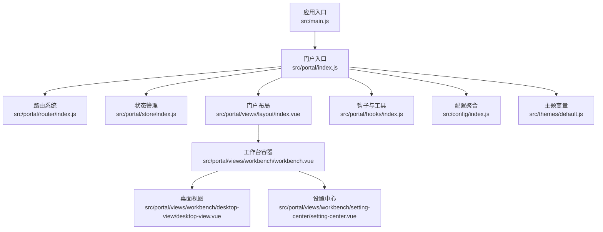
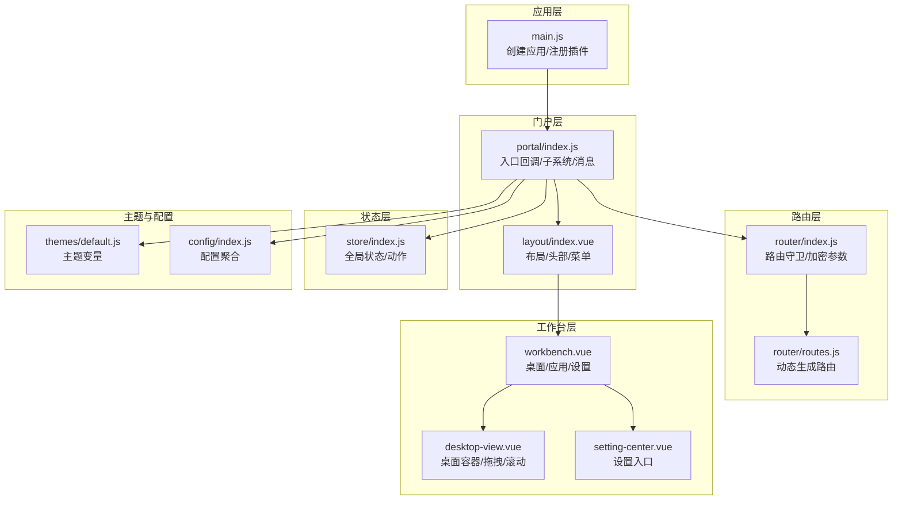
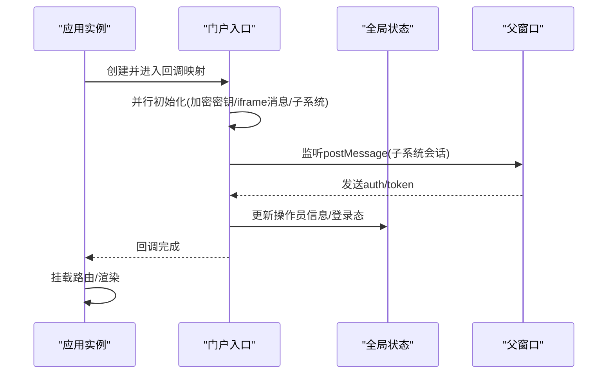
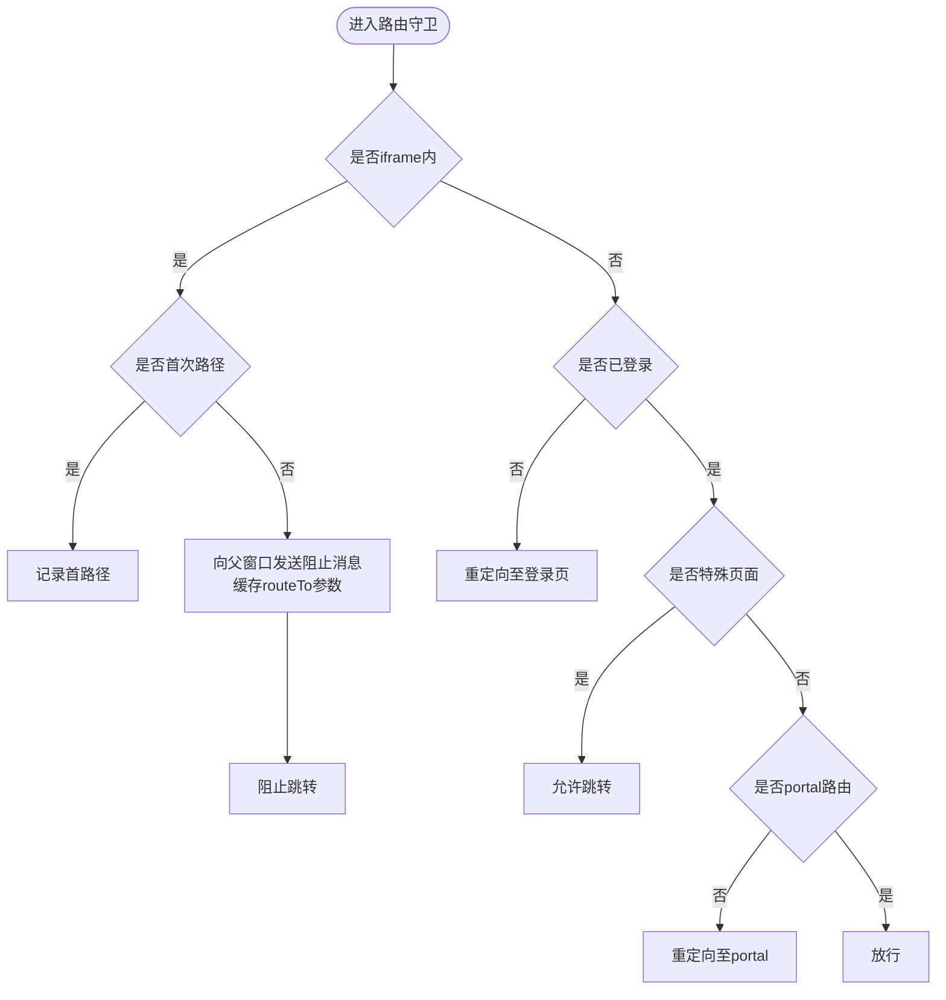
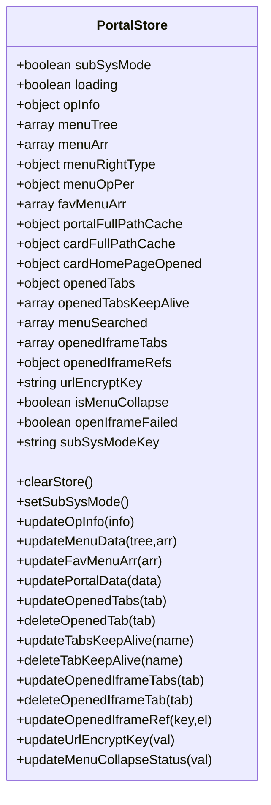
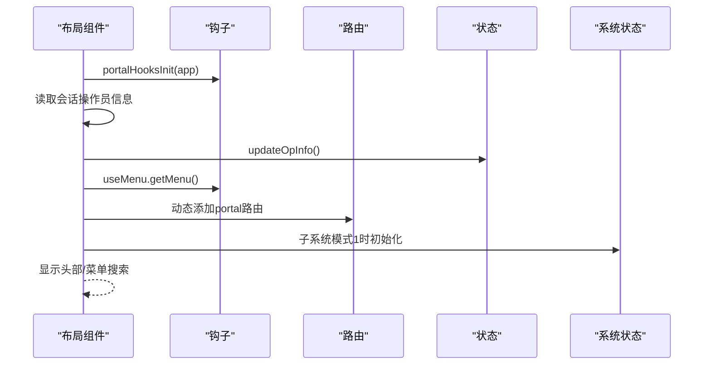
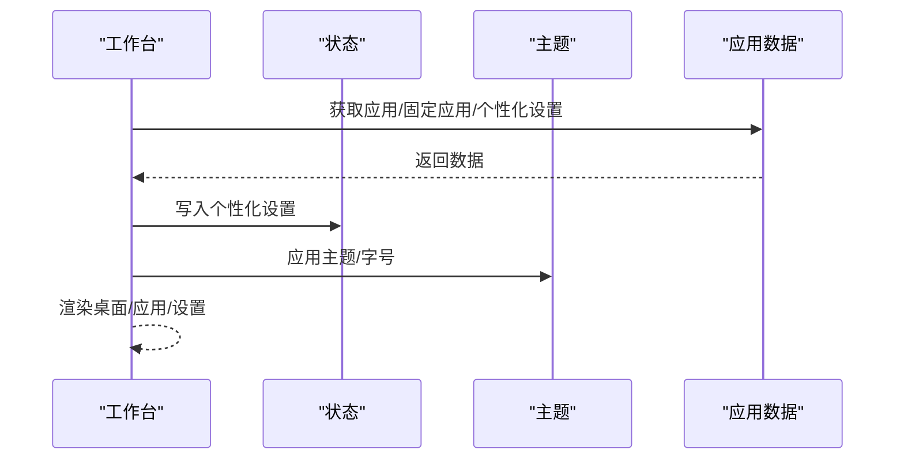
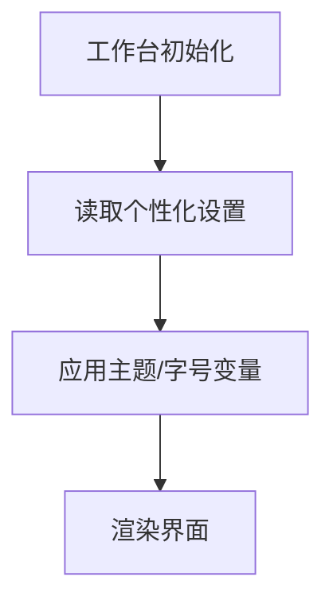
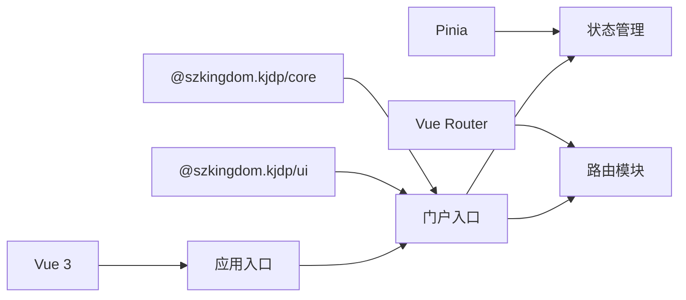

# 门户系统

<cite>
**本文引用的文件**
- [README.md](file://README.md)
- [package.json](file://package.json)
- [src/main.js](file://src/main.js)
- [src/App.vue](file://src/App.vue)
- [src/portal/index.js](file://src/portal/index.js)
- [src/portal/router/index.js](file://src/portal/router/index.js)
- [src/portal/router/routes.js](file://src/portal/router/routes.js)
- [src/portal/store/index.js](file://src/portal/store/index.js)
- [src/portal/views/layout/index.vue](file://src/portal/views/layout/index.vue)
- [src/portal/views/workbench/workbench.vue](file://src/portal/views/workbench/workbench.vue)
- [src/portal/views/workbench/desktop-view/desktop-view.vue](file://src/portal/views/workbench/desktop-view/desktop-view.vue)
- [src/portal/views/workbench/setting-center/setting-center.vue](file://src/portal/views/workbench/setting-center/setting-center.vue)
- [src/portal/hooks/index.js](file://src/portal/hooks/index.js)
- [src/config/index.js](file://src/config/index.js)
- [src/themes/default.js](file://src/themes/default.js)
</cite>

## 目录
1. [简介](#简介)
2. [项目结构](#项目结构)
3. [核心组件](#核心组件)
4. [架构总览](#架构总览)
5. [详细组件分析](#详细组件分析)
6. [依赖分析](#依赖分析)
7. [性能考虑](#性能考虑)
8. [故障排查指南](#故障排查指南)
9. [结论](#结论)
10. [附录](#附录)

## 简介
本技术文档面向 FS-AOI-WEB 门户系统，系统基于 Vue 3 + Pinia + Vue Router 构建，采用模块化与插件化设计，围绕“工作台”“路由管理”“状态管理”“主题系统”等核心能力，提供统一的门户入口、菜单导航、应用桌面与个性化设置能力。文档从整体架构、组件交互、数据流、API 与配置、扩展指南等方面进行系统性阐述，帮助开发者快速理解并高效扩展。

## 项目结构
门户系统主要由以下层次构成：
- 应用入口层：初始化应用、注册全局插件与配置，挂载路由。
- 门户层：布局、头部、菜单、内容区与登录页。
- 工作台层：桌面视图、应用栏、设置中心、个性化配置。
- 路由层：基于 Hash 模式的路由定义与参数加解密策略。
- 状态层：基于 Pinia 的全局状态管理。
- 主题层：多主题变量与动态切换。
- 配置层：HTTP、回调、常量与项目配置聚合导出。

**图表来源**
- [src/main.js](file://src/main.js#L1-L40)
- [src/portal/index.js](file://src/portal/index.js#L1-L153)
- [src/portal/router/index.js](file://src/portal/router/index.js#L1-L141)
- [src/portal/store/index.js](file://src/portal/store/index.js#L1-L226)
- [src/portal/views/layout/index.vue](file://src/portal/views/layout/index.vue#L1-L188)
- [src/portal/views/workbench/workbench.vue](file://src/portal/views/workbench/workbench.vue#L1-L235)
- [src/portal/views/workbench/desktop-view/desktop-view.vue](file://src/portal/views/workbench/desktop-view/desktop-view.vue#L1-L137)
- [src/portal/views/workbench/setting-center/setting-center.vue](file://src/portal/views/workbench/setting-center/setting-center.vue#L1-L46)
- [src/portal/hooks/index.js](file://src/portal/hooks/index.js#L1-L20)
- [src/config/index.js](file://src/config/index.js#L1-L8)
- [src/themes/default.js](file://src/themes/default.js#L1-L113)

**章节来源**
- [src/main.js](file://src/main.js#L1-L40)
- [src/App.vue](file://src/App.vue#L1-L8)
- [src/portal/index.js](file://src/portal/index.js#L1-L153)
- [src/portal/router/index.js](file://src/portal/router/index.js#L1-L141)
- [src/portal/router/routes.js](file://src/portal/router/routes.js#L1-L78)
- [src/portal/store/index.js](file://src/portal/store/index.js#L1-L226)
- [src/portal/views/layout/index.vue](file://src/portal/views/layout/index.vue#L1-L188)
- [src/portal/views/workbench/workbench.vue](file://src/portal/views/workbench/workbench.vue#L1-L235)
- [src/portal/views/workbench/desktop-view/desktop-view.vue](file://src/portal/views/workbench/desktop-view/desktop-view.vue#L1-L137)
- [src/portal/views/workbench/setting-center/setting-center.vue](file://src/portal/views/workbench/setting-center/setting-center.vue#L1-L46)
- [src/portal/hooks/index.js](file://src/portal/hooks/index.js#L1-L20)
- [src/config/index.js](file://src/config/index.js#L1-L8)
- [src/themes/default.js](file://src/themes/default.js#L1-L113)

## 核心组件
- 应用入口与插件注册：创建应用实例、注册 Pinia、注入 KJDP 核心与 UI 插件、挂载路由与错误处理。
- 门户入口：统一回调映射（应用挂载前/后）、子系统模式检测与 Token 透传、URL 加密密钥初始化、消息通道初始化。
- 路由系统：Hash 历史模式、URL 参数加密/解密、跨 iframe 路由拦截与同步、登录态校验与重定向。
- 状态管理：门户全局状态（菜单树、已开标签、iframe 引用、URL 加密密钥、折叠状态等）与动作封装。
- 门户布局：头部、菜单、内容区、搜索、切换头；支持子系统模式与全屏风格。
- 工作台：桌面视图、应用栏、设置中心、个性化（主题、字号、背景）。
- 主题系统：主题变量定义与动态切换，支持多主题。
- 配置系统：HTTP、WebApp、回调、常量与 KJDP 配置聚合导出。

**章节来源**
- [src/main.js](file://src/main.js#L1-L40)
- [src/portal/index.js](file://src/portal/index.js#L17-L125)
- [src/portal/router/index.js](file://src/portal/router/index.js#L9-L23)
- [src/portal/store/index.js](file://src/portal/store/index.js#L4-L55)
- [src/portal/views/layout/index.vue](file://src/portal/views/layout/index.vue#L38-L73)
- [src/portal/views/workbench/workbench.vue](file://src/portal/views/workbench/workbench.vue#L53-L96)
- [src/themes/default.js](file://src/themes/default.js#L1-L113)
- [src/config/index.js](file://src/config/index.js#L1-L8)

## 架构总览
门户系统采用“入口 -> 门户 -> 工作台 -> 子模块”的分层架构，路由与状态贯穿始终，主题与配置作为横切关注点参与渲染与行为控制。

**图表来源**
- [src/main.js](file://src/main.js#L1-L40)
- [src/portal/index.js](file://src/portal/index.js#L1-L153)
- [src/portal/router/index.js](file://src/portal/router/index.js#L1-L141)
- [src/portal/router/routes.js](file://src/portal/router/routes.js#L1-L78)
- [src/portal/store/index.js](file://src/portal/store/index.js#L1-L226)
- [src/portal/views/layout/index.vue](file://src/portal/views/layout/index.vue#L1-L188)
- [src/portal/views/workbench/workbench.vue](file://src/portal/views/workbench/workbench.vue#L1-L235)
- [src/portal/views/workbench/desktop-view/desktop-view.vue](file://src/portal/views/workbench/desktop-view/desktop-view.vue#L1-L137)
- [src/portal/views/workbench/setting-center/setting-center.vue](file://src/portal/views/workbench/setting-center/setting-center.vue#L1-L46)
- [src/themes/default.js](file://src/themes/default.js#L1-L113)
- [src/config/index.js](file://src/config/index.js#L1-L8)

## 详细组件分析

### 入口与回调系统
- 应用创建与插件注册：创建应用实例、注册 Pinia、注入 KJDP 核心与 UI 插件、设置全局错误处理。
- 门户回调映射：应用挂载前并行初始化 URL 加密密钥、iframe 内容节点、同步数据、用户信息、消息观察者、子系统模式；应用挂载后初始化 favicon 与主题。
- 子系统模式：通过 URL 查询参数识别子系统模式，接收父窗口消息完成 Token 转换与登录态校验，写入会话并更新操作员信息。

**图表来源**
- [src/main.js](file://src/main.js#L21-L40)
- [src/portal/index.js](file://src/portal/index.js#L17-L125)

**章节来源**
- [src/main.js](file://src/main.js#L1-L40)
- [src/portal/index.js](file://src/portal/index.js#L17-L125)

### 路由系统与参数加密
- 路由历史：Hash 历史模式，统一 stringifyQuery/parseQuery。
- 参数加密：当开启 URL 加密时，查询参数统一加密存储；解析时解密还原。
- 跨 iframe 路由：首次进入记录首条路由路径；后续路由通过 postMessage 阻止跳转并缓存 routeTo 参数，保证父子窗口路由一致。
- 登录态与重定向：未登录自动跳转登录页；登录后根据目标路由元信息决定是否携带查询参数；特殊页面（如签屏、采集）独立处理。

**图表来源**
- [src/portal/router/index.js](file://src/portal/router/index.js#L46-L134)
- [src/portal/router/index.js](file://src/portal/router/index.js#L12-L22)

**章节来源**
- [src/portal/router/index.js](file://src/portal/router/index.js#L1-L141)
- [src/portal/router/routes.js](file://src/portal/router/routes.js#L1-L78)

### 状态管理（Pinia）
- 状态域：子系统模式、加载状态、操作员信息、菜单树/数组、收藏菜单、全路径缓存、已开标签与 KeepAlive、iframe 标签与引用、URL 加密密钥、菜单折叠状态、iframe 打开失败标记、子系统键值等。
- 动作：更新操作员信息、菜单数据、收藏菜单、全路径缓存、标签增删改、iframe 标签同步与刷新标记、URL 加密密钥、菜单折叠状态等。

**图表来源**
- [src/portal/store/index.js](file://src/portal/store/index.js#L4-L226)

**章节来源**
- [src/portal/store/index.js](file://src/portal/store/index.js#L1-L226)

### 门户布局与菜单
- 初始化流程：注入钩子、触发“门户初始化前/后”回调、读取会话中的操作员信息、按菜单树动态添加路由、初始化系统状态（子系统模式1时），最终显示头部与菜单搜索。
- 顶部头部与切换头：支持动画切换隐藏/显示；子系统模式下头部方向为纵向。
- 内容区：根据路由渲染具体页面；支持全屏模式背景切换。

**图表来源**
- [src/portal/views/layout/index.vue](file://src/portal/views/layout/index.vue#L38-L73)

**章节来源**
- [src/portal/views/layout/index.vue](file://src/portal/views/layout/index.vue#L1-L188)

### 工作台系统
- 初始化：并行获取应用列表、固定应用、个性化设置，写入设置中心并应用主题与字号。
- 桌面视图：支持多桌面容器、拖拽排序、滚轮切换、滚动边界判断、动画过渡。
- 设置中心：悬浮设置入口，弹窗展示个性化设置项（主题、字号、背景等）。

**图表来源**
- [src/portal/views/workbench/workbench.vue](file://src/portal/views/workbench/workbench.vue#L53-L96)
- [src/portal/views/workbench/desktop-view/desktop-view.vue](file://src/portal/views/workbench/desktop-view/desktop-view.vue#L34-L91)
- [src/portal/views/workbench/setting-center/setting-center.vue](file://src/portal/views/workbench/setting-center/setting-center.vue#L7-L14)

**章节来源**
- [src/portal/views/workbench/workbench.vue](file://src/portal/views/workbench/workbench.vue#L1-L235)
- [src/portal/views/workbench/desktop-view/desktop-view.vue](file://src/portal/views/workbench/desktop-view/desktop-view.vue#L1-L137)
- [src/portal/views/workbench/setting-center/setting-center.vue](file://src/portal/views/workbench/setting-center/setting-center.vue#L1-L46)

### 主题系统
- 主题变量：集中定义颜色、字体大小、组件背景与交互色等 CSS 变量。
- 动态切换：通过主题钩子在工作台初始化时应用主题与字号，支持个性化设置持久化。

**图表来源**
- [src/portal/views/workbench/workbench.vue](file://src/portal/views/workbench/workbench.vue#L68-L77)
- [src/themes/default.js](file://src/themes/default.js#L1-L113)

**章节来源**
- [src/themes/default.js](file://src/themes/default.js#L1-L113)
- [src/portal/views/workbench/workbench.vue](file://src/portal/views/workbench/workbench.vue#L68-L77)

### 配置与扩展
- 配置聚合：HTTP、WebApp、服务、常量、回调、KJDP 配置统一导出，便于各模块按需引入。
- 扩展点：回调映射（应用挂载前后、路由守卫）、钩子初始化（页面、组件、菜单、工具、主题）。

**章节来源**
- [src/config/index.js](file://src/config/index.js#L1-L8)
- [src/portal/hooks/index.js](file://src/portal/hooks/index.js#L12-L17)

## 依赖分析
- 运行时依赖：Vue 3、Pinia、Vue Router、@szkingdom.kjdp/*（核心与UI）、第三方库（高亮、图表、UUID、拖拽等）。
- 开发依赖：Vite、ESLint、Prettier、Sass、压缩插件等。
- 环境要求：Node 18/20/22。

**图表来源**
- [package.json](file://package.json#L17-L39)
- [src/main.js](file://src/main.js#L1-L40)
- [src/portal/index.js](file://src/portal/index.js#L1-L153)

**章节来源**
- [package.json](file://package.json#L1-L61)
- [src/main.js](file://src/main.js#L1-L40)

## 性能考虑
- 路由参数加密：在 URL 过长或敏感场景启用加密，减少明文传输风险，但会增加 CPU 开销。
- KeepAlive 策略：仅对必要路由启用，避免无限制缓存导致内存占用上升。
- 异步组件：工作台与部分重型组件采用异步加载，降低首屏体积。
- 桌面滚动优化：桌面容器滚动边界判断与动画过渡，提升交互流畅度。
- 图标与资源：统一使用 KJDP 图标与 UI，减少重复样式与脚本。

## 故障排查指南
- 子系统模式登录异常：确认父窗口是否正确发送 auth/token 消息，检查 Token 转换结果与会话写入。
- 跨 iframe 跳转失效：检查首路径记录与 routeTo 缓存，确保父窗口收到阻止消息并正确同步参数。
- 登录态丢失：路由守卫会自动重定向至登录页，检查登录态键值与回调函数。
- 样式异常：确认主题变量是否正确应用，预版本样式开关与全屏模式背景类是否生效。

**章节来源**
- [src/portal/index.js](file://src/portal/index.js#L28-L96)
- [src/portal/router/index.js](file://src/portal/router/index.js#L46-L90)
- [src/portal/views/layout/index.vue](file://src/portal/views/layout/index.vue#L91-L95)

## 结论
FS-AOI-WEB 门户系统通过清晰的分层与模块化设计，实现了统一的入口、灵活的工作台与可扩展的主题体系。路由与状态管理保障了复杂场景下的稳定性与可维护性；配置与回调机制为二次开发提供了良好扩展点。建议在生产环境中启用 URL 加密、合理使用 KeepAlive、完善日志与错误上报，持续优化交互体验与性能表现。

## 附录
- 开发与构建：参考项目根目录 README 的环境准备与构建说明。
- 依赖安装：首次运行或依赖变更时执行安装流程。
- 代理与端口：开发端口与代理配置位于配置文件中，按需调整。

**章节来源**
- [README.md](file://README.md#L1-L55)
- [package.json](file://package.json#L6-L13)