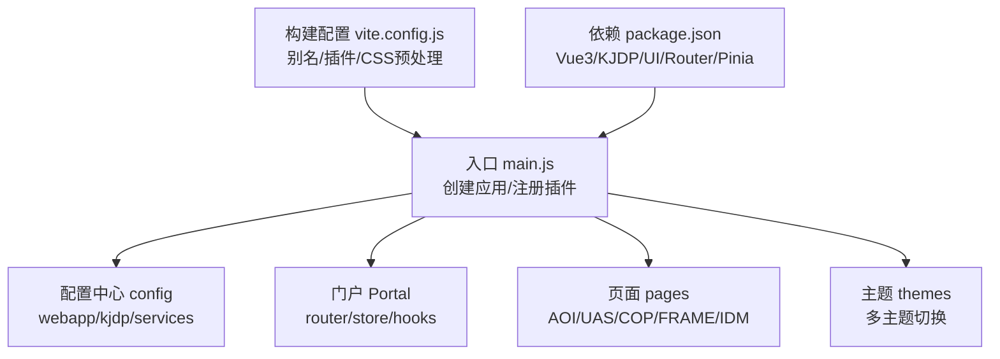
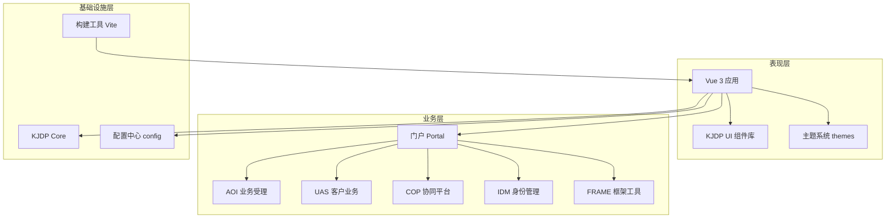
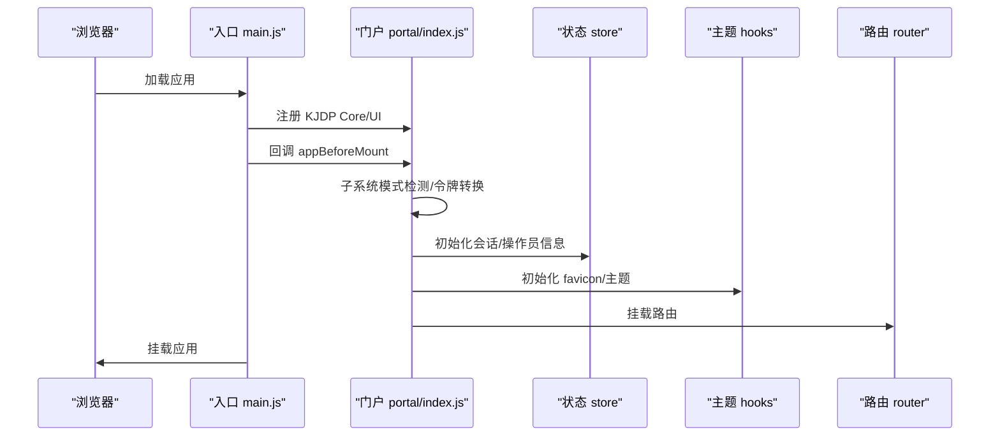
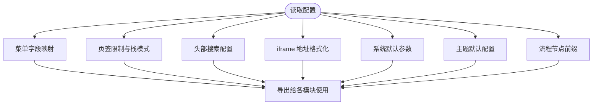
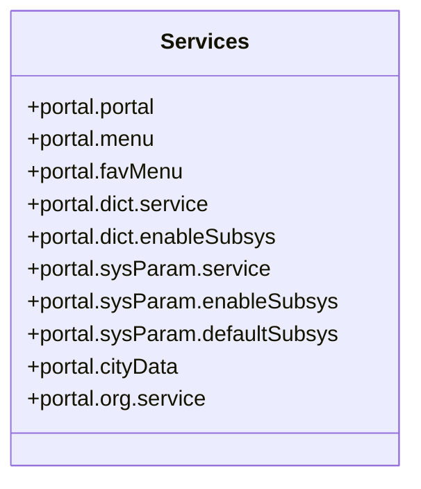
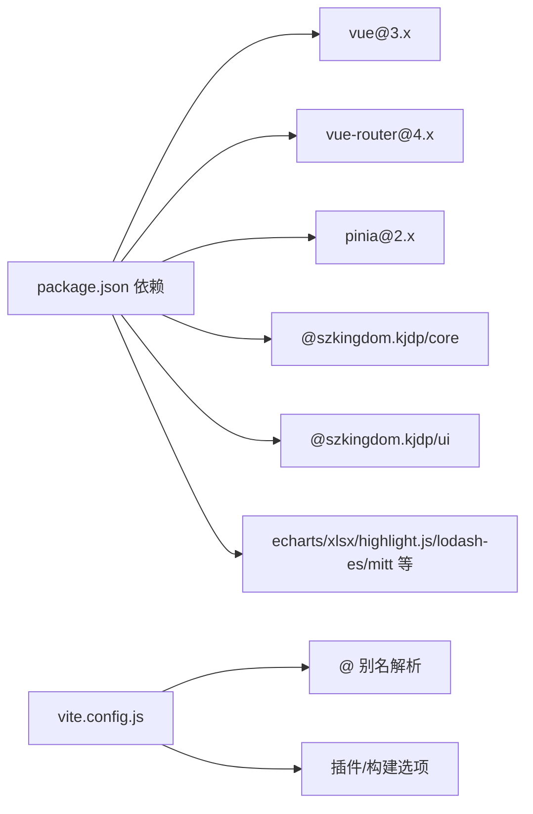

# 项目概述

<cite>
**本文档引用的文件**
- [README.md](file://README.md)
- [package.json](file://package.json)
- [vite.config.js](file://vite.config.js)
- [src/main.js](file://src/main.js)
- [src/App.vue](file://src/App.vue)
- [src/config/index.js](file://src/config/index.js)
- [src/config/webapp.js](file://src/config/webapp.js)
- [src/config/kjdp.js](file://src/config/kjdp.js)
- [src/config/services.js](file://src/config/services.js)
- [src/portal/index.js](file://src/portal/index.js)
- [src/portal/views/workbench/workbench.vue](file://src/portal/views/workbench/workbench.vue)
</cite>

## 目录
1. [引言](#引言)
2. [项目结构](#项目结构)
3. [核心组件](#核心组件)
4. [架构总览](#架构总览)
5. [详细组件分析](#详细组件分析)
6. [依赖关系分析](#依赖关系分析)
7. [性能考虑](#性能考虑)
8. [故障排查指南](#故障排查指南)
9. [结论](#结论)
10. [附录](#附录)

## 引言
FS-AOI-WEB 是一个基于 Vue 3 与 KJDP 企业级前端框架构建的金融综合业务服务平台。项目围绕“门户工作台 + 业务受理 + 统一应用 + 客户业务 + 身份管理”的多模块体系设计，面向银行、证券等金融机构的业务运营与客户服务需求，提供统一入口、流程化受理、个性化桌面、统一能力沉淀与安全管控的完整解决方案。

本项目强调：
- 企业级稳定性与可扩展性：通过 Pinia 状态管理、Vue Router 路由体系、KJDP 组件库与插件化机制实现高内聚低耦合。
- 金融合规与安全：内置登录态管理、令牌转换、URL 加密开关、统一消息弹窗与错误处理策略。
- 业务敏捷与可视化：支持动态菜单与路由、Tab 页签、主题切换、流程节点标识前缀等，满足金融业务对流程与时效性的要求。
- 开发体验与工程化：Vite 构建、ESLint/Prettier 规范、PostCSS/Sass 预处理、按需异步加载组件提升首屏性能。

## 项目结构
项目采用“模块化 + 分层”组织方式，核心目录与职责如下：
- config：全局配置中心，包含 Web 应用配置、KJDP UI Provider、服务接口映射、开发/构建与插件配置等。
- src：源代码主体，包含门户 Portal、AOI 业务受理、UAS 客户业务、IDM 身份管理、Cop 协同平台、Frame 框架工具等。
- public/static：静态资源与第三方库，包含流程编辑器、国际化资源、样式与视图模板等。
- themes：主题切换方案，支持深色/浅色/企业定制主题。
- vite.config.js：构建与开发服务器配置，含别名、插件、CSS 预处理与生产构建模式。

图表来源
- [src/main.js](file://src/main.js#L1-L40)
- [vite.config.js](file://vite.config.js#L1-L80)
- [package.json](file://package.json#L1-L61)

章节来源
- [README.md](file://README.md#L1-L55)
- [package.json](file://package.json#L1-L61)
- [vite.config.js](file://vite.config.js#L1-L80)

## 核心组件
- 应用入口与插件注册
  - 创建 Vue 应用实例，集成 Pinia、KJDP Core 与 UI，挂载路由与全局错误处理。
- 配置中心
  - Web 应用配置：菜单映射、页签限制、头部搜索、iframe 地址格式化、系统默认参数等。
  - KJDP UI Provider：全局组件默认属性、校验规则扩展、流程服务接口号映射。
  - 服务接口映射：门户/菜单/字典/系统参数等接口编号集中管理。
- 门户与工作台
  - 门户初始化回调、子系统模式检测、主题与图标初始化、URL 加密密钥获取。
  - 工作台：桌面栏/桌面视图/应用栏/设置中心/客户推荐与接入联动。
- 构建与开发
  - Vite 开发服务器、生产构建模式（hash 或带版本号）、别名解析、SCSS 全局变量注入。

章节来源
- [src/main.js](file://src/main.js#L1-L40)
- [src/config/index.js](file://src/config/index.js#L1-L8)
- [src/config/webapp.js](file://src/config/webapp.js#L1-L254)
- [src/config/kjdp.js](file://src/config/kjdp.js#L1-L59)
- [src/config/services.js](file://src/config/services.js#L1-L28)
- [src/portal/index.js](file://src/portal/index.js#L1-L153)
- [src/portal/views/workbench/workbench.vue](file://src/portal/views/workbench/workbench.vue#L1-L235)
- [vite.config.js](file://vite.config.js#L1-L80)

## 架构总览
整体架构分为三层：
- 表现层：Vue 3 + KJDP UI 组件库，提供统一的表单、表格、对话框、抽屉等基础控件与业务通用视图。
- 业务层：AOI（业务受理）、UAS（客户业务）、COP（协同）、FRAME（框架工具）、IDM（身份管理）等模块，每个模块独立开发、统一接入门户。
- 基础设施层：KJDP Core 提供系统能力（登录态、消息、加密、请求封装），配置中心提供统一参数与接口映射，构建工具链保障开发与发布效率。

图表来源
- [src/main.js](file://src/main.js#L1-L40)
- [src/config/index.js](file://src/config/index.js#L1-L8)
- [src/portal/index.js](file://src/portal/index.js#L1-L153)
- [vite.config.js](file://vite.config.js#L1-L80)

## 详细组件分析

### 门户与工作台组件
门户负责统一入口、菜单与路由、主题与图标初始化、子系统模式与令牌转换、URL 加密等；工作台提供桌面、应用栏、设置中心与客户推荐/接入联动。

图表来源
- [src/main.js](file://src/main.js#L1-L40)
- [src/portal/index.js](file://src/portal/index.js#L1-L153)

章节来源
- [src/portal/index.js](file://src/portal/index.js#L1-L153)
- [src/portal/views/workbench/workbench.vue](file://src/portal/views/workbench/workbench.vue#L1-L235)

### 配置中心组件
配置中心将菜单字段映射、页签限制、头部搜索、iframe 地址格式化、系统默认参数、主题默认值、流程节点前缀等集中管理，便于跨模块共享与统一维护。

图表来源
- [src/config/webapp.js](file://src/config/webapp.js#L1-L254)
- [src/config/kjdp.js](file://src/config/kjdp.js#L1-L59)

章节来源
- [src/config/webapp.js](file://src/config/webapp.js#L1-L254)
- [src/config/kjdp.js](file://src/config/kjdp.js#L1-L59)

### 服务接口映射组件
服务接口映射集中管理门户/菜单/字典/系统参数等接口编号，支持按模块启用子系统功能与默认子系统选择，便于前后端解耦与统一治理。

图表来源
- [src/config/services.js](file://src/config/services.js#L1-L28)

章节来源
- [src/config/services.js](file://src/config/services.js#L1-L28)

## 依赖关系分析
- 运行时依赖
  - Vue 3、Vue Router、Pinia：提供响应式与状态管理、路由能力。
  - KJDP Core/UI：提供系统能力与统一组件库。
  - 第三方库：echarts、xlsx、highlight.js、lodash-es、mitt 等，支撑图表、表格、富文本、事件总线等能力。
- 开发依赖
  - Vite、ESLint、Prettier、Sass、Rollup 插件等，保障开发效率与代码质量。
- 构建与别名
  - 别名 @/@assets/@config/@pages/@portal/@hooks/@static，提升导入便捷性与一致性。

图表来源
- [package.json](file://package.json#L1-L61)
- [vite.config.js](file://vite.config.js#L1-L80)

章节来源
- [package.json](file://package.json#L1-L61)
- [vite.config.js](file://vite.config.js#L1-L80)

## 性能考虑
- 组件按需异步加载：工作台中大量子组件采用 defineAsyncComponent 动态导入，减少初始包体。
- KeepAlive 缓存：顶层 RouterView 使用 KeepAlive 缓存组件，避免重复渲染。
- 构建期精简：esbuild 移除 console/debugger，生产构建支持 hash 模式或带版本号模式，利于缓存控制。
- CSS 优化：SCSS 全局变量注入与 PostCSS 插件移除 charset，降低样式体积与兼容成本。
- 页签与路由：通过 tabsConfig 控制最大打开数与排除菜单，避免内存与渲染压力。

章节来源
- [src/App.vue](file://src/App.vue#L1-L8)
- [src/portal/views/workbench/workbench.vue](file://src/portal/views/workbench/workbench.vue#L1-L235)
- [vite.config.js](file://vite.config.js#L1-L80)

## 故障排查指南
- 登录态与令牌转换
  - 子系统模式下，通过 postMessage 接收外部令牌并转换为内部登录态；若转换失败，弹窗提示并触发回退登录。
- URL 加密
  - 当开启 urlEncrypt 时，启动阶段拉取加密密钥并写入 store，确保后续请求参数安全。
- 服务拦截器
  - 提供 serviceInterceptors 回调，可在请求发出前进行拦截与放行判断，便于统一风控或流程前置校验。
- 全局错误处理
  - 应用级 errorHandler 统一捕获异常并输出日志，便于定位问题。

章节来源
- [src/portal/index.js](file://src/portal/index.js#L1-L153)
- [src/main.js](file://src/main.js#L1-L40)

## 结论
FS-AOI-WEB 以 Vue 3 与 KJDP 为核心，构建了面向金融业务的综合服务平台。通过模块化拆分、统一配置与插件化能力，实现了从门户工作台到业务受理、客户业务、身份管理的全链路覆盖。项目在工程化、安全性与可扩展性方面具备明确优势，适合在大型金融机构落地推广。

## 附录
- 开发与构建
  - Node 版本要求：18+/20+/22+；开发端口默认 8080；生产构建需提供 APP_VERSION 环境变量。
- 常用脚本
  - dev/build/preview/lint/lint:fix/format 等，便于本地开发与代码规范检查。

章节来源
- [README.md](file://README.md#L1-L55)
- [package.json](file://package.json#L1-L61)
- [vite.config.js](file://vite.config.js#L1-L80)