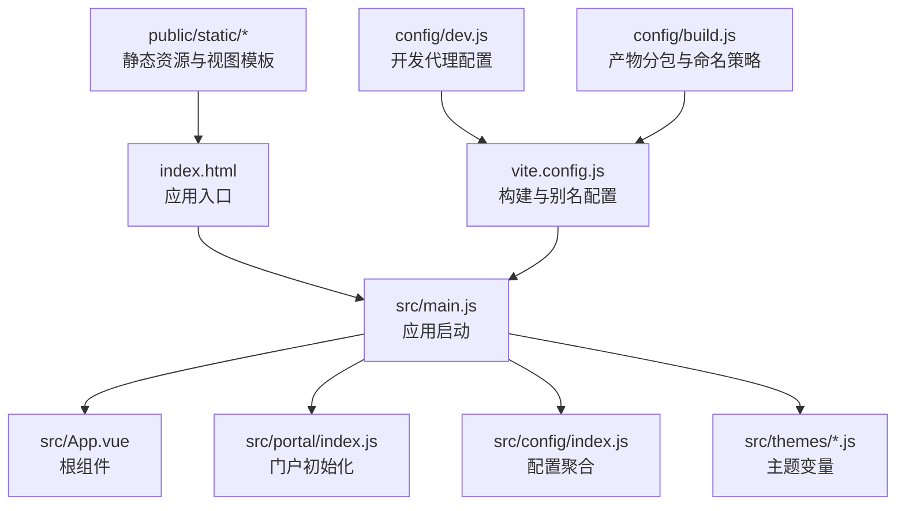
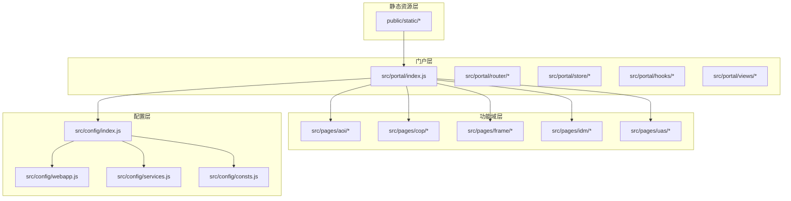
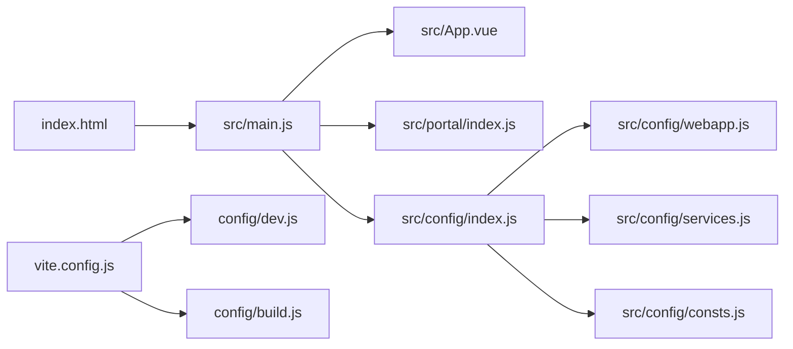

# 项目结构详解

<cite>
**本文引用的文件**
- [package.json](file://package.json)
- [vite.config.js](file://vite.config.js)
- [index.html](file://index.html)
- [src/main.js](file://src/main.js)
- [src/App.vue](file://src/App.vue)
- [src/config/index.js](file://src/config/index.js)
- [src/config/webapp.js](file://src/config/webapp.js)
- [src/config/services.js](file://src/config/services.js)
- [src/config/consts.js](file://src/config/consts.js)
- [src/portal/index.js](file://src/portal/index.js)
- [config/dev.js](file://config/dev.js)
- [config/build.js](file://config/build.js)
- [src/themes/default.js](file://src/themes/default.js)
- [src/themes/dark.js](file://src/themes/dark.js)
</cite>

## 目录
1. [引言](#引言)
2. [项目结构](#项目结构)
3. [核心组件](#核心组件)
4. [架构总览](#架构总览)
5. [详细组件分析](#详细组件分析)
6. [依赖关系分析](#依赖关系分析)
7. [性能考量](#性能考量)
8. [故障排查指南](#故障排查指南)
9. [结论](#结论)
10. [附录](#附录)

## 引言
本文件面向 FS-AOI-WEB 项目开发者，系统性梳理项目顶层目录与核心子目录的职责、组织方式与命名规范，重点解析 src、public、config 等目录的结构与作用；并深入说明 src/pages、src/portal、src/config、src/themes 等核心目录的内部组织、模块边界与协作关系。同时提供开发规范、代码组织最佳实践与目录扩展指南，帮助团队建立一致的项目导航与文件定位方法。

## 项目结构
FS-AOI-WEB 采用 Vite 作为构建工具，Vue 3 + Pinia + KJDP 生态作为前端技术栈。项目整体采用“按功能域分层 + 模块化”的组织方式，结合别名与插件机制实现高内聚低耦合的模块划分。

- 顶层目录概览
  - src：应用源码根目录，包含页面、门户、配置、主题等核心模块
  - public：静态资源目录，包含门户静态页面、第三方库、国际化资源、视图模板等
  - config：构建与开发服务器配置，包含 dev/build/plugin 等配置入口
  - 其他：package.json、vite.config.js、index.html 等构建与运行入口

- 核心别名与解析
  - @、@assets、@config、@pages、@portal、@hooks、@static 等别名在构建期统一配置，便于跨模块引用与路径迁移

**图表来源**
- [index.html](file://index.html#L1-L32)
- [src/main.js](file://src/main.js#L1-L40)
- [src/App.vue](file://src/App.vue#L1-L8)
- [src/portal/index.js](file://src/portal/index.js#L1-L153)
- [src/config/index.js](file://src/config/index.js#L1-L8)
- [vite.config.js](file://vite.config.js#L1-L80)
- [config/dev.js](file://config/dev.js#L1-L39)
- [config/build.js](file://config/build.js#L1-L104)

**章节来源**
- [package.json](file://package.json#L1-L61)
- [vite.config.js](file://vite.config.js#L1-L80)
- [index.html](file://index.html#L1-L32)

## 核心组件
本节聚焦于项目的关键构件与其职责边界：

- 应用入口与启动
  - index.html：设置缓存控制、favicon、初始加载指示器脚本与应用挂载点
  - src/main.js：创建 Vue 应用实例，注册 Pinia、KjdpCore/KjdpUI、全局样式与错误处理；通过回调钩子延迟挂载路由
  - src/App.vue：根组件，包裹 RouterView 并启用 KeepAlive

- 门户初始化与路由
  - src/portal/index.js：负责子系统模式检测、URL 加密密钥获取、消息通信初始化、主题与 favicon 初始化、请求拦截器等；导出路由与回调映射

- 配置聚合
  - src/config/index.js：导出 http/webapp/services/consts/kjdp 等配置模块，形成统一配置入口
  - src/config/webapp.js：门户与菜单、页签、搜索、主题、流程标识等系统级配置
  - src/config/services.js：平台/门户相关服务接口号映射
  - src/config/consts.js：菜单、子系统、对象类型、操作状态、组织类型、流程状态等常量定义

- 构建与开发配置
  - vite.config.js：别名、插件、CSS 预处理、开发服务器与构建策略
  - config/dev.js：开发代理规则（/copweb、/uasweb、/idmweb、/api）
  - config/build.js：产物命名、异步依赖分包、手动分包策略

**章节来源**
- [index.html](file://index.html#L1-L32)
- [src/main.js](file://src/main.js#L1-L40)
- [src/App.vue](file://src/App.vue#L1-L8)
- [src/portal/index.js](file://src/portal/index.js#L1-L153)
- [src/config/index.js](file://src/config/index.js#L1-L8)
- [src/config/webapp.js](file://src/config/webapp.js#L1-L254)
- [src/config/services.js](file://src/config/services.js#L1-L28)
- [src/config/consts.js](file://src/config/consts.js#L1-L120)
- [vite.config.js](file://vite.config.js#L1-L80)
- [config/dev.js](file://config/dev.js#L1-L39)
- [config/build.js](file://config/build.js#L1-L104)

## 架构总览
FS-AOI-WEB 采用“门户驱动 + 功能域分层”的架构模式：
- 门户层：负责菜单、页签、头部、布局与主题等通用能力
- 功能域层：以 pages/* 为核心承载具体业务页面与模块
- 配置层：集中管理系统配置、服务接口号、常量与主题变量
- 静态资源层：public/static 提供静态页面、视图模板、第三方库与国际化资源

**图表来源**
- [src/portal/index.js](file://src/portal/index.js#L1-L153)
- [src/config/index.js](file://src/config/index.js#L1-L8)
- [src/config/webapp.js](file://src/config/webapp.js#L1-L254)
- [src/config/services.js](file://src/config/services.js#L1-L28)
- [src/config/consts.js](file://src/config/consts.js#L1-L120)
- [public/static/*](file://public/static/index.html)

## 详细组件分析

### 目录职责与组织原则
- src
  - 用途：存放所有应用源代码，按功能域与能力域分层组织
  - 组织原则：以 pages/*、portal、config、themes 为主要一级目录；每个功能域内部再按组件、模块、视图、工具等细分
  - 命名规范：文件名采用小驼峰或短横线命名，避免空格与特殊字符；目录名尽量语义化

- public
  - 用途：存放静态资源与视图模板，如门户静态页面、第三方库、国际化资源、视图模板等
  - 组织原则：按功能与用途分层，如 static 下的 views、libs、i18n、images 等
  - 命名规范：静态资源文件建议带哈希后缀以便缓存控制

- config
  - 用途：存放构建与开发服务器配置，包含 dev/build/plugin 等配置入口
  - 组织原则：按功能拆分，dev.js 管理开发代理，build.js 管理产物分包与命名策略
  - 命名规范：配置文件名语义明确，避免缩写导致歧义

- src/pages
  - 用途：承载各业务域页面与模块，如 aoi/cop/frame/idm/uas 等
  - 组织原则：每个业务域独立目录，内部按视图、模块、组件、工具等细分
  - 命名规范：页面文件以 .vue 结尾，模块文件以 index.js 或具体功能命名

- src/portal
  - 用途：门户核心能力，包括路由、状态管理、Hooks、视图与主题等
  - 组织原则：按功能拆分为 router、store、hooks、views 等子目录
  - 命名规范：组件以 .vue 结尾，模块以 index.js 导出

- src/config
  - 用途：集中管理配置，包括 HTTP、WebApp、服务接口号、常量与 KJDP 配置
  - 组织原则：按配置维度拆分文件，统一从 index.js 导出
  - 命名规范：配置文件语义化，避免魔法字符串

- src/themes
  - 用途：主题变量定义，支持多套主题切换
  - 组织原则：每个主题一个文件，导出键值对形式的主题变量
  - 命名规范：变量名采用语义化命名，如 --fs-* 前缀

### 开发规范与最佳实践
- 路径别名与导入
  - 使用 @、@assets、@config、@pages、@portal、@hooks、@static 等别名进行导入，避免相对路径硬编码
  - 在 vite.config.js 中统一维护别名，确保 IDE 与构建工具一致

- 配置管理
  - 将系统配置集中在 src/config 下，通过 index.js 聚合导出，避免散落的魔法字符串
  - 对外暴露的配置采用默认导出与具名导出相结合的方式，便于按需导入

- 主题与样式
  - 主题变量集中定义在 src/themes 下，配合 SCSS 变量使用，实现主题切换
  - 全局样式在 src/assets/styles 下统一管理，避免重复定义

- 构建与缓存
  - 利用 config/build.js 的手动分包策略，将第三方库与业务代码分离，提升缓存命中率
  - 生产构建需提供 APP_VERSION 环境变量，确保产物可追踪

- 代码质量
  - 使用 ESLint 与 Prettier 规范代码风格，提供 lint 与 lint:fix 脚本
  - 在 main.js 中统一设置错误处理，便于问题定位

**章节来源**
- [vite.config.js](file://vite.config.js#L1-L80)
- [src/config/index.js](file://src/config/index.js#L1-L8)
- [src/config/webapp.js](file://src/config/webapp.js#L1-L254)
- [src/config/services.js](file://src/config/services.js#L1-L28)
- [src/config/consts.js](file://src/config/consts.js#L1-L120)
- [src/themes/default.js](file://src/themes/default.js#L1-L113)
- [src/themes/dark.js](file://src/themes/dark.js#L1-L24)
- [config/build.js](file://config/build.js#L1-L104)
- [package.json](file://package.json#L1-L61)

### 目录扩展指南
- 新增业务域页面
  - 在 src/pages 下新增目录，按视图、模块、组件、工具等细分
  - 若涉及门户集成，参考 src/portal/router/routes.js 的路由配置方式，确保菜单与页签联动

- 新增门户模块
  - 在 src/portal/modules 下新增模块，遵循组件化与 Hooks 化设计
  - 如需全局状态，可在 src/portal/store 下新增 Store 模块

- 新增配置项
  - 在 src/config 下新增配置文件，通过 src/config/index.js 聚合导出
  - 对外暴露的配置采用默认导出与具名导出相结合的方式

- 新增主题
  - 在 src/themes 下新增主题文件，导出键值对形式的主题变量
  - 在 src/config/webapp.js 中配置 themesConfig.default 指向新主题

- 新增静态资源
  - 在 public/static 下按功能与用途分层新增资源
  - 对于视图模板，建议与业务域页面一一对应，便于维护

**章节来源**
- [src/portal/router/routes.js](file://src/portal/router/routes.js)
- [src/config/webapp.js](file://src/config/webapp.js#L234-L237)

## 依赖关系分析
- 应用启动链路
  - index.html -> src/main.js -> src/App.vue -> src/portal/index.js -> 路由与配置加载
- 构建与开发
  - vite.config.js -> config/dev.js（开发代理）+ config/build.js（产物分包）
- 配置聚合
  - src/config/index.js -> src/config/webapp.js、src/config/services.js、src/config/consts.js

**图表来源**
- [index.html](file://index.html#L1-L32)
- [src/main.js](file://src/main.js#L1-L40)
- [src/App.vue](file://src/App.vue#L1-L8)
- [src/portal/index.js](file://src/portal/index.js#L1-L153)
- [src/config/index.js](file://src/config/index.js#L1-L8)
- [src/config/webapp.js](file://src/config/webapp.js#L1-L254)
- [src/config/services.js](file://src/config/services.js#L1-L28)
- [src/config/consts.js](file://src/config/consts.js#L1-L120)
- [vite.config.js](file://vite.config.js#L1-L80)
- [config/dev.js](file://config/dev.js#L1-L39)
- [config/build.js](file://config/build.js#L1-L104)

**章节来源**
- [index.html](file://index.html#L1-L32)
- [src/main.js](file://src/main.js#L1-L40)
- [src/portal/index.js](file://src/portal/index.js#L1-L153)
- [src/config/index.js](file://src/config/index.js#L1-L8)
- [vite.config.js](file://vite.config.js#L1-L80)

## 性能考量
- 产物分包与缓存
  - 通过 config/build.js 的 manualChunks 将第三方库与业务代码分离，提升浏览器缓存命中率
  - 异步依赖按包名拆分至 dependence 目录，减少单文件体积
- 构建优化
  - 生产构建移除 console 与 debugger，减小包体
  - 启用 sourcemap 便于调试与问题定位
- 开发体验
  - 开发代理覆盖 /copweb、/uasweb、/idmweb、/api，减少跨域与联调成本
  - 支持热更新与本地资源映射，加速迭代

**章节来源**
- [config/build.js](file://config/build.js#L1-L104)
- [vite.config.js](file://vite.config.js#L38-L38)
- [config/dev.js](file://config/dev.js#L1-L39)

## 故障排查指南
- 构建失败
  - 确认已设置 APP_VERSION 环境变量，否则生产构建会直接退出
  - 检查 vite.config.js 中的别名与插件配置是否正确
- 路由与菜单异常
  - 检查 src/config/webapp.js 中的 menuMap、extendUrlConfig、projectConfig 等配置
  - 确认 src/portal/router/routes.js 的路由映射与菜单 ID 一致
- 主题切换无效
  - 检查 src/themes 下的主题文件是否正确导出变量
  - 确认 src/config/webapp.js 中 themesConfig.default 指向正确主题
- 静态资源加载失败
  - 检查 public/static 下的资源路径与 index.html 中的引用是否一致
  - 确认 vite.config.js 中 @static 别名指向正确的静态目录

**章节来源**
- [vite.config.js](file://vite.config.js#L14-L29)
- [src/config/webapp.js](file://src/config/webapp.js#L131-L189)
- [src/themes/default.js](file://src/themes/default.js#L1-L113)
- [index.html](file://index.html#L9-L9)

## 结论
FS-AOI-WEB 项目通过清晰的目录分层与模块化设计，实现了门户能力与业务域页面的解耦；借助统一的配置聚合与别名体系，提升了开发效率与可维护性。遵循本文档的开发规范与扩展指南，可确保新增模块与功能在保持一致性的同时，快速融入现有架构。

## 附录
- 常用命令
  - 开发：pnpm dev
  - 构建：pnpm build（需设置 APP_VERSION）
  - 预览：pnpm preview
  - 代码检查：pnpm lint / pnpm lint:fix
  - 格式化：pnpm format
- 关键配置文件
  - 构建：vite.config.js、config/build.js
  - 开发：config/dev.js
  - 配置：src/config/index.js、src/config/webapp.js、src/config/services.js、src/config/consts.js
  - 主题：src/themes/default.js、src/themes/dark.js
  - 入口：index.html、src/main.js、src/App.vue、src/portal/index.js